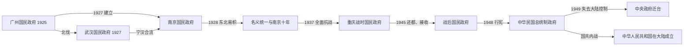

# 国民政府时期

## 时间与范围

广州国民政府成立于1925年7月；南京国民政府成立于1927年4月。1928年东北易帜后进入以南京为中央的名义统一阶段。1937—1945年中央迁重庆抗战，1946年还都南京，1948年行宪改组为中华民国政府。1949年中央政府迁台，本页至此结束大陆阶段。

## 概括

国民政府由中国国民党主导，以党治、训政、五院制和军事委员会组织国家。它依靠黄埔军校、国民革命军、国共第一次合作及群众动员发动北伐，取代北京政府；此后又将部分地方军队编入国民革命军，以税制、金融、交通和行政改革推进中央化。但其“统一”程度始终不一：地方实力派、中共政权、日本占领区及日本扶植政权先后限制中央政府的实际管辖。

## 建立、分裂与迁移

## 发展阶段

| 阶段 | 时间 | 具体过程 |
|---|---|---|
| 广州建政与北伐 | 1925—1928年 | 孙中山逝世后，国民党以国民政府委员会集体建政；国民革命军从广东北进。1927年清党与宁汉分裂使国共合作破裂，武汉、南京两个国民政府并立后再合流。 |
| 南京十年 | 1928—1937年 | 东北易帜带来名义统一。政府推进关税、金融、法律、交通和教育建设，同时进行蒋桂战争、中原大战和对中共根据地的围剿。 |
| 全面抗战 | 1937—1945年 | 淞沪会战后南京失守，中央迁重庆；军事委员会集中战争权力。沿海财政工业受损，政府借助大后方、国际援助和全国动员坚持作战。 |
| 战后接收与行宪 | 1945—1948年 | 接收日占区与台湾，处理伪政权人员和敌产；国共谈判破裂后全面内战。1946年制宪，1948年总统、国会与五院按新宪法运行。 |
| 大陆统治终结 | 1948—1949年 | 辽沈、淮海、平津三大战役改变军事均势；李宗仁代行总统职权并寻求和谈。解放军渡江后南京失守，中央机构先后迁广州、重庆、成都，最终迁台。 |

## 统治结构与实际权力

| 层级 | 法定或组织角色 | 实际运作 |
|---|---|---|
| 中国国民党 | 全国代表大会、中央执行委员会、中央政治会议等 | 训政时期由党指导政府；蒋介石通过党职、军职和派系协调掌握核心影响。 |
| 国家元首 | 国民政府委员会集体主席制、国民政府主席；1948年后为总统 | 林森长期任主席时主要承担国家代表职能，军事政治实权仍集中于蒋介石；1949年李宗仁代行总统职权。 |
| 政府首脑 | 行政院院长 | 负责行政院及部会，汪精卫、蒋介石、孔祥熙、宋子文、张群等先后任职。 |
| 五院 | 行政、立法、司法、考试、监察 | 构成孙中山五权宪法构想下的国家机关；训政时受党政关系制约，行宪后转入宪政框架。 |
| 军事中枢 | 国民政府军事委员会及委员长 | 抗战时期统合军事、外交与动员，委员长蒋介石的实际权力往往高于单一国家职务。 |
| 地方军政 | 省政府、绥靖公署、战区及地方军 | 桂系、晋系、东北军、西北军等被纳入番号与名义隶属，但保留不同程度的人事、财政和地盘。 |

正式、代理、复位和职务中断见[民国大陆时期国家元首与政府首脑表](/%E4%BA%BA%E6%96%87%E7%A7%91%E5%AD%A6/%E5%8E%86%E5%8F%B2/%E4%B8%9C%E4%BA%9A/%E4%B8%AD%E5%9B%BD/%E6%B0%91%E5%9B%BD/%E6%B0%91%E5%9B%BD%E5%A4%A7%E9%99%86%E6%97%B6%E6%9C%9F%E5%9B%BD%E5%AE%B6%E5%85%83%E9%A6%96%E4%B8%8E%E6%94%BF%E5%BA%9C%E9%A6%96%E8%84%91%E8%A1%A8.md)。

## 重要事件与转折

| 时间 | 事件 | 过程与影响 |
|---|---|---|
| 1925年 | 广州国民政府成立 | 国民党由大元帅府转为委员会政府，黄埔军校和国民革命军成为建政基础。 |
| 1926—1928年 | 北伐 | 击败或收编吴佩孚、孙传芳、张作霖等力量；地方倒戈和政治联盟与正面战场同样重要。 |
| 1927年 | 宁汉分裂、清党与国共破裂 | 南京、武汉国民政府并立；共产党转入武装革命，国民政府的政治联盟重组。 |
| 1928年 | 东北易帜 | 张学良承认南京政府，国民政府取得形式上的全国统一。 |
| 1929—1930年 | 蒋桂战争与中原大战 | 中央与地方实力派大规模交战；蒋介石胜出，但地方军事集团未完全消失。 |
| 1931年 | 九一八事变 | 日本关东军占领东北，随后建立满洲国；国民政府对东北的实际控制丧失。 |
| 1931—1936年 | 对中共根据地围剿与长征 | 国民政府集中兵力围剿，中共中央与红军转移至西北，内战并未结束。 |
| 1936年 | 西安事变 | 张学良、杨虎城扣留蒋介石，促成停止大规模内战、共同抗日的政治转折。 |
| 1937年 | 七七事变、淞沪会战与南京失守 | 全面战争爆发；政府迁重庆，东部人口、工业和教育机构大规模内迁。 |
| 1938—1940年 | 战时体制与汪精卫分裂 | 武汉、广州失守后进入相持；汪精卫另组受日本支持的南京政权，不是重庆国民政府的合法内部接班。 |
| 1942—1945年 | 同盟国合作与抗战胜利 | 中国战区地位上升，废除部分不平等条约；1945年日本投降后国民政府接收失地。 |
| 1945—1946年 | 重庆谈判、政治协商会议与冲突升级 | 和平建国方案未能约束军队竞争，战事逐步转为全面内战。 |
| 1946—1948年 | 制宪、行宪与币制危机 | 宪法实施并选举总统、副总统；法币崩溃后发行金圆券，但未能控制通胀。 |
| 1948—1949年 | 三大战役、渡江战役与迁台 | 国民党主力损失，南京及南方各中心相继失守，政府转移至台湾。 |

## 国家建设与社会基础

- **财政金融：**收回关税自主权、整理税制，1935年法币改革加强货币统一；战争和战后赤字最终造成货币信用崩溃。
- **法律行政：**形成六法体系、五院和考试文官制度，推进县政与统计；中央命令在不同地区的执行能力差异很大。
- **交通工业：**修筑铁路、公路和航空网络，建立资源委员会与国营重工业；抗战内迁保存部分工业教育能力。
- **教育文化：**大学、研究机构和现代学校扩展，战时联合大学维系高等教育；城市文化繁荣与农村教育资源不足并存。
- **农村与社会：**政府开展减租、合作与乡村建设试验，但土地关系改革不彻底，征兵征粮和战争负担削弱基层认同。

## 崛起、维系与大陆失败原因

- **崛起机制：**国民党改组为纪律化政党，以苏联援助、黄埔军校、党军和统一政治纲领整合广东，并利用北洋派系分裂发动北伐。
- **维系条件：**掌握长江下游经济中心、海关与金融资源；通过党政体系、军事委员会、地方结盟和国际承认维持中央地位。
- **结构性限制：**中央—地方权力未完全整合，党内派系与军队来源复杂；基层财政、土地制度和行政能力不足。
- **外部压力：**日本侵华造成长期人员、产业与财政损失；战后国际援助无法替代国内财政和政治整合。
- **直接触发：**接收腐败与物资失序、恶性通胀、军队指挥和补给问题削弱社会支持；共产党在土地改革、基层组织、兵员和战略上取得优势。
- **转型而非简单灭亡：**1949年国民政府失去大陆实际控制并迁台，中华民国政府与宪政机构在台湾继续运作；两岸政治主张与实际管辖范围应分别表述。

## 并立政权辨析

| 政权或区域 | 性质 | 与国民政府关系 |
|---|---|---|
| 地方实力派控制区 | 名义隶属但自主程度不同 | 可能接受中央职名和番号，同时掌握本地人事、军队与税源。 |
| 中国共产党根据地及解放区 | 中共领导的革命政权与军队控制区 | 与国民政府经历合作、冲突及全面内战，不是普通省级行政单位。 |
| 日本占领区 | 日本军队实际占领 | 国民政府主张主权但无法日常治理。 |
| 满洲国 | 日本扶植、国际承认有限的政权 | 国民政府不承认；日本关东军对其军事政治有决定性影响。 |
| 汪精卫南京政权 | 1940年成立的日本支持政权 | 自称“国民政府”，与重庆国民政府敌对；实际主权和军事能力受日本严格限制。 |

## 演变关系

- 前一节点：[北洋时期](/%E4%BA%BA%E6%96%87%E7%A7%91%E5%AD%A6/%E5%8E%86%E5%8F%B2/%E4%B8%9C%E4%BA%9A/%E4%B8%AD%E5%9B%BD/%E6%B0%91%E5%9B%BD/%E5%8C%97%E6%B4%8B%E6%97%B6%E6%9C%9F.md)
- 大陆后一节点：[中华人民共和国](/%E4%BA%BA%E6%96%87%E7%A7%91%E5%AD%A6/%E5%8E%86%E5%8F%B2/%E4%B8%9C%E4%BA%9A/%E4%B8%AD%E5%9B%BD/%E4%B8%AD%E5%8D%8E%E4%BA%BA%E6%B0%91%E5%85%B1%E5%92%8C%E5%9B%BD/README.md)
- 中央政府迁台后的历史：[台湾](/%E4%BA%BA%E6%96%87%E7%A7%91%E5%AD%A6/%E5%8E%86%E5%8F%B2/%E4%B8%9C%E4%BA%9A/%E4%B8%AD%E5%9B%BD/%E5%8F%B0%E6%B9%BE/README.md)
- 上级：[民国](/%E4%BA%BA%E6%96%87%E7%A7%91%E5%AD%A6/%E5%8E%86%E5%8F%B2/%E4%B8%9C%E4%BA%9A/%E4%B8%AD%E5%9B%BD/%E6%B0%91%E5%9B%BD/README.md)
