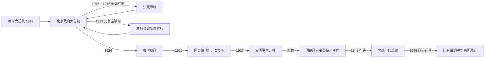

# 民国大陆时期国家元首与政府首脑表

## 范围与读表规则

本表覆盖1912年南京临时政府、北京政府及1927—1949年国民政府在中国大陆的国家元首与政府首脑。表内区分正式任职、代理、复位、集体代行、职位取消或空缺；“法定职位”不自动等于“实际最高权力”。南方并立政府和日本支持的竞争政权另表列出，避免把彼此敌对的职位误排成同一条无争议继承线。

- 同一人物多次任职分别列项。
- 日期采用公历；史料对交接日有一两日差异者，在备注说明或列至月。
- “未就任”指获任命但没有实际接掌职务，不计入正式序列。
- 1949年以后迁台序列见[1945年以来台湾政权与行政首长表](/%E4%BA%BA%E6%96%87%E7%A7%91%E5%AD%A6/%E5%8E%86%E5%8F%B2/%E4%B8%9C%E4%BA%9A/%E4%B8%AD%E5%9B%BD/%E5%8F%B0%E6%B9%BE/1945%E5%B9%B4%E4%BB%A5%E6%9D%A5%E5%8F%B0%E6%B9%BE%E6%94%BF%E6%9D%83%E4%B8%8E%E8%A1%8C%E6%94%BF%E9%A6%96%E9%95%BF%E8%A1%A8.md)。

## 职位演变

## 北京政府国家元首完整序列

| 顺序 | 人物或机构 | 职务 | 任期 | 继任关系与关键事件 |
|---:|---|---|---|---|
| 1 | **孙中山** | 南京临时政府临时大总统 | 1912-01-01—1912-04-01 | 各省代表选举；为促成清帝退位与南北统一辞职。袁世凯3月10日已在北京就职，南京机构至4月完成移交。 |
| 2 | **袁世凯** | 临时大总统 | 1912-03-10—1913-10-10 | 清帝退位后获临时参议院选举，在北京就任。 |
| 3 | **袁世凯** | 大总统 | 1913-10-10—1915-12-12；1916-03-22—1916-06-06 | 正式当选后解散国民党、国会并修改约法；洪宪帝制期间共和国职位中断，撤销帝制后复任，任内去世。 |
| — | **袁世凯** | 中华帝国皇帝（洪宪） | 1915-12-12宣布接受帝位；年号自1916-01-01，至1916-03-22撤销 | 未举行正式登基大典；护国战争与内外反对迫使撤销帝制。此为共和元首序列的制度中断。 |
| 4 | **黎元洪** | 大总统 | 1916-06-07—1917-07-17 | 由副总统继任；与段祺瑞发生府院之争。张勋复辟期间职权中断，复辟失败后辞职。 |
| — | 溥仪；实际主导张勋 | 宣统帝复辟 | 1917-07-01—1917-07-12 | 张勋拥溥仪复辟，未获全国承认；段祺瑞讨逆军击败复辟军。 |
| 5 | **冯国璋** | 代理大总统 | 1917-07-06／07-17—1918-10-10 | 以副总统代行；起始日因复辟期间命令和黎元洪正式辞职的口径不同。 |
| 6 | **徐世昌** | 大总统 | 1918-10-10—1922-06-02 | 国会选举；第一次直奉战争后被直系迫退。 |
| 7 | 周自齐 | 代理大总统 | 1922-06-02—1922-06-11 | 以内阁总理短期摄行。 |
| 8 | **黎元洪** | 大总统（复位） | 1922-06-11—1923-06-13 | 直系以“法统重光”迎回；后被逼离京辞职。 |
| 9 | 国务会议集体 | 代行大总统职权 | 1923-06-13—1923-10-10 | 高凌霨以内阁总理主持；顾维钧等曾代表签署国书，元首职位实为空缺。 |
| 10 | **曹锟** | 大总统 | 1923-10-10—1924-11-02 | 通过贿选取得职位；冯玉祥北京政变后被软禁并辞职。 |
| 11 | 黄郛 | 代理大总统／摄行职权 | 1924-11-02—1924-11-24 | 以内阁摄政处理政权过渡。 |
| 12 | **段祺瑞** | 中华民国临时执政 | 1924-11-24—1926-04-20 | 由冯玉祥、张作霖等推举，取消大总统与总理分立；三一八惨案后失势下台。 |
| — | 职位空缺 | 无稳定国家元首 | 1926-04-20—1926-05-13 | 胡惟德获推举但拒绝就任；国务院随后开始代行。 |
| 13 | 颜惠庆 | 国务院总理代行临时执政职权 | 1926-05-13—1926-06-23 | 以政府首脑身份代行元首职权。 |
| 14 | 杜锡珪 | 国务院代理总理代行元首职权 | 1926-06-23—1926-10-05 | 军事派系妥协下短期过渡。 |
| 15 | 顾维钧 | 国务院代理／正式总理代行元首职权 | 1926-10-05—1927-06-18 | 奉系控制北京期间主持国务院。 |
| 16 | **张作霖** | 安国军政府陆海军大元帅 | 1927-06-18—1928-06-03 | 以军政府元首身份统治北京中枢；北伐逼近后撤出北京，次日遇皇姑屯事件。 |

## 北京政府政府首脑完整序列

### 1912—1924年

| 顺序 | 人物 | 职务状态 | 任期 | 备注 |
|---:|---|---|---|---|
| 1 | 唐绍仪 | 国务总理 | 1912-03-13—1912-06-29 | 第一任国务总理；因与袁世凯冲突辞职。陆征祥6月17日起临时代理。 |
| 2 | 陆征祥 | 国务总理 | 1912-06-29—1912-09-25 | 赵秉钧8月20日起代理。 |
| 3 | 赵秉钧 | 国务总理 | 1912-09-25—1913-07-16 | 宋教仁案后政治危机加深；段祺瑞5月2日起代理。 |
| 4 | 段祺瑞 | 代理国务总理 | 1913-07-16—1913-08-26 | 朱启钤曾获任命但未实际就任。 |
| 5 | 熊希龄 | 国务总理 | 1913-08-26—1914-02-14 | “第一流人才内阁”未能摆脱总统控制。 |
| 6 | 孙宝琦 | 代理国务总理 | 1914-02-14—1914-05-02 | 1914年约法改制前过渡。 |
| 7 | 徐世昌 | 国务卿 | 1914-05-02—1915-12-22 | 新约法下以国务卿代替总理；陆征祥1915-10-28起代理。 |
| 8 | 陆征祥 | 国务卿 | 1915-12-22—1916-03-22 | 洪宪帝制期间主持政务。 |
| 9 | 徐世昌 | 国务卿 | 1916-03-22—1916-04-23 | 帝制撤销后短暂复任。 |
| 10 | 段祺瑞 | 国务总理 | 1916-04-23—1917-05-24 | 与黎元洪围绕参战和权力发生府院之争。 |
| 11 | 伍廷芳 | 代理国务总理 | 1917-05-24—1917-06-13 | 黎元洪免段后代理。 |
| 12 | 江朝宗 | 代理国务总理 | 1917-06-13—1917-06-24 | 张勋入京前后的短期内阁。 |
| 13 | 李经羲 | 国务总理 | 1917-06-24—1917-07-05 | 张勋复辟期间内阁中断。 |
| 14 | 段祺瑞 | 国务总理 | 1917-07-05—1917-11-23 | 讨逆后复任，因对南方政策争议辞职。 |
| 15 | 汪大燮 | 代理国务总理 | 1917-11-23—1917-12-02 | 短期过渡。 |
| 16 | 王士珍 | 代理国务总理 | 1917-12-02—1918-03-24 | 钱能训自1918-02-21起代理其职。 |
| 17 | 段祺瑞 | 国务总理 | 1918-03-24—1918-10-11 | 借参战军与安福系再度扩张。 |
| 18 | 钱能训 | 国务总理 | 1918-10-11—1919-06-14 | 五四运动后内阁受冲击。 |
| 19 | 龚心湛 | 代理国务总理 | 1919-06-14—1919-09-25 | 处理巴黎和会后危机。 |
| 20 | 靳云鹏 | 国务总理 | 1919-09-25—1920-07-02 | 直皖战争前后辞职。 |
| 21 | 萨镇冰 | 代理国务总理 | 1920-07-02—1920-08-10 | 5月起已代靳主持部分政务，7月正式代理。 |
| 22 | 靳云鹏 | 国务总理（复任） | 1920-08-10—1921-12-19 | 直奉共同影响下执政。 |
| 23 | 颜惠庆 | 代理国务总理 | 1921-12-19—1921-12-25 | 梁士诒组阁前过渡。 |
| 24 | 梁士诒 | 国务总理 | 1921-12-25—1922-05-05 | 亲奉立场遭直系反对；颜惠庆1月27日起代理。 |
| 25 | 周自齐 | 代理国务总理 | 1922-05-05—1922-06-12 | 4月11日起已代行；后又短期摄行大总统。 |
| 26 | 颜惠庆 | 国务总理 | 1922-06-12—1922-08-08 | 黎元洪复位初期组阁。 |
| 27 | 王宠惠 | 代理国务总理 | 1922-08-08—1922-11-30 | 唐绍仪曾获任命但没有到京就任。 |
| 28 | 汪大燮 | 代理国务总理 | 1922-11-30—1922-12-14 | 短期过渡。 |
| 29 | 王正廷 | 代理国务总理 | 1922-12-14—1923-01-05 | 外交官内阁过渡。 |
| 30 | 张绍曾 | 国务总理 | 1923-01-05—1924-01-15 | 高凌霨自1923-10-12代理；李根源曾获南方军政势力推定组阁但未控制北京。 |
| 31 | 孙宝琦 | 国务总理 | 1924-01-15—1924-07-04 | 曹锟政府下组阁。 |
| 32 | 顾维钧 | 代理国务总理 | 1924-07-04—1924-09-16 | 短期代理。 |
| 33 | 颜惠庆 | 国务总理 | 1924-09-16—1924-11-01 | 北京政变后结束。 |
| 34 | 黄郛 | 代理国务总理兼摄行大总统职权 | 1924-11-01—1924-11-24 | 负责曹锟下台至段祺瑞执政间过渡。 |
| — | 总理职位取消 | 临时执政兼掌行政 | 1924-11-24—1925-12-26 | 段祺瑞以临时执政统合元首与行政权。 |

### 1925—1928年

| 顺序 | 人物或安排 | 职务状态 | 任期 | 备注 |
|---:|---|---|---|---|
| 35 | 许世英 | 国务总理 | 1925-12-26／28—1926-03-06 | 总理职位恢复；贾德耀2月19日起代理。 |
| 36 | 贾德耀 | 国务总理 | 1926-03-06—1926-04-20 | 三一八惨案后政局崩解。 |
| — | 空缺 | 无总理 | 1926-04-20—1926-05-13 | 胡惟德拒绝就任。 |
| 37 | 颜惠庆 | 国务总理并代行元首职权 | 1926-05-13—1926-06-23 | 兼具行政首脑与代行元首角色。 |
| 38 | 杜锡珪 | 代理国务总理并代行元首职权 | 1926-06-23—1926-10-05 | 奉、直等派妥协下任职。 |
| 39 | 顾维钧 | 代理后任国务总理并代行元首职权 | 1926-10-05—1927-06-20 | 1927年6月18日张作霖就任大元帅，元首代行关系终止；总理任至20日。 |
| 40 | 潘复 | 国务总理 | 1927-06-20—1928-06-03 | 北京政府最后一任总理，随张作霖撤离北京。 |

## 国民政府国家元首完整序列

| 顺序 | 人物或机构 | 职务 | 任期 | 继承与权力说明 |
|---:|---|---|---|---|
| 1 | 国民政府常务委员会：胡汉民、古应芬、伍朝枢、张静江 | 南京国民政府集体国家元首 | 1927-04-18—1927-09-20 | 南京政府初建；同期武汉另有国民政府，不能视作无争议全国继承。 |
| 2 | 国民政府常务委员会：蔡元培、谭延闿、李烈钧；蒋介石自1928-01-03加入 | 集体国家元首 | 1927-09-20—1928-02-07 | 宁汉合流后的委员会制过渡。 |
| 3 | **谭延闿** | 国民政府主席 | 1928-02-07—1928-10-10 | 北伐完成前后的主席。 |
| 4 | **蒋介石** | 国民政府主席 | 1928-10-10—1931-12-15 | 东北易帜后就任；九一八事变与党内政治危机中辞职。 |
| 5 | 林森 | 代理国民政府主席 | 1931-12-15—1932-01-01 | 过渡后正式任职。 |
| 6 | 林森 | 国民政府主席 | 1932-01-01—1943-08-01 | 任内主要为国家代表；实际党军权力长期由蒋介石掌握，任内去世。 |
| 7 | **蒋介石** | 代理国民政府主席 | 1943-08-01—1943-10-10 | 林森去世后代理。 |
| 8 | **蒋介石** | 国民政府主席 | 1943-10-10—1948-05-20 | 抗战后期至行宪改组。 |
| 9 | **蒋介石** | 中华民国总统 | 1948-05-20—1949-01-21 | 第一届国民大会选举；因内战败势“引退”。 |
| 10 | 李宗仁 | 副总统代行总统职权 | 1949-01-21—本表止于1949年12月 | 以副总统身份代行而非正式继任总统；蒋介石仍任国民党总裁并对军政资源保持重大影响。 |

## 国民政府政府首脑完整序列

| 顺序 | 人物或安排 | 职务状态 | 任期 | 关键说明 |
|---:|---|---|---|---|
| 1 | 谭延闿 | 行政院院长 | 1928-10-25／28—1930-09-22 | 五院制建立后的首任行政院院长，任内去世。 |
| 2 | 宋子文 | 代理行政院院长 | 1930-09-22—1930-11-24 | 以财政部长等职务代理。 |
| 3 | 蒋介石 | 行政院院长 | 1930-11-24—1931-12-15 | 兼掌军事政治。 |
| 4 | 陈铭枢 | 代理行政院院长 | 1931-12-15—1932-01-01 | 蒋辞职后的短期过渡。 |
| 5 | 孙科 | 行政院院长 | 1932-01-01—1932-01-29 | 任期不足一月。 |
| 6 | 汪精卫 | 行政院院长 | 1932-01-29—1935-12-16 | 与蒋介石形成党政分工，遇刺后离任。 |
| 7 | 蒋介石 | 行政院院长 | 1935-12-16—1938-01-01／04 | 西安事变及全面抗战初期兼任。 |
| 8 | 孔祥熙 | 行政院院长 | 1938-01-01／04—1939-12-11 | 战时财政与行政中枢。 |
| 9 | 蒋介石 | 行政院院长 | 1939-12-11—1945-06-25 | 兼任军事委员会委员长。 |
| 10 | 宋子文 | 行政院院长 | 1945-06-25—1947-03-01 | 抗战末期就任，主持战后接收时期行政。 |
| — | 蒋介石代行院务 | 院长短期空缺 | 1947-03-01—1947-04-23 | 宋子文辞职后至张群组阁。 |
| 11 | 张群 | 行政院院长 | 1947-04-23—1948-05-24 | 行宪前最后阶段主持行政。 |
| 12 | 翁文灏 | 行政院院长 | 1948-05-25—1948-11-26 | 行宪后第一任行政院院长；面对金圆券与战争危机。 |
| 13 | 孙科 | 行政院院长 | 1948-11-26—1949-03-12 | 蒋介石引退前后主持内阁。 |
| 14 | 何应钦 | 行政院院长 | 1949-03-12—1949-06-13 | 和谈与渡江战役期间任职。 |
| 15 | 阎锡山 | 行政院院长 | 1949-06-13—本表止于1949年12月 | 中央政府先后迁广州、重庆、成都与台北；其完整任期延续至1950年。 |

## 南方并立、分裂及竞争政权

这些政权并非北京—南京国家元首序列中的普通“代理”，其法统主张、实际管辖和国际承认各不相同。

| 政权 | 最高领导或集体序列 | 时间 | 实际权力与性质 |
|---|---|---|---|
| 广州护法军政府 | 孙中山任海陆军大元帅 | 1917-09—1918-05 | 以维护《临时约法》和国会为名，与北京政府并立；军事依赖西南军阀。 |
| 改组后的护法军政府 | 政务总裁七人：孙中山、唐绍仪、唐继尧、伍廷芳、林葆怿、陆荣廷、岑春煊；岑主持 | 1918-05—1920-08 | 集体总裁制削弱孙中山权力；桂系主导，后被粤军逐出广东。 |
| 广州中华民国政府 | 孙中山任非常大总统 | 1921-05—1922-06 | 非常国会选举；陈炯明兵变后政府瓦解，孙离粤。 |
| 广州陆海军大元帅大本营 | 孙中山任陆海军大元帅 | 1923-03—1925-03 | 依靠国民党改组、苏联援助和国共合作重建广东根据地；孙逝世后由集体机构过渡。 |
| 广州国民政府 | 国民政府委员会；汪精卫任主席至1926-03，之后委员会集体主持，谭延闿等承担重要职务 | 1925-07—1927年迁武汉／分裂 | 建立国民革命军并发动北伐；不是北京政府内阁。 |
| 武汉国民政府 | 国民政府委员会常务委员集体；汪精卫为主要主持者 | 1927-02—1927-09 | 与南京政府并立，代表国民党左派及一度延续国共合作；分共后与南京合流。 |
| 南京维新政府 | 梁鸿志任行政院院长 | 1938-03—1940-03 | 日本在华中扶植的政权，后并入汪精卫政权。 |
| 北京临时政府 | 王克敏任行政委员会委员长等 | 1937-12—1940-03 | 日本在华北扶植；并入汪政权后改为华北政务委员会。 |
| 汪精卫南京政权 | 汪精卫任国民政府代主席／主席，1940—1944；陈公博继任，1944—1945 | 1940-03—1945-08 | 日本支持的竞争政权，自称“国民政府”，实际军事外交受日本制约；重庆国民政府不承认。 |

## 名义职位与实际最高权力对照

| 时段 | 名义国家元首 | 政府首脑 | 主要实权核心 |
|---|---|---|---|
| 1912—1916年 | 袁世凯 | 唐绍仪至段祺瑞等 | 袁世凯凭总统权与北洋军统帅地位居核心。 |
| 1916—1920年 | 黎元洪、冯国璋、徐世昌 | 段祺瑞等多届内阁 | 段祺瑞及皖系掌军政影响，冯国璋、曹锟等直系牵制。 |
| 1920—1924年 | 徐世昌、黎元洪、曹锟等 | 靳云鹏至颜惠庆等 | 曹锟、吴佩孚主导直系，张作霖奉系为主要竞争者。 |
| 1924—1926年 | 段祺瑞临时执政 | 职位一度合并 | 冯玉祥国民军、张作霖奉系及直系残部形成不稳定均势，段无足够直属军力。 |
| 1926—1928年 | 国务院代行、张作霖大元帅 | 颜惠庆至潘复 | 张作霖及奉系控制北京中枢；北伐军逐步扩大实际控制。 |
| 1925—1928年南方 | 广州／武汉／南京委员会 | 委员会与军事机关并行 | 国民党中枢、蒋介石掌握的国民革命军及汪精卫等政治领导相互竞争。 |
| 1928—1931年 | 蒋介石 | 谭延闿、蒋介石等 | 蒋介石兼具党军核心权力，同时需与地方实力派及党内派系妥协。 |
| 1932—1943年 | 林森 | 孙科、汪精卫、蒋介石、孔祥熙等 | 林森主要代表国家；蒋介石通过国民党和军事委员会居实际中枢。 |
| 1943—1948年 | 蒋介石 | 蒋介石、宋子文、张群 | 蒋兼任国家元首并掌党军最高权威。 |
| 1948—1949年 | 蒋介石；1949年李宗仁代行 | 翁文灏、孙科、何应钦、阎锡山 | 蒋引退后仍任国民党总裁并掌握部分军政资源；李宗仁依法代行总统职权，二者权力并不重合。 |

## 相关

- [民国](/%E4%BA%BA%E6%96%87%E7%A7%91%E5%AD%A6/%E5%8E%86%E5%8F%B2/%E4%B8%9C%E4%BA%9A/%E4%B8%AD%E5%9B%BD/%E6%B0%91%E5%9B%BD/README.md)
- [北洋时期](/%E4%BA%BA%E6%96%87%E7%A7%91%E5%AD%A6/%E5%8E%86%E5%8F%B2/%E4%B8%9C%E4%BA%9A/%E4%B8%AD%E5%9B%BD/%E6%B0%91%E5%9B%BD/%E5%8C%97%E6%B4%8B%E6%97%B6%E6%9C%9F.md)
- [国民政府时期](/%E4%BA%BA%E6%96%87%E7%A7%91%E5%AD%A6/%E5%8E%86%E5%8F%B2/%E4%B8%9C%E4%BA%9A/%E4%B8%AD%E5%9B%BD/%E6%B0%91%E5%9B%BD/%E5%9B%BD%E6%B0%91%E6%94%BF%E5%BA%9C%E6%97%B6%E6%9C%9F.md)
- [1945年以来台湾政权与行政首长表](/%E4%BA%BA%E6%96%87%E7%A7%91%E5%AD%A6/%E5%8E%86%E5%8F%B2/%E4%B8%9C%E4%BA%9A/%E4%B8%AD%E5%9B%BD/%E5%8F%B0%E6%B9%BE/1945%E5%B9%B4%E4%BB%A5%E6%9D%A5%E5%8F%B0%E6%B9%BE%E6%94%BF%E6%9D%83%E4%B8%8E%E8%A1%8C%E6%94%BF%E9%A6%96%E9%95%BF%E8%A1%A8.md)
