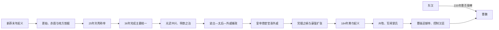

# 东汉

## 时间

25年-220年

## 概括

东汉由刘秀建立，定都洛阳。刘秀在新莽末年和更始、赤眉等政权混战中逐步统一天下，重建汉朝，史称汉光武帝。东汉前期有光武中兴和明章之治，政治相对稳定，社会经济恢复。

东汉中后期因幼主频繁、外戚与宦官轮流专权、豪强地主扩张和土地兼并加剧，中央控制能力逐步下降。184年黄巾起义后，地方州郡武装化；189年外戚、宦官互相毁灭和董卓入京使中央权威崩溃。曹操迎献帝后以汉廷名义统一北方，220年曹丕迫献帝禅位，东汉灭亡。

## 兴亡主线

## 重建背景与统治结构

| 层面 | 运作方式与变化 |
|---|---|
| 王朝重建 | 刘秀既以汉宗室恢复法统，又依靠南阳、河北豪强和军功集团逐步击败更始、赤眉、隗嚣、公孙述等。 |
| 中枢 | 削弱三公实际决策权，尚书台在皇帝近侧处理政务；提高效率，也使内廷控制更重要。 |
| 地方 | 郡县为基础，州刺史监察；汉末为应对叛乱设州牧、扩大地方军政权，成为割据制度条件。 |
| 豪强 | 大姓通过土地、宗族、宾客和坞堡影响基层，既帮助国家恢复治安税收，也隐匿人口并形成独立武力。 |
| 选官士人 | 察举、征辟和太学清议发展，士人形成跨地域政治声望网络；党锢打击后与朝廷关系破裂。 |
| 内廷政治 | 皇帝幼年时太后临朝、外戚辅政；成年皇帝常依靠身边宦官夺权，形成反复循环而非单一集团长期统治。 |
| 边疆 | 经营河西、西域、羌地、东北和南方；班超时期重建西域影响，羌乱等长期战争又消耗财政兵力。 |

## 建立、恢复与鼎盛机制

- **汉室号召与现实联盟**：刘秀的宗室身份提供合法性，真正取胜仍依靠河北地方豪强、军队和灵活招降。
- **逐区平定**：25年称帝后并未立即统一，直到36年击败公孙述，关东、陇右、巴蜀才大体纳入。
- **降低战后动员**：释放奴婢、裁并官吏、减轻田租和复员军队，使新莽末战争后的生产恢复。
- **柔道治国**：光武帝减少功臣直接干预朝政，以尚书台和文吏控制国家；功臣获得爵位而较少形成独立诸侯。
- **明章之治**：明帝、章帝继续整顿吏治、兴办教育，并对匈奴、西域展开攻势；班超经营西域将外交、驻军和当地联盟结合。
- **技术文化**：造纸改进、天文、医学和经学发展属于长期社会积累，不应只归于单个皇帝，但稳定帝国网络为传播提供条件。

## 中后期危机的形成

### 幼主与辅政循环

章帝以后多位皇帝幼年即位。太后需要父兄辅政，外戚掌禁军和尚书；皇帝成年后常借宦官发动政变。窦氏、邓氏、梁氏、何氏等外戚和宦官集团轮番兴衰，每次清洗都会破坏官僚连续性。

### 豪强与财政基础

豪强庄园吸纳流民、奴婢和依附人口，国家难以准确掌握户籍、田亩和赋役。地方大姓又是官吏、军队和赈济的实际支柱，中央无法简单消灭，只能依赖与防范并存。

### 边疆与社会压力

持续羌乱和北方、西域用兵造成军费、迁徙与地方破坏；灾荒、疫病、徭役和土地集中加深基层不安。太平道、五斗米道等宗教网络在国家救济不足处提供组织与信仰。

### 士人与内廷决裂

太学生、地方名士和官僚批评宦官，形成清议。166、169年党锢之祸禁锢、逮捕大量士人，使最有组织的地方精英不再信任中枢，也让朝廷失去危机中的合作渠道。

## 崩解与直接灭亡过程

1. 184年黄巾起义虽很快遭主力镇压，却迫使朝廷准许州郡、豪强自行募兵，地方军事权不可逆上升。
2. 西北凉州战争持续，中央财政和将领体系更加分散。
3. 189年灵帝死，何进召外军诛宦官未成反被杀；袁绍等杀宦官，外戚与宦官集团同归于尽。
4. 董卓率军入洛阳，废少帝、立献帝并迁都长安，皇帝沦为军阀控制的政治资源。
5. 董卓死后关东与关中军阀混战，州郡已不再接受统一命令。
6. 196年曹操迎献帝至许，以尚书、诏令和官爵号召诸侯，同时逐步统一北方；汉廷有名义而无独立军队财政。
7. 220年曹操死，曹丕继魏王和丞相权力，迫汉献帝禅位。献帝获封山阳公，说明王朝通过受禅程序终结，而实际权力早已转移。

## 衰亡原因层次

- **结构因素**：豪强控制人口土地、地方军政扩大，中央税兵基础长期收缩。
- **制度因素**：幼帝辅政没有稳定约束，外戚与宦官依靠清洗轮换，无法形成可持续权力交接。
- **社会因素**：灾荒、疫病、土地兼并与宗教结社扩大起义动员。
- **外部与边疆压力**：羌乱、匈奴和西域反复需要军费与将领，边军逐渐成为独立政治力量。
- **直接触发**：189年宫廷政变引外军入京，汉廷丧失禁军；此后献帝被董卓、李傕郭汜、曹操集团依次控制。
- **最终终结**：曹氏掌握北方军政和汉廷官僚，曹丕受禅只是把事实权力改成新王朝名号。

## 主要阶段

| 阶段 | 时间 | 说明 |
|---|---|---|
| 光武中兴 | 25年-57年 | 刘秀削平群雄，整顿吏治，恢复生产，重建汉室。 |
| 明章之治 | 57年-88年 | 明帝、章帝时期政治稳定，东汉国力进一步恢复。 |
| 外戚宦官政治 | 88年-168年 | 幼主继位频繁，外戚辅政与宦官干政交替出现。 |
| 党锢与黄巾 | 168年-189年 | 党锢之祸打击士人，黄巾起义引发地方武装扩张。 |
| 汉末割据 | 189年-220年 | 董卓入洛阳，群雄并起，曹操控制汉献帝，曹丕最终篡汉。 |

## 关键事件

| 事件 | 时间 | 影响 |
|---|---|---|
| 刘秀称帝 | 25年 | 东汉建立，定都洛阳。 |
| 平定割据 | 25年-36年 | 刘秀陆续平定关东、关中、陇右、蜀地等势力。 |
| 班超经营西域 | 1世纪后期 | 东汉恢复和加强对西域的影响。 |
| 外戚宦官更替专权 | 2世纪 | 中央政治结构失衡，皇权依赖内廷力量。 |
| 党锢之祸 | 166年、169年 | 士人与宦官冲突激化，士人集团被压制。 |
| 黄巾起义 | 184年 | 东汉基层秩序崩溃，地方军政力量兴起。 |
| 董卓乱政 | 189年 | 中央权威瓦解，关东诸侯讨董，进入军阀割据。 |
| 曹丕篡汉 | 220年 | 汉献帝禅位，曹魏建立，东汉灭亡。 |

## 说明

- 东汉政治比西汉更依赖士族、豪强和地方社会网络。
- 豪强地主既是地方秩序的重要力量，也削弱中央对土地、人口和赋役的控制。
- 黄巾起义后，州牧和地方军阀掌握兵权，东汉名义上存在，但实权逐渐转移到军阀手中。

## 演变关系

- 前一节点：[两汉交替](/%E4%BA%BA%E6%96%87%E7%A7%91%E5%AD%A6/%E5%8E%86%E5%8F%B2/%E4%B8%9C%E4%BA%9A/%E4%B8%AD%E5%9B%BD/%E6%B1%89/%E4%B8%A4%E6%B1%89%E4%BA%A4%E6%9B%BF.md)。
- 后一节点：[汉末群雄](/%E4%BA%BA%E6%96%87%E7%A7%91%E5%AD%A6/%E5%8E%86%E5%8F%B2/%E4%B8%9C%E4%BA%9A/%E4%B8%AD%E5%9B%BD/%E6%B1%89/%E6%B1%89%E6%9C%AB%E7%BE%A4%E9%9B%84.md)，并进一步进入三国。
- 相关笔记：[世系](/%E4%BA%BA%E6%96%87%E7%A7%91%E5%AD%A6/%E5%8E%86%E5%8F%B2/%E4%B8%9C%E4%BA%9A/%E4%B8%AD%E5%9B%BD/%E6%B1%89/%E4%B8%96%E7%B3%BB.md)。
