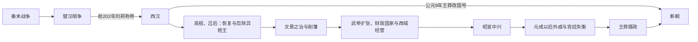

# 西汉

## 时间

前202年-8年

## 概括

西汉由刘邦在楚汉相争胜利后建立，定都长安。汉初承接秦制，但吸取秦亡教训，实行轻徭薄赋、与民休息。文帝、景帝时期形成“文景之治”，汉武帝时期中央集权、军事扩张和对外交通大幅推进，汉朝成为当时欧亚大陆东部最强大的帝国之一。

西汉后期，外戚势力上升、土地兼并加剧、政治秩序衰落。王莽借外戚身份掌握权力，在平帝死后以摄政、居摄和“假皇帝”等步骤控制朝廷，于公元9年正式建新，西汉法统结束；传统纪年把王莽篡位节点置于公元8年末至9年初。

## 兴亡主线

## 建立背景与统治结构

| 层面 | 运作方式与演变 |
|---|---|
| 皇帝与中枢 | 承秦皇帝、丞相、御史大夫和九卿框架；武帝以后尚书、中朝近臣参与决策，削弱丞相独立性。 |
| 郡国并行 | 关中和战略地区由郡县直辖，同时分封刘氏诸侯王；剪除异姓王、平七国之乱和推恩令逐步削弱封国军政权。 |
| 地方治理 | 郡太守、县令长负责行政司法；武帝设刺史监察州部，监察区尚不是后世完整地方行政层级。 |
| 选官 | 察举孝廉、贤良方正与征辟逐步发展，官僚来源仍包括功臣、郎官、外戚和地方豪族。 |
| 财政经济 | 汉初减税休养；武帝为战争推行盐铁官营、均输平准、算缗告缗和币制改革，国家汲取能力显著增强。 |
| 军事边疆 | 由和亲守势转为大规模骑兵战争，设置河西四郡、西域都护等机构；边疆控制随军费和国际形势伸缩。 |
| 合法性 | 刘邦以平乱与受命建国，武帝以后儒家经典、天人灾异和郊祀礼制日益进入国家政治语言。 |

## 建立、崛起与鼎盛机制

- **秦制的选择性继承**：西汉保留郡县、法律和文书行政，却减轻秦末式持续动员，降低新王朝与地方社会的冲突。
- **功臣—宗室平衡**：刘邦先依赖异姓诸侯击楚，建国后剪除其势力并分封同姓；文景时期再削弱过强宗王，中央集权分阶段完成。
- **恢复人口与税源**：长期低田租、减徭役和相对和平使农业、市场与国家户籍恢复，形成武帝扩张的物质基础。
- **文景之治**：文帝、景帝节省宫廷开支并稳定币制、粮价；前154年七国之乱被平定后，诸侯国官吏和封地进一步受中央控制。
- **武帝重组国家能力**：提拔卫青、霍去病等新军事集团，以察举、太学和中朝扩大用人渠道；财政专卖支撑对匈奴、南越、朝鲜和西域战争。
- **交通与帝国网络**：张骞出使后，汉朝与河西、西域及中亚诸国的政治、商贸联系扩大；所谓“丝绸之路”是长期多线路网络，而非一次开通的固定道路。
- **昭宣修复**：武帝末年转向休息，昭帝、宣帝在霍光辅政及后续亲政中调整赋役、整顿吏治，使长期战争后的国家恢复。

## 鼎盛的代价

- 对匈奴和多方向扩张获得河西、南方与西域影响，却消耗人口、马匹和财政，边疆驻军需要长期屯田补给。
- 盐铁、均输等增加中央收入，也引发国家与民间争利的争论；《盐铁论》反映昭帝时期对此的政策辩论。
- 皇帝绕过外朝任用近臣提高决策速度，却让外戚、尚书和内廷人物更易在幼主时期掌权。
- 强化经典和察举建立共同政治语言，但地方豪族可凭经学、婚姻与土地积累长期进入官僚。

## 衰落与王莽代汉原因

### 结构因素

- 土地买卖、债务和灾荒推动兼并，自耕户流失使赋役基础不稳；国家限制奴婢、田产的措施缺乏持续执行。
- 皇帝多无成年继承人或寿命较短，太后与外戚必须辅政，王氏家族因此长期控制高位。
- 察举和地方社会日益被豪族网络影响，中央命令需依赖地方大姓执行。
- 儒家灾异与禅让话语既可约束皇帝，也能被王莽用来证明天命转移。

### 政治过程与直接终结

1. 元帝以后后宫、外戚和近臣竞争加剧，王政君成为长期在位的太后、太皇太后。
2. 成帝时王氏多人任大司马；哀帝一度压制王氏，但早逝且无子。
3. 平帝幼年即位后王莽复任大司马，以安汉公、宰衡等身份控制中枢，并把女儿立为皇后。
4. 平帝公元6年去世，王莽拥立幼童刘婴为皇太子，自己称摄皇帝、假皇帝，实际掌握皇权。
5. 各地刘氏宗室和反对者起兵失败，王莽以符命、禅让叙事完成合法性包装。
6. 公元9年王莽称帝、改国号新，西汉皇室失去国家元首地位。王朝终结不是外敌攻都，而是外戚摄政集团从内部替代皇室。

## 主要阶段

| 阶段 | 时间 | 说明 |
|---|---|---|
| 建国与恢复 | 前202年-前180年 | 刘邦剪除异姓王，吕后临朝，国家从秦末战争中恢复。 |
| 文景之治 | 前180年-前141年 | 文帝、景帝轻徭薄赋，经济恢复；七国之乱后诸侯王势力被削弱。 |
| 汉武盛世 | 前141年-前87年 | 强化中央集权，独尊儒术，北击匈奴，开通西域，推行盐铁、均输等政策。 |
| 昭宣中兴 | 前87年-前49年 | 霍光辅政后政局稳定，昭帝、宣帝时期政治和经济恢复。 |
| 西汉后期 | 前49年-8年 | 元、成、哀、平时期外戚势力增强，王莽逐渐掌权并篡汉。 |

## 关键事件

| 事件 | 时间 | 影响 |
|---|---|---|
| 楚汉相争结束 | 前202年 | 刘邦称帝，西汉建立。 |
| 白登之围 | 前200年 | 汉初对匈奴处于守势，形成和亲政策。 |
| 吕后临朝 | 前195年-前180年 | 吕氏集团掌权，诸吕之乱后大臣迎立汉文帝。 |
| 七国之乱 | 前154年 | 景帝平定诸侯王叛乱，中央集权加强。 |
| 汉匈战争 | 汉武帝时期 | 卫青、霍去病多次击败匈奴，改变汉匈力量对比。 |
| 张骞通西域 | 前2世纪 | 推动中原与西域、中亚交通，丝绸之路逐渐形成。 |
| 巫蛊之祸 | 前91年 | 汉武帝晚年重大政治事件，太子刘据败亡。 |
| 霍光辅政 | 前87年以后 | 维持昭宣时期政局稳定，但也体现权臣政治影响。 |
| 王莽篡汉 | 8年 | 西汉结束，新朝建立。 |

## 说明

- 西汉初年“郡国并行”，既有中央直辖郡县，也有同姓诸侯王封国。
- 七国之乱后，诸侯王军事和行政权不断被削弱，中央集权更稳定。
- 汉武帝时期国力强盛，但长期战争和财政扩张也增加了社会负担。
- 昭宣时期常被视为西汉政治恢复和治理成熟的阶段。

## 演变关系

- 前一节点：秦亡后的楚汉相争。
- 后一节点：[两汉交替](/%E4%BA%BA%E6%96%87%E7%A7%91%E5%AD%A6/%E5%8E%86%E5%8F%B2/%E4%B8%9C%E4%BA%9A/%E4%B8%AD%E5%9B%BD/%E6%B1%89/%E4%B8%A4%E6%B1%89%E4%BA%A4%E6%9B%BF.md)。
- 相关专题：[七国之乱](/%E4%BA%BA%E6%96%87%E7%A7%91%E5%AD%A6/%E5%8E%86%E5%8F%B2/%E4%B8%9C%E4%BA%9A/%E4%B8%AD%E5%9B%BD/%E6%B1%89/%E4%B8%83%E5%9B%BD%E4%B9%8B%E4%B9%B1.md)、[世系](/%E4%BA%BA%E6%96%87%E7%A7%91%E5%AD%A6/%E5%8E%86%E5%8F%B2/%E4%B8%9C%E4%BA%9A/%E4%B8%AD%E5%9B%BD/%E6%B1%89/%E4%B8%96%E7%B3%BB.md)。
