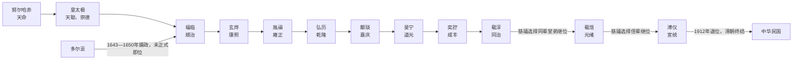

# 清皇帝世系

## 概括

清朝君主出自爱新觉罗氏。其政治谱系通常从建州女真追尊祖先算起，实际建国君主为努尔哈赤；皇太极改后金为清；顺治帝入关后迁都北京；宣统帝溥仪退位标志清朝结束。

## 世系主线

图中只列实际在位者；多尔衮虽掌握入关初年的最高权力且死后一度获追尊，仍不计入清帝正式次序。

## 追尊祖先

| 顺序 | 姓名 | 庙号 | 谥号 | 年号 | 在位时间 | 生卒时间 | 与后继关系 | 关键事件 / 备注 / 说明 |
|---:|---|---|---|---|---|---|---|---|
| 1 | 孟特穆；猛哥帖木儿 | 肇祖 | 原皇帝 | 无 | 无 | 1370年-1433年 | 爱新觉罗氏先祖 | 清世祖追尊。 |
| 2 | 福满 | 兴祖 | 直皇帝 | 无 | 无 | 不详 | 孟特穆后裔 | 清世祖追尊。 |
| 3 | 觉昌安 | 景祖 | 翼皇帝 | 无 | 无 | 1526年-1583年 | 努尔哈赤祖父 | 清世祖追尊。 |
| 4 | 塔克世 | 显祖 | 宣皇帝 | 无 | 无 | 1543年-1583年 | 努尔哈赤父 | 清世祖追尊。 |

## 后金与清朝

| 顺序 | 姓名 | 庙号 | 谥号 | 年号 | 在位时间 | 生卒时间 | 与前任关系 | 关键事件 / 备注 / 说明 |
|---:|---|---|---|---|---|---|---|---|
| 1 | **努尔哈赤** | 太祖 | 承天广运圣德神功肇纪立极仁孝睿武端毅钦安弘文定业高皇帝 | 天命 | 1616年-1626年 | 1559年-1626年 | 建国者 | 统一建州女真并兼并女真诸部；以十三副遗甲起兵。**1616年在赫图阿拉建国称汗，国号大金，史称后金。** 1626年宁远之战受挫后去世。 |
| 2 | **皇太极** | 太宗 | 应天兴国弘德彰武宽温仁圣睿孝敬敏昭定隆道显功文皇帝 | 天聪、崇德 | 1626年-1643年 | 1592年-1643年 | 太祖子 | 推行天聪新政，改女真为满洲，改沈阳为盛京。**1636年称帝，改国号为大清。** 1643年去世，子福临继位，多尔衮摄政。 |
| - | 多尔衮 | 成宗；后削庙号 | 懋德修道广业定功安民立政诚敬义皇帝；后削谥号 | 无 | 未即位 | 1612年-1650年 | 太祖子；顺治帝叔父 | 摄政王。1644年率清军入关并主持迁都北京；死后一度追尊为帝，后被削去帝号与庙号。 |
| 3 | 福临 | 世祖 | 体天隆运定统建极英睿钦文显武大德弘功至仁纯孝章皇帝 | 顺治 | 1643年-1661年 | 1638年-1661年 | 太宗子 | 1644年清军入关后迁都北京；清朝逐步取代明朝成为全国性统治者。顺治末年清军攻入云南，南明永历政权走向灭亡。 |
| 4 | **玄烨** | 圣祖 | 合天弘运文武睿哲恭俭宽裕孝敬诚信中和功德大成仁皇帝 | 康熙 | 1661年-1722年 | 1654年-1722年 | 世祖子 | 平三藩、取台湾、击败噶尔丹；雅克萨之战后与俄国签订《尼布楚条约》。康熙朝与雍正、乾隆时期合称康雍乾时期。 |
| 5 | **胤禛** | 世宗 | 敬天昌运建中表正文武英明宽仁信毅睿圣大孝至诚宪皇帝 | 雍正 | 1722年-1735年 | 1678年-1735年 | 圣祖子 | 推行摊丁入亩、耗羡归公、密折制度和军机处建设，加强财政与中央集权。 |
| 6 | **弘历** | 高宗 | 法天隆运至诚先觉体元立极敷文奋武钦明孝慈神圣纯皇帝 | 乾隆 | 1735年-1796年 | 1711年-1799年 | 世宗子 | 平定准噶尔和大小和卓，清朝版图达到高峰；晚年吏治和财政问题加重。1796年禅位给嘉庆帝后仍以太上皇掌权。 |
| 7 | 颙琰 | 仁宗 | 受天兴运敷化绥猷崇文经武光裕孝恭勤俭端敏英哲睿皇帝 | 嘉庆 | 1796年-1820年 | 1760年-1820年 | 高宗子 | 诛和珅，镇压白莲教起义；清朝由盛转衰的财政、吏治和社会压力显现。 |
| 8 | 旻宁 | 宣宗 | 效天符运立中体正至文圣武智勇仁慈俭勤孝敏宽定成皇帝 | 道光 | 1820年-1850年 | 1782年-1850年 | 仁宗子 | 鸦片战争爆发，1842年签订《南京条约》，中国近代不平等条约体系开始。 |
| 9 | 奕詝 | 文宗 | 协天翊运执中垂谟懋德振武圣孝渊恭端仁宽敏庄俭显皇帝 | 咸丰 | 1850年-1861年 | 1831年-1861年 | 宣宗子 | 太平天国兴起，第二次鸦片战争中英法联军攻入北京，圆明园被毁；咸丰帝逃往热河并去世。 |
| 10 | 载淳 | 穆宗 | 继天开运受中居正保大定功圣智诚孝信敏恭宽明肃毅皇帝 | 同治 | 1861年-1875年 | 1856年-1875年 | 文宗子 | 慈安、慈禧两宫太后垂帘听政；湘军、淮军平定太平天国，洋务运动兴起。 |
| 11 | 载湉 | 德宗 | 同天崇运大中至正经文纬武仁孝睿智端俭宽勤景皇帝 | 光绪 | 1875年-1908年 | 1871年-1908年 | 穆宗堂弟；醇亲王奕譞子 | 甲午战争失败，戊戌变法失败后被慈禧幽禁；庚子事变后推行清末新政和预备立宪。 |
| 12 | **溥仪** | 无 | 愍皇帝；逊皇帝 | 宣统 | 1908年-1912年 | 1906年-1967年 | 德宗侄；醇亲王载沣子 | 1908年即位，摄政王载沣辅政。**1912年2月12日退位，清朝结束。** 后曾短暂复辟并在伪满洲国称帝，不属于清朝全国性统治。 |

## 继承机制与关键转折

- **汗位推举到皇位继承**：努尔哈赤死后，皇太极由贝勒会议支持继位，并非按严格嫡长制自动承继；皇太极猝死后，豪格与多尔衮集团相持，最终以幼年福临继位、多尔衮与济尔哈朗辅政妥协。
- **入关后的幼主政治**：顺治、康熙均幼年即位。顺治初由多尔衮实际主政；康熙初由四辅臣辅政，随后康熙亲政并清除鳌拜集团。
- **秘密建储**：康熙晚年两立两废太子胤礽，引发诸皇子竞争。雍正以后采用秘密立储，把继承人姓名密封存放，皇帝死后公开，以减少公开储位带来的党争；乾隆、嘉庆、道光、咸丰的继承大体在这一机制下完成。
- **太上皇与实际权力**：乾隆为不超过康熙在位年数，于1796年禅位嘉庆，但至1799年去世前仍掌握关键决策，名义在位与实际最高权力需区分。
- **同治、光绪的断代选择**：同治无子，慈禧选择咸丰帝同辈支系的载湉继位，使其名义上承继咸丰；光绪无子，又选年幼溥仪承继同治并兼祧光绪。两次安排都服务于两宫或慈禧继续控制摄政结构。
- **退位而非战死**：辛亥革命后，隆裕太后代表幼帝接受优待条件并颁布退位诏书。清朝法统于1912年2月12日结束；张勋1917年短暂复辟和溥仪后来在伪满洲国称帝均不是清朝连续统治。

## 王朝兴衰与末代继承

- 清初通过八旗组织、满蒙联盟、吸纳汉官和连续战争从东北政权成长为全国性王朝。
- 康雍乾时期的财政整顿、边疆扩张和官僚整合支持长期统治，但人口增长、土地压力、官僚腐败与军费负担在18世纪末以后累积。
- 19世纪列强战争、条约体系和大规模内乱削弱中央财政与传统军队，湘淮集团和地方督抚获得更大军事、筹饷权。
- 甲午战败、庚子事变后虽推行新政、废科举、练新军和预备立宪，改革同时制造财政负担与政治期待；铁路国有化、保路运动与武昌起义构成1911年的直接危机。
- 袁世凯掌握北洋军并与南方革命政权议和，使清廷缺乏可靠军事方案；退位换取皇室优待成为最后的制度性终结方式。

## 演变关系

- 前一节点：[明](/%E4%BA%BA%E6%96%87%E7%A7%91%E5%AD%A6/%E5%8E%86%E5%8F%B2/%E4%B8%9C%E4%BA%9A/%E4%B8%AD%E5%9B%BD/%E6%98%8E/README.md)。
- 后一节点：[民国](/%E4%BA%BA%E6%96%87%E7%A7%91%E5%AD%A6/%E5%8E%86%E5%8F%B2/%E4%B8%9C%E4%BA%9A/%E4%B8%AD%E5%9B%BD/%E6%B0%91%E5%9B%BD/README.md)。
- 相关制度：[八旗](/%E4%BA%BA%E6%96%87%E7%A7%91%E5%AD%A6/%E5%8E%86%E5%8F%B2/%E4%B8%9C%E4%BA%9A/%E4%B8%AD%E5%9B%BD/%E6%B8%85/%E5%85%AB%E6%97%97.md)。
