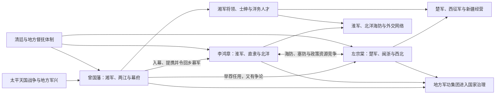

# 曾左李关系图

## 概括

曾国藩、左宗棠、李鸿章并非平行出现的三位“中兴名臣”，而是从太平天国战争、湘军幕府和地方筹饷体系中先后崛起、又各自形成军政网络的晚清重臣。曾国藩是较早的组织者与平台建立者；左宗棠从湖南士绅和湘军相关网络走向闽浙、西北；李鸿章在曾幕历练后建立淮军，长期经营直隶和北洋。三人既互相举荐、共享部属和洋务经验，也在用兵、人事、外交及海防—塞防资源分配上竞争。

## 人物与网络关系

箭头表示提携、人员流动或政策互动，不表示三人的军队始终由曾国藩统一指挥。左宗棠的楚军、李鸿章的淮军形成后均有各自饷源、将领和战区。

## 人物比较

| 人物 | 主要基础 | 关键职位与领域 | 代表性行动 | 主要局限 |
|---|---|---|---|---|
| **曾国藩** | 湖南士绅、湘军、幕府与两江财政 | 两江总督、钦差大臣；镇压太平天国、恢复地方秩序、洋务开端 | 组建湘军水陆师，围攻安庆、天京；设安庆内军械所，支持江南制造局 | 私人募兵和地方筹饷强化区域军权；对战争杀戮、天津教案处理等负有争议。 |
| **左宗棠** | 湖南士绅、湘军相关人脉、楚军与西北军政 | 闽浙总督、陕甘总督、钦差大臣；平定陕甘、收复新疆、福建洋务 | 创办福州船政，组织西征军，1876—1878年收复新疆大部 | 西征耗资巨大，也依赖厘金、海关借款和胡雪岩等筹饷网络；地方治理伴随战争强制。 |
| **李鸿章** | 曾国藩幕府、淮军、直隶与北洋系统 | 江苏巡抚、直隶总督、北洋大臣；洋务、海防、外交 | 组建淮军，镇压太平军和捻军；经营军工、轮船、电报、矿务与北洋水师 | 北洋体系区域化、制度整合不足；甲午失败及多项对外条约使其承担重大政治责任。 |

## 关系形成的阶段

### 1. 湖南士绅与湘军平台

曾国藩奉命办团练后，需要文案、筹饷、军需、地方治理和将领人才，其幕府成为跨省政治训练场。左宗棠早期曾在湖南巡抚骆秉章幕府处理军政，并非长期作为曾国藩普通幕僚；曾对其才能有举荐和合作。李鸿章则较明确进入曾幕，学习奏牍、军制和协调地方的方法。

### 2. 各建军系

- 曾国藩以湖南团练建立[湘军](/%E4%BA%BA%E6%96%87%E7%A7%91%E5%AD%A6/%E5%8E%86%E5%8F%B2/%E4%B8%9C%E4%BA%9A/%E4%B8%AD%E5%9B%BD/%E6%B8%85/%E6%B9%98%E5%86%9B.md)，掌握长江中上游总体战局。
- 李鸿章奉曾国藩之命回安徽募兵，1862年率[淮军](/%E4%BA%BA%E6%96%87%E7%A7%91%E5%AD%A6/%E5%8E%86%E5%8F%B2/%E4%B8%9C%E4%BA%9A/%E4%B8%AD%E5%9B%BD/%E6%B8%85/%E6%B7%AE%E5%86%9B.md)赴上海，迅速形成独立饷源和将领网络。
- 左宗棠在浙江军务中发展楚军，后来把相关将领和筹饷方式带入陕甘、新疆战场。
- 三个系统共享营官自募、私人负责和地方筹饷原则，但战区、人员和技术侧重点不同。

### 3. 太平天国后的国家治理

天京陷落后，曾国藩裁撤部分湘军并任两江、直隶要职；李鸿章由江苏升至直隶，接手北方军政与外交；左宗棠转向福建船政和西北战争。军功不再只换取爵位，而是使将领进入总督、巡抚、海关、军工和外交决策层。

## 合作、提携与分歧

### 曾国藩与李鸿章

- 曾国藩是李鸿章的重要导师和政治担保者，允许其从幕僚转为独立统帅，并推荐其任江苏巡抚。
- 淮军在江南与湘军形成战区配合，湘军攻天京上游，淮军经营上海和苏南。
- 李鸿章并非曾国藩永久属下；取得江苏财源和直隶职位后形成独立北洋集团。
- 1870年天津教案后曾国藩处理受到舆论攻击，李鸿章继任直隶总督，显示权力中心从湘系元老向淮系北洋转移。

### 曾国藩与左宗棠

- 曾国藩认可并举荐左宗棠的军政才能，双方在浙江战事和地方人事上合作。
- 两人性格、用兵和声望竞争造成多次书信与舆论冲突；关于天京陷落后幼天王去向等问题亦曾发生争论。
- 左宗棠的事业基础不只来自曾氏，其在骆秉章幕府、浙江军务及后来自建楚军同样重要，不能写成单线“曾门弟子”。

### 左宗棠与李鸿章

- 二人都推动军工、轮船和新式教育，却分别以西北陆防与北洋海防、外交为主要政治舞台。
- 1870年代“海防与塞防”争论中，李鸿章强调沿海尤其台湾危机下的海防资源，左宗棠坚持不能放弃新疆。实际双方并非一方完全不要塞防、另一方完全不要海防，而是在有限财政下排序不同。
- 清廷最终支持左宗棠西征，同时继续海防建设；政策结果是两方面都进行，但经费长期不足。
- 外交与用兵风格、人事网络和商业筹款亦有竞争，后世派系叙事常把分歧进一步简单化。

## 共同的洋务路径

| 领域 | 曾国藩 | 左宗棠 | 李鸿章 |
|---|---|---|---|
| 军工 | 安庆内军械所；支持江南制造局 | 福州船政局、西北军械与运输 | 江南制造局、天津机器局及北洋军械 |
| 海军 / 航运 | 支持购买船炮和派员学习 | 建船政、船政学堂及福建水师基础 | 轮船招商局、北洋水师、旅顺与威海基地 |
| 人才 | 大型幕府、翻译与留学倡议 | 船政学堂、技术人员培养 | 武备学堂、外交与电报矿务人才 |
| 财政方式 | 厘金、地方捐输和两江财源 | 跨省协饷、借款、商人筹款 | 海关、厘金、直隶与北洋专项经费 |
| 基本思路 | 以新器物增强王朝秩序 | 军事工业与边疆经营结合 | 军事、工商、交通和外交并举 |

三人主要追求在清朝政治框架内增强军政能力，并未建立统一的宪政、财政和全国军制改革方案。企业往往由官督商办或官办，受到官僚干预、地区分割和经费不稳限制。

## 共同崛起的机制

- **战争授权**：清廷为应急把募兵、筹饷和任将权交给地方大员。
- **士绅网络**：科举、书院、同乡和宗族关系提供可信任的人才与地方资源。
- **幕府机制**：大量非正式幕僚承担军事、财政、外交与翻译，弥补常规官僚机构不足。
- **军功升迁**：将领和幕僚通过战功跨越正常资历，形成以督抚为中心的政治集团。
- **新财源**：厘金、海关和商业借款支持军队及洋务，却使政策依赖地区收入和个人协调。
- **中央认可**：所有集团仍需皇帝诏令、官爵和法定税权；地方化不是国家权力简单消失，而是国家通过督抚网络重新组织。

## 历史影响与评价

### 成效

- 三人及其网络帮助清廷镇压太平天国、捻军和西北叛乱，延长王朝统治。
- 军工、航运、电报、矿务、学堂和翻译事业建立了中国早期近代工业与技术教育基础。
- 收复新疆及沿海防务使清朝在内外危机中保存重要领土。
- 幕府和督抚跨部门协调，为传统官制处理近代战争、外交和工业提供过渡机制。

### 局限与代价

- 军队依赖个人和地域，国家未形成统一参谋、预算、征兵和后勤体系。
- 厘金及地方筹饷加重社会负担，内战镇压造成巨大人口伤亡与破坏。
- 洋务多集中器物与局部产业，政治责任、财政透明和全国制度协调改革不足。
- 派系竞争导致经费和战略分散，北洋体系在甲午战争中未获全国性有效支援。
- “中兴名臣”是清廷立场的评价；从太平军、地方民众、边疆群体和对外战争角度看，三人的历史角色更复杂。

## 图像

## 演变关系

- 制度前提：[清末团练](/%E4%BA%BA%E6%96%87%E7%A7%91%E5%AD%A6/%E5%8E%86%E5%8F%B2/%E4%B8%9C%E4%BA%9A/%E4%B8%AD%E5%9B%BD/%E6%B8%85/%E6%B8%85%E6%9C%AB%E5%9B%A2%E7%BB%83.md)。
- 军事网络：[湘军](/%E4%BA%BA%E6%96%87%E7%A7%91%E5%AD%A6/%E5%8E%86%E5%8F%B2/%E4%B8%9C%E4%BA%9A/%E4%B8%AD%E5%9B%BD/%E6%B8%85/%E6%B9%98%E5%86%9B.md)、[淮军](/%E4%BA%BA%E6%96%87%E7%A7%91%E5%AD%A6/%E5%8E%86%E5%8F%B2/%E4%B8%9C%E4%BA%9A/%E4%B8%AD%E5%9B%BD/%E6%B8%85/%E6%B7%AE%E5%86%9B.md)。
- 王朝背景：[清](/%E4%BA%BA%E6%96%87%E7%A7%91%E5%AD%A6/%E5%8E%86%E5%8F%B2/%E4%B8%9C%E4%BA%9A/%E4%B8%AD%E5%9B%BD/%E6%B8%85/README.md)。
- 后一节点：洋务运动、北洋体系、清末新军与地方督抚政治。
