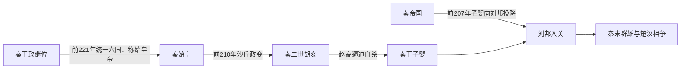

# 秦朝世系

## 概括

秦朝自前221年秦始皇称帝起，到前207年秦王子婴投降刘邦止，共经历秦始皇、秦二世和秦王子婴三个统治节点。秦始皇废除谥法，秦也没有后世意义上的年号制度，因此表中相关字段以“无”或说明性文字标注。

## 世系与灭亡主线

## 世系表

| 顺序 | 姓名 | 庙号 | 谥号 | 年号 | 在位时间 | 生卒时间 | 与前任关系 | 关键事件 / 备注 / 说明 |
|---:|---|---|---|---|---|---|---|---|
| 1 | **嬴政** | 无正式庙号 | 无；秦始皇废谥法，称始皇帝 | 无年号 | 前246年-前221年为秦王；前221年-前210年为皇帝 | 前259年-前210年 | 秦庄襄王之子，继秦王位；前221年统一六国后称皇帝 | 前221年灭齐完成统一，建立秦朝；废封建、设郡县，建立三公九卿；统一文字、度量衡、货币和车轨；北击匈奴，南服百越。 |
| 2 | 胡亥 | 无正式庙号 | 无；称秦二世皇帝 | 无年号 | 前210年-前207年 | 前230年-前207年 | 秦始皇少子，沙丘政变后继位 | 赵高、李斯矫诏立胡亥；赵高专权。前209年陈胜、吴广起义，各地反秦势力兴起。 |
| 3 | 子婴 | 无正式庙号 | 无；通常称秦王子婴 | 无年号 | 前207年，约46日 | 不详-前206年 | 秦宗室，具体亲属关系有异说；秦二世死后被赵高立为秦王 | 杀赵高后向刘邦投降，秦朝灭亡。项羽入关后杀子婴，焚毁秦宫，掠夺财物东归。 |

## 二世而亡的过程与原因

### 结构因素

- 秦以高度集中的郡县、军功和法律体系完成统一，但统一战争后仍维持大规模徭役、戍役与工程，地方社会的承受能力迅速下降。
- 六国旧贵族、地方豪强和被迁徙人口并未消失；中央一旦失去威慑，各地便有现成的反秦组织资源。
- 皇帝权力过度集中而缺乏稳定的宫廷继承与纠错机制，使最高层一次政变即可改变整个帝国的决策链。

### 关键事件与直接灭亡过程

1. 前210年秦始皇死于巡行途中，赵高、李斯隐瞒死讯并发动沙丘政变，迫使扶苏自杀，改立胡亥。
2. 胡亥清洗宗室和大臣，赵高控制诏令；政治恐怖削弱统治集团内部信任，也使地方危机难以上达。
3. 前209年陈胜、吴广起义后，六国旧地的反秦力量迅速扩张。章邯虽曾镇压多支军队，却无法同时恢复地方行政与贡赋。
4. 前207年巨鹿之战后，项羽重创秦军主力；章邯投降，关中失去外线屏障。
5. 赵高逼胡亥自杀，改立子婴为秦王，等于承认帝国名号已难维持。子婴虽杀赵高，却无力重建军队和地方服从。
6. 刘邦先入关中，子婴于前207年投降，秦朝在政治上终结；前206年项羽入关后杀子婴，进一步清除秦王室。

### 原因层次

- **统治因素**：继承政变、宗室清洗、赵高专权和错误应对，使国家能力在危机中反而加速崩解。
- **社会压力**：重役、刑法与战后资源汲取激化基层反抗。
- **外部与地方压力**：旧六国政治网络复活，反秦武装从局部骚动转为多中心战争。
- **直接触发**：巨鹿战败与章邯投降摧毁秦军主力，刘邦进入关中迫使子婴投降。
- 秦的制度并未随王朝完全消失；郡县、官僚和统一标准被汉继承、调整，说明“秦亡”不能简单等同于“秦制全部失败”。

## 辨析

- 秦始皇前246年即秦王位，前221年统一六国后才称皇帝；本表同时保留秦王阶段和皇帝阶段。
- 子婴在位时已去帝号称秦王，因此不列为“秦三世”。
- 秦朝没有年号制度；年号制度到汉武帝时期才正式形成。

## 演变关系

- 前一节点：秦国诸王长期积累的制度和军事优势。
- 后一节点：[秦末群雄](/%E4%BA%BA%E6%96%87%E7%A7%91%E5%AD%A6/%E5%8E%86%E5%8F%B2/%E4%B8%9C%E4%BA%9A/%E4%B8%AD%E5%9B%BD/%E7%A7%A6/%E7%A7%A6%E6%9C%AB%E7%BE%A4%E9%9B%84.md)与楚汉相争。
