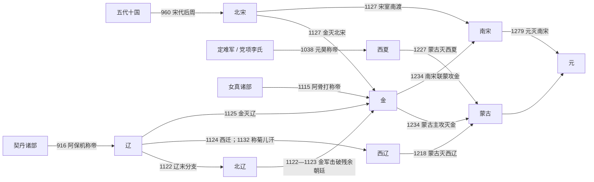

# 辽宋金西夏

## 概括

辽宋金西夏时期大致从契丹耶律阿保机于916年正式称帝延续到南宋在1279年灭亡，是唐末五代之后、元朝完成统一以前的多中心时代。辽控制东北、漠南和燕云地区，北宋以中原及江南为核心，西夏立足河西走廊，金兴起后取代辽并占领华北；北辽、西辽和南宋又分别延续了辽、宋政统的不同分支。各政权有重叠疆域诉求，却没有任何一方在大部分时间内统一整个区域。

理解这一阶段不能只沿一条“正统王朝”线索前进。战争之外，各国还以和议、边市、互使、婚姻、册封和岁币维持秩序；同一个关系也会随战争结果改变。例如1005年澶渊之盟下宋辽为兄弟之国，1141—1142年南宋对金称臣，1164年又改为叔侄关系。称臣、受册封和岁输只说明特定条约下的名分与义务，不必然意味着对方能够直接任官、征税和驻军。

辽、金、西夏都把本族军事社会组织与汉地官僚制度结合起来，宋则以文官财政国家、职业军队和高度发展的江南经济维持长期战争。13世纪蒙古先夺取草原和东北战略优势，再吸收降军、攻城技术及地方税源，先后灭西辽、西夏、金与南宋；元朝由此结束这一轮多政权并立。

## 演进流程

## 历史主线

### 多中心格局形成（916年—1038年）

916年阿保机称帝后，辽把契丹部落政治、草原军事网络与燕云农耕区连接起来。960年赵匡胤利用后周军政资源建立宋朝，陆续结束五代十国的主要割据，却未能取得燕云十六州。1005年澶渊之盟使宋辽停止大规模战争，以边界、互市和宋方向辽给付岁币维持约一个世纪的稳定；这是一种承认双方皇帝地位的条约秩序，不是辽对宋的直接统治。

党项李氏长期经营定难军和河西地区，李继迁、李德明在宋辽之间扩张并积累制度资源。1038年李元昊称帝建立西夏，宋、辽、西夏三方格局形成。1044年宋夏议和后，西夏君主在对宋文书中接受册封名义，同时继续自置官僚、军队、年号和外交，因而是“名义称臣、实际独立”。

### 金兴起与辽、北宋覆亡（1114年—1127年）

1114年阿骨打起兵反辽，1115年建立金朝。宋金于1120年订立海上之盟，但宋军未能有效攻取燕京，金则在1125年俘获辽天祚帝。辽末耶律淳等在燕京建立北辽，耶律大石向西发展为西辽，说明辽的本土帝国虽亡，契丹政统和政治网络并未同时消失。

宋金联盟很快因燕云交割、费用和叛亡者问题破裂。金军于1125—1127年两次南下，攻陷开封并俘虏徽、钦二帝，北宋灭亡。金曾扶植楚、齐等傀儡政权管理部分汉地，但实际军事主导权仍在金廷；1137年废齐后，金朝直接统治华北的程度进一步提高。赵构则在南方重建宋廷，形成金与南宋对峙。

### 宋金南北对峙与各国调适（1127年—1208年）

1141—1142年绍兴和议规定南宋向金称臣，以淮水—大散关一线为大致边界，并纳银绢；1161年海陵王南征失败后，1164年隆兴和议又把君臣改为叔侄、降低岁输。这些变化说明“宋金关系”不能用一个固定标签覆盖整个时期。

辽、宋、金、西夏的国家建设都体现制度复合。辽以南北面官分别适应不同社会，金以猛安谋克和州县官僚并行，西夏结合党项军事组织、河西治理经验及汉、吐蕃制度资源，宋则依赖文官行政、科举、税收和职业军队。各国还通过边市和使节交换物资、情报与礼仪承认；和平并非没有竞争，而是把竞争限制在条约与边界框架内。

### 蒙古扩张与区域统一（1206年—1279年）

1206年成吉思汗统一蒙古诸部后，首先打击西夏并于1211年全面攻金。1218年蒙古消灭控制西辽政权的屈出律，1227年在长期进攻和河西破坏后灭西夏。金在1214年迁都开封、1215年失中都，又自1217年与南宋交战，陷入多线消耗；1232年三峰山战败后失去主力，1234年亡于蒙古主攻与南宋参战的蔡州之战。

南宋短暂利用联蒙灭金收复部分河南，旋即与蒙古冲突。凭借江淮、四川和长江防线，南宋又抵抗四十余年；襄阳失守后，元军顺江推进，1276年临安朝廷投降，但沿海流亡政权继续存在。1279年崖山战败才是宋朝政权的最终终结。

## 政权导航

| 按建立先后 | 政权 | 时间 | 主线定位 | 世系 |
|---:|---|---|---|---|
| 1 | [辽](/%E4%BA%BA%E6%96%87%E7%A7%91%E5%AD%A6/%E5%8E%86%E5%8F%B2/%E4%B8%9C%E4%BA%9A/%E4%B8%AD%E5%9B%BD/%E8%BE%BD%E5%AE%8B%E9%87%91%E8%A5%BF%E5%A4%8F/%E8%BE%BD/README.md) | 916年—1125年 | 契丹建立的东北—草原—燕云复合帝国；1125年被金灭。 | [辽皇帝世系](/%E4%BA%BA%E6%96%87%E7%A7%91%E5%AD%A6/%E5%8E%86%E5%8F%B2/%E4%B8%9C%E4%BA%9A/%E4%B8%AD%E5%9B%BD/%E8%BE%BD%E5%AE%8B%E9%87%91%E8%A5%BF%E5%A4%8F/%E8%BE%BD/%E4%B8%96%E7%B3%BB.md) |
| 2 | [北宋](/%E4%BA%BA%E6%96%87%E7%A7%91%E5%AD%A6/%E5%8E%86%E5%8F%B2/%E4%B8%9C%E4%BA%9A/%E4%B8%AD%E5%9B%BD/%E8%BE%BD%E5%AE%8B%E9%87%91%E8%A5%BF%E5%A4%8F/%E5%AE%8B/%E5%8C%97%E5%AE%8B.md) | 960年—1127年 | 结束五代十国主要割据，与辽、西夏并立；靖康之变后灭亡。 | [宋皇帝世系](/%E4%BA%BA%E6%96%87%E7%A7%91%E5%AD%A6/%E5%8E%86%E5%8F%B2/%E4%B8%9C%E4%BA%9A/%E4%B8%AD%E5%9B%BD/%E8%BE%BD%E5%AE%8B%E9%87%91%E8%A5%BF%E5%A4%8F/%E5%AE%8B/%E4%B8%96%E7%B3%BB.md) |
| 3 | [西夏](/%E4%BA%BA%E6%96%87%E7%A7%91%E5%AD%A6/%E5%8E%86%E5%8F%B2/%E4%B8%9C%E4%BA%9A/%E4%B8%AD%E5%9B%BD/%E8%BE%BD%E5%AE%8B%E9%87%91%E8%A5%BF%E5%A4%8F/%E8%A5%BF%E5%A4%8F/README.md) | 1038年—1227年；前史始于982年 | 党项李氏以河西和兴庆府为核心的独立国家；1227年被蒙古灭。 | [西夏皇帝世系](/%E4%BA%BA%E6%96%87%E7%A7%91%E5%AD%A6/%E5%8E%86%E5%8F%B2/%E4%B8%9C%E4%BA%9A/%E4%B8%AD%E5%9B%BD/%E8%BE%BD%E5%AE%8B%E9%87%91%E8%A5%BF%E5%A4%8F/%E8%A5%BF%E5%A4%8F/%E4%B8%96%E7%B3%BB.md) |
| 4 | [金](/%E4%BA%BA%E6%96%87%E7%A7%91%E5%AD%A6/%E5%8E%86%E5%8F%B2/%E4%B8%9C%E4%BA%9A/%E4%B8%AD%E5%9B%BD/%E8%BE%BD%E5%AE%8B%E9%87%91%E8%A5%BF%E5%A4%8F/%E9%87%91/README.md) | 1115年—1234年 | 女真完颜氏先灭辽、北宋并统治华北，后与南宋对峙；1234年灭亡。 | [金皇帝世系](/%E4%BA%BA%E6%96%87%E7%A7%91%E5%AD%A6/%E5%8E%86%E5%8F%B2/%E4%B8%9C%E4%BA%9A/%E4%B8%AD%E5%9B%BD/%E8%BE%BD%E5%AE%8B%E9%87%91%E8%A5%BF%E5%A4%8F/%E9%87%91/%E4%B8%96%E7%B3%BB.md) |
| 5 | [北辽](/%E4%BA%BA%E6%96%87%E7%A7%91%E5%AD%A6/%E5%8E%86%E5%8F%B2/%E4%B8%9C%E4%BA%9A/%E4%B8%AD%E5%9B%BD/%E8%BE%BD%E5%AE%8B%E9%87%91%E8%A5%BF%E5%A4%8F/%E8%BE%BD/%E5%8C%97%E8%BE%BD.md) | 1122年—1123年 | 辽末燕京及其残余朝廷的统称；有拥立、遥立和摄政，不是稳定统一王朝。 | 见[辽皇帝世系](/%E4%BA%BA%E6%96%87%E7%A7%91%E5%AD%A6/%E5%8E%86%E5%8F%B2/%E4%B8%9C%E4%BA%9A/%E4%B8%AD%E5%9B%BD/%E8%BE%BD%E5%AE%8B%E9%87%91%E8%A5%BF%E5%A4%8F/%E8%BE%BD/%E4%B8%96%E7%B3%BB.md)中的北辽表 |
| 6 | [西辽](/%E4%BA%BA%E6%96%87%E7%A7%91%E5%AD%A6/%E5%8E%86%E5%8F%B2/%E4%B8%9C%E4%BA%9A/%E4%B8%AD%E5%9B%BD/%E8%BE%BD%E5%AE%8B%E9%87%91%E8%A5%BF%E5%A4%8F/%E8%BE%BD/%E8%A5%BF%E8%BE%BD.md) | 1124年起西迁；1132年—1218年称菊儿汗 | 契丹西迁中亚建立的霸权，以属国、贡纳和地方统治者间接治理为主。 | 见[辽皇帝世系](/%E4%BA%BA%E6%96%87%E7%A7%91%E5%AD%A6/%E5%8E%86%E5%8F%B2/%E4%B8%9C%E4%BA%9A/%E4%B8%AD%E5%9B%BD/%E8%BE%BD%E5%AE%8B%E9%87%91%E8%A5%BF%E5%A4%8F/%E8%BE%BD/%E4%B8%96%E7%B3%BB.md)中的西辽表 |
| 7 | [南宋](/%E4%BA%BA%E6%96%87%E7%A7%91%E5%AD%A6/%E5%8E%86%E5%8F%B2/%E4%B8%9C%E4%BA%9A/%E4%B8%AD%E5%9B%BD/%E8%BE%BD%E5%AE%8B%E9%87%91%E8%A5%BF%E5%A4%8F/%E5%AE%8B/%E5%8D%97%E5%AE%8B.md) | 1127年—1279年 | 宋室南渡后依托江南重建；1276年临安投降，1279年最终灭亡。 | [宋皇帝世系](/%E4%BA%BA%E6%96%87%E7%A7%91%E5%AD%A6/%E5%8E%86%E5%8F%B2/%E4%B8%9C%E4%BA%9A/%E4%B8%AD%E5%9B%BD/%E8%BE%BD%E5%AE%8B%E9%87%91%E8%A5%BF%E5%A4%8F/%E5%AE%8B/%E4%B8%96%E7%B3%BB.md) |

## 重要转折与时间节点

| 时间 | 转折 | 区域影响 |
|---|---|---|
| 916年 | 阿保机正式称帝 | 契丹国家由部落联盟转向帝国，辽成为此阶段最早建立的主要政权。 |
| 960年 | 赵匡胤建宋 | 中原重新形成稳定中央政权，但北方仍有辽，统一并未完成。 |
| 1005年 | 澶渊之盟 | 宋辽以兄弟之国、边界和岁币建立长期秩序；岁币不等同称臣。 |
| 1038—1044年 | 西夏建国与宋夏议和 | 党项国家取得稳定空间；对宋受册封而内政、军事和外交实质自主。 |
| 1114—1115年 | 女真起兵与建金 | 辽朝边疆危机转化为新帝国竞争，东北力量格局逆转。 |
| 1120—1127年 | 海上之盟、辽亡与靖康之变 | 金取代辽并灭北宋；契丹西迁、宋室南渡形成新的并立格局。 |
| 1141—1164年 | 绍兴和议至隆兴和议 | 宋金由君臣关系改为叔侄关系，边界和岁输随力量变化而重订。 |
| 1206—1218年 | 蒙古统一及灭西辽 | 草原军政力量重组，辽宋金夏体系受到跨区域帝国冲击。 |
| 1227年 | 西夏灭亡 | 蒙古清除河西侧翼，西夏核心区遭到严重战争破坏。 |
| 1234年 | 金灭亡 | 蒙古取得华北，南宋与蒙古从暂时合作转为直接对抗。 |
| 1276—1279年 | 临安投降与崖山战败 | 中央朝廷投降不等于政权即时终结；1279年流亡朝廷覆亡后宋才告终。 |

## 名分、给付与实际控制

| 关系 | 条约或阶段 | 名义安排 | 实际控制 |
|---|---|---|---|
| 宋—辽 | 1005年澶渊之盟以后 | 双方以兄弟之国交往；宋每年向辽给付银十万两、绢二十万匹。 | 宋不受辽任官或征税，辽也不直接管理宋境；边界、互市和使节往来构成稳定秩序。 |
| 宋—西夏 | 1044年庆历和议以后 | 元昊取消帝号在对宋文书中的公开使用、接受宋册封；宋给付银绢茶等。 | 西夏仍有自己的皇帝制度、年号、法律、军队与外交，是实际独立国家。 |
| 南宋—金 | 1141—1142年绍兴和议 | 南宋对金称臣，岁贡银、绢各二十五万。 | 金控制华北，南宋自行治理淮河以南；政治上位不等于金直接统治南宋行政。 |
| 南宋—金 | 1164年隆兴和议以后 | 君臣改为叔侄，岁输银、绢各二十万；1208年条款再调整。 | 双方仍各自独立治理，关系会随战争结果重订，不能把所有给付统称为同一种岁币。 |
| 西夏—辽、金 | 不同时期的册封、称臣与和亲 | 西夏在外交上接受辽或金的册封、使用亲属名分，有时缴纳贡物。 | 西夏君主控制本国官僚、军队和税赋；名义宗主权并非辽、金的日常直辖。 |
| 金—楚、齐 | 1127年楚、1130—1137年齐 | 张邦昌、刘豫拥有皇帝或地方政权名号。 | 两政权依赖金军扶立，疆域、外交和存废受金决定，属于间接控制工具而非平等盟国。 |
| 西辽—中亚属国 | 12世纪中叶 | 地方君主向菊儿汗纳贡、接受宗主权。 | 西辽多保留当地王朝、宗教和行政，直接驻军与征税程度因地区而异。 |

## 建立、维系与衰亡 / 转型机制

| 政权 | 建立与维系 | 结构性压力 | 直接终结 |
|---|---|---|---|
| 辽 | 契丹诸部整合、草原军事网络和燕云财赋共同建国；南北面官与五京体系使其能够治理游牧、农耕和多族地区。 | 皇位争夺、边疆负担与统治集团失衡削弱反应能力；完颜女真整合后取得更强军事动员，宋又参与夹攻但战果有限。 | 金军夺取诸京并于1125年俘天祚帝；北辽残余旋被击破，耶律大石西迁另建西辽。 |
| 宋 | 赵匡胤整合后周资源，以中央财政、文官行政、科举和职业军队结束主要割据；南宋依靠江南税源、水运、海贸与江淮—四川防线延续。 | 长边界军费、将兵协调和北方战略空间不足长期存在；改革引发政治分裂，但不能以“重文轻武”单因解释两次灭亡。 | 北宋在宋金联盟破裂后于1127年被金攻破开封；南宋在襄阳失守、长江防线瓦解后于1276年失临安，1279年流亡朝廷覆亡。 |
| 西夏 | 党项李氏经营定难军、控制河西走廊，以贸易、灌溉农业和多族制度资源建国，并在宋辽金之间灵活结盟。 | 人口与农业核心有限，外戚摄政、宫廷政变及长期边战削弱整合；蒙古反复进攻破坏河西城镇和水利。 | 1226—1227年蒙古系统攻取西夏城镇并围兴庆府；末主投降后死亡，国家机构被摧毁。 |
| 金 | 完颜联盟在反辽战争中扩张，利用猛安谋克动员并吸收辽宋官僚、州县和财赋；中都时期转为统治华北的定居帝国。 | 军户贫困和土地兼并削弱猛安谋克，财政与多边防线负担沉重；宫廷政变、迁都及失去东北根基放大危机。 | 1211年后蒙古持续夺取北方，1232年三峰山消灭主力；1234年蒙古主攻、南宋参战攻破蔡州。 |
| 区域转型 | 战争、和议、边市、迁徙和多制度治理共同维持多中心秩序，各国都能吸收不同族群与旧政权人才。 | 蒙古完成草原统一后兼具远程机动、攻城能力、降军与跨区域补给，可逐一隔离既有国家。 | 蒙古先灭西辽、西夏、金，再由元朝灭南宋，把原有多国边界整合进统一帝国。 |

## 目录

| 目录 | 内容 |
|---|---|
| [宋](/%E4%BA%BA%E6%96%87%E7%A7%91%E5%AD%A6/%E5%8E%86%E5%8F%B2/%E4%B8%9C%E4%BA%9A/%E4%B8%AD%E5%9B%BD/%E8%BE%BD%E5%AE%8B%E9%87%91%E8%A5%BF%E5%A4%8F/%E5%AE%8B/README.md) | 宋朝主线、北宋、南宋与完整皇帝世系。 |
| [辽](/%E4%BA%BA%E6%96%87%E7%A7%91%E5%AD%A6/%E5%8E%86%E5%8F%B2/%E4%B8%9C%E4%BA%9A/%E4%B8%AD%E5%9B%BD/%E8%BE%BD%E5%AE%8B%E9%87%91%E8%A5%BF%E5%A4%8F/%E8%BE%BD/README.md) | 辽朝主线、北辽、西辽及各支统治者世系。 |
| [金](/%E4%BA%BA%E6%96%87%E7%A7%91%E5%AD%A6/%E5%8E%86%E5%8F%B2/%E4%B8%9C%E4%BA%9A/%E4%B8%AD%E5%9B%BD/%E8%BE%BD%E5%AE%8B%E9%87%91%E8%A5%BF%E5%A4%8F/%E9%87%91/README.md) | 金朝的崛起、复合治理、宋金关系、蒙古战争与皇帝世系。 |
| [西夏](/%E4%BA%BA%E6%96%87%E7%A7%91%E5%AD%A6/%E5%8E%86%E5%8F%B2/%E4%B8%9C%E4%BA%9A/%E4%B8%AD%E5%9B%BD/%E8%BE%BD%E5%AE%8B%E9%87%91%E8%A5%BF%E5%A4%8F/%E8%A5%BF%E5%A4%8F/README.md) | 党项李氏前史、西夏国家发展、蒙古灭夏过程与皇帝世系。 |

## 相关民族与东亚历史

- 辽、金分别与契丹、女真族群源流相关，民族侧见[契丹与东北旁蒙古](/%E4%BA%BA%E6%96%87%E7%A7%91%E5%AD%A6/%E5%8E%86%E5%8F%B2/%E4%B8%9C%E4%BA%9A/%E4%B8%AD%E5%9B%BD/_%E6%B0%91%E6%97%8F/%E8%92%99%E5%8F%A4%E8%AF%AD%E6%97%8F%E4%B8%8E%E4%B8%9C%E8%83%A1/%E5%A5%91%E4%B8%B9%E4%B8%8E%E4%B8%9C%E5%8C%97%E6%97%81%E8%92%99%E5%8F%A4/README.md)和[女真诸部](/%E4%BA%BA%E6%96%87%E7%A7%91%E5%AD%A6/%E5%8E%86%E5%8F%B2/%E4%B8%9C%E4%BA%9A/%E4%B8%AD%E5%9B%BD/_%E6%B0%91%E6%97%8F/%E9%80%9A%E5%8F%A4%E6%96%AF%E8%AF%AD%E6%97%8F%E4%B8%8E%E8%82%83%E6%85%8E/%E5%A5%B3%E7%9C%9F%E8%AF%B8%E9%83%A8/README.md)。
- 高丽在辽、金、宋与蒙古之间调整外交和军事关系，半岛侧见[高丽王朝](/%E4%BA%BA%E6%96%87%E7%A7%91%E5%AD%A6/%E5%8E%86%E5%8F%B2/%E4%B8%9C%E4%BA%9A/%E6%9C%9D%E9%B2%9C%E5%8D%8A%E5%B2%9B/%E9%AB%98%E4%B8%BD%E7%8E%8B%E6%9C%9D.md)。

## 直接上级

- [中国](/%E4%BA%BA%E6%96%87%E7%A7%91%E5%AD%A6/%E5%8E%86%E5%8F%B2/%E4%B8%9C%E4%BA%9A/%E4%B8%AD%E5%9B%BD/README.md)
