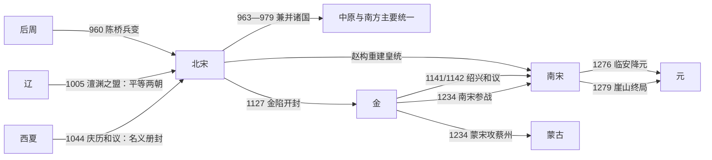

# 宋朝

## 时间

960年-1279年。1127年靖康之变造成北宋朝廷覆亡，赵构在应天府重建皇统，因政治中心和主要领土转到南方而分称北宋、南宋。

## 概括

宋朝由后周殿前都点检赵匡胤在陈桥兵变后建立。北宋采取先南后北战略，至979年消灭北汉，结束五代十国主要割据；同时通过收回节度使兵权、重组禁军、扩大科举和分割行政—财政—军事职权，压低武人长期割据的可能。它没有控制燕云十六州，因而与辽、西夏形成多国并立，而不是接续唐朝疆域的单一统一帝国。

宋并非“只有文、没有武”。它长期维持规模庞大的职业军队、边防体系和水军，南宋更对蒙古—元抵抗四十余年；其问题在于兵力与财政负担极重、军令分层、缺乏稳定产马地，并需要在辽、夏、金、蒙古等不同对手和多条边境间配置资源。1120年后联金灭辽打破原有均势，金于1127年攻陷开封。南宋依靠江淮—长江防线、四川山地、东南财政和海运重建国家，先与金和战，后抵抗蒙古与元，1279年崖山战败后终结。

## 演进流程

## 建立背景与崛起机制

- 五代的禁军政治和频繁改朝为赵匡胤提供了军事资源，也使新朝首先要解决军人拥立与地方藩镇问题。960年政变后，宋保留后周官僚、财政和军队骨架，减少一次性制度断裂。
- 太祖采取“先南后北”，利用中原资源依次兼并荆南、湖南、后蜀、南汉、南唐；吴越与清源军纳土，太宗于979年灭北汉。
- 中央把精兵和军官任免集中于开封，以枢密院、三衙等分掌调兵与统兵；地方财赋由转运系统上收，知州与通判相互制约。
- 科举扩张与文官轮调使国家不再依赖世袭军镇；商业税、盐茶专卖、货币和全国市场则为常备军与行政网络提供财政。
- 未能收复燕云使宋的北界暴露于华北平原。宋的国家能力很强，但必须把大量资源用于固定防线、驻军和粮运。

## 分阶段发展

| 阶段 | 时间 | 主线 |
|---|---|---|
| [北宋](/%E4%BA%BA%E6%96%87%E7%A7%91%E5%AD%A6/%E5%8E%86%E5%8F%B2/%E4%B8%9C%E4%BA%9A/%E4%B8%AD%E5%9B%BD/%E8%BE%BD%E5%AE%8B%E9%87%91%E8%A5%BF%E5%A4%8F/%E5%AE%8B/%E5%8C%97%E5%AE%8B.md)建立与统一 | 960年-979年 | 继承后周、兼并南方与北汉，重组中央—地方关系。 |
| 北宋均势与繁荣 | 979年-1067年 | 北伐辽失败后形成宋辽均势；宋夏战争以庆历和议收束，仁宗朝文官政治、经济和文化发展。 |
| 北宋改革与党争 | 1067年-1100年 | 王安石变法重组财政、军役与边政；新旧政策反复，改革争论逐渐与官僚排斥相结合。 |
| 北宋边疆扩张与亡国 | 1100年-1127年 | 徽宗朝继续新法并扩张西北，联金攻辽却无力控制燕京；金两次南侵后灭北宋。 |
| [南宋](/%E4%BA%BA%E6%96%87%E7%A7%91%E5%AD%A6/%E5%8E%86%E5%8F%B2/%E4%B8%9C%E4%BA%9A/%E4%B8%AD%E5%9B%BD/%E8%BE%BD%E5%AE%8B%E9%87%91%E8%A5%BF%E5%A4%8F/%E5%AE%8B/%E5%8D%97%E5%AE%8B.md)重建与宋金对峙 | 1127年-1234年 | 流亡朝廷在江南重建，绍兴和议后逐步摆脱“臣属”礼仪，依靠东南经济与防线长期存在。 |
| 南宋抗蒙与海上终局 | 1234年-1279年 | 联蒙灭金后与蒙古开战；襄樊失守后元军沿江推进，临安降而海上行朝继续至崖山。 |

## 统治结构与实际权力

| 角色 | 制度 | 实际作用 |
|---|---|---|
| 皇帝 | 最高人事、军令与政策裁决者 | 宋朝没有固定“宰相专政”结构；皇帝能力、退位后的太上皇和幼主监护都会改变实际权力分布。 |
| 中书门下 / 政事堂 | 宰相、参知政事等处理行政，名称和编制随改革调整 | 政策拟定与跨部门协调中心，受台谏、皇帝近臣及党争影响。 |
| 枢密院与三衙 | 枢密掌军政与调发，三衙统领禁军 | 调兵、统兵分离以防军权私人化；战时协调成本较高，但并不等于军队不能作战。 |
| 三司 / 户部等财政机构 | 管理盐铁、度支、户税、专卖与转运 | 支撑庞大常备军；南宋又高度依赖东南财赋、海贸与纸币。 |
| 路—州军—县 | 路级监司分掌转运、刑狱、常平与军政 | 地方没有单一全权长官，有利于中央控制，也可能使边区责任分散。 |
| 士大夫与科举 | 扩大进士取士、学校和文官轮调 | 提高行政整合与社会流动，也使政策分歧常通过奏议、台谏和朋党组织化。 |

## 重要事件

1. **960年陈桥兵变**：赵匡胤取代后周，保留其国家机器并建立宋。
2. **963—979年主要统一**：先后平定南方政权并灭北汉，割据军镇退出中原政治中心。
3. **1005年澶渊之盟**：宋辽承认彼此皇帝地位；宋交银十万两、绢二十万匹，但不向辽称臣。
4. **1040—1044年宋夏战争与庆历和议**：西夏取得数次战场胜利，元昊接受宋册封和名义臣属，宋给岁赐并开互市；西夏实际保持独立。
5. **1069年起王安石变法**：青苗、免役、保甲、将兵法等试图增强财政和边防，实施成效及地方负担不一，成为此后政治分裂焦点。
6. **1120—1123年海上之盟**：宋金约攻辽，宋军攻燕失败，金取得议价和军事优势；辽亡后两国迅速冲突。
7. **1127年靖康之变**：金军攻陷开封，徽、钦二帝及宗室被掳，北宋朝廷覆亡。
8. **1127—1138年南宋重建**：赵构在应天府即位，经历南逃、苗刘兵变与金军追击后，以临安为行在。
9. **1141/1142年绍兴和议**：宋向金称臣并交岁贡，边界稳定在淮水—大散关一线；1164年隆兴和议改为叔侄关系并降低岁币。
10. **1234年联蒙灭金**：南宋参与蔡州之战，却因随后进军河南与蒙古发生直接冲突。
11. **1267/1268—1273年襄樊之战**：元军攻破长江上游—汉水防御门户，南宋战略均势被打破。
12. **1276—1279年两阶段灭亡**：临安朝廷先投降，端宗、赵昺海上行朝继续抵抗，崖山战败后皇统终结。

## 鼎盛与长期维系条件

北宋仁宗朝常被视为文治繁荣期，南宋孝宗—宁宗前期则出现经济与制度再稳定。共同基础是高产农业、全国及海外市场、货币和信用工具、人口与城市增长、可持续的文官征税体系。与辽、金的和议虽付出岁币和礼仪代价，却通常远低于全面战争成本，并为边境贸易、人口恢复和内部治理提供时间。南宋失去北方后仍能延续一个半世纪，说明东南财政、长江水军、四川山城和地方军政网络具有真实韧性。

## 衰落与灭亡机制

| 阶段 | 结构因素 | 外部压力 | 直接触发与灭亡过程 |
|---|---|---|---|
| 北宋 | 庞大军费、决策分层、马政与北方地理劣势；后期政策反复和官僚排斥降低纠错能力 | 金整合女真、契丹降军和辽地资源，机动与攻城能力迅速增强 | 联金灭辽破坏旧均势；1126年第一次围汴后宋未完成防务重整，金同年再次南下，1127年开封陷落。 |
| 南宋 | 防线狭长、中央与战区协调困难；后期权相政治、财政征敛和将领体系更替削弱反应，但国家仍长期抵抗 | 蒙古—元先后吸收西夏、金、大理及北方汉军，获得跨区域兵源、攻城技术和水军 | 1273年襄樊失守打开汉水—长江通道；1275年丁家洲败后沿江州郡大量失守，1276年临安降，1279年崖山海上政权覆亡。 |

## 世系与继承

- [宋皇帝世系](/%E4%BA%BA%E6%96%87%E7%A7%91%E5%AD%A6/%E5%8E%86%E5%8F%B2/%E4%B8%9C%E4%BA%9A/%E4%B8%AD%E5%9B%BD/%E8%BE%BD%E5%AE%8B%E9%87%91%E8%A5%BF%E5%A4%8F/%E5%AE%8B/%E4%B8%96%E7%B3%BB.md)列全18位通常承认的皇帝，并另列1129年苗刘兵变中被拥立的幼主赵旉、1224年被史弥远排除的皇位候选赵竑，以及摄政、退位、复位情况。

## 演变关系

- 前一节点：[五代十国](/%E4%BA%BA%E6%96%87%E7%A7%91%E5%AD%A6/%E5%8E%86%E5%8F%B2/%E4%B8%9C%E4%BA%9A/%E4%B8%AD%E5%9B%BD/%E4%BA%94%E4%BB%A3/README.md)。
- 并立节点：[辽](/%E4%BA%BA%E6%96%87%E7%A7%91%E5%AD%A6/%E5%8E%86%E5%8F%B2/%E4%B8%9C%E4%BA%9A/%E4%B8%AD%E5%9B%BD/%E8%BE%BD%E5%AE%8B%E9%87%91%E8%A5%BF%E5%A4%8F/%E8%BE%BD/README.md)、[西夏](/%E4%BA%BA%E6%96%87%E7%A7%91%E5%AD%A6/%E5%8E%86%E5%8F%B2/%E4%B8%9C%E4%BA%9A/%E4%B8%AD%E5%9B%BD/%E8%BE%BD%E5%AE%8B%E9%87%91%E8%A5%BF%E5%A4%8F/%E8%A5%BF%E5%A4%8F/README.md)、[金](/%E4%BA%BA%E6%96%87%E7%A7%91%E5%AD%A6/%E5%8E%86%E5%8F%B2/%E4%B8%9C%E4%BA%9A/%E4%B8%AD%E5%9B%BD/%E8%BE%BD%E5%AE%8B%E9%87%91%E8%A5%BF%E5%A4%8F/%E9%87%91/README.md)。
- 后一节点：[元](/%E4%BA%BA%E6%96%87%E7%A7%91%E5%AD%A6/%E5%8E%86%E5%8F%B2/%E4%B8%9C%E4%BA%9A/%E4%B8%AD%E5%9B%BD/%E5%85%83/README.md)。

## 直接上级

- [辽宋金西夏](/%E4%BA%BA%E6%96%87%E7%A7%91%E5%AD%A6/%E5%8E%86%E5%8F%B2/%E4%B8%9C%E4%BA%9A/%E4%B8%AD%E5%9B%BD/%E8%BE%BD%E5%AE%8B%E9%87%91%E8%A5%BF%E5%A4%8F/README.md)
