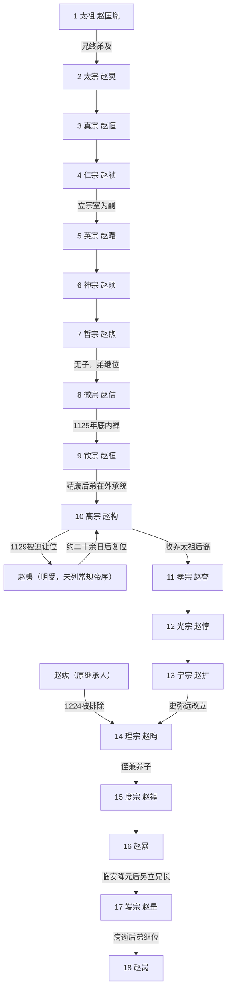

# 宋皇帝世系

## 概括

宋朝通常承认18位皇帝：北宋9位、南宋9位。北宋由太祖一支开国，皇位很快转入太宗一支；北宋绝大多数皇帝出自太宗后裔。靖康之变后，高宗无存活亲子，南宋皇位转回太祖后裔的孝宗一支。南宋末年由度宗三子赵㬎、赵昰、赵昺相继承统。

常规帝表不足以说明全部继承事实：1129年苗刘兵变迫高宗退位，幼子赵旉改元明受、约二十余日后退位，高宗复位；1224年赵竑被史弥远等排除，赵昀继位；徽宗、高宗、孝宗、光宗均在生前失去或交出帝位，其中光宗属被迫内禅。宋朝没有长期共治的两帝制度，但太上皇、太后与权臣在若干时期掌握相当实际权力。

## 皇位承继图

## 北宋皇帝

| 顺序 | 姓名 | 庙号 | 谥号 | 年号 | 在位时间 | 生卒时间 | 与前任关系 | 关键事件 / 备注 |
|---:|---|---|---|---|---|---|---|---|
| 1 | **赵匡胤** | 太祖 | 启运立极英武睿文神德圣功至明大孝皇帝 | 建隆、乾德、开宝 | 960年-976年 | 927年-976年 | 建国者 | 960年陈桥兵变代后周；兼并荆南、后蜀、南汉、南唐，收回高级将领兵权。 |
| 2 | **赵匡义 / 赵光义 / 赵炅** | 太宗 | 至仁应道神功圣德文武睿烈大明广孝皇帝 | 太平兴国、雍熙、端拱、淳化、至道 | 976年-997年 | 939年-997年 | 太祖弟 | 即位过程有后世“烛影斧声”等争议，但无同时被正式承认的共治者；979年灭北汉，高梁河和雍熙北伐失败。 |
| 3 | 赵德昌 / 赵元休 / 赵元侃 / 赵恒 | 真宗 | 应符稽古神功让德文明武定章圣元孝皇帝 | 咸平、景德、大中祥符、天禧、乾兴 | 997年-1022年 | 968年-1022年 | 太宗子 | 1005年澶渊之盟建立宋辽对等秩序；晚年皇后刘氏参与决策。 |
| 4 | 赵受益 / 赵祯 | 仁宗 | 体天法道极功全德神文圣武睿哲明孝皇帝 | 天圣、明道、景祐、宝元、康定、庆历、皇祐、至和、嘉祐 | 1022年-1063年 | 1010年-1063年 | 真宗子 | 幼年由刘太后称制至1033年；宋夏战争、1044年庆历和议，庆历新政短暂实施；无存活皇子。 |
| 5 | 赵宗实 / 赵曙 | 英宗 | 体干应历隆功盛德宪文肃武睿圣宣孝皇帝 | 治平 | 1063年-1067年 | 1032年-1067年 | 仁宗选定的宗室嗣子；太宗曾孙 | 继位初政局不稳，濮议围绕生父尊号和礼制展开。 |
| 6 | 赵仲针 / 赵顼 | 神宗 | 绍天法古运德建功英文烈武钦仁圣孝皇帝 | 熙宁、元丰 | 1067年-1085年 | 1048年-1085年 | 英宗子 | 1069年起任用王安石变法，重组财政、保甲、将兵和边政；对西夏战争得失相间。 |
| 7 | 赵佣 / 赵煦 | 哲宗 | 宪元继道显德定功钦文睿武齐圣昭孝皇帝 | 元祐、绍圣、元符 | 1085年-1100年 | 1077年-1100年 | 神宗子 | 1085—1093年由宣仁高太后听政、废改新法；亲政后推行绍述，无子而终。 |
| 8 | 赵佶 | 徽宗 | 体神合道骏烈逊功圣文仁德宪慈显孝皇帝 | 建中靖国、崇宁、大观、政和、重和、宣和 | 1100年-1126年；1125年底内禅 | 1082年-1135年 | 哲宗弟 | 崇奉艺术与道教，蔡京等推行绍述；镇压方腊起事的具体擒获记载有异；联金攻辽，金南侵时仓促传位，后被俘。 |
| 9 | **赵亶 / 赵烜 / 赵桓** | 钦宗 | 恭文顺德仁孝皇帝 | 靖康 | 1126年-1127年 | 1100年-1161年 | 徽宗子 | 第一次围汴时割地、交人质求和；第二次围城后开封陷落，1127年与徽宗被金掳走，北宋灭亡。 |

## 南宋皇帝

| 顺序 | 姓名 | 庙号 | 谥号 | 年号 | 在位时间 | 生卒时间 | 与前任关系 | 关键事件 / 备注 |
|---:|---|---|---|---|---|---|---|---|
| 10 | **赵构** | 高宗 | 受命中兴全功至德圣神武文昭仁宪孝皇帝 | 建炎、绍兴 | 1127年-1162年；1129年短暂被迫退位后复位 | 1107年-1187年 | 徽宗子、钦宗弟 | 1127年应天府即位；1129年苗刘兵变中让位赵旉，勤王后复位；1141/1142年绍兴和议，1162年主动内禅，退位后仍长期影响政局。 |
| 临时 | 赵旉 | 无 | 元懿太子（死后） | 明受 | 1129年约二十余日 | 1127年-1129年 | 高宗独子 | 苗傅、刘正彦迫高宗退位后拥立，由隆祐太后垂帘；高宗复位后仍为皇太子，同年夭折。传统帝系通常不单列为一帝。 |
| 11 | 赵伯琮 / 赵瑗 / 赵玮 / 赵昚 | 孝宗 | 绍统同道冠德昭功哲文神武明圣成孝皇帝 | 隆兴、乾道、淳熙 | 1162年-1189年 | 1127年-1194年 | 高宗养子；太祖七世孙 | 1163年隆兴北伐失利，1164年议和改善宋金礼仪；整顿财政军政，1189年主动内禅。 |
| 12 | 赵惇 | 光宗 | 循道宪仁明功茂德温文顺武圣哲慈孝皇帝 | 绍熙 | 1189年-1194年 | 1147年-1200年 | 孝宗子 | 因疾病和宫廷矛盾长期不朝孝宗；孝宗死后，赵汝愚、韩侂胄与太皇太后吴氏促成其被迫退位。 |
| 13 | 赵扩 | 宁宗 | 法天备道纯德茂功仁文哲武圣睿恭孝皇帝 | 庆元、嘉泰、开禧、嘉定 | 1194年-1224年 | 1168年-1224年 | 光宗子 | 庆元党禁、开禧北伐与嘉定和议；亲子皆夭折，继承人选择被权臣史弥远控制。 |
| 14 | 赵与莒 / 赵贵诚 / 赵昀 | 理宗 | 建道备德大功复兴烈文仁武圣明安孝皇帝 | 宝庆、绍定、端平、嘉熙、淳祐、宝祐、开庆、景定 | 1224年-1264年 | 1205年-1264年 | 太祖远支宗室；史弥远拥立 | 史弥远排除原继承人赵竑后即位；1234年联蒙灭金并端平入洛，随后宋蒙长期战争。 |
| 15 | 赵孟启 / 赵孜 / 赵禥 | 度宗 | 端文明武景孝皇帝 | 咸淳 | 1264年-1274年 | 1240年-1274年 | 理宗侄、养子 | 贾似道长期掌政；襄樊被围并于1273年失守，元军取得沿汉水入长江门户。 |
| 16 | **赵㬎** | 无 | 孝恭懿圣皇帝（端宗所上尊号）；通称恭帝 | 德祐 | 1274年-1276年 | 1271年-1323年 | 度宗子 | 幼年即位，谢太后听政；1276年临安投降元，后受封瀛国公。临安降后仍有另立的宋廷，故不是皇统最后一人。 |
| 17 | 赵昰 | 端宗 | 裕文昭武愍孝皇帝（文献称号有异） | 景炎 | 1276年-1278年 | 1269年-1278年 | 度宗子、赵㬎兄 | 在福州被拥立，随朝廷转移闽粤海上；逃难落水后病重去世。 |
| 18 | **赵昺** | 无 | 无通行谥号 | 祥兴 | 1278年-1279年 | 1272年-1279年 | 度宗子、端宗弟 | 陆秀夫、张世杰等辅政；1279年崖山海战败，陆秀夫负帝投海，宋朝终结。 |

## 摄政、退位、复位与废立

| 时间 | 人物 | 形式 | 实际权力与结果 |
|---|---|---|---|
| 1022年-1033年 | 章献明肃皇后刘氏 | 仁宗幼年垂帘 / 称制 | 主持政务并延续真宗晚年班底，未自称皇帝；死后仁宗亲政。 |
| 1085年-1093年 | 宣仁圣烈皇后高氏 | 哲宗幼年听政 | 任用司马光等废改新法；哲宗亲政后政策逆转。 |
| 1125年底-1126年 | 徽宗、钦宗 | 内禅 | 徽宗因金军压力传位，仍以太上皇身份存在；不是两帝共治，军事危机中权责一度混乱。 |
| 1129年 | 高宗、赵旉、隆祐太后孟氏 | 兵变逼禅、幼主、太后垂帘、复位 | 赵旉改元明受，孟氏名义听政；勤王军逼退苗刘，高宗恢复帝位，是宋朝明确的复位事件。 |
| 1162年-1187年 | 高宗、孝宗 | 自愿内禅与太上皇 | 孝宗正式为帝，高宗退居德寿宫但对和战、人事仍有影响，构成“单一皇位、双重政治中心”而非共帝。 |
| 1189年-1194年 | 孝宗、光宗 | 自愿内禅与太上皇 | 孝宗退位；光宗不朝重华宫导致父子与朝廷冲突。 |
| 1194年 | 光宗、宁宗、太皇太后吴氏 | 宫廷政变式内禅 | 光宗未自愿主持完整禅位，吴氏出面确认宁宗即位；光宗被迫成为太上皇。 |
| 1224年 | 赵竑、赵昀、史弥远与杨皇后 | 废除既定继承、改立 | 赵竑原为宁宗养子和继承候选，未正式即位；史弥远联合杨皇后改立赵昀，即理宗。赵竑后来被贬并死于湖州事变。 |
| 1274年-1276年 | 谢道清 | 恭帝幼年听政 | 与贾似道等处理元军南下；临安危局中代表朝廷议降。 |
| 1276年-1279年 | 杨太后及陈宜中、张世杰、陆秀夫等 | 海上幼主监护与军政辅弼 | 端宗、赵昺均年幼，实际决策由太后、宰执和军事集团分担，随转移路线而变化。 |

## 连续性说明

- 常规18帝之间没有空缺；赵旉的短期即位被传统帝系并入高宗在位期，因此不能把他既当正式第11帝又重复计算孝宗。
- 宋朝没有皇帝被废后多年与新帝平行统治的正式共治制度。高宗、孝宗退位后保有实际影响，应称太上皇政治或双重权力中心。
- 赵竑没有举行即位礼、没有年号或统治期；他的意义在于1224年的继承权被取消，而非“漏列一位皇帝”。
- 赵㬎投降不等于1276年宋朝全部终结；端宗与赵昺由未降的文武另立，形成有皇帝、年号和军政机构的海上行朝，至1279年结束。

## 演变关系

- 前一节点：[五代十国](/%E4%BA%BA%E6%96%87%E7%A7%91%E5%AD%A6/%E5%8E%86%E5%8F%B2/%E4%B8%9C%E4%BA%9A/%E4%B8%AD%E5%9B%BD/%E4%BA%94%E4%BB%A3/README.md)。
- 北宋并列：[辽](/%E4%BA%BA%E6%96%87%E7%A7%91%E5%AD%A6/%E5%8E%86%E5%8F%B2/%E4%B8%9C%E4%BA%9A/%E4%B8%AD%E5%9B%BD/%E8%BE%BD%E5%AE%8B%E9%87%91%E8%A5%BF%E5%A4%8F/%E8%BE%BD/README.md)、[西夏](/%E4%BA%BA%E6%96%87%E7%A7%91%E5%AD%A6/%E5%8E%86%E5%8F%B2/%E4%B8%9C%E4%BA%9A/%E4%B8%AD%E5%9B%BD/%E8%BE%BD%E5%AE%8B%E9%87%91%E8%A5%BF%E5%A4%8F/%E8%A5%BF%E5%A4%8F/README.md)。
- 南宋并列：[金](/%E4%BA%BA%E6%96%87%E7%A7%91%E5%AD%A6/%E5%8E%86%E5%8F%B2/%E4%B8%9C%E4%BA%9A/%E4%B8%AD%E5%9B%BD/%E8%BE%BD%E5%AE%8B%E9%87%91%E8%A5%BF%E5%A4%8F/%E9%87%91/README.md)、蒙古与元。
- 后一节点：[元](/%E4%BA%BA%E6%96%87%E7%A7%91%E5%AD%A6/%E5%8E%86%E5%8F%B2/%E4%B8%9C%E4%BA%9A/%E4%B8%AD%E5%9B%BD/%E5%85%83/README.md)。
