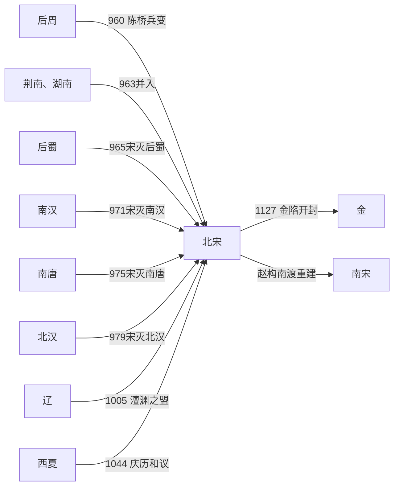

# 北宋

## 时间

960年-1127年。

## 概括

北宋由后周大将赵匡胤以陈桥兵变建立，定都东京开封。它继承后周的禁军、官僚和财政体系，先兼并南方政权，再于979年灭北汉，结束五代十国主要分裂。因两次大规模北伐失败，北宋没有收复燕云十六州，随后以条约、互市、边防堡寨和常备军与辽、西夏长期并存。

北宋以中央集权和文官政治限制武人割据，但并非简单“重文必然弱兵”。其军队规模、后勤与财政动员很大，也取得过防御和边疆扩张成果；主要难题是军令与统兵分离造成协调成本、养兵开支、骑兵与马源不足，以及同一时期承担河北、河东和西北多线防务。1120年与金结盟攻辽后，原有宋辽均势崩溃。金先后两次围攻开封，1127年掳走徽、钦二帝，北宋灭亡。

## 演进流程

## 建立背景与统一过程

- 后周世宗改革禁军、财政并夺取部分关南地区，给宋留下强干的中枢。960年，奉命北上的赵匡胤在陈桥被军士拥立，回师开封迫后周恭帝禅位。
- 太祖收回高级将领兵权，轮换禁军将领，把地方精兵调入中央，同时保留文官、降将和旧国君臣，降低兼并后的反抗。
- 963年控制荆南与湖南，965年灭后蜀，971年灭南汉，975年灭南唐；吴越于978年纳土，清源军也归附。
- 太宗979年灭北汉后立即攻辽，在高梁河败退；986年雍熙北伐再次失败，宋辽边界转向长期对峙。
- 统一带来江南粮税、盐茶、矿冶和城市市场，开封又依托汴河漕运成为庞大都城，为行政与常备军提供资源。

## 分阶段发展

| 阶段 | 时间 | 主线 |
|---|---|---|
| 建国与主要统一 | 960年-979年 | 平定南方和北汉，削弱节度使，确立开封中央。 |
| 宋辽战争与均势形成 | 979年-1005年 | 高梁河、雍熙北伐失败；辽南下至澶州，双方以条约停止争夺关南与燕云。 |
| 仁宗朝稳定与宋夏战争 | 1005年-1063年 | 澶渊体系保障北界；西夏建国引发战争，1044年和议后恢复互市；庆历新政短暂推行。 |
| 变法与边防重组 | 1063年-1100年 | 王安石新法试图增加财政、训练民兵和建立将兵体系；新旧法反复，西北战争持续。 |
| 徽宗朝扩张与亡国 | 1100年-1127年 | 朝廷强化新法并经营河湟，内有方腊等起事；海上之盟后攻辽失败，金军转而南侵。 |

## 统治结构

| 角色 | 机制 | 影响 |
|---|---|---|
| 皇帝 | 决定宰执、枢密和高级将领任免，掌握最终军令 | 能抑制地方军阀，也使皇帝误判在危机中影响全国。 |
| 中书门下与宰执 | 处理政务；神宗改革时机构名称和权限调整 | 文官政策能力强，台谏与党争也会使人事更替频繁。 |
| 枢密院—三衙 | 枢密院掌军令、三衙统禁军，将领临战受命 | 防止统兵者长期私有军队；跨战区联合作战时易出现命令层级和责任不清。 |
| 三司与转运使 | 集中财政、盐铁和漕运，地方财赋大部上供 | 支撑常备军和开封，但边费、冗官冗兵长期推高开支。 |
| 路—州—县 | 路级监司分掌财赋、司法、救荒与军事 | 中央穿透地方，边疆却需临时经略安抚与都部署协调。 |
| 禁军、厢军与乡兵 | 禁军是战斗和首都防卫核心，厢军多服役役；保甲、弓箭手等补充地方防务 | 兵种与战力差异很大，不能用总兵额直接代表可机动作战兵力。 |

## 重要事件

1. **960年陈桥兵变**：赵匡胤取代后周，宋朝建立；随后通过招抚和兵权重组控制禁军。
2. **963—979年统一战争**：依次兼并南方、吴越纳土并灭北汉，形成跨南北的财政和行政体系。
3. **979年高梁河、986年雍熙北伐**：宋军均在深入辽境后因补给、协同和辽骑反击失败，收复燕云的目标受挫。
4. **1004—1005年澶州之战与澶渊之盟**：辽军深入河北，宋真宗亲至澶州；条约规定宋给辽银十万两、绢二十万匹，边界双方不得任意增筑，两个皇帝政权保持外交对等。
5. **1038—1044年宋夏战争**：李元昊称帝后，西夏在三川口、好水川、定川寨等战役取胜；宋加强延州等防线，双方均难彻底摧毁对方。
6. **1044年庆历和议**：元昊对宋使用臣属名义，受封夏国主，宋给约二十五万五千单位银、绢、茶并恢复互市；西夏国内仍称帝并保持实际独立。
7. **1043—1045年庆历新政**：范仲淹等整顿官僚与教育，因利益冲突和政治阻力迅速终止。
8. **1069年起王安石变法**：青苗、募役、市易、保甲、将兵法等重组财政、社会动员与军事；部分措施增强收入和组织力，也造成执行偏差与激烈党争。
9. **1081—1082年大举攻夏**：五路进军初有进展，却因后勤和指挥失利退兵，永乐城又被西夏攻破，显示多路远征的制度瓶颈。
10. **1120年方腊起事**：东南税役与地方矛盾引发大规模反抗，宋军次年平定；关于方腊最终被谁俘获，现存叙述不一，不宜只归功于单一将领。
11. **1120—1123年海上之盟与攻燕失败**：宋约金夹攻辽，童贯军两度败于辽南京守军；金取得燕京后以额外补偿交付部分地区，双方互疑加深。
12. **1125—1127年两次金军南侵**：徽宗仓促内禅；第一次围汴以割地、人质和赔款暂退，第二次金军攻破外城、迫使朝廷投降并大规模掳掠宗室官民。

## 鼎盛条件

真宗后期至仁宗朝长期和平通常构成北宋的稳定高峰。澶渊之盟使河北从持续战区转为贸易边境；南方完成财政整合，稻作、手工业和商业税增长；科举扩大官僚来源，印刷、学校和城市文化发展。冗兵冗官与财政压力同时存在，故“鼎盛”是综合国力和社会经济的高位，不等于边疆毫无危机。

## 衰落因素与直接灭亡

| 类型 | 因素 | 影响 |
|---|---|---|
| 结构因素 | 燕云不在手中，华北防线缺少长城关隘纵深；常备军与首都供给耗费庞大，优质马源不足 | 对高机动北方军队的战略容错较低，开封又处平原、难长期独立防守。 |
| 制度与政策 | 调兵、统兵、后勤分属不同体系；新旧法争论后期演变成人事排斥，徽宗朝信息上达和责任机制失真 | 军队并非无战力，但跨路协同和危机决策多次失误。 |
| 外部变化 | 金在反辽战争中整合女真、契丹降军和攻城经验，实力增长速度远超宋廷预期 | 原本辽宋互相制衡的格局消失，宋直接面对更具进攻性的金。 |
| 直接触发 | 海上之盟分配燕云失败，宋接纳金叛将、双方争议税赋与领土；金认定宋可被军事迫降 | 1125年底金分两路南侵。 |
| 灭亡过程 | 1126年第一次围汴后朝廷未能统一战备；同年底金再围开封，1127年1月破城，春季掳走徽、钦二帝及宗室 | 北宋中央朝廷灭亡；康王赵构未被俘，在应天府建立南宋。 |

## 世系

- 北宋九位通常承认的皇帝及摄政、内禅和争位情况见[宋皇帝世系](/%E4%BA%BA%E6%96%87%E7%A7%91%E5%AD%A6/%E5%8E%86%E5%8F%B2/%E4%B8%9C%E4%BA%9A/%E4%B8%AD%E5%9B%BD/%E8%BE%BD%E5%AE%8B%E9%87%91%E8%A5%BF%E5%A4%8F/%E5%AE%8B/%E4%B8%96%E7%B3%BB.md)。

## 演变关系

- 前一节点：[后周](/%E4%BA%BA%E6%96%87%E7%A7%91%E5%AD%A6/%E5%8E%86%E5%8F%B2/%E4%B8%9C%E4%BA%9A/%E4%B8%AD%E5%9B%BD/%E4%BA%94%E4%BB%A3/%E4%BA%94%E4%BB%A3/%E5%91%A8%EF%BC%88%E9%83%AD%EF%BC%89.md)及其他五代十国政权。
- 并立节点：[辽](/%E4%BA%BA%E6%96%87%E7%A7%91%E5%AD%A6/%E5%8E%86%E5%8F%B2/%E4%B8%9C%E4%BA%9A/%E4%B8%AD%E5%9B%BD/%E8%BE%BD%E5%AE%8B%E9%87%91%E8%A5%BF%E5%A4%8F/%E8%BE%BD/README.md)、[西夏](/%E4%BA%BA%E6%96%87%E7%A7%91%E5%AD%A6/%E5%8E%86%E5%8F%B2/%E4%B8%9C%E4%BA%9A/%E4%B8%AD%E5%9B%BD/%E8%BE%BD%E5%AE%8B%E9%87%91%E8%A5%BF%E5%A4%8F/%E8%A5%BF%E5%A4%8F/README.md)。
- 灭亡者与后继：北宋朝廷被[金](/%E4%BA%BA%E6%96%87%E7%A7%91%E5%AD%A6/%E5%8E%86%E5%8F%B2/%E4%B8%9C%E4%BA%9A/%E4%B8%AD%E5%9B%BD/%E8%BE%BD%E5%AE%8B%E9%87%91%E8%A5%BF%E5%A4%8F/%E9%87%91/README.md)摧毁；赵氏皇统由[南宋](/%E4%BA%BA%E6%96%87%E7%A7%91%E5%AD%A6/%E5%8E%86%E5%8F%B2/%E4%B8%9C%E4%BA%9A/%E4%B8%AD%E5%9B%BD/%E8%BE%BD%E5%AE%8B%E9%87%91%E8%A5%BF%E5%A4%8F/%E5%AE%8B/%E5%8D%97%E5%AE%8B.md)承续。

## 直接上级

- [宋朝](/%E4%BA%BA%E6%96%87%E7%A7%91%E5%AD%A6/%E5%8E%86%E5%8F%B2/%E4%B8%9C%E4%BA%9A/%E4%B8%AD%E5%9B%BD/%E8%BE%BD%E5%AE%8B%E9%87%91%E8%A5%BF%E5%A4%8F/%E5%AE%8B/README.md)
