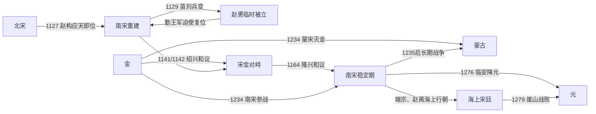

# 南宋

## 时间

1127年-1279年。

## 概括

南宋是北宋开封朝廷覆亡后由康王赵构重建的宋朝阶段。1127年赵构在南京应天府即位，随后在金军追击、地方叛乱和军队重组中不断南移，最终以临安为行在。南宋继承宋朝皇统和中央官制，却失去华北主要税源、产马地和战略纵深，必须以江淮、长江、四川山地和水军构成多层防御。

南宋不是在绍兴和议后停止抵抗的静态“偏安”政权。它在1129年苗刘兵变后复位重建，经历岳飞、韩世忠等部对金作战；1161年击退海陵王南侵，1163年与1206年又主动北伐。1234年联蒙灭金后，宋蒙战争延续四十余年。1273年襄樊失守使汉水—长江通道被打开，1276年临安朝廷投降，但海上行朝继续至1279年崖山战败。

## 演进流程

## 建立背景与重建过程

- 靖康之变时，赵构因在外组织河北兵马而未被金俘。1127年，他在应天府即位，以北宋皇子身份承继皇统，最初仍把恢复开封作为政治号召。
- 金军控制华北并先后扶植张邦昌“大楚”、刘豫“齐”等傀儡政权，试图以间接统治和军事进攻压缩宋廷。宋廷则吸收溃兵、义军和地方军，形成岳家军、韩世忠部、张俊部等战区力量。
- 1129年苗傅、刘正彦兵变，迫高宗退位并立幼子赵旉、改元明受；张浚、吕颐浩、韩世忠等勤王后，高宗约一个月内复位。赵旉通常不列入正式帝序，但必须记录这次退位—复位。
- 金军1129—1130年越江追击，高宗一度入海。宋军在黄天荡等地迟滞金军，川陕防线也牵制其西路；到1130年代后期，临安朝廷和长江防御逐渐稳定。
- 1138年后临安成为长期行在。东南税赋、海运、盐茶与海外贸易支撑中央，四大战区与水军构成军事实力。

## 分阶段发展

| 阶段 | 时间 | 主线 |
|---|---|---|
| 流亡与重建 | 1127年-1137年 | 应天即位、南迁、苗刘兵变和金军渡江；重组军队，抵抗金与伪齐。 |
| 绍兴和议与稳定 | 1138年-1161年 | 高宗、秦桧收兵权并议和；以臣属礼仪和岁贡换取淮水—大散关边界。 |
| 恢复尝试与对等改善 | 1161年-1205年 | 海陵王南侵失败；孝宗北伐失利，隆兴和议把臣属改为叔侄关系；内政与经济恢复。 |
| 开禧战争与晚金秩序 | 1206年-1234年 | 韩侂胄北伐失败、嘉定和议；蒙古攻金后，南宋最终选择联蒙并参与灭金。 |
| 宋蒙长期战争 | 1234年-1273年 | 端平入洛失败后蒙古南侵；四川、荆襄与两淮形成多战区防御，1259年钓鱼城战事与蒙哥死带来喘息。 |
| 襄樊失守与海上终局 | 1273年-1279年 | 元军沿汉水、长江推进，临安投降；端宗、赵昺朝廷转移闽粤海上，崖山战败。 |

## 统治结构与实际权力

| 层次 | 机制 | 实际作用 |
|---|---|---|
| 皇帝、太上皇与幼主监护 | 高宗、孝宗先后内禅；高宗退位后仍影响重大决策。末期谢太后、杨太后参与监护 | 正式皇位之外存在太上皇和太后权力，需与宰执、战区将领共同观察。 |
| 宰执与枢密 | 宰相、参知政事和枢密院掌行政军政；秦桧、韩侂胄、史弥远、贾似道等在不同时期集中权力 | “权相”能加强短期政策一致，也可能压制异议、使军事与人事过度依赖个人网络。 |
| 御前诸军与战区 | 早期将领部队逐步编为御前军，沿江、荆襄、四川、两淮设制置与都统体系 | 兼顾地方适应性和中央控制；跨战区救援、粮运和指挥仍是难点。 |
| 财政与漕运 | 东南田赋、盐茶专卖、商税、海贸、纸币和湖广四川供给 | 使失去北方后仍可长期养军；战争后期通货、征敛和区域破坏加重。 |
| 地方士绅与文官 | 路、州县行政延续，科举规模与书院网络扩大 | 维持社会整合和文化生产，也为地方筹饷、守城与投降选择提供不同政治主体。 |
| 水军与山城 | 长江舰队、沿海航运、四川山城体系 | 限制蒙古骑兵优势；元取得水军、降将与襄樊攻城经验后才突破。 |

## 重要事件

1. **1127年应天即位**：赵构重建宋朝，保留赵氏皇统和北宋官制合法性。
2. **1129年苗刘兵变**：高宗被迫退位，赵旉以幼主名义在位约二十余日，隆祐太后垂帘；勤王军迫使高宗复位。
3. **1129—1130年金军渡江追击**：建康、临安等受威胁，高宗入海；韩世忠在黄天荡阻击，金军最终北撤。
4. **1134—1137年反攻与伪齐撤销**：岳飞等收复襄阳六郡，宋军稳定长江上游；金于1137年废刘豫齐国，转向直接议和。
5. **1140年金毁约南侵与宋军反击**：顺昌、郾城等战事后双方仍无力消灭对方；高宗召回诸军，议和路线胜出。
6. **1141/1142年绍兴和议**：宋向金称臣，交银、绢各二十五万，边界大致为淮水—大散关；岳飞在和议完成前后被害，宋金进入二十年和平。
7. **1161年海陵王南侵失败**：金军在唐岛、采石等地受挫，后方又拥立完颜雍；海陵王被部下杀，南宋避免再次亡国。
8. **1163—1164年隆兴北伐与和议**：孝宗命张浚北伐，符离失败；新约改宋金为叔侄关系，岁币降至银、绢各二十万，宋不再以臣礼定位。
9. **1206—1208年开禧北伐与嘉定和议**：韩侂胄利用金内困出兵，但准备不足、叛将与反攻使宋失败；韩侂胄被杀，宋以赔偿和恢复岁币结束战争。
10. **1234年蔡州之战与端平入洛**：南宋为蒙古军提供协同并攻蔡州灭金；随后进军开封、洛阳，补给崩溃并与蒙古冲突，宋蒙战争展开。
11. **1235—1259年多线抗蒙**：蒙古攻四川、荆襄、两淮，宋以山城和水网防御；1259年蒙哥在钓鱼城战役期间死去，蒙古内争使战线暂缓。
12. **1267/1268—1273年襄樊围城**：元军长期封锁并使用回回炮等攻城技术，樊城陷后吕文焕献襄阳，汉水门户丧失。
13. **1275年丁家洲之败**：贾似道统军在长江下游溃败，元军沿江推进，多个州郡选择投降。
14. **1276年临安投降**：谢太后代表幼帝赵㬎向元军交降，临安中央结束；文天祥、陆秀夫、张世杰等另立端宗继续抵抗。
15. **1278—1279年海上行朝灭亡**：端宗病死后立赵昺；崖山海战宋军败，陆秀夫负赵昺投海，皇统终结。

## 鼎盛与维系条件

绍兴和议后的南宋以东南经济、制度连续和军事地理获得生存空间。长江和水军提高北方陆军南下成本；四川盆地与山城体系牵制西线；临安、明州、泉州等城市及海贸带来税收；科举与文官网络使流亡王朝迅速恢复地方治理。孝宗朝财政整顿与军备恢复构成政治高点，但恢复中原仍受战略资源与宋金力量对比制约。

## 衰落因素与直接灭亡

| 类型 | 因素 | 作用 |
|---|---|---|
| 结构因素 | 失去华北人口、马源和纵深，国土被长江、两淮、四川多个战区分割；各区救援依赖长距离漕运 | 一处门户失守会放大其他战区压力，中央难以同时补充所有防线。 |
| 政治与财政 | 后期权相控制军政、人事纠错受限；长期军费、纸币发行与征敛损耗地方，部分将领和州郡更重自保 | 不能单归因于贾似道一人，但权力集中和社会成本降低了危机中的协同。 |
| 外部压力 | 蒙古—元整合北方、中国西南与西域资源，吸收金、宋降将、工匠、攻城技术和水军 | 对手从草原骑兵国家转为能在江河、城池和海上持续作战的帝国。 |
| 决定性转折 | 襄樊长期被围而救援失败，1273年失守 | 元军获得汉水入长江的通道和宋水军降将，防线被从内部贯通。 |
| 直接灭亡 | 1275年主力在丁家洲败，1276年临安投降；海上朝廷缺乏稳定财政和腹地，1279年崖山被围歼 | 南宋分为“首都投降”和“海上皇统终结”两个步骤，不能只写1276年或只写1279年。 |

## 世系与争议即位

- 九位通常列入南宋帝序的皇帝见[宋皇帝世系](/%E4%BA%BA%E6%96%87%E7%A7%91%E5%AD%A6/%E5%8E%86%E5%8F%B2/%E4%B8%9C%E4%BA%9A/%E4%B8%AD%E5%9B%BD/%E8%BE%BD%E5%AE%8B%E9%87%91%E8%A5%BF%E5%A4%8F/%E5%AE%8B/%E4%B8%96%E7%B3%BB.md)。
- 赵旉在1129年苗刘兵变中改元“明受”、由隆祐太后垂帘，随后高宗复位；传统正史通常不把赵旉列为独立一帝，本页仍单列其临时即位。
- 1224年史弥远等废除原定继承人赵竑而拥立赵昀（理宗）；赵竑没有实际即位，不列皇帝表，但属于必须说明的废立争议。
- 高宗1162年、孝宗1189年主动内禅；光宗1194年在宫廷政变中被迫退位。三次退位均未产生长期并列皇帝，但太上皇实际影响不同。

## 演变关系

- 前一节点：[北宋](/%E4%BA%BA%E6%96%87%E7%A7%91%E5%AD%A6/%E5%8E%86%E5%8F%B2/%E4%B8%9C%E4%BA%9A/%E4%B8%AD%E5%9B%BD/%E8%BE%BD%E5%AE%8B%E9%87%91%E8%A5%BF%E5%A4%8F/%E5%AE%8B/%E5%8C%97%E5%AE%8B.md)，皇统延续而领土和政治中心重组。
- 并立节点：[金](/%E4%BA%BA%E6%96%87%E7%A7%91%E5%AD%A6/%E5%8E%86%E5%8F%B2/%E4%B8%9C%E4%BA%9A/%E4%B8%AD%E5%9B%BD/%E8%BE%BD%E5%AE%8B%E9%87%91%E8%A5%BF%E5%A4%8F/%E9%87%91/README.md)、西夏、蒙古与元。
- 后一节点：[元](/%E4%BA%BA%E6%96%87%E7%A7%91%E5%AD%A6/%E5%8E%86%E5%8F%B2/%E4%B8%9C%E4%BA%9A/%E4%B8%AD%E5%9B%BD/%E5%85%83/README.md)接管南宋主要领土、户籍与官僚资源。

## 直接上级

- [宋朝](/%E4%BA%BA%E6%96%87%E7%A7%91%E5%AD%A6/%E5%8E%86%E5%8F%B2/%E4%B8%9C%E4%BA%9A/%E4%B8%AD%E5%9B%BD/%E8%BE%BD%E5%AE%8B%E9%87%91%E8%A5%BF%E5%A4%8F/%E5%AE%8B/README.md)
