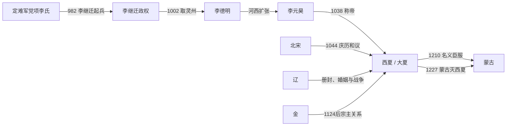

# 西夏

## 时间

1038年-1227年。若追溯党项李氏脱离宋朝控制和建立领土国家的过程，前史应从982年李继迁起兵算起；李元昊1038年正式称帝、国号“大夏”，才是西夏王朝的通常起点。

## 别称

大夏、白高大夏国；因位于宋朝西北，史学上称西夏。统治核心为党项嵬名氏，汉文中常用唐、宋所赐李姓。

## 概括

西夏由唐末定难军党项李氏发展而来。宋初试图收回夏州军镇后，李继迁重新组织党项诸部，夺取灵州；李德明在宋辽之间接受册封和贸易利益，同时令李元昊向河西扩张。元昊控制河西走廊后，于1038年称帝，以中兴府为中心建立兼有党项部族军制和中原官僚制度的国家。

西夏人口和资源远少于宋、辽、金，却能依靠河西与贺兰山—黄河地形、骑兵、十二监军司、边贸和在大国间转换关系生存近两百年。1044年对宋接受“臣”名义和册封，并不等于放弃国内帝号或被宋直接统治；1124年前后对金称臣也主要是外交宗主关系。1210年向蒙古名义投降后，西夏仍保留本国皇帝、军队和行政。拒绝出兵、拒送人质并与金和解后，蒙古于1226—1227年进行系统灭国战争，末主李睍投降后被杀。

## 演进流程

## 建立背景与崛起过程

- 唐末拓跋思恭因镇压黄巢受封定难军节度使、赐姓李，党项李氏由此世袭夏、绥等州，在五代各朝之间承认名义宗主。
- 982年宋廷试图把定难军纳入直接控制，李继迁拒绝入朝并联合党项部落；他利用宋辽对立取得辽册封，又于1002年攻占灵州，把权力中心移向黄河灌溉区。
- 李德明1004年继位后同时向宋、辽遣使。宋授予官爵、岁赐与互市，实际上承认其地方自主；1020年营建兴州，后为兴庆府 / 中兴府。
- 1028年以后李元昊主持西征，打击甘州回鹘、瓜沙州势力和青唐吐蕃，至1030年代控制河西走廊大部，获得绿洲、牧地与丝路节点。
- 元昊继位后创制西夏文、重组服饰礼制、建立十二监军司和中原式中枢，1038年称帝。国家形成不是一次宣告，而是此前数十年领土与制度积累的结果。

## 分阶段发展

| 阶段 | 时间 | 主线 |
|---|---|---|
| 建国前扩张 | 982年-1038年 | 李继迁、李德明、李元昊夺取灵州与河西，在宋辽册封体系中扩大实际自主。 |
| 建国与宋夏战争 | 1038年-1048年 | 元昊称帝，对宋三次主要胜利后订庆历和议；又与辽爆发战争，确立独立帝国地位。 |
| 幼主、后族与宋夏攻防 | 1048年-1139年 | 毅宗、惠宗、崇宗早年均受后族影响；宋大举进攻和西夏反击反复，辽亡后转而向金称臣。 |
| 制度成熟与相对鼎盛 | 1139年-1193年 | 仁宗长期统治，修法典、兴学校与佛教翻译，处置任得敬分国危机，维持宋金之间平衡。 |
| 宫廷政变与蒙古压力 | 1193年-1223年 | 桓宗被废、襄宗和神宗以政变继位；1205、1207、1209年蒙古连续进攻，1210年名义臣服后又长期攻金。 |
| 和金与蒙古灭国 | 1223年-1227年 | 献宗与金停战并建立兄弟之国，拒绝蒙古人质要求；蒙古逐城摧毁河西，围中兴府灭夏。 |

## 统治结构

| 层次 | 机制 | 实际作用 |
|---|---|---|
| 皇帝与嵬名宗室 | 皇帝兼党项部族最高首领和中原式天子 | 通过年号、礼制、佛教护国观和军事誓盟塑造王朝权威。 |
| 后族、部族贵族 | 野利、没藏、梁、罗等后族及部落首领掌军政 | 幼主时期可摄政，也多次形成外戚专权、废立和宫廷暴力。 |
| 中枢官僚 | 中书省、枢密院、三司、御史台及若干部司，党项与汉人均可任职 | 处理诏令、财政和司法；最高军职和本族称号多保留给统治精英。 |
| 十二监军司 | 左右翼各六司，按区域组织部族和边防，首领多出皇族、后族 | 同时是军事动员和地方治理骨架；贵族权力有时足以挑战皇帝。 |
| 州郡与绿洲 | 在农业、商业区使用州县和地方官，控制灌溉、盐、牧业与商路 | 连接党项牧区、汉人农区、吐蕃和回鹘绿洲，但财政容易受战争和贸易封锁冲击。 |
| 文字、法律与宗教 | 西夏文用于诏令、翻译和典籍，兼用汉文；佛教受国家资助 | 形成独立文化与行政工具，也吸收儒学、吐蕃佛教和汉传佛教。 |

## 宗主关系与实际控制

| 对象 | 名义关系 | 实际权力 |
|---|---|---|
| 宋 | 1044年元昊接受“臣”称与“夏国主”册封，获银、绢、茶岁赐和互市 | 西夏国内仍称帝、用本国年号、征税和统军；宋没有任免西夏地方官，因此属于不对称外交而非直接统治。 |
| 辽 | 李继迁、李德明受辽册封，元昊娶辽公主；双方亦在1044年等发生战争 | 婚姻与册封提供安全和合法性，辽无法日常控制西夏，西夏也会在宋辽之间议价。 |
| 金 | 辽亡后崇宗约于1124年接受金册封和臣属礼仪；金夏之间仍有边界、互市与战争 | 西夏保留完整国家；1225年和议甚至以金兄、夏弟相称，显示名义层级随实力变化。 |
| 蒙古 | 1209年入侵后，西夏于1210年名义臣服、献女与贡物，承诺协助 | 蒙古未立即驻官接管；西夏后来拒绝出兵和送质、又与金议和，说明实际自治仍在，最终导致灭国战争。 |

## 重要事件

1. **982年李继迁起兵**：宋收回定难军引发党项李氏反抗，李继迁利用部族网络和辽援重建权力。
2. **1002年攻取灵州**：取得黄河灌溉区和战略城市，改称西平府，奠定国家核心。
3. **1028—1036年河西扩张**：李元昊击败甘州回鹘并夺取瓜、沙、肃等地，贯通河西走廊。
4. **1038年称帝建国**：元昊国号大夏、使用天授礼法延祚年号，向宋宣告脱离臣属。
5. **1040—1042年三次主要胜利**：西夏在三川口、好水川、定川寨等战役重创宋军，但自身也承受贸易中断和长期动员。
6. **1044年庆历和议与辽夏战争**：西夏向宋接受名义臣属并获岁赐；同年击退辽三路进攻，随后修复关系。
7. **1048年宫廷暴力与幼主继位**：元昊受太子宁令哥袭击后死，宁令哥被处死，幼子谅祚继位，没藏、梁氏外戚长期干政。
8. **1081—1082年宋大举攻夏**：宋五路进军一度深入，因后勤和协调失败撤退；西夏随后攻破永乐城，边境再度僵持。
9. **1124年前后转向金**：金灭辽过程中以领土和威胁阻止西夏收留天祚帝，崇宗接受金宗主地位，换取西部安全。
10. **1170年任得敬危机**：权臣任得敬企图分割西夏并另立，仁宗借金支持将其诛灭，维护王朝完整。
11. **1205—1210年蒙古进攻**：蒙古先劫掠边城，1209年直逼中兴府并引水攻城；堤坝反淹蒙古营地，但西夏仍于次年名义投降。
12. **1206、1211年两次废立**：李安全废桓宗，李遵顼又取代李安全，宫廷不稳与蒙古压力相互强化。
13. **1214—1223年长期攻金**：为顺应蒙古要求并争夺陇右，西夏与金战争，耗费兵力财赋且未取得决定性领土。
14. **1223—1225年政策逆转**：神宗内禅，献宗与金议和，以兄弟之国恢复贸易；西夏拒绝蒙古出兵和送质要求。
15. **1226—1227年灭国战争**：蒙古先取黑水城、肃州、甘州、凉州，再破灵州援军、围中兴府；李睍投降后被杀，西夏灭亡。

## 鼎盛条件

仁宗李仁孝统治的1139—1193年通常视为西夏制度成熟期。长期君主统治减少继承震荡；与金、宋边界相对稳定，互市与河西农业恢复；《天盛改旧新定律令》体现法制整合；学校、科举、汉文经典和西夏文佛典并行，国家主持大规模译经、刻印。鼎盛仍建立在人口有限、贵族军事特权与外部均势之上，并非拥有压倒性资源。

## 衰落因素与直接灭亡

| 类型 | 因素 | 作用 |
|---|---|---|
| 结构因素 | 核心人口与耕地有限，绿洲和灌溉点分散；皇权依赖部族贵族、后族和监军司 | 连续失去一批城镇后难以从其他区域补充兵粮；宫廷废立会直接分裂军队。 |
| 内部危机 | 仁宗死后出现桓宗被废、襄宗被取代、神宗内禅；亲蒙、反蒙、攻金与和金集团反复 | 外交摇摆和对金战争消耗国家，无法形成对蒙古的稳定联盟。 |
| 外部压力 | 蒙古统一草原，能绕行沙漠、逐城围攻并切断河西与中兴府；金自身受蒙古重压，无法救夏 | 传统在宋辽金间制衡的策略失效。 |
| 直接触发 | 西夏拒绝为花剌子模远征提供军队，撤回援蒙部队，拒送皇子为质，并在1225年与金议和 | 蒙古把西夏视为不可靠属国和西征后方威胁，决定彻底征服。 |
| 灭亡过程 | 1226年蒙古由西向东夺取河西城市，年底击败灵州救援；1227年中兴府被围约半年，李睍出降 | 成吉思汗死讯被暂时隐瞒，按其遗命处死末主并洗劫都城，国家直接终结。 |

## 世系

- [西夏君主世系](/%E4%BA%BA%E6%96%87%E7%A7%91%E5%AD%A6/%E5%8E%86%E5%8F%B2/%E4%B8%9C%E4%BA%9A/%E4%B8%AD%E5%9B%BD/%E8%BE%BD%E5%AE%8B%E9%87%91%E8%A5%BF%E5%A4%8F/%E8%A5%BF%E5%A4%8F/%E4%B8%96%E7%B3%BB.md)把李继迁、李德明作为建国前统治者与追尊帝单列，另列1038年后十位皇帝，避免把追尊者混入皇帝顺序。

## 演变关系

- 前一节点：[定难军](/%E4%BA%BA%E6%96%87%E7%A7%91%E5%AD%A6/%E5%8E%86%E5%8F%B2/%E4%B8%9C%E4%BA%9A/%E4%B8%AD%E5%9B%BD/%E4%BA%94%E4%BB%A3/%E5%90%8E%E6%B1%89%E5%8F%8A%E5%85%B6%E4%BB%96%E6%94%BF%E6%9D%83/%E5%AE%9A%E9%9A%BE%E5%86%9B.md)。
- 并立节点：[北宋](/%E4%BA%BA%E6%96%87%E7%A7%91%E5%AD%A6/%E5%8E%86%E5%8F%B2/%E4%B8%9C%E4%BA%9A/%E4%B8%AD%E5%9B%BD/%E8%BE%BD%E5%AE%8B%E9%87%91%E8%A5%BF%E5%A4%8F/%E5%AE%8B/%E5%8C%97%E5%AE%8B.md)、[辽](/%E4%BA%BA%E6%96%87%E7%A7%91%E5%AD%A6/%E5%8E%86%E5%8F%B2/%E4%B8%9C%E4%BA%9A/%E4%B8%AD%E5%9B%BD/%E8%BE%BD%E5%AE%8B%E9%87%91%E8%A5%BF%E5%A4%8F/%E8%BE%BD/README.md)、[金](/%E4%BA%BA%E6%96%87%E7%A7%91%E5%AD%A6/%E5%8E%86%E5%8F%B2/%E4%B8%9C%E4%BA%9A/%E4%B8%AD%E5%9B%BD/%E8%BE%BD%E5%AE%8B%E9%87%91%E8%A5%BF%E5%A4%8F/%E9%87%91/README.md)。
- 后一节点：蒙古帝国接管其地，党项军民和文书制度部分进入元代。

## 直接上级

- [辽宋金西夏](/%E4%BA%BA%E6%96%87%E7%A7%91%E5%AD%A6/%E5%8E%86%E5%8F%B2/%E4%B8%9C%E4%BA%9A/%E4%B8%AD%E5%9B%BD/%E8%BE%BD%E5%AE%8B%E9%87%91%E8%A5%BF%E5%A4%8F/README.md)
