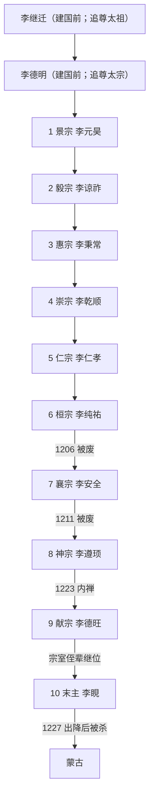

# 西夏君主世系

## 概括

党项李氏在1038年以前已经形成世袭领土政权。李继迁、李德明后来分别被追尊太祖、太宗，但他们没有作为“大夏皇帝”在位；本页因此把两位建国前统治者与李元昊以下十位西夏皇帝分开编号。李元昊1032年继承权力，1038年才正式称帝，表中同时写明。

西夏没有长期共治皇帝。1048年后多位幼主由母后、外戚摄政；1206年、1211年发生两次废立，1223年神宗内禅。末主李睍的父系在现存资料中不够清楚，常见记载作献宗侄，故不把存疑关系写成确定父子。

## 继承关系图

## 建国前统治者与追尊帝

| 顺序 | 姓名 | 庙号 | 谥号 | 年号 | 掌权时间 | 生卒 | 与前任关系 | 关键事件 / 说明 |
|---:|---|---|---|---|---|---|---|---|
| 前1 | **李继迁** | 太祖 | 神武皇帝 | 无本国年号 | 982年-1004年 | 963年-1004年 | 定难军李氏宗族，重新起兵者 | 982年反对宋直接接管夏州；接受辽册封并利用宋辽竞争，1002年取灵州。庙谥为元昊建国后追尊，不是实际皇帝在位。 |
| 前2 | **李德明** | 太宗 | 光圣皇帝 | 无本国年号 | 1004年-1032年 | 约981/983年-1032年 | 李继迁子 | 同时与宋辽通贡受封，建设兴州，经营河西；命元昊西征。追尊太宗，不计入西夏皇帝十人顺序。 |

## 西夏皇帝

| 顺序 | 姓名 | 庙号 | 谥号 | 年号 | 在位时间 | 生卒时间 | 与前任关系 | 关键事件 / 备注 |
|---:|---|---|---|---|---|---|---|---|
| 1 | **李元昊 / 嵬名曩霄** | 景宗 | 武烈皇帝 | 显道、广运、大庆、天授礼法延祚 | 1032年-1048年；1038年称帝 | 1003年-1048年 | 李德明子 | 完成河西扩张、创制西夏文、建十二监军司；1038年称帝。1048年被太子宁令哥袭伤而死，宁令哥随后被处死。 |
| 2 | 李谅祚 / 嵬名谅祚 | 毅宗 | 昭英皇帝 | 延嗣宁国、天祐垂圣、福圣承道、奲都、拱化 | 1048年-1067年 | 1047年-1068年初 | 景宗幼子 | 一岁左右即位，没藏太后、没藏讹庞及后来的梁氏先后掌权；亲政后除没藏氏，仍受外戚和宋夏战争影响。 |
| 3 | 李秉常 / 嵬名秉常 | 惠宗 | 康靖皇帝 | 乾道、天赐礼盛国庆、大安、天安礼定 | 1068年-1086年 | 1061年-1086年 | 毅宗子 | 幼年即位，梁太后及梁氏掌权；内部亲宋与反宋冲突被宋用作1081年大举进攻理由，君主实际权力有限。 |
| 4 | 李乾顺 / 嵬名乾顺 | 崇宗 | 圣文皇帝 | 天仪治平、天祐民安、永安、贞观、雍宁、元德、正德、大德 | 1086年-1139年 | 约1084年-1139年 | 惠宗子 | 三岁左右即位，早期梁氏摄政；成年后整顿朝政。辽亡时拒绝长期收留天祚帝，约1124年转向金并保全疆土。 |
| 5 | **李仁孝 / 嵬名仁孝** | 仁宗 | 圣德皇帝 | 大庆、人庆、天盛、乾祐 | 1139年-1193年 | 1124年-1193年 | 崇宗子 | 在位五十余年，法典、学校、西夏文与佛教出版发展；1170年前后粉碎任得敬分国企图，为制度鼎盛期。 |
| 6 | 李纯祐 / 嵬名纯祐 | 桓宗 | 昭简皇帝 | 天庆 | 1193年-1206年 | 1177年-1206年 | 仁宗子 | 面对蒙古1205年首次大规模劫掠；1206年被宗室李安全政变废黜，约一月后死于囚禁。 |
| 7 | 李安全 / 嵬名安全 | 襄宗 | 敬穆皇帝 | 应天、皇建 | 1206年-1211年 | 1170年-1211年 | 宗室堂兄或同辈近亲；废桓宗自立 | 迫使太皇太后协助取得金册封；1207、1209年蒙古入侵，1210年名义臣服、献女纳贡；1211年被李遵顼废黜，死因记载简略。 |
| 8 | 李遵顼 / 嵬名遵顼 | 神宗 | 英文皇帝 | 光定 | 1211年-1223年 | 1163年-1226年 | 宗室，常见世系作襄宗族侄；政变继位 | 在蒙古压力下长期攻金并尝试联宋，严重耗费国力；1223年内外交困中内禅于子李德旺，1226年卒。 |
| 9 | 李德旺 / 嵬名德旺 | 献宗 | 无通行谥号 | 乾定 | 1223年-1226年 | 1181年-1226年 | 神宗子 | 停止长期攻金，1225年与金订兄弟之国和议；拒绝蒙古送质要求，蒙古灭国战争爆发后病死。 |
| 10 | **李睍 / 嵬名睍** | 无 | 通称末主、末帝 | 宝义（年号归属与使用范围有争议） | 1226年-1227年 | 生年不详-1227年 | 宗室侄辈，常见作献宗侄；确切父系不详 | 继位时河西诸城已遭蒙古进攻；灵州援军败，中兴府被围约半年。1227年出降后被杀，西夏灭亡。 |

## 摄政、废立与继承争议

| 时间 | 人物 / 集团 | 性质 | 结果 |
|---|---|---|---|
| 1048年-约1056年 | 没藏太后、没藏讹庞 | 毅宗幼年外戚摄政 | 没藏氏控制中枢，后在宫廷斗争中被毅宗清除。 |
| 1068年-1086年 | 梁太后、梁氏外戚 | 惠宗幼年及成年初期掌权 | 对宋强硬、压制君主与亲宋派；宋1081年进攻与内部权争相连。 |
| 1086年-1099年 | 小梁太后及梁氏 | 崇宗幼年摄政 | 继续对宋战争；梁氏后来在辽压力与宫廷清洗中退出，崇宗亲政。 |
| 1206年 | 李安全废李纯祐 | 宗室政变 | 桓宗被囚死，襄宗自立；不存在两帝长期并立。 |
| 1211年 | 李遵顼取代李安全 | 宗室政变 | 襄宗被废，神宗继位；具体死亡过程资料不足。 |
| 1223年 | 李遵顼传位李德旺 | 内禅 | 神宗成为太上皇，至1226年去世；正式皇位由献宗单独掌握。 |
| 1226年 | 李睍继位 | 旁支继承 | 常见记载作献宗侄，但现存谱系不足，应用“约”“不详”而非补造父子关系。 |

## 连续性说明

- 西夏皇帝从元昊至李睍共十位；把李继迁、李德明排入“第1、第2帝”会把追尊与实际皇帝混淆。
- 毅宗的在位末年在汉历、公历换算中常写1067或1068；本表以年号至1067、卒于1068年初说明，而惠宗从1068年起算。
- 李睍年号“宝义”的材料并不如前代年号稳定，故保留常见称法并标注争议。
- 西夏宫廷多次由太后和外戚掌权，但没有女皇帝或正式共治皇帝；摄政者应单列实际权力，不能并入皇帝顺序。

## 演变关系

- 前一节点：[定难军](/%E4%BA%BA%E6%96%87%E7%A7%91%E5%AD%A6/%E5%8E%86%E5%8F%B2/%E4%B8%9C%E4%BA%9A/%E4%B8%AD%E5%9B%BD/%E4%BA%94%E4%BB%A3/%E5%90%8E%E6%B1%89%E5%8F%8A%E5%85%B6%E4%BB%96%E6%94%BF%E6%9D%83/%E5%AE%9A%E9%9A%BE%E5%86%9B.md)。
- 并列节点：[北宋](/%E4%BA%BA%E6%96%87%E7%A7%91%E5%AD%A6/%E5%8E%86%E5%8F%B2/%E4%B8%9C%E4%BA%9A/%E4%B8%AD%E5%9B%BD/%E8%BE%BD%E5%AE%8B%E9%87%91%E8%A5%BF%E5%A4%8F/%E5%AE%8B/%E5%8C%97%E5%AE%8B.md)、[辽](/%E4%BA%BA%E6%96%87%E7%A7%91%E5%AD%A6/%E5%8E%86%E5%8F%B2/%E4%B8%9C%E4%BA%9A/%E4%B8%AD%E5%9B%BD/%E8%BE%BD%E5%AE%8B%E9%87%91%E8%A5%BF%E5%A4%8F/%E8%BE%BD/README.md)、[金](/%E4%BA%BA%E6%96%87%E7%A7%91%E5%AD%A6/%E5%8E%86%E5%8F%B2/%E4%B8%9C%E4%BA%9A/%E4%B8%AD%E5%9B%BD/%E8%BE%BD%E5%AE%8B%E9%87%91%E8%A5%BF%E5%A4%8F/%E9%87%91/README.md)。
- 后一节点：1227年蒙古灭西夏。
