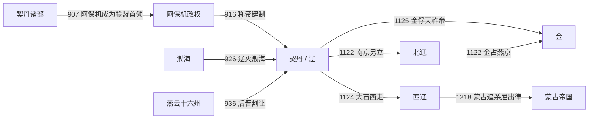

# 辽

## 时间

916年-1125年。耶律阿保机于907年成为契丹部落联盟首领，916年以年号和皇帝仪制建立更稳定的王朝国家；两种起点分别对应部落领袖即位和王朝建制，不宜混为一谈。

## 国号与范围

国号先后使用“大契丹”和“大辽”。改称“辽”的具体年份在早期文献中有937、938、947年等不同记载；983年左右复称契丹，1066年恢复“大辽”。辽的核心区域包括契丹草原、东北渤海故地、漠南与燕云十六州，鼎盛时以五京体系联系不同生态区。

## 概括

辽由契丹耶律氏建立。其崛起并非一次南下征服的结果，而是阿保机削弱轮流选举的部落旧制、整合契丹与奚等集团、吸收汉人行政人才并连续扩张的结果。926年灭渤海后，辽获得东北农耕人口和城市网络；936年支持石敬瑭建立后晋并取得燕云十六州，又把华北州县纳入帝国。

辽长期以契丹皇帝的行营、斡鲁朵和北面官掌握军政核心，以南面官治理汉地州县。1005年澶渊之盟承认宋辽两个皇帝政权的外交对等，宋交付岁币但不是辽的藩属。12世纪初，完颜部统一女真并起兵，辽的边疆控制、军队动员和统治集团团结同时失效；1125年天祚帝被金俘获，辽本土王朝终结。

## 演进流程

## 建立背景与崛起机制

- 唐末东北亚权力松动，契丹八部在草原、农耕边缘和跨区域贸易中积累军事实力；阿保机自907年起逐步打破可汗定期轮替，清除反对贵族并把首领权力固定在耶律氏。
- 阿保机设置汉城、吸收战乱流民和汉人官僚，以农业、手工业与文字建设扩大部落政权的财政和行政基础；契丹大字、小字的创制服务于法令与王朝记忆。
- 926年辽灭渤海，设东丹国安置旧地，随后逐步把其人口与州县纳入辽的多中心结构；这一收获对东北统治的重要性不亚于后来取得燕云。
- 936年辽援助石敬瑭灭后唐，获得燕云十六州。辽从此掌握长城内外的交通与防御节点，并直接统治大量汉地农业人口。
- 太宗947年一度进入开封、灭后晋，但因补给不足、掠夺引发反抗和北方政局重组而撤退。此后辽的主要目标转为维持北方多政权均势，而非长期占领整个中原。

## 分阶段发展

| 阶段 | 时间 | 政治与军事主线 |
|---|---|---|
| 部落整合与王朝建制 | 907年-927年 | 阿保机从联盟首领转为世袭皇帝，建上京，灭渤海；述律平在其死后短期称制并决定太宗继位。 |
| 燕云扩张与继承震荡 | 927年-969年 | 太宗取得燕云、灭后晋后撤；世宗、穆宗相继被弑，耶律氏与后族围绕皇位反复斗争。 |
| 制度整合与对外均势 | 969年-1031年 | 景宗、圣宗时期完善南北官制和五京网络；萧绰长期主政，宋辽战争最终以澶渊之盟收束，对高丽战争也转入和解。 |
| 鼎盛延续与内部张力 | 1031年-1101年 | 兴宗、道宗维持区域强权，1044年西京体制完成；佛教、法典和科举发展，但后族、宗室和权臣斗争加深。 |
| 女真起兵与帝国解体 | 1101年-1125年 | 天祚帝低估完颜部，1114年后连败；东京、上京、中京、南京等相继失守，出现北辽、大奚和天祚帝行朝等并立中心。 |

## 统治结构

| 层次 | 机制 | 实际作用 |
|---|---|---|
| 皇帝与行营 | 皇帝兼有可汗与中原式皇帝身份，随四时捺钵巡行；斡鲁朵掌握宫卫、人口与财产 | 最高决策依赖皇帝、后族和随行贵族的面对面关系，正式官署之外仍有强烈的家产与军事色彩。 |
| 北面官 | 管理契丹、奚和多数草原部族，掌军政、部族与宫帐事务 | 权力重心更接近皇帝；并不是单纯按地理“北方”划分。 |
| 南面官 | 借鉴唐制，管理燕云、渤海等农业州县及汉人事务 | 负责税收、司法和日常行政，但重大军事权通常仍在北面系统。 |
| 五京与州县 | 上京、中京、东京、南京、西京分别统辖不同区域 | 连接草原、东北和汉地；南京析津府是燕云行政与贸易中心，西京大同府于1044年升格。 |
| 后族与贵族 | 萧氏后族、耶律宗室和部族首领掌握婚姻、军队与高官 | 幼主时期能稳定传承，也可能造成权臣专政、宫廷清洗和继承冲突。 |
| 属国与边疆 | 对高丽、西夏、草原部族等采取战争、册封、婚姻、互市和岁贡等不同组合 | 名义臣属不等于日常直接治理；实际控制程度随距离、驻军与地方精英合作而变。 |

## 重要事件

1. **916年王朝建制**：阿保机正式称帝并建元，把可汗权力从轮替性联盟职位转为耶律氏王朝权力。
2. **926年灭渤海**：辽取得东北城市、人口与农业区，先设东丹国，后逐步重组其行政与人口分布。
3. **936年取得燕云十六州**：援立后晋后获得长城沿线战略区，使中原王朝长期缺少北方屏障。
4. **947年灭后晋而撤离开封**：辽展示远征能力，却因补给、治理和地方反抗无法长期控制华北腹地。
5. **979年高梁河之战**：北宋灭北汉后立即攻辽，在高梁河失败；宋此后数次北伐仍未收复燕云。
6. **993年-1019年辽高丽战争**：三次大规模战争均未形成辽对高丽的直接吞并；高丽一度接受辽册封并调整外交，双方最终恢复往来。
7. **1004—1005年澶州之战与澶渊之盟**：辽南下后与宋议和，宋每年给银十万两、绢二十万匹；两朝承认彼此皇帝地位，形成百余年相对稳定的边界。
8. **1044年辽夏战争**：辽以追讨叛附西夏的边部为由三路入夏而受挫，显示辽、西夏的“册封—臣属”关系无法等同于直接控制。
9. **1114—1116年女真起兵与东京失守**：完颜阿骨打攻宁江州，辽军连续战败；渤海人高永昌起事后又被金消灭，辽河以东大片地区落入金手。
10. **1120—1125年五京崩解**：金攻上京、中京，宋按海上之盟攻南京但失败；金于1122年占南京，1125年俘天祚帝。

## 鼎盛条件

圣宗朝通常被视为辽的鼎盛。萧绰摄政与成熟的宗室—后族合作稳定了幼主继承；燕云税赋、边境互市和宋岁币补充财政；南北面官与五京使不同生态区不必被强行纳入同一套制度。对宋、高丽和西北诸部的战争最终形成可承受的均势，使辽能把军事资源转向内部整合。不过，这种秩序依赖皇帝协调贵族、后族和地方精英，制度化程度有限。

## 衰落因素与直接灭亡

| 类型 | 因素 | 作用 |
|---|---|---|
| 结构因素 | 军政核心依赖宫帐、后族与部族关系；长期和平后部分军事组织松弛，边区官员盘剥又削弱属部忠诚 | 中央在危机中难以把五京、部族和州县迅速整合为统一防线。 |
| 统治危机 | 道宗后期权臣斗争、皇太子被害，天祚帝又处置宗室失当、放任败将并多次逃离政治中心 | 贵族叛乱、投金和另立皇帝增加，军心与合法性同时流失。 |
| 外部压力 | 完颜部已经整合生女真，并以猛安谋克动员；宋金海上之盟使辽南北两线受到挤压 | 金获得连续攻取辽东与五京的机会，宋虽攻燕失败，仍破坏原有宋辽均势。 |
| 直接触发 | 1114年辽拒绝阿骨打要求、低估女真起兵；1115年后和谈因名号、领土和人质条件破裂 | 战争从边境冲突升级为金消灭辽的连续征服。 |
| 灭亡过程 | 1122年天祚帝逃入夹山，南京另立北辽；1124年耶律大石离开天祚帝；1125年天祚帝在应州附近被金军俘获 | 辽本土国家失去最后一个持续行使皇权的中心，正式灭亡；西迁集团另建西辽。 |

## 世系与延续政权

- [辽、北辽、西辽世系](/%E4%BA%BA%E6%96%87%E7%A7%91%E5%AD%A6/%E5%8E%86%E5%8F%B2/%E4%B8%9C%E4%BA%9A/%E4%B8%AD%E5%9B%BD/%E8%BE%BD%E5%AE%8B%E9%87%91%E8%A5%BF%E5%A4%8F/%E8%BE%BD/%E4%B8%96%E7%B3%BB.md)
- [北辽](/%E4%BA%BA%E6%96%87%E7%A7%91%E5%AD%A6/%E5%8E%86%E5%8F%B2/%E4%B8%9C%E4%BA%9A/%E4%B8%AD%E5%9B%BD/%E8%BE%BD%E5%AE%8B%E9%87%91%E8%A5%BF%E5%A4%8F/%E8%BE%BD/%E5%8C%97%E8%BE%BD.md)
- [西辽](/%E4%BA%BA%E6%96%87%E7%A7%91%E5%AD%A6/%E5%8E%86%E5%8F%B2/%E4%B8%9C%E4%BA%9A/%E4%B8%AD%E5%9B%BD/%E8%BE%BD%E5%AE%8B%E9%87%91%E8%A5%BF%E5%A4%8F/%E8%BE%BD/%E8%A5%BF%E8%BE%BD.md)

## 演变关系

- 前一节点：唐末契丹诸部、奚与东北亚诸政权；辽又吸收了渤海和燕云州县。
- 并列节点：[北宋](/%E4%BA%BA%E6%96%87%E7%A7%91%E5%AD%A6/%E5%8E%86%E5%8F%B2/%E4%B8%9C%E4%BA%9A/%E4%B8%AD%E5%9B%BD/%E8%BE%BD%E5%AE%8B%E9%87%91%E8%A5%BF%E5%A4%8F/%E5%AE%8B/%E5%8C%97%E5%AE%8B.md)、[西夏](/%E4%BA%BA%E6%96%87%E7%A7%91%E5%AD%A6/%E5%8E%86%E5%8F%B2/%E4%B8%9C%E4%BA%9A/%E4%B8%AD%E5%9B%BD/%E8%BE%BD%E5%AE%8B%E9%87%91%E8%A5%BF%E5%A4%8F/%E8%A5%BF%E5%A4%8F/README.md)与高丽。
- 后一节点：辽本土领土主要被[金](/%E4%BA%BA%E6%96%87%E7%A7%91%E5%AD%A6/%E5%8E%86%E5%8F%B2/%E4%B8%9C%E4%BA%9A/%E4%B8%AD%E5%9B%BD/%E8%BE%BD%E5%AE%8B%E9%87%91%E8%A5%BF%E5%A4%8F/%E9%87%91/README.md)接管；契丹西迁集团在中亚建立西辽。

## 直接上级

- [辽宋金西夏](/%E4%BA%BA%E6%96%87%E7%A7%91%E5%AD%A6/%E5%8E%86%E5%8F%B2/%E4%B8%9C%E4%BA%9A/%E4%B8%AD%E5%9B%BD/%E8%BE%BD%E5%AE%8B%E9%87%91%E8%A5%BF%E5%A4%8F/README.md)
