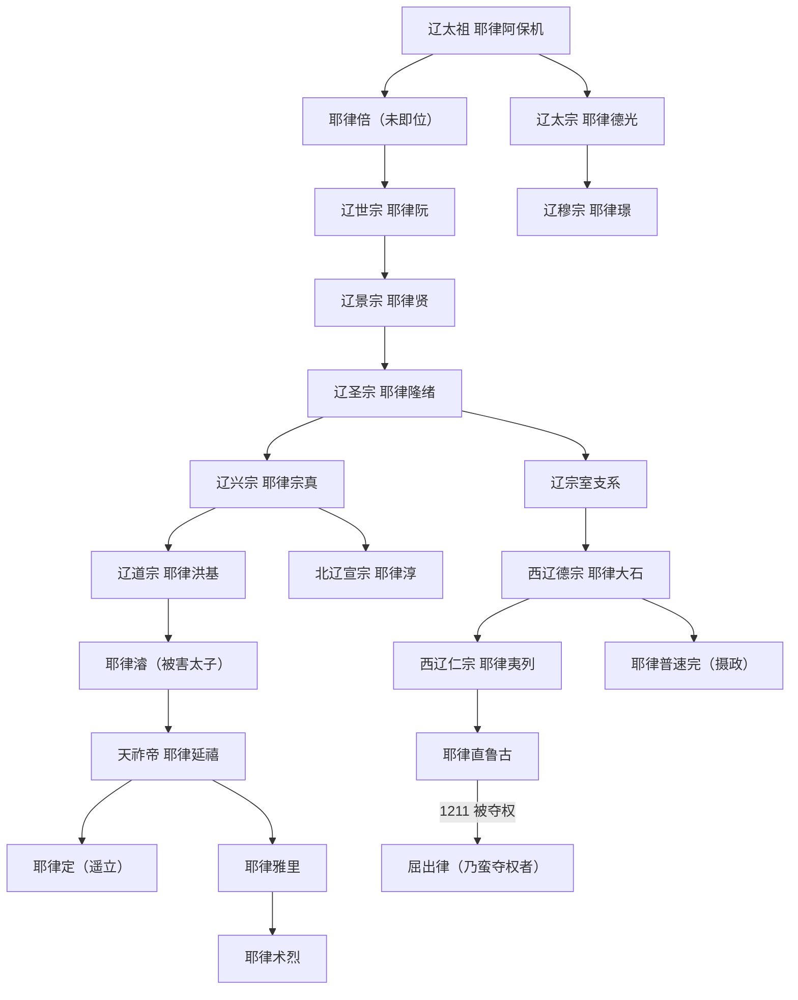

# 辽、北辽、西辽世系

## 概括

本页把辽本朝、1122—1123年的并立与残余政权、西辽的实际统治者分开排列。辽太祖以前的追尊祖先没有实际皇帝在位期；述律平、萧普贤女、萧塔不烟、耶律普速完以摄政或称制掌权，列在各自序列中但不虚构皇帝顺序。耶律定属于北辽遥立的名义继承人，屈出律属于西辽末期夺权者，均明确标注其实际地位。

辽初纪年存在史料差异：907年通常视为阿保机成为契丹最高首领，916年是采用年号并按中原王朝礼制正式称帝。西辽的汉文、伊斯兰文献换算也常相差一至数年，故以约数和双年份说明。

## 继承关系图

## 追尊祖先

| 顺序 | 姓名 | 庙号 | 谥号 | 在位 | 与后继关系 | 说明 |
|---:|---|---|---|---|---|---|
| 1 | 耶律耨里思 | 肃祖 | 昭烈皇帝 | 无 | 太祖先祖 | 王朝建立后追尊，无皇帝统治期。 |
| 2 | 耶律萨剌德 | 懿祖 | 庄敬皇帝 | 无 | 肃祖后裔 | 追尊，不计入辽帝顺序。 |
| 3 | 耶律匀德实 | 玄祖 | 简献皇帝 | 无 | 懿祖后裔 | 追尊，不计入辽帝顺序。 |
| 4 | 耶律撒剌的 | 德祖 | 宣简皇帝 | 无 | 玄祖子、太祖父 | 追尊，不计入辽帝顺序。 |

## 辽本朝皇帝

| 顺序 | 姓名 | 庙号 | 谥号 / 通称 | 年号 | 在位时间 | 生卒 | 与前任关系 | 关键事件与继承备注 |
|---:|---|---|---|---|---|---|---|---|
| 1 | **耶律阿保机** | 太祖 | 大圣大明神烈天皇帝 | 神册、天赞、天显 | 907年-926年；916年正式称帝 | 872年-926年 | 建国者 | 907年成为契丹最高首领，916年称帝；建上京、创文字，926年灭渤海。 |
| 摄政 | **述律平** | 无 | 淳钦皇后 | 沿用天显 | 926年-927年称制 | 879年-953年 | 太祖皇后 | 控制太祖死后继承，支持次子德光；不是皇帝。 |
| 2 | **耶律德光** | 太宗 | 孝武惠文皇帝 | 天显、会同、大同 | 927年-947年 | 902年-947年 | 太祖次子 | 936年取得燕云；947年灭后晋、入开封后撤。太祖长子耶律倍原为皇太子，因政治压力让位并于930年投后唐，未正式即帝。 |
| 3 | 耶律阮 | 世宗 | 孝和庄宪皇帝 | 天禄 | 947年-951年 | 917年-951年 | 太宗侄、耶律倍子 | 太宗死于南征归途后在军中即位；击败述律平支持的耶律李胡，951年被弑。李胡是失败的皇位竞争者，未正式在位。 |
| 4 | 耶律璟 | 穆宗 | 孝安敬正皇帝 | 应历 | 951年-969年 | 931年-969年 | 世宗堂弟、太宗子 | 平定世宗死后的政变，后期怠政并被近侍杀死。 |
| 5 | 耶律贤 | 景宗 | 孝成康靖皇帝 | 保宁、乾亨 | 969年-982年 | 948年-982年 | 世宗子 | 任用汉官韩德让等，萧绰参与决策；为圣宗朝整合奠基。 |
| 6 | **耶律隆绪** | 圣宗 | 文武大孝宣皇帝 | 乾亨、统和、开泰、太平 | 982年-1031年 | 971年-1031年 | 景宗子 | 幼年即位，母萧绰摄政至1009年前后；1005年澶渊之盟，辽进入鼎盛。 |
| 7 | 耶律宗真 | 兴宗 | 神圣孝章皇帝 | 景福、重熙 | 1031年-1055年 | 1016年-1055年 | 圣宗子 | 早期受生母法天太后影响，后亲政；1044年设西京，辽夏战争失利后恢复外交。 |
| 8 | 耶律洪基 | 道宗 | 仁圣大孝文皇帝 | 清宁、咸雍、大康、大安、寿昌 | 1055年-1101年 | 1032年-1101年 | 兴宗子 | 1063年耶律重元叛乱失败；权臣耶律乙辛构陷皇太子耶律濬，造成继承与政治危机。 |
| 9 | **耶律延禧** | 无 | 天祚帝 | 乾统、天庆、保大 | 1101年-1125年 | 1075年-1128年 | 道宗孙、耶律濬子 | 1114年女真起兵后连续失地；1122年南京另立北辽；1125年被金俘，辽本朝亡。 |

## 辽本朝未即位的重要继承人物

| 人物 | 身份 | 继承状态 |
|---|---|---|
| 耶律倍 | 太祖长子、原皇太子、东丹王 | 让位于弟德光，930年投后唐；后被追尊义宗、让国皇帝，但从未作为辽皇帝实际在位。 |
| 耶律李胡 | 太祖三子 | 述律平在947年支持其争位，战败；未即位、无年号。 |
| 耶律重元 | 圣宗子、道宗叔父 | 1063年发动叛乱并企图夺位，失败自杀；不是共治皇帝。 |
| 耶律濬 | 道宗太子、天祚帝父 | 受权臣构陷，1077年被害；后追尊顺宗，不计入帝序。 |

## 北辽与辽末残余统治者

| 顺序 | 姓名 | 庙号 / 称号 | 年号 | 在位或执政 | 生卒 | 与前任关系 | 实际地位与结局 |
|---:|---|---|---|---|---|---|---|
| 1 | **耶律淳** | 宣宗、天锡帝 | 建福 | 1122年约四个月 | 1063年-1122年 | 辽兴宗曾孙；天祚帝族叔 | 南京官僚与军队实际拥立；把天祚帝降为湘阴王，形成两个辽廷。病逝。 |
| 名义2 | 耶律定 | 秦王 | 无单独年号 | 1122年被遥立 | 不详 | 天祚帝子；耶律淳遗命指定 | 始终不在南京，未举行正常即位、未亲政；1123年在天祚帝营被金俘。 |
| 摄政 | **萧普贤女** | 德妃、皇太后 | 德兴 | 1122年称制 | 不详-1123年 | 耶律淳妻 | 北辽实际执政者；金占南京前撤退，投天祚帝后以擅立罪被处死。 |
| 3 | 耶律雅里 | 梁王 | 神历 | 1123年约五个月 | 不详-1123年 | 天祚帝子 | 被军士劫持北走后拥立，控制的是西北流动残部；病逝。 |
| 4 | 耶律术烈 | 无通行庙号 | 无 | 1123年短期 | 不详-1123年 | 辽宗室；雅里之后被拥立 | 统治不足月，军变中被杀；“英宗”等称法并非通行正史庙号。 |

> 萧干在1123年率奚、渤海军建立“大奚”，与上述耶律氏残余同时存在，但他没有承继辽皇位，故不列入皇帝世系。

## 西辽统治序列

| 顺序 | 姓名 | 称号 / 王室 | 年号 | 统治时间 | 生卒 | 与前任关系 | 实际地位与关键事件 |
|---:|---|---|---|---|---|---|---|
| 1 | **耶律大石** | 德宗、天祐皇帝、古儿汗；耶律氏 | 延庆、康国 | 1124年-1143年；1132年正式称帝 | 1087年-1143年 | 辽宗室，建国者 | 1124年在可敦城另立集团，1134年前后建都巴拉沙衮；1141年卡特万之战确立中亚霸权。 |
| 摄政2 | **萧塔不烟** | 感天皇后；萧氏 | 咸清 | 约1143/1144年-1150年 | 不详 | 大石皇后，为幼子摄政 | 实际执政约七年后把权力交给耶律夷列；不是耶律氏皇帝。 |
| 3 | 耶律夷列 | 仁宗、古儿汗；耶律氏 | 绍兴 | 约1150/1151年-1163年 | 不详-1163年 | 大石子 | 维持对喀喇汗、高昌等附庸的宗主权。 |
| 摄政4 | **耶律普速完** | 承天皇后、古儿汗；耶律氏 | 崇福 | 约1163/1164年-1177/1178年 | 不详-1177/1178年 | 大石女、夷列妹，为侄摄政 | 实际掌权，后因宫廷与萧氏权臣冲突被杀。 |
| 5 | 耶律直鲁古 | 末主、古儿汗；耶律氏 | 天禧 | 约1177/1178年-1211年 | 不详-约1213年 | 夷列子 | 花剌子模扩张使西部宗主权衰退；1211年被屈出律夺权，仍保留名义尊号至死。 |
| 夺权者 | **屈出律** | 古儿汗；乃蛮王族 | 无汉文年号 | 1211年-1218年 | 不详-1218年 | 直鲁古收容的乃蛮王子、女婿；非血缘继承 | 夺取实权后统治西辽残余；1218年蒙古哲别进军，逃至巴达赫尚被捕杀。传统中西史料常以1211年为耶律王朝实亡、1218年为国家终结。 |

> 旧表所列“嗣元皇帝”无法与公认西辽统治者或明确追尊对象对应，且无可核实的姓名、亲属关系与统治事实，故不把它保留为一位虚构的世系成员。

## 演变关系

- 辽前承契丹部落联盟，1125年本朝亡于[金](/%E4%BA%BA%E6%96%87%E7%A7%91%E5%AD%A6/%E5%8E%86%E5%8F%B2/%E4%B8%9C%E4%BA%9A/%E4%B8%AD%E5%9B%BD/%E8%BE%BD%E5%AE%8B%E9%87%91%E8%A5%BF%E5%A4%8F/%E9%87%91/README.md)。
- [北辽](/%E4%BA%BA%E6%96%87%E7%A7%91%E5%AD%A6/%E5%8E%86%E5%8F%B2/%E4%B8%9C%E4%BA%9A/%E4%B8%AD%E5%9B%BD/%E8%BE%BD%E5%AE%8B%E9%87%91%E8%A5%BF%E5%A4%8F/%E8%BE%BD/%E5%8C%97%E8%BE%BD.md)是辽末另立及残余继立，不等同于西辽。
- [西辽](/%E4%BA%BA%E6%96%87%E7%A7%91%E5%AD%A6/%E5%8E%86%E5%8F%B2/%E4%B8%9C%E4%BA%9A/%E4%B8%AD%E5%9B%BD/%E8%BE%BD%E5%AE%8B%E9%87%91%E8%A5%BF%E5%A4%8F/%E8%BE%BD/%E8%A5%BF%E8%BE%BD.md)由耶律大石西迁后新建，1211年耶律氏失权，1218年蒙古灭其残余。
