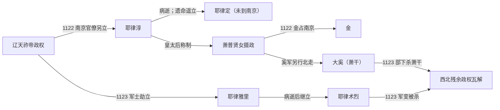

# 北辽

## 时间

1122年-1123年。狭义北辽指1122年南京析津府的耶律淳—萧普贤女政权；广义叙述还包括1123年耶律雅里、耶律术烈在西北残部中的短暂继立。

## 概括

北辽产生于辽天祚帝在金军进攻下离开中京、南京地区之后。南京官僚、守军与耶律大石等人担心政治中心真空，也试图保存燕云和中京一带，于1122年拥立宗室耶律淳。这个政权与仍在位的天祚帝同时存在，双方各自控制辽的一部分，并不是平稳完成的皇位继承。

耶律淳死后，萧普贤女以皇太后身份称制，按遗命“遥立”仍随天祚帝行动的秦王耶律定；耶律定从未到南京即位，也没有实际主持北辽政务。金军于1122年底攻占南京后，南京政权终结。1123年，天祚帝军中的部分将士又劫持梁王耶律雅里北走并拥立，雅里死后耶律术烈短暂继立，最终均亡于内部分裂。

## 演进流程

## 建立背景与权力基础

- 1120—1122年金先后攻取辽上京、中京等地，天祚帝向夹山方向逃亡，南京与燕云守臣失去稳定指挥。
- 宋金海上之盟约定分别攻辽。北宋两度攻南京均被耶律大石、萧干等辽军击退，说明北辽虽资源有限，仍依靠燕云城防、汉军和契丹—奚部队维持短期战斗力。
- 南京官僚以唐肃宗灵武即位为先例，拥立留守耶律淳，试图用近支宗室重建指挥中心；北辽把天祚帝降为湘阴王，因此实质上与其争夺正统。
- 政权控制范围主要是燕、云、平以及上京、中京、辽西等名义上的六路，实际控制随金军推进迅速收缩；沙漠以北部族仍多隶天祚帝。

## 统治者与实际权力

| 顺序 | 人物 | 身份与时间 | 与前任关系 | 实际权力与争议 |
|---:|---|---|---|---|
| 1 | **耶律淳** | 宣宗、天锡帝；1122年 | 辽兴宗曾孙，天祚帝族叔 | 在南京实际即位，改元建福；统合当地文武，但政权从未得到天祚帝承认。 |
| 2 | 耶律定 | 秦王；1122年被遥立 | 天祚帝子；耶律淳遗命指定 | 当时仍在天祚帝营中，未到南京、未亲政；应列为名义继承人而非正常即位皇帝。1123年被金俘获。 |
| 摄政 | **萧普贤女** | 德妃、皇太后称制；1122年 | 耶律淳妻 | 改元德兴，掌握南京朝廷实际权力；多次请求金册立耶律定为藩王而遭拒。 |
| 3 | 耶律雅里 | 梁王；1123年约五个月 | 天祚帝子 | 被部分军士劫持北走后拥立，改元神历；与南京北辽已无连续领土，属于辽末西北残余朝廷。 |
| 4 | 耶律术烈 | 1123年短期 | 辽宗室，常见记载作雅里后继者 | 雅里死后由残部拥立，不久与主将一同在军变中被杀；无稳定年号和行政中心。 |

> 完整表及辽、西辽统治者衔接见[辽、北辽、西辽世系](/%E4%BA%BA%E6%96%87%E7%A7%91%E5%AD%A6/%E5%8E%86%E5%8F%B2/%E4%B8%9C%E4%BA%9A/%E4%B8%AD%E5%9B%BD/%E8%BE%BD%E5%AE%8B%E9%87%91%E8%A5%BF%E5%A4%8F/%E8%BE%BD/%E4%B8%96%E7%B3%BB.md)。

## 重要事件

1. **1122年耶律淳即位**：南京文武拥立耶律淳，改元建福，并把天祚帝降封为湘阴王，辽朝由此公开分裂。
2. **北宋第一次攻燕失败**：童贯所率宋军企图按海上之盟取燕，遭北辽军击败；宋未能自行夺取约定地区。
3. **郭药师降宋与第二次攻燕**：常胜军转投宋后再攻南京，仍因辽援军到达而失败，北宋只能转向与金交涉。
4. **耶律淳病逝与遥立耶律定**：北辽没有可在南京立即即位的成年继承人，萧普贤女称制使政权更依赖军政首领。
5. **1122年底金占南京**：金军突破居庸关并接收南京；萧普贤女、耶律大石与契丹—奚军撤离，狭义北辽结束。
6. **撤退集团分裂**：耶律大石带萧普贤女投天祚帝，后者以擅立为罪处死萧氏；萧干率奚、渤海军另建“大奚”，约五个月后为部下所杀。
7. **1123年雅里、术烈相继被立**：天祚帝军中部分将士北走立雅里，雅里病死后又立术烈；军队缺粮、首领冲突，最终发生兵变，残余朝廷瓦解。

## 衰落与灭亡原因

| 层次 | 原因 |
|---|---|
| 结构因素 | 北辽没有完整草原腹地与全国性财政，只能依赖南京州县、临时军队和个别将领；皇位继承又缺少能在都城亲政的候选人。 |
| 外部压力 | 金军已经控制辽东、上京和中京；宋从南侧进攻并吸收常胜军，北辽无法同时保持燕云与北方交通。 |
| 内部分裂 | 南京朝廷、天祚帝行朝、雅里残部和萧干大奚各自行动；契丹、奚、渤海、汉军首领的目标并不一致。 |
| 直接终结 | 1122年底金占南京，使核心政权失去领土；1123年雅里病逝、术烈与萧干先后被部下杀死，使残余继立也告结束。 |

## 演变关系

- 前一节点：[辽](/%E4%BA%BA%E6%96%87%E7%A7%91%E5%AD%A6/%E5%8E%86%E5%8F%B2/%E4%B8%9C%E4%BA%9A/%E4%B8%AD%E5%9B%BD/%E8%BE%BD%E5%AE%8B%E9%87%91%E8%A5%BF%E5%A4%8F/%E8%BE%BD/README.md)末期的天祚帝政权。
- 并立关系：1122年北辽与天祚帝行朝并立；萧干“大奚”是撤退军团的分支，不是耶律氏皇位的正常继承。
- 后一节点：燕云主要由[金](/%E4%BA%BA%E6%96%87%E7%A7%91%E5%AD%A6/%E5%8E%86%E5%8F%B2/%E4%B8%9C%E4%BA%9A/%E4%B8%AD%E5%9B%BD/%E8%BE%BD%E5%AE%8B%E9%87%91%E8%A5%BF%E5%A4%8F/%E9%87%91/README.md)接收；耶律大石后来西迁建立[西辽](/%E4%BA%BA%E6%96%87%E7%A7%91%E5%AD%A6/%E5%8E%86%E5%8F%B2/%E4%B8%9C%E4%BA%9A/%E4%B8%AD%E5%9B%BD/%E8%BE%BD%E5%AE%8B%E9%87%91%E8%A5%BF%E5%A4%8F/%E8%BE%BD/%E8%A5%BF%E8%BE%BD.md)。

## 直接上级

- [辽](/%E4%BA%BA%E6%96%87%E7%A7%91%E5%AD%A6/%E5%8E%86%E5%8F%B2/%E4%B8%9C%E4%BA%9A/%E4%B8%AD%E5%9B%BD/%E8%BE%BD%E5%AE%8B%E9%87%91%E8%A5%BF%E5%A4%8F/%E8%BE%BD/README.md)
