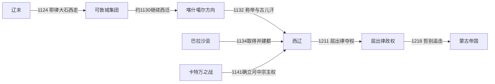

# 西辽

## 时间

1124年-1218年。1124年是耶律大石脱离辽末行朝、在蒙古高原另立政治中心的起点；1132年是他正式使用皇帝与“菊儿汗 / 古儿汗”称号的常见纪年，因此也常把1132年视为建国年。中西文献的纪年换算存在一至数年差异，统治者在位年以“约”标示时应理解为资料差异，而非空白。

## 别称

喀喇契丹、哈剌契丹、黑契丹。中亚文献多称其君主为“古儿汗”，汉文传统称西辽。

## 概括

西辽是辽末宗室耶律大石带领契丹、汉、渤海等军民西迁后，在蒙古高原和中亚重建的多族群帝国。它不是辽在原领土上的简单续存：权力中心转到虎思斡耳朵（巴拉沙衮），统治人口以突厥语族和穆斯林居民为主，帝国外围主要由高昌回鹘、喀喇汗诸王、花剌子模等地方政权在宗主权下继续治理。

1141年卡特万之战击败塞尔柱苏丹桑贾尔后，西辽成为河中地区的最高军事权力。其统治以较少的契丹核心军队、贡赋网络、地方王朝与城市官员合作维持，并普遍容许伊斯兰教、佛教、景教等并存。12世纪末，花剌子模扩张、附庸离心和王位集团内斗削弱宗主体系；1211年乃蛮王子屈出律夺取实际权力，1218年蒙古将领哲别进入西辽，屈出律在巴达赫尚被捕杀，政权终结。

## 演进流程

## 建立背景与崛起过程

- 1122年耶律大石参加南京北辽防务，北辽瓦解后曾回到天祚帝身边。因反对天祚帝在资源尽失时贸然反攻，1124年率部离开，在可敦城一带争取辽西北驻军和部族支持。
- 这一集团保留辽朝的耶律皇统、萧氏后族、汉文年号与印玺，也包含汉人、渤海人、契丹部众和其他草原军队，为跨区域迁徙提供了行政与军事骨干。
- 约1130年大石继续向西，先后通过高昌回鹘地区，进攻喀什噶尔受挫后转向七河流域；1132年使用皇帝和古儿汗称号。
- 1134年取得巴拉沙衮，以虎思斡耳朵为都城；附近葛逻禄、康里等集团以及高昌回鹘先后承认其宗主地位。
- 1137年西辽击败西喀喇汗军；1141年在撒马尔罕附近卡特万大败桑贾尔与喀喇汗联军，随后使花剌子模缴纳贡赋，帝国达到鼎盛。

## 分阶段发展

| 阶段 | 时间 | 主线 |
|---|---|---|
| 流亡集团形成 | 1124年-1132年 | 在可敦城重建军政核心并西迁；名义上继承辽，但实际另寻领土与属众。 |
| 建都与中亚扩张 | 1132年-1143年 | 取得巴拉沙衮，控制七河与天山周边；卡特万之战后取得河中霸权。 |
| 摄政与宗主秩序维持 | 1143年-1177/1178年 | 萧塔不烟、耶律夷列、耶律普速完相继掌权，通过地方王朝和贡赋维系统治。 |
| 附庸扩张与中央收缩 | 1177/1178年-1211年 | 耶律直鲁古时期花剌子模势力增强，塔剌思等战败使西部宗主权松动。 |
| 屈出律夺权与蒙古征服 | 1211年-1218年 | 屈出律挟持直鲁古后掌权，干预宗教和地方统治；哲别进军后附庸倒向蒙古。 |

## 统治结构

| 角色 | 形式 | 名义与实际控制 |
|---|---|---|
| 古儿汗 / 皇帝 | 耶律氏同时使用内亚古儿汗与汉式皇帝、年号、印玺 | 直接控制都城及契丹核心军，宣称对广大中亚附庸的最高权威。 |
| 摄政者 | 萧塔不烟、耶律普速完分别以皇后、皇太后身份执政 | 她们是实际统治者，不应被合并为“后期摄政”；其执政构成连续统治序列的一部分。 |
| 中央军政集团 | 契丹、萧氏后族及随迁的汉、渤海等人员 | 人数有限，靠军事威望、巡行与任命监督附庸，未在各地建立同等密度的州县。 |
| 附庸王朝 | 东西喀喇汗、高昌回鹘、花剌子模等在不同时段称臣纳贡 | 地方君主继续征税和处理日常司法；西辽的宗主权不等于直接领土行政。 |
| 城市与贡赋 | 在关键城市派监督者，向附庸索取固定贡赋和军役 | 维持成本较低，但中央难以及时阻止强大附庸扩张。 |
| 宗教政策 | 统治者多保留契丹传统与佛教，同时容纳穆斯林、景教等 | 早中期宽容有利于少数统治者治理多数穆斯林；屈出律后期强制干预宗教则激化反抗。 |

## 重要事件

1. **1124年离开天祚帝**：耶律大石在可敦城集结军队与部族，形成独立于辽本土残局的政治中心。
2. **1132年称帝、称古儿汗**：以双重称号同时面向辽朝继承传统与中亚草原政治。
3. **1134年取得巴拉沙衮**：把虎思斡耳朵建成首都，奠定七河流域核心区。
4. **1137年苦盏附近战胜喀喇汗军**：打开进入河中地区的道路。
5. **1141年卡特万之战**：击败塞尔柱—喀喇汗联军，桑贾尔威望受重创，花剌子模随后接受西辽贡赋要求。
6. **1177/1178年宫廷政变**：耶律普速完与萧氏权臣的冲突导致她被杀，耶律直鲁古继位，显示摄政集团与后族矛盾。
7. **1208—1210年花剌子模反攻**：花剌子模与西喀喇汗势力挑战西辽，塔剌思战败使河中宗主体系瓦解。
8. **1211年屈出律夺权**：直鲁古收容败逃的乃蛮王子屈出律，后者联合离心势力夺取实权；直鲁古保留名义尊号至死。
9. **1218年蒙古征服**：哲别利用喀什噶尔等地对屈出律的不满推进，屈出律逃入巴达赫尚后被捕杀。

## 鼎盛条件

西辽的鼎盛并非对中亚各地进行直接州县统治，而是军事威慑与低成本宗主网络的成功。契丹核心军在卡特万建立声望；巴拉沙衮连接草原、天山与河中商路；附庸王朝保留本地官僚和宗教秩序，减少统治摩擦；汉式印玺、年号与内亚古儿汗称号又为不同政治传统提供可理解的合法性。

## 衰落因素与直接灭亡

| 类型 | 因素 | 后果 |
|---|---|---|
| 结构因素 | 帝国疆域广而核心人口少，财政和地方行政依赖附庸；宗主权随军事威望而升降 | 花剌子模一旦成长，西辽缺乏直接官僚系统重新控制西部。 |
| 内部因素 | 摄政后期宫廷政变、直鲁古时期财政与军事压力、收容乃蛮集团 | 屈出律得以掌握军队并在1211年架空、夺取君权。 |
| 外部压力 | 花剌子模扩张、喀喇汗附庸反叛，蒙古统一草原后追击旧敌 | 西辽同时失去西部贡赋与东部安全屏障。 |
| 直接触发 | 屈出律在喀什噶尔等地的强制宗教政策破坏早期宽容秩序；蒙古哲别宣布保护宗教活动 | 地方居民和附庸不再支持屈出律，蒙古军推进阻力降低。 |
| 灭亡过程 | 1218年哲别进入七河、喀什噶尔，屈出律南逃；在巴达赫尚被当地人捕获并交给蒙古处死 | 西辽中央与屈出律政权均告终，原属地分别进入蒙古与花剌子模势力范围，随后又被蒙古整合。 |

## 世系

- 完整统治序列见[辽、北辽、西辽世系](/%E4%BA%BA%E6%96%87%E7%A7%91%E5%AD%A6/%E5%8E%86%E5%8F%B2/%E4%B8%9C%E4%BA%9A/%E4%B8%AD%E5%9B%BD/%E8%BE%BD%E5%AE%8B%E9%87%91%E8%A5%BF%E5%A4%8F/%E8%BE%BD/%E4%B8%96%E7%B3%BB.md)。屈出律是夺权的乃蛮统治者，不是耶律氏皇帝；萧塔不烟、耶律普速完则是实际摄政者，应列入统治序列。

## 演变关系

- 前一节点：[辽](/%E4%BA%BA%E6%96%87%E7%A7%91%E5%AD%A6/%E5%8E%86%E5%8F%B2/%E4%B8%9C%E4%BA%9A/%E4%B8%AD%E5%9B%BD/%E8%BE%BD%E5%AE%8B%E9%87%91%E8%A5%BF%E5%A4%8F/%E8%BE%BD/README.md)末期耶律大石集团。
- 并列关系：与金、南宋、西夏处于同一时代，但直接参与的是中亚诸王朝秩序。
- 后一节点：1218年蒙古帝国征服；花剌子模也在西辽衰退时接收部分西部属地。
- 性质：既有辽朝流亡继承，也有在新地域征服、重组附庸的国家建构，不能只写成“辽朝迁都”。

## 直接上级

- [辽](/%E4%BA%BA%E6%96%87%E7%A7%91%E5%AD%A6/%E5%8E%86%E5%8F%B2/%E4%B8%9C%E4%BA%9A/%E4%B8%AD%E5%9B%BD/%E8%BE%BD%E5%AE%8B%E9%87%91%E8%A5%BF%E5%A4%8F/%E8%BE%BD/README.md)
