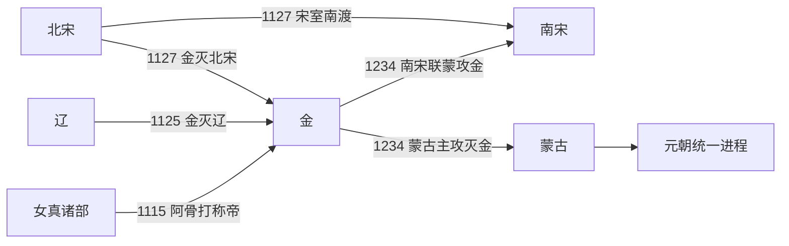

# 金

## 时间

1115年—1234年。

## 别称

大金、女真金。

## 概括

金朝是完颜氏女真集团在反辽战争中建立的复合型帝国。完颜阿骨打先整合生女真诸部，1114年起兵反辽，1115年称帝建国；金军利用辽朝内部失序与宋金海上之盟，1125年俘获辽天祚帝，继而在1127年攻陷开封、俘虏宋徽宗与宋钦宗，使北宋灭亡。金由东北区域性联盟迅速成为统治东北、华北及部分西北地区的大国。

金朝没有简单以女真旧制取代辽、宋制度，而是以完颜皇权、猛安谋克组织和中原官僚州县并行治理不同人群。早期曾扶植张邦昌的楚、刘豫的齐等傀儡政权，但军事与最终决策仍掌握在金廷及金军将领手中；1137年废齐以后，金朝更直接地统治华北。海陵王迁都中都，世宗在长期和平中恢复生产，金朝统治由征服帝国转向定居型王朝。

13世纪蒙古崛起后，金朝的东北根基、军事殖民体系与财政连续受损。1214年迁都开封并未保存北方全局，反而造成中都及河北防线被放弃；其后金又与南宋、西夏交战，陷入多线消耗。1232年三峰山败亡和开封围城摧毁主力，1234年蔡州陷落，哀宗让位、自尽，末帝完颜承麟同日战死，金朝灭亡。

## 建立背景与崛起机制

- **辽朝边疆秩序松动**：女真诸部受辽朝节度、贡纳与边市体系控制，海东青索取、贸易纠纷及辽廷干预加深不满；辽末皇权与地方控制力也已下降。
- **完颜部的内部整合**：自完颜乌古迺、劾里钵等首领以来，完颜部逐渐扩大联盟。1113年阿骨打继任都勃极烈，既依靠宗族军事骨干，也吸收周边女真部落。
- **从起兵到建国**：1114年阿骨打攻宁江州，并在出河店等战斗中击败数量占优的辽军；1115年正式称帝，建立大金。因而1114年是反辽战争起点，1115年才是金朝皇帝世系的起点。
- **吸收被征服地区资源**：渤海人、契丹人、汉人军政人员及辽宋旧官员进入金朝体制，弥补女真联盟治理城市、税赋和农业人口的不足。
- **利用宋辽矛盾**：1120年宋金订立海上之盟，约定夹攻辽朝。宋军攻燕京失利，金军则控制辽朝腹地；联盟很快因燕云归属、赎城费用与接纳叛亡者而破裂。

## 分阶段发展

### 建国、灭辽与灭北宋（1115年—1135年）

太祖、太宗时期以女真骑兵和猛安谋克动员为基础，先夺辽上京、中京等重镇，1125年俘获天祚帝。灭辽后，金并未停留在燕云边界，而于1125—1127年两次南下：第一次迫使宋割地纳款，第二次围破开封，造成靖康之变。金一度扶立楚、齐来隔离南宋，但这些政权缺乏独立军力和稳定认受性，只能视为金控制下的间接统治工具。

### 官制重组与宋金和议（1135年—1149年）

熙宗时期废除部分早期勃极烈合议机构，强化尚书省、科举、礼制和成文法等王朝制度。金军与南宋在陕西、淮河和长江沿线反复作战，南宋军队一度北进。1141年形成和议、次年完成礼仪与交割：南宋向金称臣，以淮水—大散关一线为大致边界，每年纳银、绢各二十五万。该安排体现的是金对宋的政治上位及岁贡关系，并非双方始终不变的“平等和平”。

### 海陵王集权、迁都与南征失败（1149年—1161年）

完颜亮弑熙宗夺位后清除宗室政敌，将政治中心南移。1153年正式迁都中都，按中原帝都模式建设燕京，并加强中央对华北财赋与行政的控制。1161年海陵王大举攻宋，水军在唐岛、采石受挫，后方女真贵族拥立完颜雍为帝。海陵王与世宗由此短暂并立，海陵王旋被部下杀死，南征终止。

### 大定、明昌时期的稳定与隐患（1161年—1208年）

世宗以休养生息、整顿吏治、清查猛安谋克户口和土地恢复统治，被称为“大定之治”。1164年隆兴和议把宋金君臣关系改为叔侄关系，南宋岁输减为银、绢各二十万，说明两国名分与给付条件可以随战争结果改变。章宗继续发展礼制、科举和文化，但边防开支、宗室与军事户土地问题、货币超发以及北方诸部压力逐渐显现。1206年南宋发动开禧北伐失败，1208年嘉定和议又提高宋方岁输并结束战争。

### 蒙古入侵、迁汴与多线崩解（1208年—1234年）

1211年蒙古大举攻金，野狐岭等战役重创金军。1213年胡沙虎弑卫绍王、拥立宣宗，宫廷政变进一步削弱应战能力。金廷在1214年与蒙古议和后由中都迁往开封；蒙古视之为继续抵抗，次年攻取中都。东北与河北相继失守，契丹等地方力量反叛，金朝核心缩至河南、陕西一带。

为了弥补北方损失，金自1217年转而进攻南宋，并与西夏交战，未能取得足以替代北方的领土，却消耗了仅存兵力。1231—1232年蒙古多路深入河南，三峰山之战歼灭金军主力，开封又遭长期围困、饥荒与疫病。哀宗于1233年离开开封，城中将领崔立随后向蒙古投降。哀宗辗转归德、蔡州；1233年末蒙古与南宋军围蔡州，1234年2月9日城破，金朝终结。

## 统治结构

| 层面 | 机构与运作 | 实际作用与限制 |
|---|---|---|
| 皇权与宗室 | 皇帝出自完颜氏，早期仍带有部族首领推戴和宗族共议色彩，熙宗以后日益采用中原王朝的皇位继承与礼制。 | 宗室是军事骨干，也屡次成为政变参与者；1149年、1161年、1213年的宫廷更替均影响国策连续性。 |
| 猛安谋克 | 以猛安、谋克编组女真及部分附属人口，兼有军队动员、户籍、土地占有和基层管理功能，军事义务具有世袭性。 | 它不是单纯军队编制；定居后出现土地兼并、军户贫困与战斗力下降，世宗曾清查人口、调整土地以求恢复。 |
| 中央官僚 | 以尚书省为行政核心，吸收辽、宋旧官制，建立科举、监察、法律和财政体系，并任用女真、契丹、渤海、汉人官员。 | 有利于治理农业人口和城市，但多重身份、考试路径及政治信任并未完全消失。 |
| 州县与地方 | 汉地主要以路、府、州、县治理；女真屯聚区保留猛安谋克；边地还使用招抚、羁縻、册封和军事镇戍。 | 同一疆域内存在不同制度层次，名义臣属并不等于金廷能直接征税、驻军或日常行政。 |
| 财政与军事 | 华北田赋、盐铁与商业税支撑中央和常备边防；女真军、汉军、契丹军及降军共同作战。 | 蒙古战争造成税源丧失，纸币贬值、军费和转运负担激增；迁汴后人口与政府集中河南，使粮运更加脆弱。 |
| 首都体系 | 早期以上京会宁府为中心，后设多京；1153年迁中都，1214年迁南京开封。 | 迁中都便于控制华北；迁开封是避蒙古的应急选择，却割裂东北根基并暴露黄河以南的战略纵深不足。 |

## 重要事件

| 时间 | 事件 | 过程与意义 |
|---|---|---|
| 1114年 | 起兵反辽 | 阿骨打攻宁江州、败辽军，完颜联盟由边疆力量转入公开争夺帝国主导权。 |
| 1115年 | 建立大金 | 阿骨打称帝，反辽联盟获得独立王朝名义和持续动员框架。 |
| 1120年 | 宋金海上之盟 | 双方约定夹攻辽；因宋军战果、燕云交割和利益分配而迅速产生矛盾。 |
| 1125年 | 灭辽 | 金军俘获天祚帝；辽在本土灭亡，耶律大石等力量后来西迁形成西辽。 |
| 1127年 | 靖康之变 | 金军攻陷开封、掳徽钦二帝，北宋灭亡；赵构在南方重建宋廷。 |
| 1130年—1137年 | 扶立与废除伪齐 | 刘豫政权替金管理部分华北并承担攻宋任务；因军事无效和政治需要被金废除，显示其无独立主权。 |
| 1141—1142年 | 绍兴和议 | 宋对金称臣、划定边界并纳银绢；形成约二十年的对峙秩序。 |
| 1153年 | 迁都中都 | 政治重心从女真故地转向燕京—华北，中央集权和中原制度进一步强化。 |
| 1161年 | 海陵王南征与世宗即位 | 唐岛、采石失利；世宗在辽阳另立，海陵王被杀，金朝转入守成。 |
| 1164年 | 隆兴和议 | 宋金由君臣改为叔侄，岁输下降，反映战争后双方力量与名分的重新议定。 |
| 1206—1208年 | 开禧战争与嘉定和议 | 南宋北伐失败，金虽获有利条款，却暴露边军和财政已非前期状态。 |
| 1211年 | 蒙古全面入侵 | 野狐岭等败仗使金失去野战主动权，北方防御体系开始瓦解。 |
| 1214—1215年 | 迁汴与中都失陷 | 金廷南迁开封，蒙古次年攻取中都；东北、河北的实际控制迅速丧失。 |
| 1217年—1224年 | 对宋战争 | 金试图向南扩张以补北失，结果在蒙古、宋、西夏及地方反抗间多线消耗。 |
| 1232年 | 三峰山之战 | 金军主力在风雪、疲劳和蒙古合围下覆灭，开封防守失去外援。 |
| 1233—1234年 | 开封、蔡州相继陷落 | 开封投降后哀宗逃至蔡州；蒙古主攻、南宋参战，城破当日皇位两次更替并亡国。 |

## 鼎盛条件

世宗大定年间（1161年—1189年）通常被视为金朝鼎盛期。海陵王南征失败后，宋金边界转为稳定，政府得以减轻大规模远征；华北农业、手工业与城市税源恢复，中央官僚制度趋于成熟；世宗又整顿吏治、限制奢侈，清查猛安谋克户口与土地，在维持女真军事身份的同时运用中原财政行政。其繁荣依赖和平、华北经济恢复和制度调适，而非单靠某一位君主的个人能力。

## 衰落与灭亡原因

### 结构性因素

- 猛安谋克军户定居后发生土地兼并、贫困和身份松弛，世袭军事组织难以长期保持建国时的机动性与战斗力。
- 帝国同时防守东北、漠南、陕西、淮河等长边界，中央军费和运输成本极高；纸币滥发与税源流失使后期财政恶化。
- 完颜宗室、女真军户与多族官僚共同构成统治体系，但宫廷政变和政治猜忌多次损害军事指挥与继承稳定。
- 迁都中都推动华北治理，1214年迁汴却使政府脱离女真故地，也把大量人口、军队和财赋压力集中到河南。

### 外部压力

- 蒙古具备跨草原动员、骑兵机动和分进合击优势，并能吸收契丹、汉人降将及攻城技术，逐步夺取金的马源、人口与城镇。
- 契丹等地方反叛和红袄军活动削弱金在东北、山东的控制；南宋与西夏既是潜在盟友，也是边境竞争者。
- 金在1217年后主动攻宋、此前又与西夏交恶，未能建立稳定的共同抗蒙秩序，反而把有限兵力投入多条战线。

### 直接触发与灭亡过程

1211年蒙古入侵和野狐岭败战打破金的北方防线；1214年迁汴及1215年中都失守使其由大帝国退缩为以河南为核心的区域政权。1232年三峰山之战消灭主要机动军，开封在饥荒、疫病和围攻中失去抵抗能力。哀宗出逃后无法重建军队，蒙古与南宋会师蔡州。1234年2月9日，哀宗在城破前把帝位传给完颜承麟后自尽，承麟旋即战死；这是金朝的直接终点。

## 演变关系

- **前一节点**：[辽](/%E4%BA%BA%E6%96%87%E7%A7%91%E5%AD%A6/%E5%8E%86%E5%8F%B2/%E4%B8%9C%E4%BA%9A/%E4%B8%AD%E5%9B%BD/%E8%BE%BD%E5%AE%8B%E9%87%91%E8%A5%BF%E5%A4%8F/%E8%BE%BD/README.md)在1125年被金灭亡，部分契丹势力向西发展为西辽；金亦继承辽朝的东北与燕云统治遗产。
- **并列与对峙节点**：[北宋](/%E4%BA%BA%E6%96%87%E7%A7%91%E5%AD%A6/%E5%8E%86%E5%8F%B2/%E4%B8%9C%E4%BA%9A/%E4%B8%AD%E5%9B%BD/%E8%BE%BD%E5%AE%8B%E9%87%91%E8%A5%BF%E5%A4%8F/%E5%AE%8B/%E5%8C%97%E5%AE%8B.md)、[南宋](/%E4%BA%BA%E6%96%87%E7%A7%91%E5%AD%A6/%E5%8E%86%E5%8F%B2/%E4%B8%9C%E4%BA%9A/%E4%B8%AD%E5%9B%BD/%E8%BE%BD%E5%AE%8B%E9%87%91%E8%A5%BF%E5%A4%8F/%E5%AE%8B/%E5%8D%97%E5%AE%8B.md)和[西夏](/%E4%BA%BA%E6%96%87%E7%A7%91%E5%AD%A6/%E5%8E%86%E5%8F%B2/%E4%B8%9C%E4%BA%9A/%E4%B8%AD%E5%9B%BD/%E8%BE%BD%E5%AE%8B%E9%87%91%E8%A5%BF%E5%A4%8F/%E8%A5%BF%E5%A4%8F/README.md)。宋对金的称臣、叔侄名分和岁输随不同时期和议变化；西夏曾受金册封并行臣礼，但内部行政和军事长期自主，不能等同金朝直辖地。
- **后一节点**：蒙古取得金朝旧地后继续与南宋作战，最终进入元朝统一进程。

## 皇帝世系

- [金皇帝世系](/%E4%BA%BA%E6%96%87%E7%A7%91%E5%AD%A6/%E5%8E%86%E5%8F%B2/%E4%B8%9C%E4%BA%9A/%E4%B8%AD%E5%9B%BD/%E8%BE%BD%E5%AE%8B%E9%87%91%E8%A5%BF%E5%A4%8F/%E9%87%91/%E4%B8%96%E7%B3%BB.md)：列出十位通常承认的皇帝，并说明海陵王与世宗短暂并立、卫绍王被弑及末帝数小时在位等问题。

## 直接上级

- [辽宋金西夏](/%E4%BA%BA%E6%96%87%E7%A7%91%E5%AD%A6/%E5%8E%86%E5%8F%B2/%E4%B8%9C%E4%BA%9A/%E4%B8%AD%E5%9B%BD/%E8%BE%BD%E5%AE%8B%E9%87%91%E8%A5%BF%E5%A4%8F/README.md)
