# 金皇帝世系

## 概括

金朝通常从完颜阿骨打于1115年称帝起算，到1234年蔡州陷落止，共列十位皇帝。阿骨打在1114年已起兵反辽，但当时仍是女真联盟首领，因此皇帝在位从1115年计算。金朝未形成稳定的单一继承规则：太祖死后由弟太宗继位，随后转向太祖后裔；熙宗、海陵王与卫绍王均在政变中被杀，1161年海陵王与世宗还曾短暂同时称帝。

末年纪年尤其需要区分：宣宗于1224年去世，哀宗在位为1224—1234年。1234年2月9日蔡州城破前，哀宗把皇位传给宗室将领完颜承麟，随后自尽；承麟完成即位礼后不久战死，在位仅数小时或不足一日。史书常称其“金末帝”，但“昭宗”并非普遍承认的正式庙号，“盛昌”是否实际颁行也存在争议。

## 继承主线

```mermaid
flowchart LR
  Taizu["太祖 完颜阿骨打<br/>1115—1123"] --> Taizong["太宗 完颜吴乞买<br/>1123—1135"]
  Taizong --> Xizong["熙宗 完颜亶<br/>1135—1149"]
  Xizong -->|"1149 政变被弑"| Hailing["海陵王 完颜亮<br/>1149—1161"]
  Hailing -->|"1161 辽阳另立，短暂并立"| Shizong["世宗 完颜雍<br/>1161—1189"]
  Shizong --> Zhangzong["章宗 完颜璟<br/>1189—1208"]
  Zhangzong --> Weishao["卫绍王 完颜永济<br/>1208—1213"]
  Weishao -->|"1213 政变被弑"| Xuanzong["宣宗 完颜珣<br/>1213—1224"]
  Xuanzong --> Aizong["哀宗 完颜守绪<br/>1224—1234"]
  Aizong -->|"1234 蔡州城破前让位"| Modi["末帝 完颜承麟<br/>数小时"]
```

## 皇帝完整表

| 顺序 | 姓名 | 庙号 | 谥号 / 后世称号 | 年号 | 在位时间 | 生卒时间 | 与前任关系 | 关键事件 / 备注 |
|---:|---|---|---|---|---|---|---|---|
| 1 | **完颜阿骨打** | 太祖 | 应乾兴运昭德定功仁明庄孝大圣武元皇帝 | 收国、天辅 | 1115年—1123年 | 1068年—1123年 | 建国者；1113年继任女真部落联盟首领 | 1114年起兵反辽，1115年称帝；建立金朝并攻取辽上京、中京等地。皇帝在位不从1114年起算。 |
| 2 | **完颜吴乞买** | 太宗 | 体元应运世德昭功哲惠仁圣文烈皇帝 | 天会 | 1123年—1135年 | 1075年—1135年 | 太祖弟；由宗族政治安排继位 | 1125年俘辽天祚帝；1127年攻陷开封、灭北宋；扶立楚、齐进行间接控制。 |
| 3 | 完颜亶 | 熙宗 | 弘基缵武庄靖孝成皇帝 | 天会、天眷、皇统 | 1135年—1149年 | 1119年—1150年（公历） | 太祖孙、完颜宗峻之子；太宗指定的下一代继承人 | 改革勃极烈旧制、强化尚书省和皇帝礼制；1141—1142年与南宋达成绍兴和议；1149年末被完颜亮政变杀害。其死在传统纪年属皇统九年，换算公历已为1150年初，故生卒年与在位终年写法不同。 |
| 4 | **完颜亮** | 无 | 海陵王，后又降为海陵庶人 | 天德、贞元、正隆 | 1149年—1161年 | 1122年—1161年 | 熙宗堂兄弟、同为太祖孙；弑熙宗夺位 | 清除宗室政敌，1153年迁都中都；1161年南征失败。同年世宗在辽阳称帝，两人短暂并立；完颜亮旋被部下杀死，死后被废去帝号。 |
| 5 | **完颜雍** | 世宗 | 光天兴运文德武功圣明仁孝皇帝 | 大定 | 1161年—1189年 | 1123年—1189年 | 海陵王堂兄弟、太祖孙；在海陵王仍在位时由东北军政集团拥立 | 停止南征，1164年与南宋改订隆兴和议；整顿猛安谋克、恢复农业与财政，形成“大定之治”。 |
| 6 | 完颜璟 | 章宗 | 宪天光运仁文义武神圣英孝皇帝 | 明昌、承安、泰和 | 1189年—1208年 | 1168年—1208年 | 世宗孙、太子完颜允恭之子 | 发展礼制、科举和文化；后期财政与边防压力加重。1206—1208年击退南宋开禧北伐，但蒙古高原力量已在整合。 |
| 7 | 完颜永济 | 无 | 卫绍王 | 大安、崇庆、至宁 | 1208年—1213年 | 生年不详—1213年 | 章宗叔、世宗子；章宗无存活皇子，故以叔继侄 | 1211年蒙古全面入侵，金军在野狐岭等地惨败；1213年被权臣胡沙虎发动政变杀害，死后不按皇帝正统上庙。 |
| 8 | 完颜珣 | 宣宗 | 继天兴统述道勤仁英武圣孝皇帝 | 贞祐、兴定、元光 | 1213年—1224年 | 1163年—1224年 | 卫绍王侄；章宗异母兄弟；由胡沙虎政变拥立 | 1214年与蒙古暂时议和后迁都开封，1215年中都失陷；1217年起攻南宋并与西夏冲突，使金陷入多线战争。 |
| 9 | **完颜守绪** | 哀宗 | 敬天德运忠文靖武天圣烈孝庄皇帝 | 正大、开兴、天兴 | 1224年—1234年 | 1198年—1234年 | 宣宗第三子 | 尝试修好西夏、整军抗蒙；1232年三峰山败后开封被围，1233年逃往归德、蔡州。1234年2月9日让位完颜承麟后自尽。 |
| 10 | **完颜承麟** | 无 | 常称金末帝；“昭宗”并非通行正式庙号 | 一说盛昌，是否正式颁行有争议 | 1234年2月9日，数小时或不足一日 | 生年不详—1234年 | 完颜宗室远支、哀宗麾下将领；非哀宗直系继承人 | 哀宗认为其强健且可能突围延续国统，故在蔡州城破前传位。承麟受礼后参与守城，同日被蒙古军杀死，是中国帝制史上在位最短的君主之一。 |

## 废立、并立与实际权力

| 时间 | 名义君主与变动 | 实际权力结构 | 说明 |
|---|---|---|---|
| 1115年—1135年 | 太祖、太宗先后在位 | 皇帝与完颜宗室军事首领共同决策，早期勃极烈会议仍具影响 | 太祖以后由弟太宗继位，保留部族联盟时代兄终弟及和宗族推戴特征；此后才转向太祖孙熙宗。 |
| 1149年 | 熙宗被弑，海陵王夺位 | 完颜亮联合近臣发动宫廷政变 | 不是正常继承；海陵王后来又被世宗朝废去帝号，但其实际统治的十二年仍须列入完整世系。 |
| 1161年10月—11月 | 海陵王在南征军中，完颜雍在辽阳称帝 | 东北女真贵族与军队转而支持世宗，海陵王仍控制南征军一段时间 | 这是两个皇帝名号短暂并存的争位期，而非双方协商的共治；海陵王被杀后世宗取得唯一皇权。 |
| 1213年 | 卫绍王被杀，宣宗被拥立 | 胡沙虎控制都城并主导废立，随后又被术虎高琪诛杀 | 宣宗虽由政变上台，随后建立自己的朝廷；卫绍王没有复位。 |
| 1234年2月9日 | 哀宗主动让位，完颜承麟即位 | 蔡州已被蒙古、南宋合围，军政体系只剩城内守军 | 两人的统治在同日先后发生，不是长期共治；承麟即位后不久战死，未能形成新朝廷。 |

## 前国家首领与皇帝世系的边界

完颜部在建国前已有较长的首领传承，常见谱系由始祖函普、乌鲁、跋海、绥可、石鲁、乌古迺、劾里钵、颇剌淑、盈歌、乌雅束延续至阿骨打。这些人物对完颜联盟形成和女真整合十分重要，但他们没有在金朝建立后以皇帝身份实际在位；后来的追尊不能把金朝皇帝世系提前到1115年以前。

## 世系连续性说明

- 太祖与太宗是兄弟继承；熙宗为太祖孙，标志皇权回到太祖一支。
- 熙宗、海陵王、世宗均为太祖孙辈，1149年和1161年的更替均伴随政变或另立，不能写成普通父子继承。
- 章宗为世宗孙；卫绍王是世宗子、章宗叔，属于叔继侄。宣宗是章宗异母兄弟、卫绍王侄。
- 哀宗为宣宗子；末帝承麟是宗室远支和守城将领，受命的目的主要是试图在哀宗死后延续国统。
- 金朝没有公认的正式女帝或长期共同皇帝。后妃、权臣和宗室虽可能影响废立，仍应与皇帝表分开。

## 演变关系

- 主笔记：[金](/%E4%BA%BA%E6%96%87%E7%A7%91%E5%AD%A6/%E5%8E%86%E5%8F%B2/%E4%B8%9C%E4%BA%9A/%E4%B8%AD%E5%9B%BD/%E8%BE%BD%E5%AE%8B%E9%87%91%E8%A5%BF%E5%A4%8F/%E9%87%91/README.md)。
- 前一政权：[辽](/%E4%BA%BA%E6%96%87%E7%A7%91%E5%AD%A6/%E5%8E%86%E5%8F%B2/%E4%B8%9C%E4%BA%9A/%E4%B8%AD%E5%9B%BD/%E8%BE%BD%E5%AE%8B%E9%87%91%E8%A5%BF%E5%A4%8F/%E8%BE%BD/README.md)于1125年被金灭亡。
- 并列政权：[南宋](/%E4%BA%BA%E6%96%87%E7%A7%91%E5%AD%A6/%E5%8E%86%E5%8F%B2/%E4%B8%9C%E4%BA%9A/%E4%B8%AD%E5%9B%BD/%E8%BE%BD%E5%AE%8B%E9%87%91%E8%A5%BF%E5%A4%8F/%E5%AE%8B/%E5%8D%97%E5%AE%8B.md)、[西夏](/%E4%BA%BA%E6%96%87%E7%A7%91%E5%AD%A6/%E5%8E%86%E5%8F%B2/%E4%B8%9C%E4%BA%9A/%E4%B8%AD%E5%9B%BD/%E8%BE%BD%E5%AE%8B%E9%87%91%E8%A5%BF%E5%A4%8F/%E8%A5%BF%E5%A4%8F/README.md)；其与金的名分和岁输关系随和议变化，不等同于金朝直接行政。
- 后一阶段：1234年金亡后，蒙古控制其大部分旧地，南宋短暂取得部分河南地区，旋即与蒙古发生新的战争。
