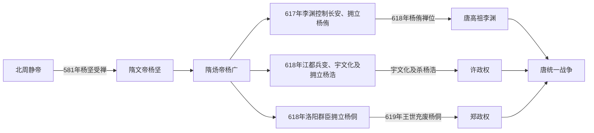

# 隋世系

## 概括

隋朝正式皇帝以杨坚、杨广、杨侑为主线。隋末中央崩解后，长安的杨侑、江都的杨浩、洛阳的杨侗在不同军政集团控制下并立；三者都列入更替脉络，但必须区分名义君位与实际最高权力。

## 世系与崩解主线

## 继承机制与实际权力

- 杨坚以北周外戚、关陇重臣和辅政者身份控制幼主，在平定尉迟迥等反对力量后受禅；建国不是单纯血缘继承，而是关陇军政集团重新组合。
- 文帝原太子杨勇因宫廷、用人和生活方式等争议被废，杨广获立。杨坚死亡过程和杨广是否弑父，史籍叙事存在争议，不能把后世指控当作已证事实。
- 杨广在位后期仍是名义皇帝，但大规模叛乱使诏令只能控制部分城市与军队。617年李渊入长安，拥立皇孙杨侑并遥尊杨广为太上皇，实际建立独立关中政权。
- 618年宇文化及等在江都杀杨广、立杨浩；杨浩完全受军队控制，旋即被杀。洛阳官员另立杨侗，随后王世充掌握实权。
- 杨侑禅唐标志关中隋廷结束；杨浩被杀使江都隋廷消失；619年杨侗被王世充废杀，最后一个主要隋室朝廷终结。
- 隋的制度和官僚并未随杨氏君位一同消失。唐继承三省六部、州县、科举探索和统一帝国基础，并吸收大量隋官、军队与粮仓。

## 君主世系表

| 顺序 | 姓名 | 庙号 | 谥号 | 年号 | 在位时间 | 生卒时间 | 与前任关系 | 关键事件 / 备注 |
|---:|---|---|---|---|---|---|---|---|
| 追尊 | 杨忠 | 太祖 | 武元皇帝 | 无 | 未实际在位 | 507年—568年 | 无 | 北周封随国公；杨坚建立隋朝后追尊。 |
| 1 | **杨坚** | 高祖 | 文皇帝 | 开皇、仁寿 | 581年—604年 | 541年—604年 | 杨忠之子；受北周静帝禅让 | 581年建隋；587年废西梁；589年灭陈统一南北；开皇之治；确立三省六部制，推进科举和户籍财政整顿。 |
| 2 | **杨广** | 世祖 | 炀皇帝；另有明皇帝、闵皇帝等谥称 | 大业 | 604年—618年 | 569年—618年 | 杨坚之子 | 营建东都洛阳，开凿大运河，修驰道；三征高句丽与大规模徭役加剧社会危机；618年江都兵变中被宇文化及等弑杀。 |
| 并立 | 杨侑 | 无 | 恭皇帝 | 义宁 | 617年—618年 | 605年—619年 | 杨广之孙，元德太子杨昭之子 | 李渊攻入长安后拥立，遥尊杨广为太上皇；618年禅位李渊，唐朝建立；此处已校正旧表误写。 |
| 并立 | 杨浩 | 无 | 秦王，后多称秦孝王 | 无 | 618年 | ？—618年 | 杨坚之孙，秦王杨俊之子 | 江都兵变后由宇文化及拥立为帝；同年被宇文化及杀害。 |
| 并立 | 杨侗 | 无 | 恭皇帝，史称皇泰主 | 皇泰 | 618年—619年 | 605年—619年 | 杨广之孙，元德太子杨昭之子 | 洛阳官员拥立；619年被王世充废黜，后被杀，隋朝残余政权终结。 |
| 追尊 | 杨昭 | 世宗 | 孝成皇帝 | 无 | 未实际在位 | 584年—606年 | 杨广之子 | 原为元德太子；杨侗追尊。 |

## 演变关系

- 前一节点：[北周](/%E4%BA%BA%E6%96%87%E7%A7%91%E5%AD%A6/%E5%8E%86%E5%8F%B2/%E4%B8%9C%E4%BA%9A/%E4%B8%AD%E5%9B%BD/%E5%8D%97%E5%8C%97%E6%9C%9D/%E5%8C%97%E6%9C%9D/%E5%91%A8%EF%BC%88%E5%AE%87%E6%96%87%EF%BC%89.md)。581年杨坚代周建隋。
- 统一节点：[南北朝](/%E4%BA%BA%E6%96%87%E7%A7%91%E5%AD%A6/%E5%8E%86%E5%8F%B2/%E4%B8%9C%E4%BA%9A/%E4%B8%AD%E5%9B%BD/%E5%8D%97%E5%8C%97%E6%9C%9D/README.md)。589年隋灭陈，南北朝结束。
- 后一节点：[唐](/%E4%BA%BA%E6%96%87%E7%A7%91%E5%AD%A6/%E5%8E%86%E5%8F%B2/%E4%B8%9C%E4%BA%9A/%E4%B8%AD%E5%9B%BD/%E5%94%90/README.md)。618年杨侑禅位李渊，唐朝建立；619年王世充废杨侗，隋残余政权终结。
