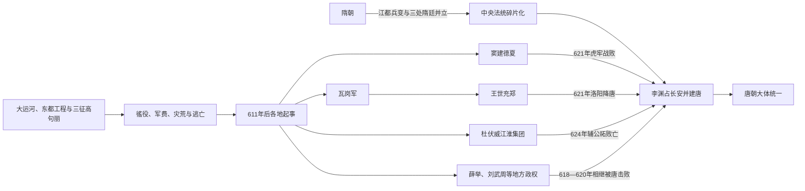

# 隋末群雄

## 时间

611年—624年左右

## 概括

隋末群雄是隋炀帝后期大规模徭役、征辽失败、财政压力和地方控制崩溃共同引发的政权瓦解阶段。各地参与者并非同一种“农民起义”：有饥民、盗群和宗教性队伍，也有隋将、郡县官、地方豪强和关陇贵族。李唐先取得关中人口、粮仓与政治名义，再通过联盟、招降和关键会战逐步统一，至624年前后才大体结束主要竞争。

## 瓦解与统一主线

## 危机形成

| 层面 | 具体机制 |
|---|---|
| 超强动员 | 营建东都、大运河、长城和巡幸需大量民夫、粮运；工程有长期整合作用，短期同时集中则超出社会承受能力。 |
| 对高句丽战争 | 612—614年连续远征，军队、畜力和物资损失严重，地方逃役、叛乱随征发扩大。 |
| 灾害与粮食 | 山东、河北等地水旱、饥荒与征粮叠加，流民很容易进入有组织武装。 |
| 地方军政 | 镇压需要郡县和将领自行募兵，官军、豪强部曲与起义队伍可互相转化，中央难判断忠诚。 |
| 皇帝与中枢分离 | 杨广长期驻江都，关中、洛阳和北方将领各自处置危机，诏令与实控范围脱节。 |
| 合法性竞争 | 各集团或拥立隋宗室、或称王称帝、或接受唐官爵；“反隋”与“借隋号令”常同时存在。 |

## 过程与重要转折

1. **611年前后山东河北起事扩大**：王薄等最初队伍与逃避征辽者结合，地方治安问题转为跨郡战争。
2. **杨玄感叛乱（613）**：高级贵族利用隋军在辽东时起兵进攻洛阳，虽迅速失败，却证明统治集团内部已分裂。
3. **瓦岗军壮大**：翟让建立基础，李密加入后取得兴洛仓等粮仓，借赈粮和围攻洛阳扩大影响；内部冲突及与王世充决战失败后瓦解。
4. **窦建德整合河北**：从起义军发展为夏政权，建立官署、征税和军队，是唐在关东最强对手。
5. **李渊太原起兵（617）**：利用突厥关系稳定北面，迅速攻长安，拥杨侑获得隋朝名义，同时控制关中仓储。
6. **三处隋廷终结（618—619）**：杨广被杀后，杨侑禅唐；杨浩被宇文化及杀；杨侗被王世充废，隋室不再有主要领土政权。
7. **唐保卫关中（618—620）**：薛举、薛仁杲从陇西威胁长安，刘武周、宋金刚占太原；李世民分别击败，使唐拥有稳定后方。
8. **虎牢之战（621）**：李世民围洛阳王世充，窦建德来援；唐军先在虎牢击败窦军，再迫王世充投降，一战取得河南、河北主动权。
9. **南方整合**：李靖等迫萧铣投降；杜伏威降唐后辅公祏再起，624年败亡，江淮和长江中游纳入。
10. **余波**：刘黑闼等利用河北对唐处置不满再起，显示“灭一首领”不等于地方立即稳定；唐以军事、招抚和官僚恢复并用完成整合。

## 唐取胜的原因

- **关中基地**：长安政权拥有地形屏障、关陇军事人才和隋代粮仓，能承受多方向战争。
- **隋朝名义**：李渊先拥立杨侑再受禅，使隋官、郡县和贵族较容易转入唐，而非全部视其为普通叛军。
- **领导分工**：李渊处理中枢和联盟，李世民、李建成、李孝恭、李靖等分别主持战区，唐不依赖单一军头。
- **先近后远**：先清除薛举、刘武周以保关中，再集中对付王世充、窦建德，避免四面扩张。
- **利用对手矛盾**：瓦岗分裂、宇文化及与各地敌对、王世充和窦建德结盟较晚，使唐得以逐个击破。
- **吸纳而非尽杀**：对许多降将和地方势力授官留用，迅速获得熟悉当地的行政和军事人才。
- **制度继承**：唐接管隋的州县、仓储、运河和文书体系，统一不是从零建立国家。

## 隋灭亡的原因层次

- **结构因素**：新统一帝国需要整合南北，户籍、交通和边疆工程本有必要，但过短时间内并行造成负担集中。
- **统治因素**：杨广低估远征失败和民变规模，拒绝及时降低征发；中枢回避坏消息，地方失去修复窗口。
- **外部压力**：高句丽战争持续消耗精锐，突厥又影响北方各集团的安全与联盟。
- **直接触发**：征辽失败、杨玄感之乱和连续灾荒把逃役者转成武装；皇帝滞留江都使关中、洛阳自行拥立。
- **最终终结**：江都兵变杀杨广后，三个隋廷均被控制者迅速取代，杨氏失去独立军队；唐再以数年战争消灭竞争政权。

## 说明

- 611年以后，山东、河北、河南等地民变扩大，瓦岗军、窦建德、杜伏威等势力逐渐成形。
- 隋炀帝长期在外巡幸，中央权威与地方控制力下降；三征高句丽失败进一步削弱军事和财政基础。
- 617年，李渊在太原起兵，攻入长安，拥立代王杨侑为隋恭帝，遥尊隋炀帝为太上皇。
- 618年，江都兵变中宇文化及等弑杀隋炀帝，拥立杨浩；同年李渊受杨侑禅让建立唐朝。
- 618年，洛阳官员拥立杨侗为帝，形成皇泰政权；619年王世充废杨侗自立，隋朝残余政权终结。
- 唐朝建立后并未立即统一全国，仍需陆续平定薛举、刘武周、王世充、窦建德、刘黑闼、萧铣、辅公祏等势力。

## 主要势力

| 势力 | 活动区域 | 代表人物 | 结局 | 说明 |
|---|---|---|---|---|
| 瓦岗军 | 河南、山东一带 | 翟让、李密 | 被王世充击败，李密降唐后被杀 | 隋末最重要的起义军之一，曾威胁东都洛阳。 |
| 夏 | 河北 | 窦建德 | 621年败于李世民，被唐处死 | 以河北为根基，曾援救王世充。 |
| 郑 | 洛阳 | 王世充 | 621年降唐，后被杀 | 废杨侗自立，控制东都洛阳。 |
| 梁 | 江陵、江南部分地区 | 萧铣 | 621年降唐 | 依托南方旧梁宗室声望建立政权。 |
| 西秦 | 陇西、关中西部 | 薛举、薛仁杲 | 618年被唐灭 | 一度威胁唐朝关中根基。 |
| 定杨 | 河东、并州一带 | 刘武周、宋金刚 | 620年败亡 | 曾攻占太原，威胁唐朝北方。 |
| 江淮势力 | 江淮地区 | 杜伏威、辅公祏 | 杜伏威降唐，辅公祏624年被平定 | 江淮地方武装，唐统一南方的重要环节。 |
| 唐 | 关中、河东，后扩展全国 | 李渊、李世民 | 最终统一 | 以关陇军事集团和关中资源为基础，逐步消灭群雄。 |

## 演变关系

- 前一节点：[隋](/%E4%BA%BA%E6%96%87%E7%A7%91%E5%AD%A6/%E5%8E%86%E5%8F%B2/%E4%B8%9C%E4%BA%9A/%E4%B8%AD%E5%9B%BD/%E9%9A%8B/README.md)。隋炀帝后期统治危机引发民变和地方割据。
- 后一节点：[唐](/%E4%BA%BA%E6%96%87%E7%A7%91%E5%AD%A6/%E5%8E%86%E5%8F%B2/%E4%B8%9C%E4%BA%9A/%E4%B8%AD%E5%9B%BD/%E5%94%90/README.md)。唐朝建立后通过数年战争逐步统一全国。
- 并列关系：王世充、窦建德、萧铣、刘武周、薛举等势力与唐政权在同一时期竞争正统与地域控制权。
