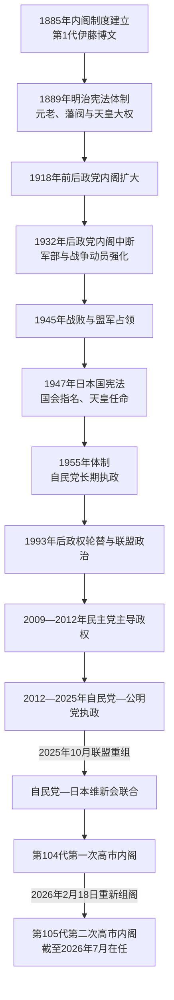

# 日本内阁总理大臣表

## 范围与读法

本表按日本首相官邸采用的**历代内阁编号**排列，从1885年内阁制度建立后的第1代伊藤博文内阁，到截至2026年7月仍在任的第105代高市早苗内阁。这里的“第几代”指一次组阁，不等于独立人物数；同一首相在选举、内阁总辞或政治联盟变化后重新组阁，会获得新的代次。

首相是政府首脑。明治宪法体制下，元老、军部、枢密院、贵族院和政党都可能制约内阁；1947年宪法施行后，首相由国会指名并由天皇任命，内阁向国会集体负责。天皇连续表另见[天皇世系表](/%E4%BA%BA%E6%96%87%E7%A7%91%E5%AD%A6/%E5%8E%86%E5%8F%B2/%E4%B8%9C%E4%BA%9A/%E6%97%A5%E6%9C%AC/%E5%A4%A9%E7%9A%87%E4%B8%96%E7%B3%BB%E8%A1%A8.md)。

## 内阁制度演变图

## 明治时期组阁（第1—14代）

| 代 | 内阁总理大臣 | 任期 | 政治基础 / 内阁性质 | 关键事件与交接 |
| --- | --- | --- | --- | --- |
| 1 | 伊藤博文 | 1885-12-22—1888-04-30 | 长州藩阀；首届内阁 | 建立近代内阁制度，推进宪法体制准备。 |
| 2 | 黑田清隆 | 1888-04-30—1889-10-25 | 萨摩藩阀 | 《大日本帝国宪法》颁布；条约改正受阻后辞职。 |
| 3 | 山县有朋 | 1889-12-24—1891-05-06 | 长州藩阀 | 首届帝国议会开会，政府与民党围绕预算交锋。 |
| 4 | 松方正义 | 1891-05-06—1892-08-08 | 萨摩藩阀 | 选举干涉激化政府与议会矛盾。 |
| 5 | 伊藤博文 | 1892-08-08—1896-08-31 | 元老内阁 | 经历甲午战争与《马关条约》，日本取得台湾并扩张在朝鲜利益。 |
| 6 | 松方正义 | 1896-09-18—1898-01-12 | 藩阀与进步党合作 | 推进金本位和战后经营，政党合作破裂后辞职。 |
| 7 | 伊藤博文 | 1898-01-12—1898-06-30 | 藩阀内阁 | 试图稳定财政和议会关系，未能形成持久多数。 |
| 8 | 大隈重信 | 1898-06-30—1898-11-08 | 宪政党；日本首届政党内阁 | 党内分裂和尾崎行雄共和演说事件导致短命。 |
| 9 | 山县有朋 | 1898-11-08—1900-10-19 | 藩阀内阁 | 强化文官任用限制与军部大臣现役武官制。 |
| 10 | 伊藤博文 | 1900-10-19—1901-05-10 | 立宪政友会 | 以政党组织支撑政府，财政争议使内阁总辞。 |
| 11 | 桂太郎 | 1901-06-02—1906-01-07 | 长州系藩阀；桂园时代 | 英日同盟、日俄战争和《朴次茅斯条约》均发生于任内。 |
| 12 | 西园寺公望 | 1906-01-07—1908-07-14 | 立宪政友会；桂园时代 | 开展战后经营，因预算和军费压力辞职。 |
| 13 | 桂太郎 | 1908-07-14—1911-08-30 | 藩阀内阁；桂园时代 | 日韩合并、工厂法公布，并处理日俄战后外交。 |
| 14 | 西园寺公望 | 1911-08-30—1912-12-21 | 立宪政友会；跨明治、大正 | 陆军拒绝推荐大臣触发内阁倒台，暴露军部制度性否决权。 |

## 大正时期组阁（第15—25代）

| 代 | 内阁总理大臣 | 任期 | 政治基础 / 内阁性质 | 关键事件与交接 |
| --- | --- | --- | --- | --- |
| 15 | 桂太郎 | 1912-12-21—1913-02-20 | 藩阀内阁 | 护宪运动反对元老绕开政党政治，内阁仅两个月即倒台。 |
| 16 | 山本权兵卫 | 1913-02-20—1914-04-16 | 萨摩系；政友会支持 | 改革军部大臣资格，因西门子事件辞职。 |
| 17 | 大隈重信 | 1914-04-16—1916-10-09 | 同志会等支持 | 日本参加第一次世界大战并向中国提出“二十一条”。 |
| 18 | 寺内正毅 | 1916-10-09—1918-09-29 | 陆军、官僚内阁 | 西原借款与西伯利亚出兵；米骚动迫使内阁辞职。 |
| 19 | 原敬 | 1918-09-29—1921-11-04 | 立宪政友会；首个本格政党内阁 | 扩大交通与教育投资，1921年遇刺身亡。 |
| 20 | 高桥是清 | 1921-11-13—1922-06-12 | 立宪政友会 | 接续原敬内阁，党内整合失败后总辞。 |
| 21 | 加藤友三郎 | 1922-06-12—1923-08-24 | 海军、官僚内阁 | 落实华盛顿海军裁军体系，任内病逝。 |
| 22 | 山本权兵卫 | 1923-09-02—1924-01-07 | 震灾善后内阁 | 处理关东大地震，因虎之门事件辞职。 |
| 23 | 清浦奎吾 | 1924-01-07—1924-06-11 | 贵族院、官僚内阁 | 第二次护宪运动与选举失败使其下台。 |
| 24 | 加藤高明 | 1924-06-11—1926-01-28 | 护宪三派、宪政会 | 通过普通选举法，同时制定治安维持法；任内病逝。 |
| 25 | 若槻礼次郎 | 1926-01-30—1927-04-20 | 宪政会；跨大正、昭和 | 金融危机处置受枢密院阻挠，内阁总辞。 |

## 昭和战前、战时与占领初期（第26—51代）

| 代 | 内阁总理大臣 | 任期 | 政治基础 / 内阁性质 | 关键事件与交接 |
| --- | --- | --- | --- | --- |
| 26 | 田中义一 | 1927-04-20—1929-07-02 | 立宪政友会；陆军背景 | 推行对华强硬政策，因皇姑屯事件问责失信而辞职。 |
| 27 | 滨口雄幸 | 1929-07-02—1931-04-14 | 立宪民政党 | 实行金解禁和紧缩，签署伦敦海军条约；遇刺重伤后辞职。 |
| 28 | 若槻礼次郎 | 1931-04-14—1931-12-13 | 立宪民政党 | 九一八事变后无法约束关东军，内阁倒台。 |
| 29 | 犬养毅 | 1931-12-13—1932-05-16 | 立宪政友会 | 五一五事件中被海军青年军官刺杀，政党内阁时代中断。 |
| 30 | 斋藤实 | 1932-05-26—1934-07-08 | 海军、举国一致内阁 | 承认满洲国并退出国际联盟，因帝人事件辞职。 |
| 31 | 冈田启介 | 1934-07-08—1936-03-09 | 海军、举国一致内阁 | 天皇机关说事件和二二六事件冲击政局，事件后辞职。 |
| 32 | 广田弘毅 | 1936-03-09—1937-02-02 | 外交官、军部合作内阁 | 恢复军部大臣现役武官制，签署《反共产国际协定》。 |
| 33 | 林铣十郎 | 1937-02-02—1937-06-04 | 陆军内阁 | 无明确议会基础，“食逃解散”选举失利后辞职。 |
| 34 | 近卫文麿 | 1937-06-04—1939-01-05 | 贵族、举国动员 | 卢沟桥事变后全面侵华，颁布国家总动员法。 |
| 35 | 平沼骐一郎 | 1939-01-05—1939-08-30 | 官僚、右翼内阁 | 诺门罕战事和《苏德互不侵犯条约》冲击外交方针，内阁总辞。 |
| 36 | 阿部信行 | 1939-08-30—1940-01-16 | 陆军内阁 | 在欧洲战争爆发后试图“不介入”，国内战争体制仍继续。 |
| 37 | 米内光政 | 1940-01-16—1940-07-22 | 海军内阁 | 反对与德意结盟，受陆军拒派大臣而倒台。 |
| 38 | 近卫文麿 | 1940-07-22—1941-07-18 | 新体制运动 | 成立大政翼赞会，缔结三国同盟并推进南进。 |
| 39 | 近卫文麿 | 1941-07-18—1941-10-18 | 战时举国体制 | 日美谈判破裂，无法阻止开战路线而辞职。 |
| 40 | 东条英机 | 1941-10-18—1944-07-22 | 陆军主导战时内阁 | 发动太平洋战争；塞班失守后总辞。 |
| 41 | 小矶国昭 | 1944-07-22—1945-04-07 | 陆军、海军联合内阁 | 战局持续恶化，无法实现军政统合而辞职。 |
| 42 | 铃木贯太郎 | 1945-04-07—1945-08-17 | 终战内阁 | 经御前会议接受《波茨坦公告》，日本宣布投降。 |
| 43 | 东久迩宫稔彦王 | 1945-08-17—1945-10-09 | 皇族终战处理内阁 | 办理解除武装与盟军进驻，因改革要求分歧辞职。 |
| 44 | 币原喜重郎 | 1945-10-09—1946-05-22 | 外交官内阁；盟军占领期 | 推进民主化改革、女性参政与新宪法草拟过程。 |
| 45 | 吉田茂 | 1946-05-22—1947-05-24 | 自由党；占领期 | 在新宪法公布和施行前后组织政府。 |
| 46 | 片山哲 | 1947-05-24—1948-03-10 | 社会党主导联合内阁 | 新宪法下首届国会政权，因联盟与党内矛盾辞职。 |
| 47 | 芦田均 | 1948-03-10—1948-10-15 | 民主党主导联合内阁 | 昭和电工事件引发政治危机并导致总辞。 |
| 48 | 吉田茂 | 1948-10-15—1949-02-16 | 民主自由党 | 稳定保守政权并准备经济紧缩改革。 |
| 49 | 吉田茂 | 1949-02-16—1952-10-30 | 民主自由党、自由党 | 道奇路线、朝鲜战争特需与《旧金山和约》；1952年恢复主权。 |
| 50 | 吉田茂 | 1952-10-30—1953-05-21 | 自由党 | “笨蛋混蛋”发言引发众议院解散，选后再次组阁。 |
| 51 | 吉田茂 | 1953-05-21—1954-12-10 | 自由党 | 保守分裂与造船疑狱削弱内阁，反吉田势力联合迫其辞职。 |

## 昭和战后独立与经济大国化（第52—74代）

| 代 | 内阁总理大臣 | 任期 | 政治基础 / 内阁性质 | 关键事件与交接 |
| --- | --- | --- | --- | --- |
| 52 | 鸠山一郎 | 1954-12-10—1955-03-19 | 日本民主党 | 结束吉田长期执政，推进保守势力重组。 |
| 53 | 鸠山一郎 | 1955-03-19—1955-11-22 | 日本民主党 | 形成保守合同条件，自民党于1955年成立。 |
| 54 | 鸠山一郎 | 1955-11-22—1956-12-23 | 自由民主党 | 恢复日苏邦交并加入联合国后辞职。 |
| 55 | 石桥湛山 | 1956-12-23—1957-02-25 | 自由民主党 | 提出扩大社会福利与对外交流，因病短期辞职。 |
| 56 | 岸信介 | 1957-02-25—1958-06-12 | 自由民主党 | 强调经济建设和日美关系，选后再次组阁。 |
| 57 | 岸信介 | 1958-06-12—1960-07-19 | 自由民主党 | 强行通过新《日美安全保障条约》，安保斗争后辞职。 |
| 58 | 池田勇人 | 1960-07-19—1960-12-08 | 自由民主党 | 以“宽容与忍耐”和所得倍增计划缓和政治对立。 |
| 59 | 池田勇人 | 1960-12-08—1963-12-09 | 自由民主党 | 高速增长和贸易自由化推进，国民收入显著上升。 |
| 60 | 池田勇人 | 1963-12-09—1964-11-09 | 自由民主党 | 东京奥运会前后基础设施扩张，因病辞职。 |
| 61 | 佐藤荣作 | 1964-11-09—1967-02-17 | 自由民主党 | 延续高速增长，处理日韩邦交正常化。 |
| 62 | 佐藤荣作 | 1967-02-17—1970-01-14 | 自由民主党 | 提出非核三原则，围绕冲绳返还与美国谈判。 |
| 63 | 佐藤荣作 | 1970-01-14—1972-07-07 | 自由民主党 | 1972年实现冲绳行政权返还，长期执政后退任。 |
| 64 | 田中角荣 | 1972-07-07—1972-12-22 | 自由民主党 | 实现日中邦交正常化，提出日本列岛改造论。 |
| 65 | 田中角荣 | 1972-12-22—1974-12-09 | 自由民主党 | 石油危机冲击经济，金权政治争议迫其辞职。 |
| 66 | 三木武夫 | 1974-12-09—1976-12-24 | 自由民主党 | 推动政治净化并调查洛克希德事件，党内反弹后下台。 |
| 67 | 福田赳夫 | 1976-12-24—1978-12-07 | 自由民主党 | 提出“福田主义”，强化与东南亚的非军事合作。 |
| 68 | 大平正芳 | 1978-12-07—1979-11-09 | 自由民主党 | 倡议“环太平洋合作”，选举后重组内阁。 |
| 69 | 大平正芳 | 1979-11-09—1980-06-12 | 自由民主党 | 党内分裂导致不信任案通过，众参同日选举期间病逝。 |
| 70 | 铃木善幸 | 1980-07-17—1982-11-27 | 自由民主党 | 着手行政与财政改革，日美同盟表述引发党内争论。 |
| 71 | 中曾根康弘 | 1982-11-27—1983-12-27 | 自由民主党 | 提出“战后政治总决算”，强化首相领导和日美关系。 |
| 72 | 中曾根康弘 | 1983-12-27—1986-07-22 | 自由民主党 | 推进国铁、电信和烟草专卖民营化准备。 |
| 73 | 中曾根康弘 | 1986-07-22—1987-11-06 | 自由民主党 | 完成重要国企改革，泡沫经济形成条件逐渐积累。 |
| 74 | 竹下登 | 1987-11-06—1989-06-03 | 自由民主党；跨昭和、平成 | 创设消费税，里库路特事件削弱内阁并迫其辞职。 |

## 平成时期组阁（第75—98代；第98代跨入令和）

| 代 | 内阁总理大臣 | 任期 | 政治基础 / 内阁性质 | 关键事件与交接 |
| --- | --- | --- | --- | --- |
| 75 | 宇野宗佑 | 1989-06-03—1989-08-10 | 自由民主党 | 性丑闻与参议院选举失败使内阁仅两月即结束。 |
| 76 | 海部俊树 | 1989-08-10—1990-02-28 | 自由民主党 | 冷战结束背景下启动政治改革讨论，选后重组。 |
| 77 | 海部俊树 | 1990-02-28—1991-11-05 | 自由民主党 | 海湾战争巨额财政援助引发“支票簿外交”反思。 |
| 78 | 宫泽喜一 | 1991-11-05—1993-08-09 | 自由民主党 | 泡沫破裂与政治改革失败导致自民党失去众议院多数。 |
| 79 | 细川护熙 | 1993-08-09—1994-04-28 | 非自民八党联合 | 终结自民党连续38年执政，通过选举制度改革。 |
| 80 | 羽田孜 | 1994-04-28—1994-06-30 | 少数联合内阁 | 社会党退出后缺乏多数支持，短期总辞。 |
| 81 | 村山富市 | 1994-06-30—1996-01-11 | 社会党、自民党、先驱新党联合 | 经历阪神淡路大地震和奥姆真理教事件，发表“村山谈话”。 |
| 82 | 桥本龙太郎 | 1996-01-11—1996-11-07 | 自民党主导联合 | 推进冲绳美军基地调整和行政改革，选后重组。 |
| 83 | 桥本龙太郎 | 1996-11-07—1998-07-30 | 自由民主党 | 提高消费税后经济低迷、金融危机加深，参院选败后辞职。 |
| 84 | 小渊惠三 | 1998-07-30—2000-04-05 | 自民党后转自自公联合 | 以财政刺激应对衰退，确立“平成”后期联合执政框架；病倒。 |
| 85 | 森喜朗 | 2000-04-05—2000-07-04 | 自由民主党 | 接替病倒的小渊，失言和低支持率持续困扰政权。 |
| 86 | 森喜朗 | 2000-07-04—2001-04-26 | 自公保联合后自公联合 | 行政改革省厅重组落地，党内压力下辞职。 |
| 87 | 小泉纯一郎 | 2001-04-26—2003-11-19 | 自由民主党、公明党 | 以结构改革和首相主导打击党内派阀，处理朝鲜绑架问题。 |
| 88 | 小泉纯一郎 | 2003-11-19—2005-09-21 | 自公联合 | 派遣自卫队赴伊拉克，邮政民营化法案受阻后解散众院。 |
| 89 | 小泉纯一郎 | 2005-09-21—2006-09-26 | 自公联合 | “邮政选举”大胜后通过民营化法，任满退任。 |
| 90 | 安倍晋三 | 2006-09-26—2007-09-26 | 自公联合 | 教育基本法修改、防卫厅升格；参院选败与健康问题后辞职。 |
| 91 | 福田康夫 | 2007-09-26—2008-09-24 | 自公联合 | 面对扭曲国会和政策僵局，支持率下降后辞职。 |
| 92 | 麻生太郎 | 2008-09-24—2009-09-16 | 自公联合 | 应对全球金融危机；众院选举惨败使自民党首次长期下野。 |
| 93 | 鸠山由纪夫 | 2009-09-16—2010-06-08 | 民主党主导联合 | 实现政权轮替，因普天间基地承诺失信和党内问题辞职。 |
| 94 | 菅直人 | 2010-06-08—2011-09-02 | 民主党主导 | 处理东日本大震灾、海啸与福岛第一核电站事故，灾后争议中辞职。 |
| 95 | 野田佳彦 | 2011-09-02—2012-12-26 | 民主党主导 | 推动消费税增税与社会保障改革，解散众院后选举失败。 |
| 96 | 安倍晋三 | 2012-12-26—2014-12-24 | 自公联合 | 以“安倍经济学”重启增长政策，强化首相官邸主导。 |
| 97 | 安倍晋三 | 2014-12-24—2017-11-01 | 自公联合 | 通过安全保障相关法制，并两次推迟消费税增税。 |
| 98 | 安倍晋三 | 2017-11-01—2020-09-16 | 自公联合；跨平成、令和 | 延续长期政权，2019年提高消费税；因健康问题辞职。 |

## 令和时期组阁（第99—105代；截至2026年7月）

| 代 | 内阁总理大臣 | 任期 | 政治基础 / 内阁性质 | 关键事件与交接 |
| --- | --- | --- | --- | --- |
| 99 | 菅义伟 | 2020-09-16—2021-10-04 | 自公联合 | 应对新冠疫情、推动数字厅和疫苗接种；支持率下降后不再竞选党总裁。 |
| 100 | 岸田文雄 | 2021-10-04—2021-11-10 | 自公联合 | 提出“新资本主义”，众院选举后依惯例重组内阁。 |
| 101 | 岸田文雄 | 2021-11-10—2024-10-01 | 自公联合 | 处理疫情后复苏、安保政策转向与政治资金丑闻；不再竞选党总裁。 |
| 102 | 石破茂 | 2024-10-01—2024-11-11 | 自公联合 | 就任后解散众院，自公联盟失去众议院过半。 |
| 103 | 石破茂 | 2024-11-11—2025-10-21 | 自公少数执政 | 在少数国会格局下依赖逐案协商，2025年结束执政。 |
| 104 | 高市早苗 | 2025-10-21—2026-02-18 | 自民党—日本维新会联合 | 公明党退出长期联盟后，自民党与日本维新会签署联合执政协议；高市成为日本首位女性首相，众院选举后内阁总辞。 |
| 105 | 高市早苗 | 2026-02-18—至今 | 自民党—日本维新会联合 | 第二次高市内阁；在众院选举后重新组阁，截至2026年7月仍在任。 |

## 临时代理与编号说明

以下人员曾在首相死亡、辞职或内阁成立空档中临时代理，但不另计“历代内阁”代次：

| 代理者 | 代理时间 | 原因 / 身份 |
| --- | --- | --- |
| 三条实美 | 1889-10-25—1889-12-24 | 黑田清隆辞职后，以内大臣身份暂代首相职务。 |
| 黑田清隆 | 1896-08-31—1896-09-18 | 伊藤博文辞职至松方正义组阁间代理。 |
| 西园寺公望 | 1901-05-10—1901-06-02 | 伊藤博文辞职至桂太郎组阁间代理。 |
| 内田康哉 | 1921-11-04—1921-11-13 | 原敬遇刺后，以外相身份临时代理。 |
| 内田康哉 | 1923-08-24—1923-09-02 | 加藤友三郎病逝后再次代理。 |
| 若槻礼次郎 | 1926-01-28—1926-01-30 | 加藤高明病逝后短期代理并继任组阁。 |
| 高桥是清 | 1932-05-16—1932-05-26 | 犬养毅遇刺后，以大藏大臣身份代理。 |
| 伊东正义 | 1980-06-12—1980-07-17 | 大平正芳病逝后，以内阁官房长官身份代理。 |
| 青木干雄 | 2000-04-03—2000-04-05 | 小渊惠三失去履职能力后，以内阁官房长官身份代理。 |

短暂代理与正式组阁应分开理解：前者维持行政连续性，后者经天皇任命并形成新内阁。若首相因疾病暂不能履职而内阁并未总辞，代理期也不会改变正式内阁编号。

## 政治结构的长期变化

- **1885—1918年：元老与藩阀主导。** 内阁虽有宪法形式，却主要由萨长藩阀和元老选择首相；帝国议会、政党和军部逐渐成为独立制约力量。
- **1918—1932年：政党内阁扩大。** 原敬以后，众议院多数党组阁一度成为常态，但元老荐举、贵族院与军部制度性权力仍未消失。
- **1932—1945年：军部与战争动员。** 五一五事件后政党内阁中断，军部可借拒派现役大臣使内阁倒台；全面战争使议会监督和政党竞争被压缩。
- **1945—1955年：占领改革与保守重组。** 新宪法确立议会内阁制，政党重新竞争；对美同盟、有限再军备和经济复兴构成“吉田路线”。
- **1955—1993年：“五五年体制”。** 自民党长期执政，社会党长期居最大反对党；派阀竞争常在执政党内部完成首相更替。
- **1993—2025年10月：联盟政治与官邸主导。** 政权轮替和选举改革改变党派竞争，1999年以后自民党—公明党联盟逐步稳定，2009—2012年民主党主导政权构成一次重要轮替；危机应对、外交安全和行政协调增强首相官邸作用。
- **2025年10月至今：联盟重组。** 公明党结束与自民党的长期执政联盟，自民党改与日本维新会组成联合政府；第104、105代高市内阁均以自民党—日本维新会联盟为政治基础。

## 相关时代

- [明治时代](/%E4%BA%BA%E6%96%87%E7%A7%91%E5%AD%A6/%E5%8E%86%E5%8F%B2/%E4%B8%9C%E4%BA%9A/%E6%97%A5%E6%9C%AC/%E6%98%8E%E6%B2%BB%E6%97%B6%E4%BB%A3.md)
- [大正时代](/%E4%BA%BA%E6%96%87%E7%A7%91%E5%AD%A6/%E5%8E%86%E5%8F%B2/%E4%B8%9C%E4%BA%9A/%E6%97%A5%E6%9C%AC/%E5%A4%A7%E6%AD%A3%E6%97%B6%E4%BB%A3.md)
- [昭和时代](/%E4%BA%BA%E6%96%87%E7%A7%91%E5%AD%A6/%E5%8E%86%E5%8F%B2/%E4%B8%9C%E4%BA%9A/%E6%97%A5%E6%9C%AC/%E6%98%AD%E5%92%8C%E6%97%B6%E4%BB%A3.md)
- [平成时代](/%E4%BA%BA%E6%96%87%E7%A7%91%E5%AD%A6/%E5%8E%86%E5%8F%B2/%E4%B8%9C%E4%BA%9A/%E6%97%A5%E6%9C%AC/%E5%B9%B3%E6%88%90%E6%97%B6%E4%BB%A3.md)
- [令和时代](/%E4%BA%BA%E6%96%87%E7%A7%91%E5%AD%A6/%E5%8E%86%E5%8F%B2/%E4%B8%9C%E4%BA%9A/%E6%97%A5%E6%9C%AC/%E4%BB%A4%E5%92%8C%E6%97%B6%E4%BB%A3.md)
- [日本历史总览](/%E4%BA%BA%E6%96%87%E7%A7%91%E5%AD%A6/%E5%8E%86%E5%8F%B2/%E4%B8%9C%E4%BA%9A/%E6%97%A5%E6%9C%AC/README.md)
