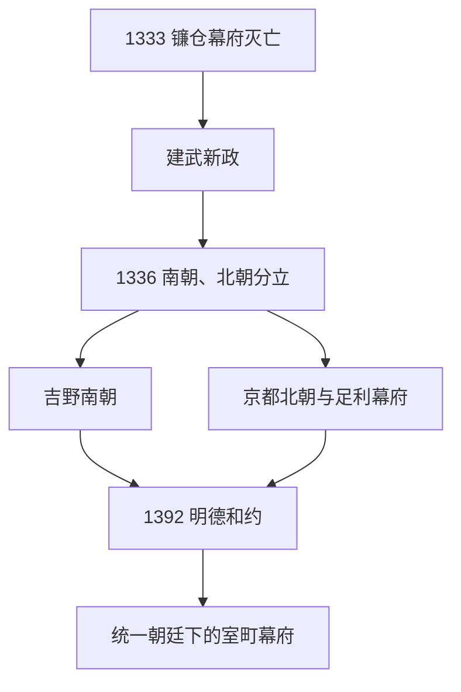

# 南北朝时期

## 时间

1336-1392年。

## 别称

- 南北朝时代
- 日本南北朝
- 室町时代前期的南北朝内乱阶段

## 概括

南北朝时期是镰仓幕府灭亡、建武新政失败后，日本皇统分裂为南朝和北朝并长期对立的阶段。足利尊氏拥立北朝并建立室町幕府，后醍醐天皇退往吉野形成南朝；1392年南朝后龟山天皇将神器交给北朝后小松天皇，南北朝合一。

## 说明

- 1333年镰仓幕府灭亡后，后醍醐天皇推行建武新政。
- 建武新政未能稳定武士阶层利益，足利尊氏反叛并进入京都。
- 1336年，足利尊氏拥立光明天皇，形成京都北朝；后醍醐天皇退往吉野，形成南朝。
- 南朝以吉野为中心，坚持自身皇统正统性。
- 北朝依托足利氏和室町幕府，在京都维持朝廷秩序。
- 这一时期与室町幕府早期重叠，但从皇统和政治合法性看，应单独列为日本历史重要阶段。
- 1392年南北朝合一，后小松天皇成为统一皇统天皇。

## 南朝天皇世系

南朝为日本传统皇统编号中的正统。

| 顺序 | 天皇 | 在位时间 | 说明 |
| ---: | --- | --- | --- |
| 96 | **后醍醐天皇** | 1318-1339 | 建武新政失败后退往吉野，南朝开端。 |
| 97 | 后村上天皇 | 1339-1368 | 南朝延续时期天皇。 |
| 98 | 长庆天皇 | 1368-1383 | 南朝后期天皇。 |
| 99 | **后龟山天皇** | 1383-1392 | 南朝末代天皇，1392年南北朝合一。 |

## 北朝天皇世系

北朝不列入传统正统编号，但在室町幕府政治体系中具有实际政治地位。

| 顺序 | 北朝天皇 | 在位时间 | 说明 |
| ---: | --- | --- | --- |
| 北1 | 光严天皇 | 1331-1333 | 镰仓幕府拥立，建武新政后被废。 |
| 北2 | 光明天皇 | 1336-1348 | 足利尊氏拥立，北朝正式展开。 |
| 北3 | 崇光天皇 | 1348-1351 | 观应扰乱时期退位。 |
| 北4 | 后光严天皇 | 1352-1371 | 北朝重建后的天皇。 |
| 北5 | 后圆融天皇 | 1371-1382 | 北朝后期天皇。 |
| 北6 | 后小松天皇 | 1382-1392 | 北朝末代天皇；南北朝合一后列为第100代天皇。 |

## 室町幕府将军

| 顺序 | 将军 | 在职时间 | 说明 |
| ---: | --- | --- | --- |
| 1 | **足利尊氏** | 1338-1358 | 室町幕府初代将军，支持北朝。 |
| 2 | 足利义诠 | 1358-1367 | 尊氏之子，南北朝对立持续。 |
| 3 | **足利义满** | 1368-1394 | 任内推动南北朝合一。 |

## 统治结构

| 类型 | 角色 | 时间 | 说明 |
| --- | --- | --- | --- |
| 南朝君主 | 南朝天皇 | 1336-1392 | 以吉野为中心，传统皇统编号承认为正统。 |
| 北朝君主 | 北朝天皇 | 1336-1392 | 依托足利氏和室町幕府维持京都朝廷。 |
| 武家首脑 / 实际最高领导人 | 足利将军 | 1338-1392 | 以幕府军事政权支持北朝并主导政治。 |

## 建立与分阶段发展

### 建武新政破裂（1333—1336）

镰仓幕府灭亡后，后醍醐天皇试图由朝廷直接重建行政、裁判和土地秩序。新政官署频繁改组，恩赏不足且土地裁决混乱；参加倒幕的武士期待得到领地确认和军功回报，却发现公家与皇子占据重要位置。1335年中先代之乱爆发，足利尊氏未经充分授权东下平乱，随后同朝廷决裂。1336年尊氏占领京都、制定《建武式目》并拥立光明天皇；后醍醐携三神器退往吉野，南北朝分裂形成。

### 两朝战争与观应扰乱（1336—1352）

南朝依靠北畠亲房、楠木氏、新田氏余部和各地皇子维持跨区域抵抗，北朝则由足利幕府支撑。战争不是两条固定前线，而是地方武士根据恩赏、家族和领地利益反复易帜。1349—1352年足利尊氏、直义兄弟及高师直集团爆发观应扰乱，幕府内部战争使南朝一度夺回京都，并短暂控制三上皇与神器；足利阵营重整后恢复北朝。

### 地方化与幕府重建（1352—1368）

幕府为争取守护支持，扩大其征发、军役和庄园收益权限，守护大名由临时军事职位转为区域权力。九州征西府等南朝据点仍有实力，足利直冬等异议力量也利用皇统对立。第二代将军足利义诠逐步恢复京都控制，但全国统一尚未完成。

### 足利义满的统一（1368—1392）

足利义满就任将军后压制或分化有力守护，整合京都财政、朝廷与寺社关系。南朝军事和经济资源逐渐枯竭，地方支持者陆续妥协。1392年义满斡旋后，后龟山天皇回京都并交出三神器；协议包含两统交替即位设想，实际由北朝的后小松天皇及其后裔延续皇统。

## 重要事件

| 时间 | 事件 | 过程与影响 |
| --- | --- | --- |
| 1333 | 镰仓幕府灭亡 | 后醍醐天皇重返京都，倒幕联盟失去共同敌人。 |
| 1334 | 建武新政 | 朝廷试图直接统治，恩赏和土地裁判引发武士不满。 |
| 1335 | 中先代之乱 | 北条残余攻占镰仓，尊氏东下并与朝廷决裂。 |
| 1336 | 湊川之战与两朝分立 | 楠木正成败亡；京都北朝、吉野南朝形成。 |
| 1338 | 足利尊氏任将军 | 室町幕府武家政权正式化。 |
| 1349—1352 | 观应扰乱 | 足利政权内战，南朝利用分裂一度占领京都。 |
| 1352 | 正平一统及其破裂 | 南朝短暂控制神器和上皇，旋即被足利方逆转。 |
| 1361 | 南朝再占京都 | 显示战争仍具反复性，但无法长期维持。 |
| 1368 | 足利义满就任将军 | 幕府进入重建和中央权威强化阶段。 |
| 1391 | 明德之乱 | 山名氏被削弱，义满强化对守护大名的控制。 |
| 1392 | 明德和约、南北朝合一 | 后龟山交出神器，皇统分裂在制度上结束。 |

## 分裂持续与合一原因

- **制度真空：** 镰仓幕府灭亡后，朝廷无法迅速满足数量庞大的武士恩赏和土地确认需求，武家政府再次成为必要协调者。
- **合法性双重化：** 南朝掌握三神器并主张后醍醐正统，北朝控制京都且有幕府军力；双方各有一种不可轻易取代的合法性。
- **地方利益：** 守护、国人和武士常按领地争议选择阵营，使战争能在中央失败后转移到地方延续。
- **幕府内斗：** 观应扰乱给南朝反攻机会，也迫使足利氏向守护让渡资源，增强区域分权。
- **统一条件：** 义满控制京都、财政和大部分守护，南朝后继乏力；谈判允许后龟山体面交出神器。
- **直接终点：** 1392年的合一是政治协议，不等于南朝传统立即消失；后南朝反抗和正统争论仍延续。1911年日本官方确认南朝为正统，现代皇统编号据此排列。

## 演变关系

- 前一节点：[镰仓时代](/%E4%BA%BA%E6%96%87%E7%A7%91%E5%AD%A6/%E5%8E%86%E5%8F%B2/%E4%B8%9C%E4%BA%9A/%E6%97%A5%E6%9C%AC/%E9%95%B0%E4%BB%93%E6%97%B6%E4%BB%A3.md)。
- 并行关系：[室町时代](/%E4%BA%BA%E6%96%87%E7%A7%91%E5%AD%A6/%E5%8E%86%E5%8F%B2/%E4%B8%9C%E4%BA%9A/%E6%97%A5%E6%9C%AC/%E5%AE%A4%E7%94%BA%E6%97%B6%E4%BB%A3.md)早期与南北朝时期重叠。
- 后一节点：[室町时代](/%E4%BA%BA%E6%96%87%E7%A7%91%E5%AD%A6/%E5%8E%86%E5%8F%B2/%E4%B8%9C%E4%BA%9A/%E6%97%A5%E6%9C%AC/%E5%AE%A4%E7%94%BA%E6%97%B6%E4%BB%A3.md)的统一朝廷阶段。
- 相关总表：[天皇世系表](/%E4%BA%BA%E6%96%87%E7%A7%91%E5%AD%A6/%E5%8E%86%E5%8F%B2/%E4%B8%9C%E4%BA%9A/%E6%97%A5%E6%9C%AC/%E5%A4%A9%E7%9A%87%E4%B8%96%E7%B3%BB%E8%A1%A8.md)。
