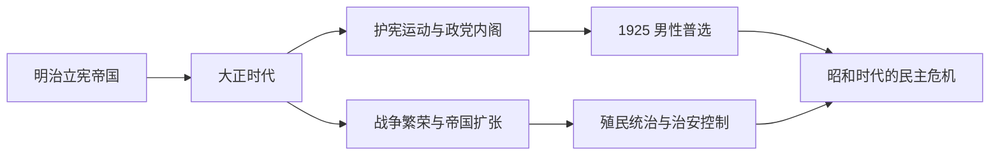

# 大正时代

## 时间

1912-1926年。

## 概括

大正时代处于明治国家建构完成以后、昭和战前危机全面化以前。政党、议会、报刊、工会和社会运动扩大，被概括为“大正民主”；同时天皇主权、元老荐相、军部统帅权和殖民统治仍然存在。第一次世界大战带来出口繁荣和国际地位上升，也造成通货膨胀、贫富差距与战后萧条，为后续政治激化留下条件。

## 建立背景

1912年明治天皇去世，大正天皇即位。制度上没有革命：明治宪法、帝国议会、殖民地和军队继续运作。但城市人口、教育和大众传媒增长，政党要求“宪政常道”，社会组织也把选举权、劳动、妇女解放和殖民地权利带入公共议题。

## 分阶段发展

### 护宪运动与政党影响扩大（1912—1914）

陆军拒绝推荐陆相，使第二次西园寺内阁倒台；桂太郎试图以宫廷和元老网络重返权力，引发第一次护宪运动。群众集会、议会党派和报刊共同迫使桂内阁在1913年辞职，显示不经众议院多数支持的内阁越来越难长期统治。

### 第一次世界大战与帝国扩张（1914—1918）

日本以英日同盟为由向德国宣战，占领山东德属据点和德属南洋群岛。1915年向袁世凯政府提出“二十一条”，扩大在华权益。欧洲列强忙于战争，日本工业与航运出口急升，但物价尤其米价上涨；1918年全国米骚动使寺内内阁倒台，原敬组成首个由平民出身政党领袖主持的“本格政党内阁”。

### 大正民主的高峰与限制（1918—1925）

- 原敬依靠立宪政友会和地方利益网络扩大铁路、教育与选举基础，但拒绝立即实行普选，1921年遇刺。
- 工会、农民组合、社会主义、妇女运动和朝鲜、台湾的民族运动更加活跃；政府同时以警察、殖民行政和治安法规压制。
- 华盛顿会议形成海军军备限制和东亚多边协定，日本归还山东部分权益，但保留南洋委任统治地与既有殖民帝国。
- 1925年普通选举法给予25岁以上男性选举权；同年治安维持法打击以改变国体或私有制为目标的运动，民主扩展与政治控制同步加强。

### 震灾、金融脆弱与昭和转折（1923—1926）

1923年关东大地震摧毁东京、横滨，大量人员死亡；混乱中发生针对朝鲜人、中国人和左翼人士的谣言、私刑与杀害。重建扩大财政和银行风险。战后萧条、企业债务和震灾票据使金融体系日益脆弱，1927年昭和金融恐慌的根源已在大正末年形成。

## 统治结构

| 层级 | 角色 | 实际作用 |
| --- | --- | --- |
| 君主 | 大正天皇 | 宪法上的主权者；后期因健康原因减少政务，皇太子裕仁自1921年摄政。 |
| 宫廷与非正式权力 | 元老、枢密院 | 元老继续荐举首相，枢密院可阻挠条约、财政和紧急政策。 |
| 政府首脑 | 内阁总理大臣 | 政党领袖组阁增多，但军人、官僚和贵族院出身首相仍可执政。 |
| 议会与政党 | 众议院、贵族院、政友会、宪政会等 | 众议院以预算和不信任压力影响内阁；贵族院仍非民选。 |
| 军部 | 陆军、海军 | 统帅权和军部大臣制度保持独立性，未受内阁完整控制。 |
| 殖民统治 | 朝鲜总督府、台湾总督府、关东厅、南洋厅 | 殖民地居民缺乏与本土同等政治权利，统治方式在同化、警察控制和有限改革间调整。 |

正式内阁连续表见[日本内阁总理大臣表](/%E4%BA%BA%E6%96%87%E7%A7%91%E5%AD%A6/%E5%8E%86%E5%8F%B2/%E4%B8%9C%E4%BA%9A/%E6%97%A5%E6%9C%AC/%E5%86%85%E9%98%81%E6%80%BB%E7%90%86%E5%A4%A7%E8%87%A3%E8%A1%A8.md)；大正天皇及摄政关系见[天皇世系表](/%E4%BA%BA%E6%96%87%E7%A7%91%E5%AD%A6/%E5%8E%86%E5%8F%B2/%E4%B8%9C%E4%BA%9A/%E6%97%A5%E6%9C%AC/%E5%A4%A9%E7%9A%87%E4%B8%96%E7%B3%BB%E8%A1%A8.md)。

## 重要事件

| 时间 | 事件 | 过程与影响 |
| --- | --- | --- |
| 1912—1913 | 大正政变、第一次护宪运动 | 反对藩阀政治，桂太郎内阁倒台。 |
| 1914—1918 | 参加第一次世界大战 | 占领山东德属权益和南洋群岛，出口繁荣并扩大国际地位。 |
| 1915 | “二十一条” | 以战争压力扩大在华利益，激化中国反日舆论。 |
| 1918 | 米骚动 | 高米价引发全国抗议，寺内内阁辞职，原敬组阁。 |
| 1919 | 巴黎和会 | 日本取得原德属南洋岛屿委任统治权；种族平等提案未获通过。 |
| 1919 | 朝鲜三一运动 | 殖民当局镇压大规模独立运动，随后调整为较柔性的“文化政治”。 |
| 1921 | 原敬遇刺 | 政党内阁领袖被刺杀，显示政治暴力持续存在。 |
| 1921—1922 | 华盛顿会议 | 接受主力舰比例限制，融入战间期国际协调体系。 |
| 1923 | 关东大地震 | 首都圈严重毁坏，震后屠杀与戒严成为国家和社会暴力的重要节点。 |
| 1924 | 第二次护宪运动 | 反对清浦贵族院内阁，护宪三派赢得选举并组阁。 |
| 1925 | 普通选举法 | 成年男性普选实现，女性仍无投票权。 |
| 1925 | 治安维持法 | 扩大思想和组织镇压，限制普选带来的政治开放。 |
| 1926 | 大正天皇去世 | 裕仁即位，改元昭和。 |

## 政党政治扩大的条件与失稳因素

### 扩大条件

- 工业化、城市化、教育与报刊发展形成更广泛公共舆论。
- 众议院对预算的权力迫使官僚和元老寻求政党支持，政党则以地方组织交换公共建设和选票。
- 第一次世界大战繁荣扩大城市中产、工人和企业群体，使政治参与议题超出旧士绅范围。

### 失稳因素

- 宪法并未确立首相必须由众议院多数产生；元老、贵族院、枢密院和军部仍可绕过或否决政党。
- 普选与治安维持法同年出台，说明国家接受选举扩大但不接受挑战天皇制与殖民帝国。
- 战后萧条、米价、农村贫困和金融坏账削弱民众对既有政党的信任；选举腐败和政商关系也损害合法性。
- 中国民族主义、殖民地反抗、苏联革命和列强海军竞争，使外交与安全议题更容易被强硬势力利用。

时代终结的直接原因是大正天皇于1926年去世。年号更替本身没有立即终结政党政治，却把尚未解决的金融脆弱、军部独立、殖民冲突和政治暴力带入[昭和时代](/%E4%BA%BA%E6%96%87%E7%A7%91%E5%AD%A6/%E5%8E%86%E5%8F%B2/%E4%B8%9C%E4%BA%9A/%E6%97%A5%E6%9C%AC/%E6%98%AD%E5%92%8C%E6%97%B6%E4%BB%A3.md)。

## 演变关系

- 前一节点：[明治时代](/%E4%BA%BA%E6%96%87%E7%A7%91%E5%AD%A6/%E5%8E%86%E5%8F%B2/%E4%B8%9C%E4%BA%9A/%E6%97%A5%E6%9C%AC/%E6%98%8E%E6%B2%BB%E6%97%B6%E4%BB%A3.md)。
- 后一节点：[昭和时代](/%E4%BA%BA%E6%96%87%E7%A7%91%E5%AD%A6/%E5%8E%86%E5%8F%B2/%E4%B8%9C%E4%BA%9A/%E6%97%A5%E6%9C%AC/%E6%98%AD%E5%92%8C%E6%97%B6%E4%BB%A3.md)。
