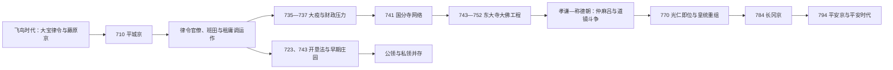

# 奈良时代

## 时间

710—794年。

710年元明天皇迁都平城京，784年桓武天皇迁都长冈京，794年再迁平安京。因而“奈良时代”作为历史分期包含784—794年的长冈京十年；平城京实际作为常设首都的主要时段是710—784年，中间又有740—745年的数次临时迁都。

## 概括

奈良时代是飞鸟时期国家建设进入日常运转的阶段。以《大宝律令》和《养老律令》为法制框架，朝廷从平城京通过大政官、神祇官、国司、郡司和户籍赋役管理列岛，并借遣唐使、国家史书、都城礼仪和佛教网络塑造“日本国”的秩序。这个体制从未像法典条文那样完全整齐：中央高官主要来自皇族和少数贵族，地方征税依赖世袭郡司，班田和租庸调又受到人口流动、疫病、土地开垦与运输成本侵蚀。圣武朝以国分寺和东大寺大佛回应灾害和政治危机，国家佛教达到高峰；孝谦—称德朝的藤原仲麻吕、道镜斗争则显示宫廷、外戚与僧侣权力交织。桓武迁都不是律令国家突然崩溃，而是王权在财政、寺院、继承和边疆压力下重组政治中心。

## 建立背景

- 701年《大宝律令》已经确立中央二官八省、地方国郡与户籍赋役的基本框架，藤原京则提供常设都城经验。
- 藤原京宫城位于城市中央，扩张和仪式空间受限；平城京规模更大，北置宫城，以朱雀大路分左右京，参考唐代都城规划但按奈良盆地地形调整。
- 迁都工程自708年前后展开，710年朝廷迁入。此后宫殿、官署、官仓、寺院、东西市和贵族住宅共同构成政治经济中心。
- 平城京并非“完全固定不动”：圣武天皇在740—745年间先后经营恭仁、难波、紫香乐等都城，745年才回到平城京。

## 分阶段发展

| 阶段 | 时间 | 主要权力主体 | 历史过程 |
| --- | --- | --- | --- |
| 平城京与律令巩固 | 710—729年 | 元明、元正天皇；藤原不比等；长屋王 | 都城官署投入运作，《古事记》《日本书纪》编成；718年完成《养老律令》。藤原不比等死后，皇亲长屋王进入中枢，皇族与藤原氏争夺继承和高级官职。 |
| 圣武朝危机与国家佛教 | 729—749年 | 圣武天皇、光明皇后、藤原四兄弟、橘诸兄 | 长屋王之变后藤原氏上升；735—737年天花大疫重创人口和官僚，藤原四兄弟相继死亡。藤原广嗣之乱、频繁迁都、国分寺网络和大佛工程并行。 |
| 孝谦—称德朝权力斗争 | 749—770年 | 孝谦／称德天皇、藤原仲麻吕、光明皇太后、道镜 | 藤原仲麻吕依托光明皇太后和淳仁天皇掌权，764年兵败被杀；孝谦重祚为称德，道镜获法王等高位。皇位继承、僧侣政治与藤原诸家重新结盟。 |
| 光仁—桓武重组 | 770—794年 | 光仁天皇、桓武天皇、藤原百川、藤原种继 | 皇统由天武系转向天智系后裔；朝廷整顿财政并强化东北经营。784年迁长冈京，785年藤原种继遇刺引发继承危机，794年再迁平安京。 |

## 统治结构与实际权力主体

| 层级 | 机构或群体 | 职能与现实运作 |
| --- | --- | --- |
| 君主 | 天皇、太上天皇、皇太后 | 天皇主持任官、祭祀、法令和外交；退位天皇、皇后及其家政机关也可能形成独立权力中心。女帝孝谦重祚为称德，说明皇位政治不能只按父子世系理解。 |
| 中央官制 | 神祇官、大政官与八省 | 神祇官管理国家祭祀，大政官统辖行政；左、右大臣与大纳言等组成议政中枢，具体政务依赖大量书吏、文书和官署。 |
| 宫廷贵族 | 皇亲、藤原氏、橘氏等 | 高位并非通过开放科举取得，出身、婚姻、家学和天皇信任决定升迁。藤原南家、北家、式家、京家在四兄弟之后分化竞争。 |
| 地方行政 | 国司、郡司、里长及大宰府、镇守府 | 中央任命国司，旧地方豪族多世袭郡司，负责造籍、征税和徭役；大宰府处理九州外交防卫，镇守府等机构推进东北军事。 |
| 宗教机构 | 东大寺、国分寺、奈良诸大寺与僧纲 | 寺院承担镇护国家、教育、抄经、救济和技术组织，也拥有土地、劳力和宫廷关系；僧侣受度牒、戒坛和僧纲管理，但实际政治影响不一。 |
| 基层编户 | 公民、杂户、品部与奴婢等 | 法典按户籍、身份、年龄和性别规定班田、赋役与职能；逃亡、浮浪、冒籍和地方差异使制度不断调整。 |

历代天皇、女帝重祚及在位时间见[天皇世系表](/%E4%BA%BA%E6%96%87%E7%A7%91%E5%AD%A6/%E5%8E%86%E5%8F%B2/%E4%B8%9C%E4%BA%9A/%E6%97%A5%E6%9C%AC/%E5%A4%A9%E7%9A%87%E4%B8%96%E7%B3%BB%E8%A1%A8.md)，本页只列实际权力变化。

## 重要事件

1. **迁都平城京（710）**：元明天皇把宫廷与官署迁入新都，固定首都使年度朝会、文书行政、仓储与贡纳集中成为可能。
2. **《古事记》（712）与《日本书纪》（720）编成**：朝廷整理神话、皇统和对外关系，以文字构造统一政治记忆；越早部分的年代与史实性越需同考古和外国史料核对。
3. **《养老律令》编成（718）**：在大宝律令基础上修订法典，757年正式施行；实际行政仍不断以格、式和临时诏令补充。
4. **三世一身法（723）**：为鼓励开垦，按水利建设方式允许新田由数代占有，说明班田体系已面临耕地和税源压力。
5. **长屋王之变（729）**：长屋王被控谋反后自尽，光明子成为皇后，藤原氏通过外戚关系进入新的权力阶段；罪名与事件策划细节仍有争论。
6. **天花大疫（735—737）**：疫情造成大规模死亡，藤原四兄弟全部病亡，劳动力、税收和地方行政受重创，橘诸兄等进入中枢。
7. **藤原广嗣之乱（740）与迁都循环**：广嗣在九州起兵失败，圣武天皇随即离开平城京，先后经营恭仁、难波、紫香乐；这既反映安全焦虑，也与新都、大佛和派系政治相关。
8. **国分寺、国分尼寺诏（741）**：在各国建立官寺网络，以佛教仪礼祈求国家安宁，同时把地方资源、僧尼和中央寺院连接起来。
9. **垦田永年私财法（743）**：新垦田可永久私有，刺激贵族、寺院和地方有力者组织开垦，成为初期庄园发展的制度条件；它并未立即废除班田或公田。
10. **东大寺大佛工程与开眼会（743—752）**：圣武天皇743年下诏造大佛，745年回平城京后推进铸造，752年举行开眼仪式；工程动员铜、木材、粮食、工匠和广泛捐献，既强化国家象征，也加重财政与劳役。
11. **鉴真抵日（753—754）**：鉴真第六次渡海，于753年踏上日本国土，754年到达奈良并在东大寺设戒坛授戒；因此“753年东渡成功”和“754年抵达奈良”并不矛盾。
12. **《养老律令》施行与橘奈良麻吕之变（757）**：法典正式施行之年又发生宫廷谋反案，藤原仲麻吕借机清除政敌。
13. **藤原仲麻吕之乱（764）**：仲麻吕与淳仁天皇一方失败，孝谦上皇重掌政权并再即位为称德天皇，道镜影响迅速扩大。
14. **宇佐八幡神谕事件（769）**：围绕道镜能否继承皇位的神谕和使者往返，显示宗教权威被卷入皇位政治；道镜最终未即位，事件细节主要来自朝廷史书。
15. **称德去世与光仁即位（770）**：天武系直系继承告终，天智系后裔白壁王即位为光仁天皇，藤原氏参与新的继承安排。
16. **东北战争扩大（780起）**：陆奥伊治呰麻吕反乱并攻陷多贺城，显示朝廷对东北的统治并未完成；桓武朝随后长期投入征夷战争。
17. **迁都长冈京（784）与种继遇刺（785）**：新都利用水运并远离奈良寺院网络，但工程、洪水、疫病、政治疑狱和早良亲王事件共同削弱其稳定性。
18. **迁都平安京（794）**：桓武在山城盆地建立新的政治中心，奈良时代结束，律令官制和奈良寺院体系则继续存在。

## 律令财政与土地制度

### 班田、户籍与赋役

律令原则上定期编造户籍，向一定年龄以上公民授予口分田，死后收回；国家以田租、庸、调、杂徭和兵役取得粮食、地方产品与劳力。租多在地方征收，庸调则需远距离运往中央，运输途中口粮和时间常比税额本身更沉重。人口死亡、逃亡、浮浪和户籍隐匿使班田周期难以维持，各地执行差异很大。

### 开垦与早期庄园

723年和743年的土地法把私人开垦纳入国家扩田目标。贵族、寺院和地方有力者提供种子、工具与水利，农民实际耕种，由此形成拥有多层权利的初期庄园。公领与私领长期并存，不能把743年视为“封建土地制”一夜取代律令制；真正广泛的庄园公领制还要到平安中后期形成。

### 都城经济

平城京依靠各国贡纳维持皇室、贵族、寺院和官人消费，东西市承担受管制的交换。木简、仓库遗址和贡纳标签显示官僚经济高度依赖实物核算。铜钱发行扩大了货币使用，但稻米、布帛和劳役仍是主要价值与支付手段。

## 宗教、文化与对外交流

- **国家佛教**：奈良六宗以经论研究和僧侣培养为主，东大寺兼具全国国分寺体系中心、仪礼场所和学问寺院功能。寺院权力强大但彼此并非统一政治集团。
- **戒律与僧团管理**：鉴真建立规范授戒传统，强化国家认可僧侣资格；759年唐招提寺建立，成为律宗重镇。
- **天平文化**：东大寺、正仓院、药师寺、唐招提寺等保存造像、建筑、文书和工艺。正仓院物品体现唐朝、朝鲜半岛、中亚、西亚风格进入日本的交流网络，但并非每件“异域风格”物品都能确定直接产地。
- **文学与国家记忆**：《万叶集》汇集不同阶层和地区诗歌，编纂经历长期累积；《古事记》《日本书纪》、各国《风土记》和汉诗集则服务于历史、地理与礼仪知识整理。
- **遣唐使**：使团带回佛典、法令、音乐、医学、历法和器物，留学生与僧人常在唐多年；航线危险，对外交流也通过新罗、渤海使节和民间航海延续。
- **神祇与佛教并行**：春日大社等氏族祭祀与国家祭祀持续发展，佛教护国仪礼并未消除神祇信仰，神佛关系逐渐走向相互解释和结合。

## 鼎盛条件、结构压力与时代转折

### 鼎盛条件

- 飞鸟时代完成的律令、户籍和国郡体系，为中央调集人力、铜、木材、粮食与地方产品提供制度基础。
- 固定都城把宫廷、贵族、寺院、市场和外交集中，形成高密度的知识与工艺网络。
- 遣唐使和东亚交通提供成熟的法制、佛教、建筑与书写资源，日本宫廷可选择性改造。
- 圣武天皇、光明皇后及寺院通过大佛、救济和抄经把灾害治理与王权合法性连接。

### 结构压力

- 大疫和饥荒减少人口，班田、征兵与长途贡纳仍要求稳定编户，制度目标与基层承受力发生矛盾。
- 私人开垦虽增加耕地，也让税源、劳力和土地权利越来越受贵族、寺院及地方有力者控制。
- 皇位继承缺少稳定的单一规则，皇亲、女帝、外戚、太上天皇和僧侣家政机关反复结盟。
- 大佛、都城和边疆战争同时展开，财政与劳役竞争加剧。
- 奈良大寺的政治影响确实令朝廷警惕，但“为摆脱僧侣而迁都”只是原因之一。

### 直接转折

770年后的光仁、桓武政权需要巩固新的皇统、整顿财政并继续东北战争。长冈京提供桂川—淀川水运条件，也可重新配置贵族和寺院关系；但种继遇刺、早良亲王冤案传统、工程与环境问题使新都仅维持十年。794年迁都平安京后，奈良失去中央官署，却继续作为大寺院和文化中心。时代变化因此是政治中心迁移与制度调整，不是奈良文明突然灭亡。

## 演变关系

- 前一节点：[飞鸟时代](/%E4%BA%BA%E6%96%87%E7%A7%91%E5%AD%A6/%E5%8E%86%E5%8F%B2/%E4%B8%9C%E4%BA%9A/%E6%97%A5%E6%9C%AC/%E9%A3%9E%E9%B8%9F%E6%97%B6%E4%BB%A3.md)
- 后一节点：[平安时代](/%E4%BA%BA%E6%96%87%E7%A7%91%E5%AD%A6/%E5%8E%86%E5%8F%B2/%E4%B8%9C%E4%BA%9A/%E6%97%A5%E6%9C%AC/%E5%B9%B3%E5%AE%89%E6%97%B6%E4%BB%A3.md)
- 完整皇统：[天皇世系表](/%E4%BA%BA%E6%96%87%E7%A7%91%E5%AD%A6/%E5%8E%86%E5%8F%B2/%E4%B8%9C%E4%BA%9A/%E6%97%A5%E6%9C%AC/%E5%A4%A9%E7%9A%87%E4%B8%96%E7%B3%BB%E8%A1%A8.md)
- 上级：[日本历史](/%E4%BA%BA%E6%96%87%E7%A7%91%E5%AD%A6/%E5%8E%86%E5%8F%B2/%E4%B8%9C%E4%BA%9A/%E6%97%A5%E6%9C%AC/README.md)

## 相关中国朝代与东亚史

奈良时代的律令、都城、佛教、汉文学和遣唐使网络均与[唐](/%E4%BA%BA%E6%96%87%E7%A7%91%E5%AD%A6/%E5%8E%86%E5%8F%B2/%E4%B8%9C%E4%BA%9A/%E4%B8%AD%E5%9B%BD/%E5%94%90/README.md)密切相关；这些制度在日本并非原样复制，而是在皇族政治、氏族结构、地方豪族和本地祭祀条件下重新组合。
