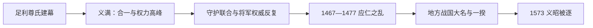

# 室町时代

## 时间

1336-1573年。

## 概括

室町时代以足利氏建立的室町幕府为中心，是公家文化与武士文化融合的中世阶段。它既承接镰仓武家政权，又包含前期的南北朝对立和后期的战国化；幕府将军权威在足利义满时期达到高峰，之后逐渐被管领、守护大名和战国大名分散。

## 说明

- 对应中国元末和明朝。
- 前期与[南北朝时期](/%E4%BA%BA%E6%96%87%E7%A7%91%E5%AD%A6/%E5%8E%86%E5%8F%B2/%E4%B8%9C%E4%BA%9A/%E6%97%A5%E6%9C%AC/%E5%8D%97%E5%8C%97%E6%9C%9D%E6%97%B6%E6%9C%9F.md)重叠。
- 日本受明朝文化影响较深，日明贸易和禅宗文化影响显著。
- 公家文化与武士文化融合，茶汤、插花等传统文化发展。
- 能乐、狂言、御伽草子等文艺形式走向大众化。
- 足利义满营建金阁寺，对应北山文化。
- 足利义政营建银阁寺，对应东山文化。
- 一休和雪舟水墨画是相关文化人物与艺术代表。
- 应仁之乱后幕府权威严重衰落，逐渐进入战国时代。

## 天皇世系

本时代天皇详见[天皇世系表](/%E4%BA%BA%E6%96%87%E7%A7%91%E5%AD%A6/%E5%8E%86%E5%8F%B2/%E4%B8%9C%E4%BA%9A/%E6%97%A5%E6%9C%AC/%E5%A4%A9%E7%9A%87%E4%B8%96%E7%B3%BB%E8%A1%A8.md)。南北朝时期的南朝、北朝天皇另见[南北朝时期](/%E4%BA%BA%E6%96%87%E7%A7%91%E5%AD%A6/%E5%8E%86%E5%8F%B2/%E4%B8%9C%E4%BA%9A/%E6%97%A5%E6%9C%AC/%E5%8D%97%E5%8C%97%E6%9C%9D%E6%97%B6%E6%9C%9F.md)。

## 足利将军世系

| 顺序 | 将军 | 在职时间 | 说明 |
| ---: | --- | --- | --- |
| 1 | **足利尊氏** | 1338-1358 | 室町幕府初代将军，支持北朝。 |
| 2 | 足利义诠 | 1358-1367 | 南北朝对立持续。 |
| 3 | **足利义满** | 1368-1394 | 幕府权威高峰，推动南北朝合一。 |
| 4 | 足利义持 | 1394-1423 | 室町前期将军。 |
| 5 | 足利义量 | 1423-1425 | 在职时间较短。 |
| 6 | **足利义教** | 1429-1441 | 将军权威一度强化，后被赤松氏刺杀。 |
| 7 | 足利义胜 | 1442-1443 | 在职时间很短。 |
| 8 | **足利义政** | 1449-1473 | 应仁之乱时期将军，东山文化代表人物。 |
| 9 | 足利义尚 | 1473-1489 | 室町后期将军。 |
| 10 | 足利义稙 | 1490-1493、1508-1521 | 两度任将军。 |
| 11 | 足利义澄 | 1494-1508 | 室町后期将军。 |
| 12 | 足利义晴 | 1521-1546 | 战国化加深时期将军。 |
| 13 | 足利义辉 | 1546-1565 | 被三好氏、松永久秀势力攻击而死。 |
| 14 | 足利义荣 | 1568 | 在职时间很短。 |
| 15 | **足利义昭** | 1568-1573 | 末代将军，被织田信长放逐。 |

## 实际掌权者说明

室町幕府没有像镰仓幕府北条执权那样连续、固定、可完整编号的“实际掌权者世系”。实际权力随阶段变化：前期主要在足利将军及其近臣，义满时期将军权威最强；中后期由管领家、守护大名和有力地方大名分担或争夺；应仁之乱后，许多地区进入战国大名实际统治。

| 类型 | 角色 | 时间 | 说明 |
| --- | --- | --- | --- |
| 武家首脑 / 实际最高领导人 | 足利将军 | 室町前中期 | 尤其足利尊氏、义满、义教时期权力较强。 |
| 幕府重臣 | 管领、侍所所司等 | 室町时代 | 细川、斯波、畠山等家族长期影响幕政。 |
| 地方实力者 | 守护大名、战国大名 | 室町后期 | 幕府衰落后地方权力增强。 |

## 统治结构

| 类型 | 角色 | 时间 | 说明 |
| --- | --- | --- | --- |
| 君主 | 天皇 | 室町时代 | 保留朝廷礼仪和正统性。 |
| 武家首脑 | 足利将军 | 1338-1573 | 室町幕府的政治核心。 |
| 地方实力者 | 守护大名、战国大名 | 室町后期 | 幕府衰落后地方权力增强。 |

## 建立与分阶段发展

### 幕府建立与南北朝战争（1336—1392）

足利尊氏借北朝任命建立武家政权，依据《建武式目》恢复裁判和御家人秩序。幕府需要守护大名提供军队，因而允许其取得更多庄园年贡和地方警察权；这使中央能战胜南朝，也埋下守护坐大。观应扰乱显示足利家内部与执事集团矛盾可迅速变成全国战争。1392年足利义满促成两朝合一。

### 足利义满的权力高峰（1368—1408）

义满压制山名、大内等强大守护，建立花之御所，兼任太政大臣并控制朝廷人事。1401年重启对明外交，日明勘合贸易以“日本国王”名义进行，为幕府和有力寺院、商人带来收益。北山文化把禅宗、武家与公家审美结合。义满死后，继承者难以维持同等个人权威。

### 将军权威反复与守护联合（1408—1467）

第四代义持停止一段时期的对明正式贸易。第六代义教通过抽签成为将军后强化裁断、干预守护继承，却于1441年嘉吉之乱中被赤松满祐刺杀。幕府讨平赤松，却再未稳定压服各守护家。关东镰仓府与京都幕府持续冲突，1438年永享之乱、1454年享德之乱使东国先于京都进入长期战争。

### 应仁之乱与战国化（1467—1493）

将军足利义政继承问题同畠山、斯波家内争以及细川、山名竞争交织，1467年爆发应仁之乱。京都被毁，战斗向地方扩散；1477年主要军队撤离并未恢复旧秩序。守护代、国人和村落在领国中取得自主权。1485年山城国一揆驱逐交战大名，1488年加贺一向一揆推翻守护，显示非大名组织也能掌握区域政治。

### 名义幕府与地方大名（1493—1573）

1493年明应之变后，将军可被管领重臣废立，细川氏内部又被三好氏取代。港市、寺社和战国大名分别经营贸易与外交。1543年前后火绳枪传入，1549年基督教传教开始。1565年足利义辉被杀，幕府权威接近崩溃；1568年织田信长拥足利义昭入京，1573年双方决裂，信长放逐义昭，室町幕府终结。

## 重要事件

| 时间 | 事件 | 过程与影响 |
| --- | --- | --- |
| 1336—1338 | 北朝建立、尊氏任将军 | 室町幕府以京都北朝授权形成。 |
| 1349—1352 | 观应扰乱 | 将军、直义与高师直集团内战，南朝趁机反攻。 |
| 1391 | 明德之乱 | 山名氏受削，义满加强对守护控制。 |
| 1392 | 南北朝合一 | 幕府完成皇统统一，京都政治中心恢复。 |
| 1401—1404 | 对明使节与勘合贸易 | 幕府进入东亚册封、贸易体系，控制合法贸易凭证。 |
| 1438 | 永享之乱 | 镰仓公方足利持氏败亡，关东政治长期分裂。 |
| 1441 | 嘉吉之乱 | 足利义教被刺，强力将军政治受挫。 |
| 1467—1477 | 应仁之乱 | 守护家内争演变为京都大战，幕府协调力崩溃。 |
| 1485 | 山城国一揆 | 国人共同体暂时自治，驱逐交战大名。 |
| 1488 | 加贺一向一揆 | 本愿寺门徒与国人推翻富樫氏，形成长期地方统治。 |
| 1493 | 明应之变 | 细川政元废黜将军，常被视为战国政治起点。 |
| 1543、1549 | 火绳枪与基督教传入 | 海贸、武器和宗教进入大名竞争。 |
| 1565 | 永禄之变 | 足利义辉被杀，将军安全和权威彻底受制于畿内军阀。 |
| 1568 | 织田信长入京 | 足利义昭复位，但实际依赖信长军力。 |
| 1573 | 义昭被放逐 | 足利幕府结束，统一战争转入织田主导。 |

## 权力基础与衰落原因

### 权力基础

- 幕府位于京都，可同时利用天皇任命、公家文化、寺社金融与畿内市场，这是镰仓幕府不具备的中央位置优势。
- 守护获赋予半济、征发和司法权限，以地方资源支持幕府战争；义满再以分化、讨伐和朝廷职位压制过强守护。
- 日明贸易和京都税源提供财政，禅宗寺院、港市商人和守护大名共同参与跨海网络。

### 衰落机制

- **结构因素：** 幕府依赖守护军力，却没有足以持续压制守护的直属财政和军队；继承争端容易被重臣家内斗绑架。
- **区域分化：** 关东有镰仓府、古河公方和关东管领等独立权力中心，中央命令难以统一东国。
- **社会变化：** 商品经济、村落联合、寺社武装和守护代崛起，使政治主体超过旧有将军—守护框架。
- **直接打击：** 嘉吉之乱杀死强势将军，应仁之乱摧毁京都协调网络，明应之变把废立将军常态化。
- **最终终结：** 织田信长最初借将军合法性进入京都，随后在军费、命令和联盟问题上与义昭冲突；1573年放逐义昭，使已空心化的幕府失去最后中央机关。

## 演变关系

- 前一节点：[南北朝时期](/%E4%BA%BA%E6%96%87%E7%A7%91%E5%AD%A6/%E5%8E%86%E5%8F%B2/%E4%B8%9C%E4%BA%9A/%E6%97%A5%E6%9C%AC/%E5%8D%97%E5%8C%97%E6%9C%9D%E6%97%B6%E6%9C%9F.md)。
- 并行关系：[南北朝时期](/%E4%BA%BA%E6%96%87%E7%A7%91%E5%AD%A6/%E5%8E%86%E5%8F%B2/%E4%B8%9C%E4%BA%9A/%E6%97%A5%E6%9C%AC/%E5%8D%97%E5%8C%97%E6%9C%9D%E6%97%B6%E6%9C%9F.md)属于室町时代早期的重要分裂阶段。
- 后一节点：[战国时代](/%E4%BA%BA%E6%96%87%E7%A7%91%E5%AD%A6/%E5%8E%86%E5%8F%B2/%E4%B8%9C%E4%BA%9A/%E6%97%A5%E6%9C%AC/%E6%88%98%E5%9B%BD%E6%97%B6%E4%BB%A3.md)。
- 结束节点：[安土桃山时代](/%E4%BA%BA%E6%96%87%E7%A7%91%E5%AD%A6/%E5%8E%86%E5%8F%B2/%E4%B8%9C%E4%BA%9A/%E6%97%A5%E6%9C%AC/%E5%AE%89%E5%9C%9F%E6%A1%83%E5%B1%B1%E6%97%B6%E4%BB%A3.md)。

## 相关中国朝代与东亚史

- 室町时期日明贸易、勘合贸易和倭寇问题对应[明](/%E4%BA%BA%E6%96%87%E7%A7%91%E5%AD%A6/%E5%8E%86%E5%8F%B2/%E4%B8%9C%E4%BA%9A/%E4%B8%AD%E5%9B%BD/%E6%98%8E/README.md)。
