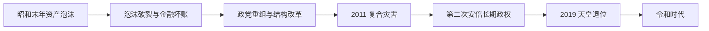

# 平成时代

## 时间

1989-2019年。

## 概括

平成时代是日本由泡沫经济顶峰进入低增长、通货紧缩和人口老龄化的阶段，也是五五年体制松动、联盟政治常态化、行政权向首相官邸集中的时期。日本仍是主要经济与科技强国，但金融坏账、公共债务、就业二元化、地方衰退和灾害风险长期交织。

## 分阶段发展

### 泡沫破裂与“失去的十年”（1989—2001）

1989—1990年货币收紧后，股票与土地价格相继下跌。以土地作抵押的贷款恶化，银行延迟确认坏账，企业削减投资和负债；经济停滞与物价下跌相互强化。1993年自民党因政治改革分裂而失去政权，非自民联合内阁短暂执政；1994年改行小选举区比例代表并立制，政党重组和联合组阁成为常态。1995年阪神淡路大地震与奥姆真理教毒气袭击暴露危机管理和社会安全问题，1997—1998年金融危机又迫使政府注资与重组银行。

### 结构改革与自民党再整合（2001—2009）

小泉纯一郎以“没有改革就没有增长”为口号，强化首相官邸、处置不良贷款并推动邮政民营化。改革提高部分企业效率，却也扩大非正式就业和地区差异的政治争论。日本派遣自卫队参与伊拉克重建支援，对安全政策边界的解释继续变化。小泉退任后首相频繁更替，2008年全球金融危机重创出口，2009年民主党赢得众议院选举，实现较完整政权轮替。

### 民主党执政、复合灾害与政策困境（2009—2012）

民主党试图削弱官僚主导、增加家庭补贴并重设美军基地政策，但联盟协调、财政约束和行政经验不足削弱执行。2011年东日本大震灾、海啸和福岛第一核电站事故造成大规模伤亡、撤离和长期能源政策争议。灾后重建、核事故处理与党内分裂加速政权失去支持。

### 安倍长期执政与平成收束（2012—2019）

安倍晋三第二次执政后，以宽松货币、财政刺激和结构政策组成“安倍经济学”，结束持续通缩的目标只部分实现，但就业和企业利润改善。内阁通过国家安全保障会议、特定秘密保护法与2015年安全保障相关法，扩大自卫队在集体自卫和同盟协作中的空间，引发宪法与民主程序争论。访日旅游、女性就业和数字经济增长的同时，工资停滞、少子老龄化和地方人口流失未根本逆转。2019年明仁天皇生前退位，避免了因天皇去世才改元的传统交接。

## 统治结构

| 层级 | 角色 | 运作特点 |
| --- | --- | --- |
| 国家象征 | 明仁天皇 | 依战后宪法履行国事行为，无政府统治权；2019年依据特别法退位。 |
| 政府首脑 | 内阁总理大臣 | 由国会指名；行政改革后，内阁官房、内阁府和首相官邸的政策协调能力增强。 |
| 立法与政党 | 众参两院、自民党及联盟伙伴、在野党 | 两院多数不一致时形成“扭曲国会”；小选举区制度鼓励大党竞争，但联盟仍常必要。 |
| 行政与司法 | 中央省厅、地方政府、法院 | 官僚仍掌握专业能力，地方承担人口、灾害与福利压力；司法维持违宪审查但通常较克制。 |

天皇连续表见[天皇世系表](/%E4%BA%BA%E6%96%87%E7%A7%91%E5%AD%A6/%E5%8E%86%E5%8F%B2/%E4%B8%9C%E4%BA%9A/%E6%97%A5%E6%9C%AC/%E5%A4%A9%E7%9A%87%E4%B8%96%E7%B3%BB%E8%A1%A8.md)；从竹下、宇野到跨入令和的第四次安倍内阁，见[日本内阁总理大臣表](/%E4%BA%BA%E6%96%87%E7%A7%91%E5%AD%A6/%E5%8E%86%E5%8F%B2/%E4%B8%9C%E4%BA%9A/%E6%97%A5%E6%9C%AC/%E5%86%85%E9%98%81%E6%80%BB%E7%90%86%E5%A4%A7%E8%87%A3%E8%A1%A8.md)。

## 重要事件

| 时间 | 事件 | 过程与影响 |
| --- | --- | --- |
| 1989 | 消费税开征、昭和改元平成 | 财政改革与政治丑闻交织，竹下内阁辞职。 |
| 1990—1992 | 资产泡沫破裂 | 土地和股价下跌，银行坏账与企业去杠杆长期化。 |
| 1993 | 自民党首次失去长期执政 | 非自民联合内阁成立，五五年体制出现制度性断裂。 |
| 1994 | 选举制度改革 | 众议院改为小选举区比例代表并立制，党派竞争重组。 |
| 1995 | 阪神淡路大地震、东京地铁沙林事件 | 同年两场危机推动灾害响应、非营利组织和治安制度反思。 |
| 1997—1998 | 亚洲金融危机与国内银行危机 | 大型金融机构倒闭，政府注资、银行合并和监管改革。 |
| 2001—2005 | 小泉结构改革与邮政民营化 | 首相主导增强，自民党派阀与利益分配方式被重塑。 |
| 2008 | 全球金融危机 | 出口和制造业急跌，就业不稳定加深。 |
| 2009 | 民主党政权 | 选民推动政权轮替，自民党一度下野。 |
| 2011 | 东日本大震灾、海啸与福岛核事故 | 造成长期重建、核安全、能源与疏散治理问题。 |
| 2012 | 自民党重返执政 | 第二次安倍内阁开始，货币与安全政策转向。 |
| 2015 | 安全保障相关法 | 扩大特定条件下集体自卫权运用，社会争议强烈。 |
| 2016 | 天皇发表退位意向相关讲话 | 推动国会制定一次性特别法。 |
| 2019 | 明仁退位 | 皇太子德仁即位，平成结束、令和开始。 |

## 长期停滞的成因与政治调整

### 结构因素

- 资产泡沫时期银行和企业以土地抵押扩张；价格下跌后，坏账确认和破产重组过慢，形成长期“资产负债表衰退”。
- 少子老龄化降低劳动力和国内需求增长，社会保障支出上升；年轻人和女性更多进入非正式就业，工资与家庭形成受到影响。
- 依赖出口的制造业受到日元波动、亚洲产业竞争和全球金融危机冲击；服务业生产率和数字化转型相对缓慢。

### 政策与外部压力

- 财政刺激托底经济但推高公共债务；货币宽松缓解通缩，却难单独解决人口、工资和产业结构问题。
- 频繁首相更替降低政策连续性，直到小泉和第二次安倍政权才形成较强官邸主导。
- 地震、核事故与国际安全环境变化迫使政府同时处理能源、财政和防务议题。

### 并非单一“衰落”

平成期生活基础设施、寿命、科研、文化产业和海外资产仍有优势；“失去的年代”主要描述相对增长放缓、资产价格和制度调整，而非国家整体崩溃。时代结束的直接原因是明仁天皇于2019年退位，政治经济问题则延续到[令和时代](/%E4%BA%BA%E6%96%87%E7%A7%91%E5%AD%A6/%E5%8E%86%E5%8F%B2/%E4%B8%9C%E4%BA%9A/%E6%97%A5%E6%9C%AC/%E4%BB%A4%E5%92%8C%E6%97%B6%E4%BB%A3.md)。

## 演变关系

- 前一节点：[昭和时代](/%E4%BA%BA%E6%96%87%E7%A7%91%E5%AD%A6/%E5%8E%86%E5%8F%B2/%E4%B8%9C%E4%BA%9A/%E6%97%A5%E6%9C%AC/%E6%98%AD%E5%92%8C%E6%97%B6%E4%BB%A3.md)。
- 后一节点：[令和时代](/%E4%BA%BA%E6%96%87%E7%A7%91%E5%AD%A6/%E5%8E%86%E5%8F%B2/%E4%B8%9C%E4%BA%9A/%E6%97%A5%E6%9C%AC/%E4%BB%A4%E5%92%8C%E6%97%B6%E4%BB%A3.md)。
