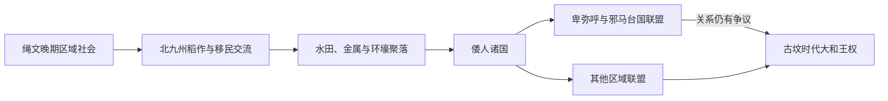

# 弥生时代

## 时间

北九州约前10至前9世纪开始，至3世纪中期；列岛各地转型时间不同

## 概括

弥生时代的关键不是单一器物，而是灌溉水稻、金属技术、新的人口流动和聚落政治在列岛西部形成后逐步扩散。稻作需要修建水田、调配水源、储藏种谷并协调收获，促进村落联盟和首领权力；剩余、土地和贸易竞争也带来环壕聚落、武器伤痕与防御设施。朝鲜半岛来的移民与在地绳文人长期通婚、交换和融合，不宜用“外来人完全取代本地人”解释。中国史书中的倭国、奴国、卑弥呼与邪马台国，为弥生晚期政治提供了同时代文字窗口，但其地理和与后世大和王权的关系仍有争议。

## 形成过程与地区扩散

| 阶段 | 约时间 | 主要变化 |
|---|---|---|
| 初始期 | 前10至前8世纪 | 北九州出现水田、石刀、储藏和朝鲜半岛式陶器、工具 |
| 前期 | 前8至前4世纪 | 稻作社会在北九州稳定，逐步进入中国、四国和近畿部分地区 |
| 中期 | 前4至前1世纪 | 环壕聚落、青铜礼器、铁工具与区域交换扩大，社会分化明显 |
| 后期 | 前1世纪—3世纪 | 大型聚落与“国”联盟形成，中国文献记录倭国使节、战争和卑弥呼 |
| 转向古坟 | 3世纪中期前后 | 近畿出现大型前方后圆坟和更广礼制网络，政治中心重组 |

不同考古编年对最早水田与分期界线有数百年差异，不能用一条全国统一日期覆盖北海道、东北与琉球。

## 经济、技术与社会机制

- **水田农业**：水渠、田埂、木制农具和共同劳动提高粮食可储存性，也使水利和土地分配成为权力资源。
- **多元生计延续**：渔猎、采集、旱作和海产在很多地区仍很重要，稻米并未立即成为所有人的唯一主食。
- **青铜与铁**：铜剑、铜矛、铜铎和镜逐渐礼仪化；铁制斧、刀、镰和武器提高生产与战争能力。原料、成品和技术长期依赖半岛—列岛网络。
- **纺织与储藏**：纺轮、织物痕迹和高床仓反映家庭生产、赋纳和财富积累。
- **聚落分层**：吉野里等大型环壕聚落拥有住宅、仓库、墓地和防御空间；豪华随葬和大型墓葬显示首领形成。
- **战争与联盟**：箭镞、断头、武器伤和防御沟说明冲突存在，但各地暴力程度不同，不能把整个时代写成持续战争。

## 同时代文字记录与政治首领

| 时间 | 记录 | 可确认内容 | 争议 |
|---|---|---|---|
| 前1世纪前后 | 《汉书》称“倭人百余国” | 列岛西部存在多个政治共同体并定期往来 | “百余”未必是精确统计 |
| 57年 | 奴国王向东汉朝贡并获金印 | 九州北部有能开展外交的王权；志贺岛金印与记载相呼应 | 奴国具体范围仍讨论 |
| 107年 | 倭国王帅升等向东汉献人 | 更大联盟或王号出现 | 名称、统治范围不清 |
| 2世纪后期 | 《魏志》追述“倭国大乱” | 多国联盟经历战争与政治重组 | 具体年代和规模依后世记录 |
| 约188—248年 | **卑弥呼** | 女王以祭祀权威统合邪马台国及约三十国；239年获魏“亲魏倭王”称号 | 邪马台国位于九州还是畿内，学界长期争论 |
| 248年后 | 男王短暂继位，壹与／台与被立 | 女王继承再次稳定联盟 | 与大和王权及传统皇统无法可靠对接 |

## 重要事件

1. 北九州板付、菜畑等遗址显示早期水田与绳文—弥生器物共存，说明转型是渐进混合。
2. 金属器和稻作技术经朝鲜半岛进入，随后在列岛内部再传播、改造和本地生产。
3. 中期大型环壕聚落、首领墓与区域性铜器分布圈形成，反映多个政治文化网络。
4. 57年“汉委奴国王”外交把北九州王权接入东亚册封和贸易体系。
5. 2世纪后期联盟战争推动更大范围的权力整合。
6. 239年卑弥呼遣使魏国，以外部册封、铜镜等礼物强化内部地位。
7. 3世纪中期大型前方后圆坟在近畿出现，旧有铜铎祭祀和部分区域中心衰退，进入古坟政治秩序。

## 崛起、分化与转型原因

### 早期政治体崛起

- 稻米可集中储存，控制水利、仓储和祭祀的首领更容易调动劳力。
- 金属、盐、玉、镜等稀缺物资通过长距离交换成为身份和联盟工具。
- 对汉、魏和朝鲜半岛诸国的外交能为某些首领提供超越本地的合法性。

### 结构性分化

- 水源和适耕地分布不均，水田区与沿海、山地社会发展路径不同。
- 人口增长、土地竞争和贸易节点争夺增加冲突；区域礼器圈又强化不同联盟身份。
- 各“国”仍由本地首领掌握，卑弥呼联盟并非统一官僚国家。

### 转入古坟秩序

3世纪中期，近畿核心的首领联盟以尺度空前、形制相近的前方后圆坟展示等级，并把镜、武器、石制品等礼物分配给地方首领。旧弥生政治并未一夜消失，而是在联盟、婚姻和战争中重组为更广的大和王权网络。

## 演变关系

- 前一节点：[绳文时代](/%E4%BA%BA%E6%96%87%E7%A7%91%E5%AD%A6/%E5%8E%86%E5%8F%B2/%E4%B8%9C%E4%BA%9A/%E6%97%A5%E6%9C%AC/%E7%BB%B3%E6%96%87%E6%97%B6%E4%BB%A3.md)
- 后一节点：[古坟时代](/%E4%BA%BA%E6%96%87%E7%A7%91%E5%AD%A6/%E5%8E%86%E5%8F%B2/%E4%B8%9C%E4%BA%9A/%E6%97%A5%E6%9C%AC/%E5%8F%A4%E5%9D%9F%E6%97%B6%E4%BB%A3.md)
- 传统皇统参照：[天皇世系表](/%E4%BA%BA%E6%96%87%E7%A7%91%E5%AD%A6/%E5%8E%86%E5%8F%B2/%E4%B8%9C%E4%BA%9A/%E6%97%A5%E6%9C%AC/%E5%A4%A9%E7%9A%87%E4%B8%96%E7%B3%BB%E8%A1%A8.md)
- 上级：[日本历史](/%E4%BA%BA%E6%96%87%E7%A7%91%E5%AD%A6/%E5%8E%86%E5%8F%B2/%E4%B8%9C%E4%BA%9A/%E6%97%A5%E6%9C%AC/README.md)
