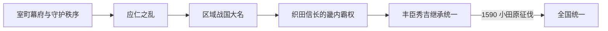

# 战国时代

## 时间

本页采用1493—1590年：以明应之变后将军权威被有力守护操纵为起点，以丰臣秀吉灭后北条氏、完成全国军事统一为终点。学界和通史也常以1467年应仁之乱、1568年织田信长入京、1573年室町幕府终结或1600年关原之战划界，因此“战国时代”并无唯一年代。

## 概括

战国时代不是一个统一王朝，而是室町幕府的全国协调能力瓦解后，守护家、守护代、国人、寺社和新兴战国大名重新组织领国的长期过程。战争频繁，却不只是无序混战：各领国制定分国法、检地、城下町和家臣团制度，强化税收、司法和军事动员；这种区域集权最终为织田、丰臣的全国统一提供了组织基础。

## 形成背景

- 1467—1477年应仁之乱把京都及幕府重臣卷入继承战争，守护大名长期离开领国，家臣和地方国人趁机扩大自主权。
- 足利将军的继承依赖细川等管领与有力武家。1493年细川政元发动明应之变、废黜足利义稙，显示将军已可被重臣更换。
- 庄园领主和朝廷对地方年贡的实际控制衰退，武装村落、国人联盟、寺社势力与大名之间形成多层竞争。
- 农业复种、矿业、海运与市场成长增加可争夺资源，也使能够保护道路、统一度量和控制关卡的大名获得优势。

## 分阶段发展

### 幕府秩序瓦解与区域政权兴起（1467—1530年代）

京都由细川、高国、大内等势力反复争夺。地方上，北条早云家族在关东、毛利元就在中国地方、尼子氏在出云、岛津氏在九州逐步建立更直接的领国统治。并非所有新兴者都“以下克上”取代主君，有些大名由守护家转型，有些则借婚姻、养子和联盟取得合法性。

### 领国国家与军事技术变化（1530—1568）

大名通过分国法、土地调查、人质与婚姻、直属家臣编组约束地方武士；城郭由山城逐渐与山麓城下町结合。1543年前后火绳枪传入，1549年耶稣会传教开始。枪炮提高步兵、工匠和补给的重要性，但骑兵、长枪、筑城和联盟仍同样关键，不能把战争变化归为单一“火器革命”。

### 织田信长的畿内霸权（1560—1582）

1560年桶狭间之战后，织田信长从尾张向美浓和近畿扩张；1568年拥足利义昭入京，随后同将军、浅井、朝仓、石山本愿寺等势力长期作战。1573年放逐义昭，室町幕府名义统治终结。信长以安土城、道路与市场政策、直属军团和城下町控制连接畿内与东海，但1582年本能寺之变中被明智光秀袭杀。

### 丰臣秀吉完成统一（1582—1590）

羽柴秀吉在山崎之战击败明智光秀，继而在清洲会议后的继承竞争中压倒柴田胜家，并与德川家康妥协。1585年出任关白，1587年平定九州，1590年小田原征伐迫使后北条氏投降，东北诸大名臣服，全国主要军事抵抗被纳入丰臣秩序，战国时代进入[安土桃山时代](/%E4%BA%BA%E6%96%87%E7%A7%91%E5%AD%A6/%E5%8E%86%E5%8F%B2/%E4%B8%9C%E4%BA%9A/%E6%97%A5%E6%9C%AC/%E5%AE%89%E5%9C%9F%E6%A1%83%E5%B1%B1%E6%97%B6%E4%BB%A3.md)的统一阶段。

## 权力与社会组织

| 层级 | 角色 | 作用 |
| --- | --- | --- |
| 天皇与朝廷 | 后土御门、后柏原、后奈良、正亲町天皇等 | 财政困窘但仍提供官位、改元和政治正统性；完整皇统见[天皇世系表](/%E4%BA%BA%E6%96%87%E7%A7%91%E5%AD%A6/%E5%8E%86%E5%8F%B2/%E4%B8%9C%E4%BA%9A/%E6%97%A5%E6%9C%AC/%E5%A4%A9%E7%9A%87%E4%B8%96%E7%B3%BB%E8%A1%A8.md)。 |
| 名义武家首脑 | 足利将军 | 在畿内和外交上仍有象征作用，但继承和行动受有力武家制约；完整表见[室町时代](/%E4%BA%BA%E6%96%87%E7%A7%91%E5%AD%A6/%E5%8E%86%E5%8F%B2/%E4%B8%9C%E4%BA%9A/%E6%97%A5%E6%9C%AC/%E5%AE%A4%E7%94%BA%E6%97%B6%E4%BB%A3.md)。 |
| 区域统治者 | 战国大名 | 以领国为单位掌握军队、裁判、税收、城郭和对外交涉，没有一张全国君主世系。 |
| 地方中介 | 国人、地侍、村落、寺社、商人 | 可成为大名家臣，也可能结成一揆抵抗；统一过程就是把这些中介重新纳入层级。 |
| 统一推动者 | 织田信长、丰臣秀吉 | 以畿内财政、联盟、军事和朝廷官位逐步压倒区域大名。 |

## 主要区域力量

| 地区 | 代表势力 | 统治与竞争特点 |
| --- | --- | --- |
| 关东 | 后北条氏、上杉诸家 | 后北条以小田原为中心建立领国；关东管领名义与上杉内部继承长期交织。 |
| 甲信越 | 武田氏、上杉谦信 | 围绕信浓、越后与关东通道竞争；川中岛战役是反复冲突的象征。 |
| 东海 | 今川氏、德川氏、织田氏 | 控制京都—东国通路；桶狭间后力量格局重组。 |
| 畿内 | 足利将军、细川氏、三好氏、松永久秀、寺社 | 朝廷、幕府、港市和宗教武装密集，政治联盟变化最快。 |
| 中国地方 | 大内氏、尼子氏、毛利氏 | 毛利元就及后继者控制濑户内海航路并取代旧强权。 |
| 四国 | 长宗我部氏等 | 土佐统一后向四国扩张，最终服从丰臣。 |
| 九州 | 大友氏、龙造寺氏、岛津氏 | 海外贸易、基督教传播与地区争霸相互作用；1587年丰臣征服终止三强竞争。 |
| 东北 | 伊达氏、最上氏、南部氏等 | 地方政治相对独立，1590年奥州处分后纳入丰臣秩序。 |

## 重要事件

| 时间 | 事件 | 过程与影响 |
| --- | --- | --- |
| 1467—1477 | 应仁之乱 | 幕府重臣和将军继承冲突摧毁京都权威，为战国化提供背景。 |
| 1485—1493 | 山城国一揆 | 国人和村落联合驱逐交战大名，显示地方集体政治能力。 |
| 1493 | 明应之变 | 细川政元废将军，常作为战国时代政治起点。 |
| 1531 | 大物崩 | 细川高国败亡，畿内权力进一步转入家臣和地方军事势力。 |
| 1543前后 | 火绳枪传入 | 枪械生产和部队编制逐渐扩大。 |
| 1549 | 方济各·沙勿略来日 | 基督教与南蛮贸易进入大名外交和港市经济。 |
| 1560 | 桶狭间之战 | 今川义元战死，织田信长崛起，德川家康获得独立空间。 |
| 1568 | 织田信长入京 | 信长拥立足利义昭，掌握畿内政治主动权。 |
| 1571 | 延历寺烧讨 | 信长摧毁重要宗教军事据点，造成大规模杀戮。 |
| 1573 | 足利义昭被放逐 | 室町幕府终结，统一战争进入织田主导阶段。 |
| 1575 | 长篠之战 | 织田、德川击败武田军；枪队、工事和协同作战的作用突出。 |
| 1580 | 石山本愿寺退城 | 十年战争结束，信长掌握大阪湾关键节点。 |
| 1582 | 本能寺之变、山崎之战 | 信长死亡；秀吉迅速击败明智光秀并取得继承优势。 |
| 1587 | 九州征伐 | 岛津氏降服，秀吉控制西日本与对外港口。 |
| 1590 | 小田原征伐 | 后北条氏灭亡，主要大名承认丰臣统治。 |

## 分裂原因与统一条件

### 分裂长期化

- 幕府财政和直属军力有限，依赖守护执行命令；守护和家臣一旦争夺中央，地方控制便转给国人和守护代。
- 继承规则不固定，养子、庶流和重臣拥立使将军家与大名家都易爆发内战。
- 山地、海湾和区域市场支持多个军事财政中心，任何一方都难迅速形成压倒优势。
- 寺社、一揆、海商和村落拥有独立资源，使大名必须谈判、吸纳或长期围攻。

### 统一得以实现

- 领国大名先完成地方检地、家臣编组和城下町建设，为更大规模征服提供可接管的行政单元。
- 畿内拥有京都正统性、堺等商港、近江交通和高密度市场；控制该区可同时取得税源、武器和官位。
- 织田、丰臣灵活运用联盟、降服保留、转封与人质，不只依靠歼灭战争。
- 信长之死本可能使统一倒退，但秀吉快速控制继承会议、织田核心领地和朝廷官位，避免权力长期真空。

## 演变关系

- 前一节点：[室町时代](/%E4%BA%BA%E6%96%87%E7%A7%91%E5%AD%A6/%E5%8E%86%E5%8F%B2/%E4%B8%9C%E4%BA%9A/%E6%97%A5%E6%9C%AC/%E5%AE%A4%E7%94%BA%E6%97%B6%E4%BB%A3.md)。
- 后一节点：[安土桃山时代](/%E4%BA%BA%E6%96%87%E7%A7%91%E5%AD%A6/%E5%8E%86%E5%8F%B2/%E4%B8%9C%E4%BA%9A/%E6%97%A5%E6%9C%AC/%E5%AE%89%E5%9C%9F%E6%A1%83%E5%B1%B1%E6%97%B6%E4%BB%A3.md)。
- 同期东亚背景：[明](/%E4%BA%BA%E6%96%87%E7%A7%91%E5%AD%A6/%E5%8E%86%E5%8F%B2/%E4%B8%9C%E4%BA%9A/%E4%B8%AD%E5%9B%BD/%E6%98%8E/README.md)。
