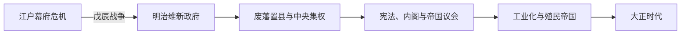

# 明治时代

## 时间

1868-1912年。

## 概括

明治时代是日本由幕藩体制转为中央集权民族国家、再转为立宪帝国和殖民强国的阶段。改革并非一次完成：新政府先在内战中取得全国控制，继而废藩、征税、征兵和兴学，再以宪法、议会和内阁固定权力结构；工业化与战争动员相互促进，但农民负担、劳动冲突、对外侵略和殖民统治也是这一转型的组成部分。

## 建立背景

- 1853年佩里舰队来航后，幕府在西方军事压力下开港并签订不平等条约，财政、物价和政治合法性同时受损。
- 萨摩、长州等强藩吸收西式军备，并与公家、商人和反幕力量结盟；“尊王攘夷”逐渐转为以天皇名义建立新政府。
- 1867年德川庆喜大政奉还没有消除权力冲突。1868—1869年戊辰战争中，倒幕军击败幕府及东北、北海道抵抗力量，取得制度重建所需的军事前提。

## 分阶段发展

### 统一与废除幕藩体制（1868—1877）

- 新政府发布五条御誓文、迁都东京，逐步将土地与人民从藩主控制转归中央。
- 1871年废藩置县，以中央任命的府县知事取代藩主；身份、户籍、货币和行政体系趋于统一。
- 地租改正把税收货币化并固定土地所有权，征兵令建立全国军队，学制推动基础教育；这些改革也将现金税、兵役和市场波动直接压到农村社会。
- 士族俸禄被处置、佩刀等特权取消。1874年佐贺之乱、1877年西南战争相继失败，标志旧武士以武力恢复特权的可能性基本终结。

### 财政整顿与立宪国家成形（1877—1890）

- 政府出售或扶植矿山、纺织、铁路和造船等事业，再由政商承接部分企业，形成国家引导的工业化。
- 自由民权运动要求国会、宪法和地方自治。政府既镇压激进活动，也承诺开设国会。
- 松方财政以紧缩、增税和银本位稳定财政，却造成通货紧缩、农户破产和土地集中。
- 1885年建立内阁制；1889年颁布《大日本帝国宪法》，1890年帝国议会开会。国家由天皇主权、官僚内阁、贵族院与有限选举的众议院共同构成。

### 工业化、战争与帝国扩张（1890—1905）

- 纺织出口、铁路、重工业和军工增长，教育、征兵和地方行政提高国家动员能力；财阀与政府采购关系加深。
- 1894—1895年甲午战争后，日本迫使清朝承认朝鲜“独立”、割让台湾和澎湖，并获得巨额赔款；三国干涉还辽刺激了军备扩张。
- 1902年英日同盟使日本获得外交保障。1904—1905年日俄战争以日本获胜告终，但人员、债务与社会成本巨大，赔款落空引发日比谷骚乱。
- 战争胜利扩大日本在南满洲与朝鲜的优势，也使军部、殖民官僚和重工业在国家中的地位上升。

### 帝国制度巩固（1905—1912）

- 1905年日本迫使韩国成为保护国，1910年正式吞并；台湾和朝鲜受到总督府统治，其政治权利、土地与资源配置服从帝国需要。
- 1911年前后主要不平等条约限制基本撤除，成为明治政府长期外交目标的完成标志。
- 城市工厂、铁路和大众报刊扩张，工人和佃农问题日益明显；1910年“大逆事件”则显示政府以治安和天皇制意识形态限制异议。

## 统治结构

| 层级 | 主要角色 | 运作方式与限制 |
| --- | --- | --- |
| 君主 | 明治天皇 | 宪法规定统治权总揽于天皇；政策通常由重臣、内阁和官僚以天皇名义形成。 |
| 非正式最高协调者 | 元老 | 伊藤博文、山县有朋等维新重臣荐举首相并协调宫廷、军队和政党，未由宪法明确规定。 |
| 政府首脑 | 内阁总理大臣 | 1885年起主持内阁；并非必须来自议会多数党，也不是向议会集体负责的现代议会内阁。 |
| 立法 | 帝国议会 | 贵族院与众议院共同立法；选举权最初仅属于缴纳较高直接税的成年男性。 |
| 军事 | 陆军、海军统帅系统 | 统帅权直属天皇，军部大臣制度使军方能够在组阁和国策中取得强势地位。 |
| 地方与殖民地 | 府县官僚、台湾总督府、韩国统监府 / 朝鲜总督府 | 国内行政中央集权化；殖民地不享有与本土相同的政治参与和法律地位。 |

历届正式内阁见[日本内阁总理大臣表](/%E4%BA%BA%E6%96%87%E7%A7%91%E5%AD%A6/%E5%8E%86%E5%8F%B2/%E4%B8%9C%E4%BA%9A/%E6%97%A5%E6%9C%AC/%E5%86%85%E9%98%81%E6%80%BB%E7%90%86%E5%A4%A7%E8%87%A3%E8%A1%A8.md)，皇统见[天皇世系表](/%E4%BA%BA%E6%96%87%E7%A7%91%E5%AD%A6/%E5%8E%86%E5%8F%B2/%E4%B8%9C%E4%BA%9A/%E6%97%A5%E6%9C%AC/%E5%A4%A9%E7%9A%87%E4%B8%96%E7%B3%BB%E8%A1%A8.md)。

## 重要事件

| 时间 | 事件 | 过程与影响 |
| --- | --- | --- |
| 1868—1869 | 戊辰战争 | 新政府击败幕府及其同盟，完成军事统一。 |
| 1871 | 废藩置县 | 取消藩政实体，建立中央直辖府县。 |
| 1872—1873 | 学制、征兵令与地租改正 | 形成教育、军事和财政三套全国性制度，也引发基层反抗。 |
| 1874—1875 | 台湾出兵与江华岛事件 | 日本以武力扩大周边影响，近代对外扩张开始制度化。 |
| 1877 | 西南战争 | 西乡隆盛败亡，士族武装反抗终结。 |
| 1881—1885 | 国会承诺与内阁制 | 自由民权压力和政府制度设计共同推动立宪准备。 |
| 1889—1890 | 宪法颁布、帝国议会开会 | 有限立宪政治正式运行。 |
| 1894—1895 | 甲午战争 | 日本取得台湾、赔款与在朝鲜的优势，东亚力量格局改变。 |
| 1902 | 英日同盟 | 日本进入列强联盟体系。 |
| 1904—1905 | 日俄战争 | 日本夺取南满洲权益并巩固对朝鲜控制，国内承担沉重战争成本。 |
| 1905—1910 | 韩国保护国化与吞并 | 韩国外交、内政逐步被控制，最终成为日本殖民地。 |
| 1911 | 关税自主权恢复 | 条约改正的主要目标完成。 |
| 1912 | 明治天皇去世 | 年号更替为大正，既有制度和帝国政策继续延伸。 |

## 崛起条件、结构代价与时代终结

### 崛起条件

- 幕府后期已存在较高商业化、识字率和区域市场，新政府能够利用而非从零创造这些基础。
- 中央财政、征兵、学校和铁路把地方资源转化为国家动员能力；政府采购、技术引进和民营企业共同推动工业化。
- 国际列强竞争既制造生存压力，也提供技术、贷款、贸易市场和“以帝国对抗帝国”的扩张机会。
- 甲午赔款、殖民资源和战争订单进一步加速重工业，但也使发展越来越依赖军事扩张。

### 结构代价

- 早期税制和紧缩政策加剧农村分化；工厂劳动尤其依赖低工资女性劳工。
- 宪法保留元老荐相、军队统帅权和贵族院等非民选权力，议会政治从一开始便受多重限制。
- 对台湾、朝鲜和中国东北的扩张不是现代化的附属现象，而是明治国家建构与资源动员的一部分。

明治时代并非因国家崩溃而结束，而是因明治天皇于1912年去世、年号改元。其中央集权、立宪形式、工业体系和帝国版图由[大正时代](/%E4%BA%BA%E6%96%87%E7%A7%91%E5%AD%A6/%E5%8E%86%E5%8F%B2/%E4%B8%9C%E4%BA%9A/%E6%97%A5%E6%9C%AC/%E5%A4%A7%E6%AD%A3%E6%97%B6%E4%BB%A3.md)继承，同时军部自主性、殖民矛盾和社会不平等也一并留下。

## 演变关系

- 前一节点：[江户时代](/%E4%BA%BA%E6%96%87%E7%A7%91%E5%AD%A6/%E5%8E%86%E5%8F%B2/%E4%B8%9C%E4%BA%9A/%E6%97%A5%E6%9C%AC/%E6%B1%9F%E6%88%B7%E6%97%B6%E4%BB%A3.md)。
- 后一节点：[大正时代](/%E4%BA%BA%E6%96%87%E7%A7%91%E5%AD%A6/%E5%8E%86%E5%8F%B2/%E4%B8%9C%E4%BA%9A/%E6%97%A5%E6%9C%AC/%E5%A4%A7%E6%AD%A3%E6%97%B6%E4%BB%A3.md)。
- 对照阅读：[清](/%E4%BA%BA%E6%96%87%E7%A7%91%E5%AD%A6/%E5%8E%86%E5%8F%B2/%E4%B8%9C%E4%BA%9A/%E4%B8%AD%E5%9B%BD/%E6%B8%85/README.md)、[朝鲜半岛殖民时期](/%E4%BA%BA%E6%96%87%E7%A7%91%E5%AD%A6/%E5%8E%86%E5%8F%B2/%E4%B8%9C%E4%BA%9A/%E6%9C%9D%E9%B2%9C%E5%8D%8A%E5%B2%9B/%E6%AE%96%E6%B0%91%E6%97%B6%E6%9C%9F.md)。
