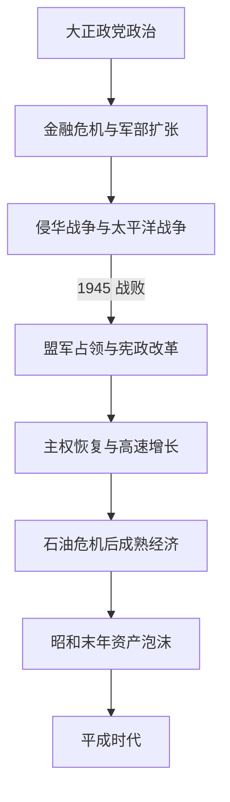

# 昭和时代

## 时间

1926-1989年。

## 概括

昭和时代横跨两个性质迥异的国家结构：前半期是帝国扩张、军部政治与总体战争，1945年战败后则在盟军占领下改造为主权在民、象征天皇制和议会内阁制国家。其后日本依托冷战秩序、美国安全保障和出口工业化实现高速增长，1970年代后转向成熟经济，昭和末年又形成资产泡沫。

## 分阶段发展

### 政党政治崩解与对外侵略（1926—1937）

昭和初年金融恐慌、世界经济大萧条和农村贫困削弱政党内阁。1931年关东军发动九一八事变，未经内阁充分控制即占领中国东北并扶植满洲国；国际联盟调查后，日本于1933年退出联盟。1932年五一五事件刺杀犬养毅，本格政党内阁中断；1936年二二六事件虽被镇压，军部却借人事与统帅权进一步支配组阁和国策。

### 全面战争与帝国崩溃（1937—1945）

1937年卢沟桥事变演变为全面侵华战争，南京大屠杀等大规模杀戮与暴行发生。国家总动员法、大政翼赞会和思想控制压缩议会与社会自主空间。1940年日本加入德意日三国同盟并向法属印度支那扩张；美国、英国和荷兰实施经济制裁。1941年日美谈判破裂后，日本袭击珍珠港并进攻东南亚。初期扩张很快因工业、运输、资源和海空军能力差距而逆转；1945年美军战略轰炸、冲绳战役、广岛和长崎原子弹爆炸、苏联对日作战共同逼近本土，天皇裁决接受《波茨坦公告》。日本帝国投降，殖民体系瓦解。

### 占领改革与主权恢复（1945—1955）

盟军最高司令官总司令部通过日本政府实施解除武装、战犯审判、土地改革、财阀整顿、教育改革和妇女参政。1947年宪法确立主权在民、象征天皇制、基本权利和第九条。冷战升级后，占领政策转向经济稳定与反共；朝鲜战争特需促进复苏。1951年《旧金山和约》和日美安全保障安排签署，1952年日本恢复主权，但冲绳仍由美国施政。

### 五五年体制与高速增长（1955—1973）

自由党与民主党合并为自由民主党，社会党也完成统一，形成自民党长期执政、社会党长期最大反对党的格局。政府、官僚、银行和企业围绕产业政策、投资与出口协同，农村和中小企业利益通过自民党组织被纳入。1960年安保斗争没有阻止新日美安保条约生效，却迫使岸信介辞职；随后池田勇人把重心转向所得倍增。东京奥运会、新干线、钢铁、汽车和家电象征高速增长，同时出现水俣病等严重公害。1972年冲绳行政权返还，日本与中华人民共和国邦交正常化。

### 石油危机、经济转型与泡沫形成（1973—1989）

1973年石油危机终结两位数增长，日本以节能、技术升级和海外投资转向较稳定增长。洛克希德事件暴露金权政治；行政改革、国铁等国企民营化重塑国家经济。1985年《广场协议》后日元急升，宽松货币、金融自由化和土地制度共同推高股票与房地产价格。昭和天皇1989年去世时，日本已是经济大国，但泡沫风险、人口老龄化和财政结构问题正在积累。

## 统治结构

| 时段 | 国家象征 / 元首 | 政府与实际权力 |
| --- | --- | --- |
| 1926—1945 | 昭和天皇为帝国宪法下主权者 | 内阁、军令系统、元老后继重臣、枢密院和官僚并立；陆海军借统帅权和军部大臣资格制拥有制度性否决力。 |
| 1945—1952 | 天皇先处于旧宪法框架，1947年后为国家象征 | 日本内阁执行占领政策，盟军最高司令官总司令部掌握最终占领权力。 |
| 1952—1989 | 昭和天皇为象征天皇 | 国会指名首相，内阁向国会负责；自民党派阀、中央官僚、产业界和日美同盟共同塑造政策。 |

历届内阁与临时代理见[日本内阁总理大臣表](/%E4%BA%BA%E6%96%87%E7%A7%91%E5%AD%A6/%E5%8E%86%E5%8F%B2/%E4%B8%9C%E4%BA%9A/%E6%97%A5%E6%9C%AC/%E5%86%85%E9%98%81%E6%80%BB%E7%90%86%E5%A4%A7%E8%87%A3%E8%A1%A8.md)；昭和天皇的皇统位置见[天皇世系表](/%E4%BA%BA%E6%96%87%E7%A7%91%E5%AD%A6/%E5%8E%86%E5%8F%B2/%E4%B8%9C%E4%BA%9A/%E6%97%A5%E6%9C%AC/%E5%A4%A9%E7%9A%87%E4%B8%96%E7%B3%BB%E8%A1%A8.md)。

## 重要事件

| 时间 | 事件 | 结果与长期影响 |
| --- | --- | --- |
| 1927 | 昭和金融恐慌 | 银行挤兑和倒闭暴露战后坏账，强化国家金融整顿。 |
| 1929—1931 | 世界经济大萧条 | 出口萎缩、农村贫困和失业加深，强硬扩张论得势。 |
| 1931—1933 | 九一八事变、满洲国与退出国际联盟 | 军方在中国东北建立占领秩序，日本远离国际协调。 |
| 1932 | 五一五事件 | 犬养毅被杀，本格政党内阁时代中断。 |
| 1936 | 二二六事件 | 青年军官政变失败，但军部政治影响继续扩大。 |
| 1937 | 全面侵华战争 | 长期消耗战开始，伴随南京大屠杀等战争暴行。 |
| 1940 | 三国同盟与大政翼赞会 | 外交与国内政治进一步纳入总体战体制。 |
| 1941 | 珍珠港与太平洋战争 | 日本同美英荷进入全面战争。 |
| 1945 | 战败投降 | 本土遭毁灭性打击，殖民帝国解体，盟军占领开始。 |
| 1946—1947 | 新宪法制定与施行 | 确立主权在民、象征天皇制、议会内阁制和和平主义。 |
| 1951—1952 | 和约、安保与恢复主权 | 日本重返国际社会，同时纳入美国主导的冷战同盟。 |
| 1955 | 五五年体制形成 | 自民党长期执政的政治结构确立。 |
| 1960 | 安保斗争 | 条约生效但岸内阁倒台，政治重心转向经济增长。 |
| 1964 | 东京奥运会和东海道新干线 | 展示战后重建和基础设施现代化。 |
| 1972 | 冲绳返还、日中邦交正常化 | 战后领土与东亚外交出现重大调整。 |
| 1973 | 第一次石油危机 | 高速增长结束，产业转向节能和技术密集。 |
| 1985—1989 | 日元升值与资产泡沫 | 货币宽松和投机推高资产价格，为平成初期崩盘埋下风险。 |
| 1989 | 昭和天皇去世 | 改元平成，昭和时代结束。 |

## 帝国扩张、战败与战后崛起的原因

### 战前体制失稳

- **结构因素：** 明治宪法没有把军队明确置于议会内阁的统一控制下；政党依赖金权和地方利益网络，军部与右翼可借政治暴力破坏妥协。
- **社会经济压力：** 金融危机、萧条和农村贫困削弱对政党政治的信任，军需扩张被宣传为解决资源和市场困境的办法。
- **外部压力：** 列强殖民竞争、华盛顿体系约束和中国民族国家重建，被扩张派解释为对日本“生存圈”的威胁。
- **直接触发：** 关东军制造九一八事变并既成事实化，内阁未能追责；五一五、二二六等暴力事件进一步改变政治激励。

### 帝国灭亡

- **结构因素：** 日本工业与资源规模无法长期承受对华持久战和对美英海上战争，陆海军战略分裂且运输线过长。
- **外部压力：** 美国潜艇战、空袭与岛屿推进切断资源，苏联参战打破外交斡旋幻想。
- **直接触发：** 1945年原子弹爆炸、苏联进攻和天皇裁决促成接受投降条件。
- 战败不仅是内阁更替，而是海外帝国、军部政治和旧宪法国家的整体终结。

### 战后经济崛起

- 土地改革、教育与劳动制度、既有工业基础和高储蓄提供国内条件。
- 美国市场、安全保障与朝鲜战争特需降低防务和资本约束；政府、银行和企业以产业政策集中投资。
- 年轻劳动力、城市化和技术引进推动生产率上升。其代价包括公害、过长劳动、城乡差距和对进口能源的依赖。
- 石油危机后通过节能和产业升级避免崩溃，但金融宽松与资产化在昭和末年积累新风险。

## 演变关系

- 前一节点：[大正时代](/%E4%BA%BA%E6%96%87%E7%A7%91%E5%AD%A6/%E5%8E%86%E5%8F%B2/%E4%B8%9C%E4%BA%9A/%E6%97%A5%E6%9C%AC/%E5%A4%A7%E6%AD%A3%E6%97%B6%E4%BB%A3.md)。
- 后一节点：[平成时代](/%E4%BA%BA%E6%96%87%E7%A7%91%E5%AD%A6/%E5%8E%86%E5%8F%B2/%E4%B8%9C%E4%BA%9A/%E6%97%A5%E6%9C%AC/%E5%B9%B3%E6%88%90%E6%97%B6%E4%BB%A3.md)。
