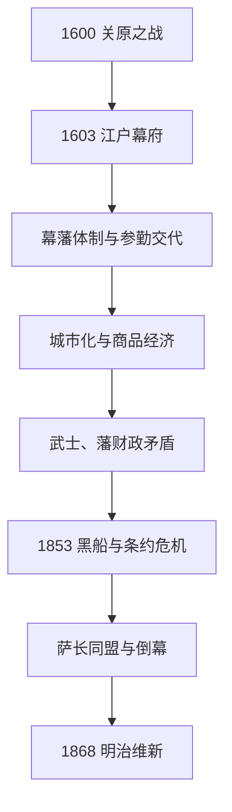

# 江户时代

## 时间

1603—1868年。1603年德川家康受任征夷大将军是制度起点；1867年德川庆喜大政奉还并辞任将军，1868年王政复古、戊辰战争和江户开城则构成实际终结过程。

## 概括

江户时代是德川将军以幕藩体制统合全国的近世阶段。幕府直辖战略城市、矿山和交通，各藩保留地方行政，天皇朝廷维持礼仪正统；参勤交代、人质、婚姻和城郭限制约束大名。长期和平推动城市、商品农业、教育和大众文化，却也使以米年贡供养武士的财政体系逐渐不适应货币经济。19世纪内外危机叠加，幕府在开国与攘夷、中央与雄藩之间失去协调能力，最终被明治新政府取代。

## 建立与分阶段发展

### 德川统合与制度定型（1600—1651）

关原之战后，家康大规模没收、减封和转封，配置亲藩、谱代与外样大名。1603年开幕府，1615年大阪之阵灭丰臣家，同年武家诸法度与一国一城令约束诸侯。第三代家光强化参勤交代，使大名周期性居住江户并承担道路、宅邸和随从开支。1637—1638年岛原天草起义被镇压后，幕府严禁基督教并重整海上往来。

### “锁国”秩序与城市社会（1639—1716）

“锁国”不是完全隔绝：长崎保持对荷兰和中国商人的贸易，对马藩处理朝鲜外交，萨摩藩控制琉球对华通道，松前藩同阿伊努社会贸易。幕府限制日本人出海和欧洲传教，以可控口岸管理信息、商品和外交。江户、大阪、京都成长为政治、商业和文化中心；元禄时期货币经济、出版、歌舞伎、俳谐和浮世草子繁荣。

### 改革、市场扩张与财政矛盾（1716—1787）

德川吉宗的享保改革整顿年贡、开发新田、设置上米和允许汉译洋书，试图恢复幕府财政。田沼意次时期更积极利用商业、专卖和商人资本，却因贿赂印象、天明饥荒与政治斗争而失败。大名和武士收入以固定石高为基础，物价、借债和参勤开支使财政日益依赖商人。

### 饥荒、改革与外来压力（1787—1853）

松平定信的宽政改革强调节俭、救济和思想控制；水野忠邦的天保改革试图压低物价、整顿城市并收回江户大阪周边领地，遭商人和大名抵制。天明、天保饥荒造成死亡、逃亡和一揆。与此同时俄、美、英船只接近，日本通过兰学吸收医学、测绘和炮术；幕府在拒绝、有限补给和海防之间反复调整。

### 幕末与政权崩溃（1853—1868）

1853年佩里舰队来航，次年《日美和亲条约》开港；1858年安政五国条约扩大通商并给予领事裁判权、限制关税自主。条约未经天皇充分认可，激化幕府、朝廷和大名争执。大老井伊直弼以安政大狱镇压反对者，1860年在樱田门外被刺。长州、萨摩等雄藩一度主张尊王攘夷，在西方舰队报复中认识军事差距，转而结盟倒幕。德川庆喜推行改革并于1867年大政奉还，企图在新议政结构中保留德川主导；倒幕派发动王政复古，1868年鸟羽伏见之战开启戊辰战争，江户和平开城后幕府中心瓦解。

## 德川将军世系

皇统另见[天皇世系表](/%E4%BA%BA%E6%96%87%E7%A7%91%E5%AD%A6/%E5%8E%86%E5%8F%B2/%E4%B8%9C%E4%BA%9A/%E6%97%A5%E6%9C%AC/%E5%A4%A9%E7%9A%87%E4%B8%96%E7%B3%BB%E8%A1%A8.md)。幕府将军是全国武家首脑，老中、大老、侧用人等会在特定阶段主导政务，但没有形成取代德川家的连续统治世系。

| 顺序 | 将军 | 在职时间 | 与前任关系 | 关键事件 / 说明 |
| ---: | --- | --- | --- | --- |
| 1 | **德川家康** | 1603—1605 | 创建者 | 关原胜者；建立幕府，退位后仍以大御所掌权至1616年。 |
| 2 | 德川秀忠 | 1605—1623 | 家康三子 | 大阪之阵、武家诸法度和朝廷统制制度化。 |
| 3 | **德川家光** | 1623—1651 | 秀忠长子 | 参勤交代定制，镇压岛原起义，完成海禁与口岸秩序。 |
| 4 | 德川家纲 | 1651—1680 | 家光长子 | 由武断政治转向文治，明历大火后重建江户。 |
| 5 | 德川纲吉 | 1680—1709 | 家光四子之子 | 元禄文化繁荣；生类怜悯令和财政争议突出。 |
| 6 | 德川家宣 | 1709—1712 | 家光三子之子 | 新井白石辅政，实施正德之治。 |
| 7 | 德川家继 | 1713—1716 | 家宣之子 | 幼年将军，无嗣早逝，秀忠嫡系断绝。 |
| 8 | **德川吉宗** | 1716—1745 | 纪州德川家 | 享保改革，强化财政、救济与实用知识。 |
| 9 | 德川家重 | 1745—1760 | 吉宗长子 | 侧近政治增强；幕府财政与货币经济矛盾延续。 |
| 10 | 德川家治 | 1760—1786 | 家重长子 | 田沼意次掌政，商业政策与天明危机并存。 |
| 11 | 德川家齐 | 1787—1837 | 一桥德川家 | 在位最长；宽政改革、大御所政治与财政膨胀。 |
| 12 | 德川家庆 | 1837—1853 | 家齐次子 | 天保饥荒、天保改革和海防压力。 |
| 13 | 德川家定 | 1853—1858 | 家庆四子 | 黑船来航、开国与将军继承争议。 |
| 14 | 德川家茂 | 1858—1866 | 纪州德川家 | 安政条约、公武合体、长州征讨；任内病逝。 |
| 15 | **德川庆喜** | 1866—1867 | 一桥德川家 | 推进幕府改革，大政奉还并辞任将军；末代将军。 |

## 幕藩统治结构

| 层级 | 机构 / 群体 | 实际作用 |
| --- | --- | --- |
| 正统君主 | 天皇与京都朝廷 | 负责改元、官位和礼仪，受幕府财政和《禁中并公家诸法度》约束；幕末政治影响回升。 |
| 全国武家政府 | 江户幕府 | 将军下设大老、老中、若年寄、寺社奉行、町奉行、勘定奉行等，直辖天领、港口、矿山和主要道路。 |
| 地方政权 | 约二百余藩 | 大名在领内有行政、司法和征税权；亲藩、谱代、外样按与德川关系分类，规模和数量不断变化。 |
| 基层治理 | 郡代、代官、村役人、町年寄 | 通过村请制、五人组与町组织征税、治安和连带责任；村落并非完全被动，也能诉愿和集体抗争。 |
| 身份秩序 | 武士、百姓、町人及被排斥群体 | “士农工商”是简化概括；实际身份更复杂，包括公家、僧侣、神职、渔民、艺能者与被差别身份群体。 |
| 对外窗口 | 长崎、对马、萨摩—琉球、松前 | 分别连接荷兰 / 中国、朝鲜、琉球—中国和阿伊努—北方贸易，构成“四口”交往。 |

## 经济、社会与文化机制

- 石高制以稻米估产决定大名地位和军役，实际经济却越来越由货币、棉花、油料、茶、蚕丝、海运和城市消费驱动。
- 参勤交代增加大名负担，也建设道路、宿场、金融和全国市场；大阪堂岛米市把米年贡转化为价格和信用。
- 寺子屋、藩校、出版和借书业提高识字与知识流通；朱子学、国学、兰学和实学分别服务秩序、经典考证与技术吸收。
- 歌舞伎、浮世绘、俳谐、文乐、相扑和城市饮食形成町人文化；文化生产不只集中于武士精英。
- 北海道南部扩张、萨摩控制琉球和对阿伊努贸易的不平等，也说明“和平”主要指本州核心的武家秩序，并非所有边缘群体都同等受益。

## 重要事件

| 时间 | 事件 | 过程与影响 |
| --- | --- | --- |
| 1600 | 关原之战 | 德川东军获胜，重排全国大名领地。 |
| 1603 | 江户幕府成立 | 家康受任将军，德川霸权制度化。 |
| 1614—1615 | 大阪之阵 | 丰臣家灭亡，全国性军事对手消失。 |
| 1615 | 武家诸法度、一国一城令 | 约束大名婚姻、城郭和行为，幕藩秩序定型。 |
| 1635 | 参勤交代定制 | 大名定期往返江户，政治与财政受幕府控制。 |
| 1637—1638 | 岛原天草起义 | 重税与宗教压迫引发反抗，镇压后禁教和海禁加强。 |
| 1639—1641 | 葡萄牙人被逐、荷兰商馆迁出岛 | 长崎贸易被集中管理，形成有限开放的“锁国”秩序。 |
| 1657 | 明历大火 | 江户大部焚毁，推动城市空间和防火制度重建。 |
| 1716—1745 | 享保改革 | 吉宗整顿财政、开发新田并调整知识政策。 |
| 1782—1788 | 天明饥荒与骚动 | 减产、疫病和救济失败造成大规模社会危机。 |
| 1787—1793 | 宽政改革 | 节俭、备荒和思想整顿并行。 |
| 1833—1839 | 天保饥荒 | 农村死亡、逃亡和城市骚动加剧，幕府威信下降。 |
| 1841—1843 | 天保改革 | 强制紧缩和上知令遭抵制，中央改革失败。 |
| 1853—1854 | 黑船来航与和亲条约 | 美国军事压力迫使幕府开港，闭关秩序松动。 |
| 1858 | 安政条约 | 开通通商、领事裁判与低关税限制激化政治危机。 |
| 1860 | 樱田门外之变 | 大老井伊直弼遇刺，幕府强制协调能力受重创。 |
| 1866 | 萨长同盟 | 两个雄藩由竞争转向倒幕合作。 |
| 1867 | 大政奉还、王政复古 | 庆喜交还政权名义，倒幕派排除德川主导。 |
| 1868 | 鸟羽伏见之战、江户开城 | 戊辰战争决定中央权力转向明治政府。 |

## 稳定条件与灭亡原因

### 长期稳定的条件

- 幕府以领地配置、参勤交代、城郭和婚姻审批约束大名，同时允许藩处理地方事务，降低中央日常治理成本。
- 朝廷、寺社和身份秩序提供正统性；长期无全国战争使人口、农业、市场和文化积累。
- 有限口岸既减少传教和军事介入，又保留白银、药材、书籍、情报和外交通道。

### 结构性衰弱

- 武士俸禄和藩财政以固定石高为本，商品价格和借贷却不断增长；改革多在增税、节俭和商业利用之间摇摆。
- 饥荒、农民一揆和城市打毁暴露救济能力不均，雄藩通过专卖、贸易和西式军备反而积累独立实力。
- 将军继承、朝廷授权和大名协商没有应对列强条约的共同决策程序，开国问题把制度内分歧升级为合法性危机。

### 外部压力与直接触发

- 西方蒸汽海军、鸦片战争消息和不平等条约体系表明传统海防不足；强行开港使物价、黄金外流和排外政治加剧。
- 萨摩、长州经历对外战争后采用西式武器并形成倒幕联盟，幕府第二次长州征讨失败显示军事优势丧失。
- 1867年庆喜的大政奉还本可形成大名联合政治，但王政复古政变、领地处分争议和鸟羽伏见失败使妥协破裂。
- 因而江户幕府并非被“黑船”单独推翻，而是财政—身份结构、雄藩成长、朝幕合法性竞争和列强压力共同作用，内战是直接终结机制。

## 演变关系

- 前一节点：[安土桃山时代](/%E4%BA%BA%E6%96%87%E7%A7%91%E5%AD%A6/%E5%8E%86%E5%8F%B2/%E4%B8%9C%E4%BA%9A/%E6%97%A5%E6%9C%AC/%E5%AE%89%E5%9C%9F%E6%A1%83%E5%B1%B1%E6%97%B6%E4%BB%A3.md)。
- 后一节点：[明治时代](/%E4%BA%BA%E6%96%87%E7%A7%91%E5%AD%A6/%E5%8E%86%E5%8F%B2/%E4%B8%9C%E4%BA%9A/%E6%97%A5%E6%9C%AC/%E6%98%8E%E6%B2%BB%E6%97%B6%E4%BB%A3.md)。
- 对照阅读：[明](/%E4%BA%BA%E6%96%87%E7%A7%91%E5%AD%A6/%E5%8E%86%E5%8F%B2/%E4%B8%9C%E4%BA%9A/%E4%B8%AD%E5%9B%BD/%E6%98%8E/README.md)、[清](/%E4%BA%BA%E6%96%87%E7%A7%91%E5%AD%A6/%E5%8E%86%E5%8F%B2/%E4%B8%9C%E4%BA%9A/%E4%B8%AD%E5%9B%BD/%E6%B8%85/README.md)。
