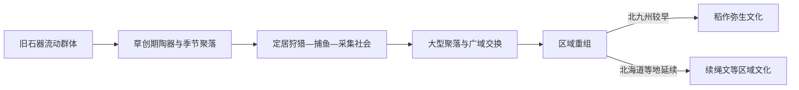

# 绳文时代

## 时间

约前1.4万年—前10至前4世纪，各地结束时间不同

## 概括

绳文时代因绳纹陶器得名，但它不是一种数千年不变的“原始文化”。列岛居民在气候、海岸和森林变化中形成多样的狩猎、捕鱼、采集、植物管理和小规模栽培组合，许多地区长期维持定居或反复使用的聚落。北日本遗址显示，未以谷物农业为核心的社会也能建设大型住居、墓地、土丘和石圈，并发展复杂仪式。西日本和北九州较早接触大陆稻作，北海道和琉球则延续不同文化序列，因此绳文—弥生界线必须按地区理解。

## 常用分期

| 分期 | 约年代 | 主要变化 |
|---|---|---|
| 草创期 | 前1.4万—前1万纪初 | 早期陶器出现，冰期末环境快速变化，聚落仍较流动 |
| 早期 | 前1万纪—前5千纪 | 海侵、森林资源和沿海捕鱼扩大，竖穴住居增加 |
| 前期 | 前5千纪—前3500年 | 较稳定村落、贝冢和区域交换发展 |
| 中期 | 前3500—前2500年 | 东日本部分地区人口与大型聚落达到高峰，陶器装饰繁复 |
| 后期 | 前2500—前1200年 | 聚落重组，墓地、石圈和仪式设施突出 |
| 晚期 | 前1200年以后 | 区域差异加深；北九州逐步进入稻作弥生文化，东北与北海道延续更久 |

年代会随碳十四校正和地方编年调整，表中只提供观察框架。

## 生计与聚落机制

- **多样食物组合**：栗、栎果、核桃、块根、鹿、野猪、鱼类、贝类和海兽按地区、季节搭配，降低依赖单一作物的风险。
- **植物管理**：三内丸山等地显示栗树利用和环境管理；豆类、葫芦等栽培证据提示“采集者—农民”不是非此即彼的分类。
- **定居并非绝对**：一些大型聚落持续数百年，另一些社区在多个季节营地间移动；房屋数量不等于同一时刻全部有人居住。
- **储藏与协作**：竖穴住居、储藏穴、垃圾堆积和公共设施显示家庭与社区共同劳动。
- **海上网络**：黑曜石、玉、沥青、贝制品和盐沿岛链、海峡与内海交换，北海道、东北、关东和中部并不孤立。

## 社会与仪式

| 证据 | 可支持的解释 | 不能过度推断之处 |
|---|---|---|
| 土偶 | 身体、生命、疾病或仪式观念的一部分 | 不能确定所有土偶都是同一种“女神” |
| 石棒、石圈与土丘 | 集体仪式、纪念和社区协作 | 用途随遗址和时期不同 |
| 墓地与随葬差异 | 亲属、年龄、身份和社区记忆 | 尚不足以证明普遍世袭王权 |
| 拔牙、饰物与漆器 | 身份标记、技术专门化和远距交换 | 不能直接套用后世阶级或民族名称 |
| 环状聚落 | 居住、墓葬和公共空间的规划 | 聚落结构不是统一模板 |

## 代表性遗址与事件

1. **大平山元遗址**保存非常早的陶片，为冰期末陶器使用提供锚点。
2. **三内丸山遗址**显示中期大型聚落、长屋、柱列建筑、栗树利用和广域物资交换。
3. **贝冢形成**记录海岸资源、食谱、犬葬和环境变化，也帮助重建当时海岸线。
4. **大汤、御所野等遗址**的石圈、墓地和公共设施显示晚期仪式与社区组织。
5. **海退与气候波动**使中期以后部分大型聚落收缩，人口重新分布；这不是整个绳文文化一次性“崩溃”。
6. **大陆稻作与金属技术进入北九州**后，旧有社区以迁移、通婚、技术采用和抵抗等多种方式回应。

## 形成、繁荣与转型原因

### 长期维持条件

- 暖流与寒流交会、森林坚果和河海资源提供较稳定而多元的食物。
- 陶器、磨石、弓箭、编织和储藏技术提高资源利用率。
- 亲族、交换和仪式网络在灾害或歉收时分散风险。

### 地区转型因素

- 气候冷暖、火山活动、海岸线和资源承载力改变聚落规模。
- 朝鲜半岛与大陆来的稻作、金属器和新人口先在北九州形成农业社会，再向东扩展。
- 转型并非原有人群被完全取代；古代DNA和考古都显示迁入、混合与区域延续并存。

## 演变关系

- 前一节点：[旧石器时代](/%E4%BA%BA%E6%96%87%E7%A7%91%E5%AD%A6/%E5%8E%86%E5%8F%B2/%E4%B8%9C%E4%BA%9A/%E6%97%A5%E6%9C%AC/%E6%97%A7%E7%9F%B3%E5%99%A8%E6%97%B6%E4%BB%A3.md)
- 后一节点：[弥生时代](/%E4%BA%BA%E6%96%87%E7%A7%91%E5%AD%A6/%E5%8E%86%E5%8F%B2/%E4%B8%9C%E4%BA%9A/%E6%97%A5%E6%9C%AC/%E5%BC%A5%E7%94%9F%E6%97%B6%E4%BB%A3.md)
- 上级：[日本历史](/%E4%BA%BA%E6%96%87%E7%A7%91%E5%AD%A6/%E5%8E%86%E5%8F%B2/%E4%B8%9C%E4%BA%9A/%E6%97%A5%E6%9C%AC/README.md)
