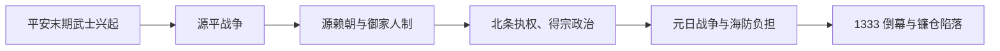

# 镰仓时代

## 时间

1185-1333年。

## 概括

镰仓时代是日本中世武家政权兴起的阶段。源赖朝建立镰仓幕府后，武士政权与京都朝廷并存，日本政治重心从贵族朝廷逐渐转向武家统治；源氏将军断绝后，幕府实际权力长期由北条氏执权掌握。

## 说明

- 对应中国南宋和元朝。
- 武家政权兴起，标志日本中世展开。
- 京都朝廷仍保留天皇和公家秩序，但幕府掌握军事和实际治理力量。
- 1221年承久之乱后，朝廷政治空间被进一步压缩，镰仓幕府对京都的控制增强。
- 元朝两次东征日本是这一时期的重要对外事件。
- 鸟兽戏画、东大寺金刚力士像和镰仓大佛是相关文化与艺术代表。

## 天皇世系

本时代天皇详见[天皇世系表](/%E4%BA%BA%E6%96%87%E7%A7%91%E5%AD%A6/%E5%8E%86%E5%8F%B2/%E4%B8%9C%E4%BA%9A/%E6%97%A5%E6%9C%AC/%E5%A4%A9%E7%9A%87%E4%B8%96%E7%B3%BB%E8%A1%A8.md)。镰仓时代主要涉及后鸟羽天皇至后醍醐天皇之间的皇统，并形成持明院统与大觉寺统交替继承的背景。

## 镰仓幕府将军世系

| 顺序 | 将军 | 在职时间 | 说明 |
| ---: | --- | --- | --- |
| 1 | **源赖朝** | 1192-1199 | 初代征夷大将军，建立镰仓幕府。 |
| 2 | 源赖家 | 1202-1203 | 源赖朝之子，后被北条氏控制并废黜。 |
| 3 | 源实朝 | 1203-1219 | 源氏将军最后一代，被刺杀。 |
| 4 | 藤原赖经 | 1226-1244 | 九条家出身的摄家将军。 |
| 5 | 藤原赖嗣 | 1244-1252 | 摄家将军。 |
| 6 | 宗尊亲王 | 1252-1266 | 皇族将军。 |
| 7 | 惟康亲王 | 1266-1289 | 皇族将军。 |
| 8 | 久明亲王 | 1289-1308 | 皇族将军。 |
| 9 | 守邦亲王 | 1308-1333 | 镰仓幕府末代将军。 |

## 北条氏执权世系

源氏将军断绝后，北条氏执权成为镰仓幕府的实际最高掌权者。

| 顺序 | 执权 | 在职时间 | 说明 |
| ---: | --- | --- | --- |
| 1 | **北条时政** | 1203-1205 | 初代执权，确立北条氏优势。 |
| 2 | **北条义时** | 1205-1224 | 承久之乱时掌握幕府实权。 |
| 3 | **北条泰时** | 1224-1242 | 制定《御成败式目》，完善武家法。 |
| 4 | 北条经时 | 1242-1246 | 北条氏得宗家掌权。 |
| 5 | 北条时赖 | 1246-1256 | 强化得宗权力。 |
| 6 | 北条长时 | 1256-1264 | 执权政治延续。 |
| 7 | 北条政村 | 1264-1268 | 北条氏一门长老。 |
| 8 | **北条时宗** | 1268-1284 | 元日战争时期实际领导者。 |
| 9 | 北条贞时 | 1284-1301 | 元寇后幕府财政和御家人问题加剧。 |
| 10 | 北条师时 | 1301-1311 | 镰仓后期执权。 |
| 11 | 北条宗宣 | 1311-1312 | 在职时间较短。 |
| 12 | 北条熙时 | 1312-1315 | 镰仓后期执权。 |
| 13 | 北条基时 | 1315 | 在职时间很短。 |
| 14 | **北条高时** | 1316-1326 | 得宗家末期代表，幕府衰落。 |
| 15 | 北条贞显 | 1326 | 在职时间很短。 |
| 16 | **北条守时** | 1326-1333 | 末代执权，镰仓幕府灭亡。 |

## 统治结构

| 类型 | 角色 | 时间 | 说明 |
| --- | --- | --- | --- |
| 君主 | 天皇 | 镰仓时代 | 保留朝廷与礼仪权威。 |
| 武家首脑 | 征夷大将军 | 1192-1333 | 幕府名义上的武家政权首脑。 |
| 实际最高领导人 | 北条氏执权 | 1203-1333 | 北条氏以执权、得宗等身份长期掌握幕府实权。 |

## 建立与分阶段发展

### 源赖朝建立武家政府（1180—1199）

平安末年庄园扩张、院政与摄关家竞争，使朝廷越来越依赖地方武士。保元、平治之乱后平氏掌握中央，但1180年以仁王举兵引发源平战争。源赖朝以镰仓为基地，把东国武士组织为御家人，设置侍所、政所和问注所；1185年平氏在坛之浦败亡，朝廷允许赖朝向各地派守护、地头，武家政府由临时军事联盟转为全国性权力网络。1192年赖朝受任征夷大将军，但幕府的实际形成早于这一任命。

### 北条执权与幕府制度化（1199—1247）

赖朝死后，北条政子及其父北条时政以将军外戚控制幕政。1219年源实朝遇刺，源氏将军断绝，幕府改立摄家、皇族为名义将军。1221年后鸟羽上皇发动承久之乱失败，幕府没收西国反幕领地、设置六波罗探题，控制京都与西国的能力大增。1232年北条泰时制定《御成败式目》，以武家惯例处理领地、继承和诉讼。1247年宝治合战消灭三浦氏后，北条得宗家权力进一步集中。

### 得宗专制与元日战争（1247—1284）

执权仍是正式职位，实际决策却逐渐由北条得宗、内管领和得宗被官组成。蒙古帝国及其控制下的高丽多次遣使，幕府拒绝臣属。1274年文永之役、1281年弘安之役中，元、高丽联军登陆九州；日本海岸防垒、武士抵抗、联军补给困难和风暴共同使入侵失败。把胜利只归因于“神风”会忽略防御工事、动员和跨海后勤。

### 财政困境、继承争议与灭亡（1284—1333）

抗元没有带来可分配的新领地，九州防务却长期消耗御家人。土地分割继承、借贷和得宗家偏袒使中小御家人困窘，1297年永仁德政令试图强制返还所卖土地，却损害信用且未解决结构问题。皇室持明院统与大觉寺统交替继承，幕府介入皇位安排。后醍醐天皇两次谋求倒幕，1331年元弘之乱后虽被流放，反幕力量仍扩散；1333年足利高氏倒向后醍醐、攻破六波罗探题，新田义贞攻陷镰仓，北条氏与幕府灭亡。

## 重要事件

| 时间 | 事件 | 过程与影响 |
| --- | --- | --- |
| 1180—1185 | 源平战争 | 源氏联盟击败平氏，赖朝在东国建立御家人网络。 |
| 1185 | 守护、地头设置 | 幕府取得地方军事、警察和庄园征收的制度支点。 |
| 1192 | 赖朝任征夷大将军 | 武家首脑身份正式化，但不是幕府突然诞生的唯一日期。 |
| 1199—1205 | 北条氏掌权 | 将军外戚以十三人合议、执权等机制控制幕政。 |
| 1219 | 源实朝遇刺 | 源氏将军断绝，摄家、皇族将军成为名义首脑。 |
| 1221 | 承久之乱 | 后鸟羽上皇败北，幕府控制朝廷、西国与皇位安排。 |
| 1232 | 《御成败式目》 | 武家法与裁判规则制度化。 |
| 1247 | 宝治合战 | 三浦氏覆灭，得宗家权力集中。 |
| 1274 | 文永之役 | 元、高丽联军首次进攻九州后撤退。 |
| 1281 | 弘安之役 | 第二次大规模进攻失败，海防负担长期化。 |
| 1297 | 永仁德政令 | 试图救济御家人，却破坏土地交易和借贷秩序。 |
| 1331—1333 | 元弘之乱与倒幕 | 后醍醐阵营、足利高氏和新田义贞共同瓦解幕府。 |

## 兴起与灭亡原因

### 兴起机制

- 东国武士需要一个能够确认领地、裁判纠纷并协调军役的中心，赖朝以御恩与奉公众关系把私人主从变成政权基础。
- 朝廷在源平战争中依赖武士，守护、地头任命使镰仓的军事权进入既有庄园网络，而非完全取代朝廷。
- 北条氏通过外戚、执权和合议机构控制幼年或外来将军，维持制度连续性。

### 衰落与直接终结

- **结构因素：** 得宗家与被官集中恩赏，御家人的分割继承、债务和诉讼压力加深。
- **外部压力：** 两次抗元提高海防与军役成本，却没有征服土地可供论功行赏。
- **合法性冲突：** 幕府介入两统迭立，引发朝廷内部反弹；后醍醐把皇位与倒幕结合。
- **直接触发：** 足利高氏临阵倒戈、新田义贞攻入镰仓，使分散不满转化为同步军事崩溃。
- 幕府灭亡后并未恢复稳定的古代天皇亲政，而是短暂进入建武新政并迅速转为[南北朝时期](/%E4%BA%BA%E6%96%87%E7%A7%91%E5%AD%A6/%E5%8E%86%E5%8F%B2/%E4%B8%9C%E4%BA%9A/%E6%97%A5%E6%9C%AC/%E5%8D%97%E5%8C%97%E6%9C%9D%E6%97%B6%E6%9C%9F.md)。

## 演变关系

- 前一节点：[平安时代](/%E4%BA%BA%E6%96%87%E7%A7%91%E5%AD%A6/%E5%8E%86%E5%8F%B2/%E4%B8%9C%E4%BA%9A/%E6%97%A5%E6%9C%AC/%E5%B9%B3%E5%AE%89%E6%97%B6%E4%BB%A3.md)。
- 后一节点：[南北朝时期](/%E4%BA%BA%E6%96%87%E7%A7%91%E5%AD%A6/%E5%8E%86%E5%8F%B2/%E4%B8%9C%E4%BA%9A/%E6%97%A5%E6%9C%AC/%E5%8D%97%E5%8C%97%E6%9C%9D%E6%97%B6%E6%9C%9F.md)。

## 相关中国朝代与东亚史

- 镰仓时代的元日战争对应[元](/%E4%BA%BA%E6%96%87%E7%A7%91%E5%AD%A6/%E5%8E%86%E5%8F%B2/%E4%B8%9C%E4%BA%9A/%E4%B8%AD%E5%9B%BD/%E5%85%83/README.md)和蒙古帝国扩张；半岛侧中介背景见[高丽王朝](/%E4%BA%BA%E6%96%87%E7%A7%91%E5%AD%A6/%E5%8E%86%E5%8F%B2/%E4%B8%9C%E4%BA%9A/%E6%9C%9D%E9%B2%9C%E5%8D%8A%E5%B2%9B/%E9%AB%98%E4%B8%BD%E7%8E%8B%E6%9C%9D.md)。
