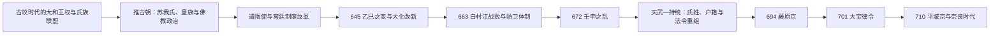

# 飞鸟时代

## 时间

593—710年。

本笔记沿用“推古朝开始（593）—迁都平城京（710）”的分期。学界也常把佛教公传的传统年代538年或552年作为飞鸟时代起点，因此飞鸟时代与古坟时代后期明显重叠；艺术史还常把645年后的晚段称为“白凤时代”。

## 概括

飞鸟时代不是一次“大化改新”便完成中央集权的时期，而是大和王权在东亚战争、佛教传播、氏族竞争与大陆制度输入的共同压力下，经过一个多世纪逐步转化为律令国家的过程。推古朝以苏我氏、皇族和渡来系技术集团为政治基础，建立冠位、宫廷规范并向隋朝派使；645年乙巳之变打破苏我本宗专权，此后的改革在白村江战败和壬申之乱后进一步加速。天武、持统两朝重组氏姓、户籍、官制、祭祀和都城，最终以689年《飞鸟净御原令》、694年藤原京和701年《大宝律令》把此前改革制度化。710年迁都平城京后，国家进入以固定都城和成文律令运转的奈良时代。

## 建立背景

- 6世纪的大和王权仍是大王、皇族与物部、苏我、大伴等氏族共同维持的联盟，地方由国造等世袭首领控制，中央尚不能像后世官僚国家那样直接治理全国。
- 佛教由百济等朝鲜半岛政权传入，传统公传年代有538年、552年两说。寺院营建需要文字、造像、冶金、瓦作和组织劳役，因而既是宗教变化，也是国家能力与氏族威望的竞争。
- 587年丁未之乱后，苏我马子击败物部守屋；592年崇峻天皇被杀，推古天皇即位。苏我氏、推古天皇与厩户皇子（后世称圣德太子）形成新的宫廷权力组合。
- “圣德太子摄政”及其制度功绩主要见于后成书的《日本书纪》和太子信仰传统；厩户皇子确为推古朝重要皇族政治人物，但其具体权限和部分事迹仍须与后世塑造区分。

## 分阶段发展

| 阶段 | 时间 | 主要权力主体 | 历史过程 |
| --- | --- | --- | --- |
| 推古朝改革与对隋交往 | 593—622年 | 推古天皇、苏我马子、厩户皇子 | 603年冠位十二阶、604年《十七条宪法》传统和607年遣隋使，推动宫廷秩序、佛教与大陆知识输入；这些措施主要规范统治集团，尚非近代意义上的宪法或全国科举官僚制。 |
| 苏我本宗专权 | 622—645年 | 苏我虾夷、苏我入鹿、皇族各支 | 厩户皇子和苏我马子去世后，苏我本宗支配王位继承与高级官职；643年山背大兄王一族覆灭，使反苏我联盟形成。 |
| 乙巳之变与改革试行 | 645—672年 | 中大兄皇子、孝德与齐明天皇、中臣镰足 | 645年苏我入鹿被杀，次年改革诏书提出公地公民、地方行政、户籍与赋税等原则；难波宫建设、遣唐使和官制调整持续推进，但诏文细节可能受8世纪律令制度影响，不能视为646年已全国落实。 |
| 海外战败与防卫国家 | 660—672年 | 齐明天皇、中大兄皇子（后为天智天皇） | 百济灭亡后朝廷出兵援助复国，663年白村江之战败于唐—新罗联军；此后在九州、濑户内和近江加强山城、烽火与防人体系，并把宫廷迁至近江大津宫。 |
| 天武—持统国家重建 | 672—697年 | 天武天皇、持统天皇、皇亲与官人 | 672年壬申之乱后，天武以军事胜利重组皇亲政治；684年八色之姓重排氏族，689年《飞鸟净御原令》施行，690年庚寅年籍建立较系统的户籍基础，694年迁入藤原京。 |
| 律令完成与迁都前夜 | 697—710年 | 文武天皇、元明天皇、藤原不比等官僚 | 701年《大宝律令》完成律、令体系，702年起施行并由遣唐使校验制度；“天皇”“日本”等国家称号在7世纪后期至8世纪初逐渐定型，首次使用的具体时间仍有争议。710年迁都平城京。 |

## 统治结构与实际权力主体

| 层级 | 机构或群体 | 运作方式与变化 |
| --- | --- | --- |
| 王权核心 | 天皇、皇后与皇太子 | 天皇号和皇位继承规则逐步制度化；女帝在统合皇族、过渡继承和推动改革中发挥实际作用，并非仅为名义君主。 |
| 皇族政治 | 厩户皇子、中大兄皇子、大海人皇子等 | 皇族既是改革发动者，也是继承战争的参与者；壬申之乱显示成文规则尚不足以消除武力争位。 |
| 强势氏族 | 苏我氏、中臣氏及后来的藤原氏 | 苏我氏依靠婚姻、佛教和财政资源掌权；中臣镰足参与乙巳之变，669年受赐“藤原”姓，其子藤原不比等在大宝律令与奈良初政局中崛起。 |
| 官僚中枢 | 大政官、神祇官及诸官司的前身 | 7世纪后期逐步形成文书化分工，至大宝律令确立二官八省式框架；它不是照搬唐制，而是结合皇族、氏姓和祭祀传统改造。 |
| 地方治理 | 国司、郡司体系的前身 | 原国造等地方首领逐渐转为郡司层级，中央派遣官员管理“国”；转型速度各地不同，东北和南九州控制尤其不均。 |
| 宗教与知识集团 | 寺院、僧尼、渡来人及书吏工匠 | 寺院承担祈祷、教育、外交和技术传播；来自百济、高句丽、新罗及中国大陆的人群参与历法、医学、建筑、文字和工艺。 |

历代天皇不在本页重复列全；推古天皇至文武天皇的顺序、重祚和在位时间见[天皇世系表](/%E4%BA%BA%E6%96%87%E7%A7%91%E5%AD%A6/%E5%8E%86%E5%8F%B2/%E4%B8%9C%E4%BA%9A/%E6%97%A5%E6%9C%AC/%E5%A4%A9%E7%9A%87%E4%B8%96%E7%B3%BB%E8%A1%A8.md)。

## 重要事件

1. **推古天皇即位（592）与厩户皇子参与朝政（593）**：结束崇峻被杀后的危机，形成女帝、皇族和苏我氏共同执政的格局。
2. **冠位十二阶（603）与《十七条宪法》（604）**：试图以服色、德目和君臣秩序约束官人；氏族出身仍然重要，不能理解为成熟的择优官僚制。
3. **遣隋使（607）**：小野妹子等使者往来隋朝，宫廷主动获取礼制、佛教与行政知识；国书措辞反映王权寻求更独立的对外身份。
4. **乙巳之变（645）**：中大兄皇子、中臣镰足等在宫廷杀死苏我入鹿，苏我虾夷自尽，苏我本宗专权终结；政变本身不等于改革已经完成。
5. **大化改新诏令（646起）**：提出土地、人户、行政区划和赋役重组方向，实际执行跨越天智、天武、持统朝，且不同地区进度不一。
6. **遣唐使展开（630起）**：留学生、学问僧与使团带回唐朝律令、历法、佛教和都城制度；航海风险高，往返常需多年。
7. **白村江之战（663）**：倭国援百济军被唐—新罗联军击败，朝廷放弃半岛军事介入，转向九州防御、户籍和动员体制建设。
8. **近江迁都与天智改革（667—671）**：迁至近江大津宫，编制户籍并强化防卫；所谓《近江令》是否作为完整法典存在，学界仍有争议。
9. **壬申之乱（672）**：大海人皇子击败大友皇子一方，次年即位为天武天皇；胜利使其得以重排氏族和官位，成为律令国家形成的直接转折。
10. **八色之姓（684）与《飞鸟净御原令》（689）**：重新规定氏族等级，并以法令、户籍和官司把宫廷改革固定下来。
11. **藤原京营建（694）**：首次建成规模完整、棋盘式规划的常设都城，集中宫殿、官署、官人住宅与市场，为平城京提供制度和工程经验。
12. **《大宝律令》（701）**：确立刑法与行政法框架，规范中央官司、地方国郡、户籍班田和赋役，是飞鸟国家建设的制度总结。
13. **迁都平城京（710）**：更大的新都适应律令官僚、人口和贡纳物资集中，飞鸟地区不再是常驻政治中心。

## 制度、经济与文化机制

### 律令与财政

改革以“公地公民”为规范性目标，把人户登记于籍帐，并按身份、年龄与性别承担田地分配和租、庸、调等义务。这个体系依赖地方首领转化为郡司、中央官人掌握文字、定期造籍以及交通仓储建设，因而是渐进形成的。氏族私有资源、寺院领地和地方共同体并未在645年后立刻消失。

### 宫都、交通与生产

难波宫、近江大津宫和藤原京的营建表明权力重心从临时宫室走向行政城市。稻作贡赋仍是财政基础，铁器、水利、仓储、道路与驿传提高资源动员能力；708年发行和同开珎前后开始尝试铜钱流通，但实物贡纳长期仍比货币重要。

### 佛教与知识传播

苏我氏以飞鸟寺等寺院建立威望，王室和各氏族随后竞建寺院。法隆寺及飞鸟、斑鸠地区的寺院、造像和壁画体现朝鲜半岛与隋唐技术的吸收；现存法隆寺核心建筑多定年于7世纪后期至8世纪初，不能把所有遗构直接等同于推古朝原建。晚7世纪“白凤文化”在造像、壁画、瓦作和宫都工程上显示国家化、国际化趋势。

佛教没有简单取代本地祭祀。天武、持统时期在建立律令佛教秩序的同时，也整编神祇祭祀；神祇官和国家祭祀由此成为律令制的一部分。

## 崛起条件、结构压力与时代转折

### 国家形成的条件

- 大和盆地连接濑户内海与朝鲜海峡航路，可吸收大陆和半岛的人员、技术与制度。
- 佛教寺院和宫都工程训练了跨氏族征发劳力、物资核算与专业分工。
- 遣隋、遣唐使把东亚现成的法律、文字和礼制资源带入，减少制度试错成本。
- 白村江战败造成直接安全压力，推动户籍、防卫、烽火和集中动员。
- 壬申之乱后的天武政权拥有重建官制与氏姓秩序的军事和政治权威。

### 持续限制

- 皇位继承仍依赖皇族联盟、婚姻和武力，女帝重祚与继承战争反映规则尚在形成。
- 中央必须借助旧国造和地方豪族征税、征兵，律令规定与地方实践之间存在落差。
- 都城、寺院、出兵和防线建设消耗巨大，赋役负担逐渐转移到编户农民。
- 唐、新罗关系兼有学习、竞争与战争，不能用单一“汉化”概括国家形成。

### 直接转折

飞鸟时代不是因王朝灭亡而结束。701年大宝律令使分散改革获得统一法典，藤原京又证明常设行政都城可运行；但其空间和物资网络仍不足以容纳扩大的官僚国家。元明天皇于710年迁都平城京，政治地理改变，而飞鸟时期形成的天皇制、律令、国郡、户籍和国家佛教则被完整带入下一阶段。

## 演变关系

- 前一节点：[古坟时代](/%E4%BA%BA%E6%96%87%E7%A7%91%E5%AD%A6/%E5%8E%86%E5%8F%B2/%E4%B8%9C%E4%BA%9A/%E6%97%A5%E6%9C%AC/%E5%8F%A4%E5%9D%9F%E6%97%B6%E4%BB%A3.md)
- 后一节点：[奈良时代](/%E4%BA%BA%E6%96%87%E7%A7%91%E5%AD%A6/%E5%8E%86%E5%8F%B2/%E4%B8%9C%E4%BA%9A/%E6%97%A5%E6%9C%AC/%E5%A5%88%E8%89%AF%E6%97%B6%E4%BB%A3.md)
- 完整皇统：[天皇世系表](/%E4%BA%BA%E6%96%87%E7%A7%91%E5%AD%A6/%E5%8E%86%E5%8F%B2/%E4%B8%9C%E4%BA%9A/%E6%97%A5%E6%9C%AC/%E5%A4%A9%E7%9A%87%E4%B8%96%E7%B3%BB%E8%A1%A8.md)
- 上级：[日本历史](/%E4%BA%BA%E6%96%87%E7%A7%91%E5%AD%A6/%E5%8E%86%E5%8F%B2/%E4%B8%9C%E4%BA%9A/%E6%97%A5%E6%9C%AC/README.md)

## 相关中国朝代与东亚史

- 遣隋使与早期国家改革可对读[隋](/%E4%BA%BA%E6%96%87%E7%A7%91%E5%AD%A6/%E5%8E%86%E5%8F%B2/%E4%B8%9C%E4%BA%9A/%E4%B8%AD%E5%9B%BD/%E9%9A%8B/README.md)。
- 遣唐使、律令和都城制度的输入可对读[唐](/%E4%BA%BA%E6%96%87%E7%A7%91%E5%AD%A6/%E5%8E%86%E5%8F%B2/%E4%B8%9C%E4%BA%9A/%E4%B8%AD%E5%9B%BD/%E5%94%90/README.md)。
- 佛教传播、白村江战争和移民技术网络可对读[百济王国](/%E4%BA%BA%E6%96%87%E7%A7%91%E5%AD%A6/%E5%8E%86%E5%8F%B2/%E4%B8%9C%E4%BA%9A/%E6%9C%9D%E9%B2%9C%E5%8D%8A%E5%B2%9B/%E7%99%BE%E6%B5%8E%E7%8E%8B%E5%9B%BD.md)与[新罗王国](/%E4%BA%BA%E6%96%87%E7%A7%91%E5%AD%A6/%E5%8E%86%E5%8F%B2/%E4%B8%9C%E4%BA%9A/%E6%9C%9D%E9%B2%9C%E5%8D%8A%E5%B2%9B/%E6%96%B0%E7%BD%97%E7%8E%8B%E5%9B%BD.md)。
