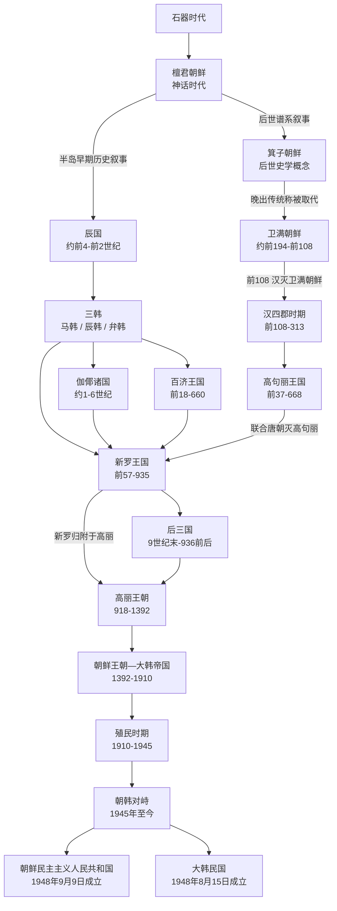

# 朝鲜半岛

这页是 `人文科学/历史/东亚/朝鲜半岛` 目录的 README 导览页。详细说明已拆分到同目录下的各阶段笔记；本页只保留演变总图和按存在顺序排列的导航。

## 历史演进流程图

## 阶段导航

| 顺序 | 名称 | 时间 | 简要概括 |
| --- | --- | --- | --- |
| 1 | [石器时代](/%E4%BA%BA%E6%96%87%E7%A7%91%E5%AD%A6/%E5%8E%86%E5%8F%B2/%E4%B8%9C%E4%BA%9A/%E6%9C%9D%E9%B2%9C%E5%8D%8A%E5%B2%9B/%E7%9F%B3%E5%99%A8%E6%97%B6%E4%BB%A3.md) | 石器时代 | 朝鲜半岛历史演变图中的最早阶段。 |
| 2 | [檀君朝鲜](/%E4%BA%BA%E6%96%87%E7%A7%91%E5%AD%A6/%E5%8E%86%E5%8F%B2/%E4%B8%9C%E4%BA%9A/%E6%9C%9D%E9%B2%9C%E5%8D%8A%E5%B2%9B/%E6%AA%80%E5%90%9B%E6%9C%9D%E9%B2%9C.md) | 神话叙事形成于古代、定型于中世 | 建国神话与共同体记忆，不等同于可连续考证的王朝。 |
| 3 | [箕子朝鲜](/%E4%BA%BA%E6%96%87%E7%A7%91%E5%AD%A6/%E5%8E%86%E5%8F%B2/%E4%B8%9C%E4%BA%9A/%E6%9C%9D%E9%B2%9C%E5%8D%8A%E5%B2%9B/%E7%AE%95%E5%AD%90%E6%9C%9D%E9%B2%9C.md) | 传说年代；后世史学概念 | 中国与朝鲜后世文献形成的箕子东来叙事，缺乏可证的连续王统，不采用晚出四十一代谱。 |
| 4 | [卫满朝鲜](/%E4%BA%BA%E6%96%87%E7%A7%91%E5%AD%A6/%E5%8E%86%E5%8F%B2/%E4%B8%9C%E4%BA%9A/%E6%9C%9D%E9%B2%9C%E5%8D%8A%E5%B2%9B/%E5%8D%AB%E6%BB%A1%E6%9C%9D%E9%B2%9C.md) | 约前194-前108 | 卫满取代准王政权后建立，右渠王时期被汉朝攻灭；可确认世系只到卫满、无名中间代与右渠。 |
| 5 | [汉四郡时期](/%E4%BA%BA%E6%96%87%E7%A7%91%E5%AD%A6/%E5%8E%86%E5%8F%B2/%E4%B8%9C%E4%BA%9A/%E6%9C%9D%E9%B2%9C%E5%8D%8A%E5%B2%9B/%E6%B1%89%E5%9B%9B%E9%83%A1%E6%97%B6%E6%9C%9F.md) | 前108-313 | 汉武帝灭卫满朝鲜后在半岛建立四郡。 |
| 6 | [高句丽王国](/%E4%BA%BA%E6%96%87%E7%A7%91%E5%AD%A6/%E5%8E%86%E5%8F%B2/%E4%B8%9C%E4%BA%9A/%E6%9C%9D%E9%B2%9C%E5%8D%8A%E5%B2%9B/%E9%AB%98%E5%8F%A5%E4%B8%BD%E7%8E%8B%E5%9B%BD.md) | 前37-668 | 扶余人朱蒙建立，后迁至平壤，5世纪进入鼎盛。 |
| 7 | [辰国](/%E4%BA%BA%E6%96%87%E7%A7%91%E5%AD%A6/%E5%8E%86%E5%8F%B2/%E4%B8%9C%E4%BA%9A/%E6%9C%9D%E9%B2%9C%E5%8D%8A%E5%B2%9B/%E8%BE%B0%E5%9B%BD.md) | 约前4世纪-前2世纪 | 文献所见中南部政治网络，范围和统一程度有争议，不宜视作单一王朝。 |
| 8 | [三韩](/%E4%BA%BA%E6%96%87%E7%A7%91%E5%AD%A6/%E5%8E%86%E5%8F%B2/%E4%B8%9C%E4%BA%9A/%E6%9C%9D%E9%B2%9C%E5%8D%8A%E5%B2%9B/%E4%B8%89%E9%9F%A9.md) | 约前2世纪末—4世纪 | 马韩、辰韩、弁韩是多国与部落联盟的统称，分别与百济、新罗、伽倻的形成相关。 |
| 9 | [百济王国](/%E4%BA%BA%E6%96%87%E7%A7%91%E5%AD%A6/%E5%8E%86%E5%8F%B2/%E4%B8%9C%E4%BA%9A/%E6%9C%9D%E9%B2%9C%E5%8D%8A%E5%B2%9B/%E7%99%BE%E6%B5%8E%E7%8E%8B%E5%9B%BD.md) | 前18-660 | 由马韩脉络发展而来，4世纪达到鼎盛。 |
| 10 | [伽倻](/%E4%BA%BA%E6%96%87%E7%A7%91%E5%AD%A6/%E5%8E%86%E5%8F%B2/%E4%B8%9C%E4%BA%9A/%E6%9C%9D%E9%B2%9C%E5%8D%8A%E5%B2%9B/%E4%BC%BD%E5%80%BB.md) | 约1—6世纪（传统纪年42—562） | 多个伽倻政治体组成的网络，金官伽倻与大伽倻先后居主导，最终被新罗吸收。 |
| 11 | [新罗王国](/%E4%BA%BA%E6%96%87%E7%A7%91%E5%AD%A6/%E5%8E%86%E5%8F%B2/%E4%B8%9C%E4%BA%9A/%E6%9C%9D%E9%B2%9C%E5%8D%8A%E5%B2%9B/%E6%96%B0%E7%BD%97%E7%8E%8B%E5%9B%BD.md) | 前57-935 | 7世纪后期借唐朝力量统一大同江以南地区，后分裂为后三国。 |
| 12 | [后三国](/%E4%BA%BA%E6%96%87%E7%A7%91%E5%AD%A6/%E5%8E%86%E5%8F%B2/%E4%B8%9C%E4%BA%9A/%E6%9C%9D%E9%B2%9C%E5%8D%8A%E5%B2%9B/%E5%90%8E%E4%B8%89%E5%9B%BD.md) | 9世纪末-936年 | 后百济、后高句丽 / 摩震 / 泰封与残存新罗并立；918年王建承接泰封，936年统一主要政权。 |
| 13 | [高丽王朝](/%E4%BA%BA%E6%96%87%E7%A7%91%E5%AD%A6/%E5%8E%86%E5%8F%B2/%E4%B8%9C%E4%BA%9A/%E6%9C%9D%E9%B2%9C%E5%8D%8A%E5%B2%9B/%E9%AB%98%E4%B8%BD%E7%8E%8B%E6%9C%9D.md) | 918-1392 | 王建建立，合并新罗、灭后百济，实现“三韩一统”。 |
| 14 | [朝鲜王朝](/%E4%BA%BA%E6%96%87%E7%A7%91%E5%AD%A6/%E5%8E%86%E5%8F%B2/%E4%B8%9C%E4%BA%9A/%E6%9C%9D%E9%B2%9C%E5%8D%8A%E5%B2%9B/%E6%9C%9D%E9%B2%9C%E7%8E%8B%E6%9C%9D.md) | 1392—1897（朝鲜王朝）；1897—1910（大韩帝国） | 李成桂取代高丽建国，1897年改国号为大韩帝国，1910年被日本吞并。 |
| 15 | [殖民时期](/%E4%BA%BA%E6%96%87%E7%A7%91%E5%AD%A6/%E5%8E%86%E5%8F%B2/%E4%B8%9C%E4%BA%9A/%E6%9C%9D%E9%B2%9C%E5%8D%8A%E5%B2%9B/%E6%AE%96%E6%B0%91%E6%97%B6%E6%9C%9F.md) | 1910-1945 | 日本总督府统治半岛，经历武断统治、有限调整、皇民化与战时总动员。 |
| 16 | [朝韩对峙](/%E4%BA%BA%E6%96%87%E7%A7%91%E5%AD%A6/%E5%8E%86%E5%8F%B2/%E4%B8%9C%E4%BA%9A/%E6%9C%9D%E9%B2%9C%E5%8D%8A%E5%B2%9B/%E6%9C%9D%E9%9F%A9%E5%AF%B9%E5%B3%99.md) | 1945年至今 | 分区占领、两个国家与朝鲜战争形成停战而未和平的长期对峙。 |
| 17 | [朝鲜民主主义人民共和国](/%E4%BA%BA%E6%96%87%E7%A7%91%E5%AD%A6/%E5%8E%86%E5%8F%B2/%E4%B8%9C%E4%BA%9A/%E6%9C%9D%E9%B2%9C%E5%8D%8A%E5%B2%9B/%E6%9C%9D%E9%B2%9C%E6%B0%91%E4%B8%BB%E4%B8%BB%E4%B9%89%E4%BA%BA%E6%B0%91%E5%85%B1%E5%92%8C%E5%9B%BD.md) | 1948年9月9日至今 | 劳动党领导的北方国家，历经战争、重建、饥荒、市场化适应与核导建设。 |
| 18 | [大韩民国](/%E4%BA%BA%E6%96%87%E7%A7%91%E5%AD%A6/%E5%8E%86%E5%8F%B2/%E4%B8%9C%E4%BA%9A/%E6%9C%9D%E9%B2%9C%E5%8D%8A%E5%B2%9B/%E5%A4%A7%E9%9F%A9%E6%B0%91%E5%9B%BD.md) | 1948年8月15日至今 | 由威权发展型国家转型为民主共和国，并完成快速工业化。 |

## 专题表

- [朝鲜总督表](/%E4%BA%BA%E6%96%87%E7%A7%91%E5%AD%A6/%E5%8E%86%E5%8F%B2/%E4%B8%9C%E4%BA%9A/%E6%9C%9D%E9%B2%9C%E5%8D%8A%E5%B2%9B/%E6%9C%9D%E9%B2%9C%E6%80%BB%E7%9D%A3%E8%A1%A8.md)：殖民时期总督、代理总督与统治机构。
- [大韩民国总统与国务总理表](/%E4%BA%BA%E6%96%87%E7%A7%91%E5%AD%A6/%E5%8E%86%E5%8F%B2/%E4%B8%9C%E4%BA%9A/%E6%9C%9D%E9%B2%9C%E5%8D%8A%E5%B2%9B/%E5%A4%A7%E9%9F%A9%E6%B0%91%E5%9B%BD%E6%80%BB%E7%BB%9F%E4%B8%8E%E5%9B%BD%E5%8A%A1%E6%80%BB%E7%90%86%E8%A1%A8.md)：历任总统、代总统、国务总理及代理履职。
- [朝鲜国家领导人与内阁总理表](/%E4%BA%BA%E6%96%87%E7%A7%91%E5%AD%A6/%E5%8E%86%E5%8F%B2/%E4%B8%9C%E4%BA%9A/%E6%9C%9D%E9%B2%9C%E5%8D%8A%E5%B2%9B/%E6%9C%9D%E9%B2%9C%E5%9B%BD%E5%AE%B6%E9%A2%86%E5%AF%BC%E4%BA%BA%E4%B8%8E%E5%86%85%E9%98%81%E6%80%BB%E7%90%86%E8%A1%A8.md)：最高领导人、国家代表机关负责人和内阁总理分表。

## 相关中国朝代与民族史

- 古朝鲜、扶余、高句丽和渤海等早期线索与[东北濊貊与朝鲜](/%E4%BA%BA%E6%96%87%E7%A7%91%E5%AD%A6/%E5%8E%86%E5%8F%B2/%E4%B8%9C%E4%BA%9A/%E4%B8%AD%E5%9B%BD/_%E6%B0%91%E6%97%8F/%E4%B8%9C%E5%8C%97%E6%BF%8A%E8%B2%8A%E4%B8%8E%E6%9C%9D%E9%B2%9C/README.md)、[渤海线索](/%E4%BA%BA%E6%96%87%E7%A7%91%E5%AD%A6/%E5%8E%86%E5%8F%B2/%E4%B8%9C%E4%BA%9A/%E4%B8%AD%E5%9B%BD/_%E6%B0%91%E6%97%8F/%E4%B8%9C%E5%8C%97%E6%BF%8A%E8%B2%8A%E4%B8%8E%E6%9C%9D%E9%B2%9C/%E6%B8%A4%E6%B5%B7%E7%BA%BF%E7%B4%A2/README.md)交叉；半岛目录维护国家史，民族目录维护族群源流。
- 汉四郡与[汉](/%E4%BA%BA%E6%96%87%E7%A7%91%E5%AD%A6/%E5%8E%86%E5%8F%B2/%E4%B8%9C%E4%BA%9A/%E4%B8%AD%E5%9B%BD/%E6%B1%89/README.md)相关；隋唐对高句丽和半岛三国秩序的重组，见[隋](/%E4%BA%BA%E6%96%87%E7%A7%91%E5%AD%A6/%E5%8E%86%E5%8F%B2/%E4%B8%9C%E4%BA%9A/%E4%B8%AD%E5%9B%BD/%E9%9A%8B/README.md)、[唐](/%E4%BA%BA%E6%96%87%E7%A7%91%E5%AD%A6/%E5%8E%86%E5%8F%B2/%E4%B8%9C%E4%BA%9A/%E4%B8%AD%E5%9B%BD/%E5%94%90/README.md)。
- 高丽与辽、金、元互动密切，见[辽宋金西夏](/%E4%BA%BA%E6%96%87%E7%A7%91%E5%AD%A6/%E5%8E%86%E5%8F%B2/%E4%B8%9C%E4%BA%9A/%E4%B8%AD%E5%9B%BD/%E8%BE%BD%E5%AE%8B%E9%87%91%E8%A5%BF%E5%A4%8F/README.md)、[元](/%E4%BA%BA%E6%96%87%E7%A7%91%E5%AD%A6/%E5%8E%86%E5%8F%B2/%E4%B8%9C%E4%BA%9A/%E4%B8%AD%E5%9B%BD/%E5%85%83/README.md)；朝鲜王朝与明清秩序相关，见[明](/%E4%BA%BA%E6%96%87%E7%A7%91%E5%AD%A6/%E5%8E%86%E5%8F%B2/%E4%B8%9C%E4%BA%9A/%E4%B8%AD%E5%9B%BD/%E6%98%8E/README.md)、[清](/%E4%BA%BA%E6%96%87%E7%A7%91%E5%AD%A6/%E5%8E%86%E5%8F%B2/%E4%B8%9C%E4%BA%9A/%E4%B8%AD%E5%9B%BD/%E6%B8%85/README.md)。

## 直接上级

- [东亚历史](/%E4%BA%BA%E6%96%87%E7%A7%91%E5%AD%A6/%E5%8E%86%E5%8F%B2/%E4%B8%9C%E4%BA%9A/README.md)
