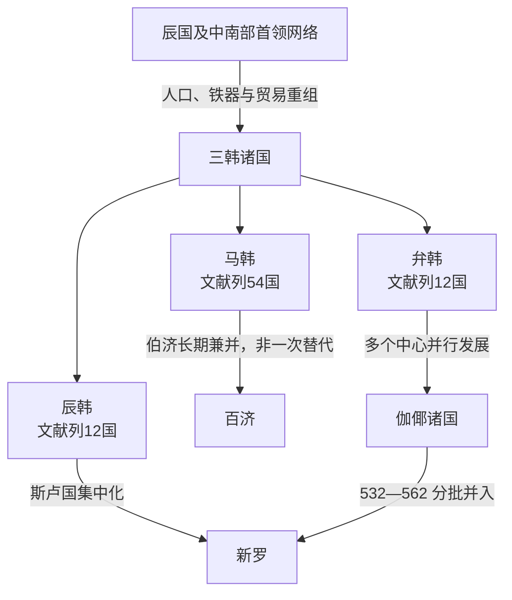

# 三韩

## 时间

约前1世纪至4世纪前后；马韩、辰韩、弁韩各地进入百济、新罗和伽倻体系的时间不同，不能用一个统一终止年概括。

## 概括

三韩是中国史书对朝鲜半岛中南部马韩、辰韩、弁韩诸小国的合称，不是一个叫“三韩”的统一国家，也不是三个边界固定、各有单一王朝的国家。3世纪《三国志》列马韩五十四国、辰韩十二国、弁韩十二国，共七十八个政治体；这个清单主要反映成书者掌握的特定时期状况，不能假定七十八国在数百年间同时、原样存在。百济、斯卢和多支伽倻政治体从这些网络中成长，通过联盟、战争和吸纳逐步取代旧格局。

## 证据边界

| 证据 | 可说明内容 | 限制 |
| --- | --- | --- |
| 《三国志》东夷传 | 3世纪左右诸国数量、首领称号、祭祀、经济与对郡县关系 | 成书晚于三韩早期，分类带有外部观察和概括 |
| 《后汉书》等文献 | 1—2世纪韩人与郡县往来、辰王及三韩分布 | 部分材料转录更早记录，年代层次需区分 |
| 聚落与墓葬 | 稻作、铁器、木棺墓、瓮棺墓和区域中心演变 | 物质文化边界不必与文献“国”界重合 |
| 郡县、倭与半岛国家记录 | 外交、贸易和战争网络 | 同一名称可能随时间指不同联盟或地点 |
| 后世建国传说 | 百济、新罗、伽倻对自身起源的记忆 | 前57、前18、42等精确建国年多属回溯纪年，不能替代考古分期 |

## 三大区域网络

| 系统 | 文献所列小国 | 大致区域 | 政治与经济特点 | 后续主线 |
| --- | ---: | --- | --- | --- |
| 马韩 | 54 | 汉江以南至半岛西南部 | 规模最大；目支国首领曾以“辰王”居联盟上位，实际控制有限；稻作和对乐浪、带方贸易重要 | 伯济国壮大为[百济王国](/%E4%BA%BA%E6%96%87%E7%A7%91%E5%AD%A6/%E5%8E%86%E5%8F%B2/%E4%B8%9C%E4%BA%9A/%E6%9C%9D%E9%B2%9C%E5%8D%8A%E5%B2%9B/%E7%99%BE%E6%B5%8E%E7%8E%8B%E5%9B%BD.md)，西南诸中心被逐步吸收 |
| 辰韩 | 12 | 洛东江以东和庆州一带 | 多个谷地小国；斯卢国逐步整合周边；铁器、农业和东海岸交通发展 | 斯卢国成长为[新罗王国](/%E4%BA%BA%E6%96%87%E7%A7%91%E5%AD%A6/%E5%8E%86%E5%8F%B2/%E4%B8%9C%E4%BA%9A/%E6%9C%9D%E9%B2%9C%E5%8D%8A%E5%B2%9B/%E6%96%B0%E7%BD%97%E7%8E%8B%E5%9B%BD.md) |
| 弁韩 | 12 | 洛东江中下游与南海岸 | 与辰韩语言风俗相近且空间交错；铁生产、出口和海上交通突出 | 多个小国发展成[伽倻](/%E4%BA%BA%E6%96%87%E7%A7%91%E5%AD%A6/%E5%8E%86%E5%8F%B2/%E4%B8%9C%E4%BA%9A/%E6%9C%9D%E9%B2%9C%E5%8D%8A%E5%B2%9B/%E4%BC%BD%E5%80%BB.md)诸政治体 |

“马韩—百济、辰韩—新罗、弁韩—伽倻”是便于理解的主线，不表示三韩各自在某一年整体改名。尤其马韩西南部的地方社会延续较久，百济吸收过程和时间仍有考古争论。

## 形成背景

前2世纪末卫满朝鲜灭亡、汉郡县设置，使原来被北方王国控制的贸易路线发生变化。古朝鲜遗民和其他北方人口南迁，铁器、文字知识与新型墓葬进入中南部；本地稻作聚落、海岸贸易和首领集团同时持续发展。原来可能被概称为[辰国](/%E4%BA%BA%E6%96%87%E7%A7%91%E5%AD%A6/%E5%8E%86%E5%8F%B2/%E4%B8%9C%E4%BA%9A/%E6%9C%9D%E9%B2%9C%E5%8D%8A%E5%B2%9B/%E8%BE%B0%E5%9B%BD.md)的网络因此分化、重组，外部文献到1—3世纪越来越常用马韩、辰韩、弁韩描述它们。

## 政治与社会机制

### 小国与邑落

文献中的“国”多由一个中心邑落和周边村落构成，大国可能有万余家，小国只有数千家或更少。首领称臣智、邑借等，称号大小反映地位差异。首领掌握对外交涉、军事、贸易和祭祀，却仍须与下属邑落协商。

### 辰王与联盟

马韩目支国首领一度被称为辰王，似乎拥有跨国威望；但文献也说辰王不能自行继位或对诸国实行直接行政，说明其更像联盟共主。随着伯济等地方强国上升，目支国的上位地位衰退。没有可连续列名的辰王世系。

### 生产与贸易

水稻、粟黍及铁制农具支撑人口增长。弁韩铁既供半岛内部，也流向乐浪、带方和日本列岛，并可能兼作交换媒介。沿海港口、洛东江和汉江流域把地方社会接入黄海、朝鲜海峡网络，贸易收益帮助部分首领扩大随从和武装。

### 祭祀与共同体

文献记五月播种后、十月收获后举行群体祭祀、饮酒歌舞；另有天君主持仪式、苏涂作为神圣空间。宗教权威有时与世俗首领并列，既能整合邑落，也可能限制政治首领直接控制圣域。

## 重要事件与过程

| 时间 | 事件 / 过程 | 转折意义 |
| --- | --- | --- |
| 前2世纪 | 辰国及中南部首领网络寻求对外联系 | 为三韩形成提供区域政治基础 |
| 前108以后 | 乐浪等郡设置，古朝鲜人口南迁 | 铁器、移民和贸易路线共同促成南部重组 |
| 前1世纪—1世纪 | 木棺墓、铁器和稻作聚落扩大 | 地方首领控制资源，多个小国逐渐清楚 |
| 1世纪前后 | 伯济、斯卢等小国开始扩大 | 三韩内部出现能够长期兼并邻国的核心 |
| 2世纪 | 韩诸国与乐浪、带方既贸易又冲突 | 郡县不只是文化来源，也是争夺通道的军事对手 |
| 3世纪中叶 | 魏与韩诸国发生战争，带方太守弓遵战死 | 郡县试图重建权威，反而显示韩人政治与军事力量增长 |
| 3世纪 | 《三国志》形成五十四、十二、十二国框架 | 留下最完整文字快照，但不是跨时代不变地图 |
| 3—4世纪 | 伯济与斯卢集中王权、兼并邻国 | 百济、新罗从联盟成员转为区域国家 |
| 4—6世纪 | 弁韩地区维持多个伽倻中心 | 多中心体制延续，最终在百济、新罗竞争中被吸收 |
| 4—6世纪 | 马韩西南地方社会逐步进入百济体系 | 具体终结年代因文献与墓葬解释不同而有争议 |

## 首领与统治结构

| 系统 | 最高或重要层级 | 可识别人物 | 说明 |
| --- | --- | --- | --- |
| 马韩 | 辰王、目支国首领、各国臣智 | 无可靠连续姓名 | 辰王拥有礼仪或联盟上位地位，但不能任意世袭和直接统治五十四国 |
| 辰韩 | 各国臣智、邑借等 | 无可靠连续姓名 | 斯卢国王室后来可列世系，不应倒填为整个辰韩共同王统 |
| 弁韩 | 各国首领 | 无可靠连续姓名 | 后来的金官、大伽倻等各有自身首领，不能合造成一个弁韩王朝 |

三韩不适用单一君主世系表。若把后世百济、新罗的传说始祖全部倒填为三韩首领，会混淆回溯建国叙事和当时政治结构。

## 崛起、分化与终结原因

- **结构条件**：稻作、铁器和人口增长使中心邑落获得更多粮食、武器和劳力。
- **联盟机制**：祭祀、贸易和共同防御促成跨邑落合作，但山地和河谷分隔使地方自治长期存在。
- **外部压力**：郡县、北方移民和日本列岛交流提供技术与财富，也引发通道和贡赐竞争。
- **强国上升**：伯济、斯卢等把贸易收益转化为军队、官职和世袭王权，逐步兼并同类小国。
- **非同步终结**：百济较早整合汉江流域，斯卢在4—6世纪完成新罗集中化，伽倻多国则延续到562年；因此不存在三韩“同日灭亡”。

## 演变关系

- 前一节点：[辰国](/%E4%BA%BA%E6%96%87%E7%A7%91%E5%AD%A6/%E5%8E%86%E5%8F%B2/%E4%B8%9C%E4%BA%9A/%E6%9C%9D%E9%B2%9C%E5%8D%8A%E5%B2%9B/%E8%BE%B0%E5%9B%BD.md)，但这是多中心重组而不是统一王国机械“三分”。
- 后续节点：[百济王国](/%E4%BA%BA%E6%96%87%E7%A7%91%E5%AD%A6/%E5%8E%86%E5%8F%B2/%E4%B8%9C%E4%BA%9A/%E6%9C%9D%E9%B2%9C%E5%8D%8A%E5%B2%9B/%E7%99%BE%E6%B5%8E%E7%8E%8B%E5%9B%BD.md)、[新罗王国](/%E4%BA%BA%E6%96%87%E7%A7%91%E5%AD%A6/%E5%8E%86%E5%8F%B2/%E4%B8%9C%E4%BA%9A/%E6%9C%9D%E9%B2%9C%E5%8D%8A%E5%B2%9B/%E6%96%B0%E7%BD%97%E7%8E%8B%E5%9B%BD.md)、[伽倻](/%E4%BA%BA%E6%96%87%E7%A7%91%E5%AD%A6/%E5%8E%86%E5%8F%B2/%E4%B8%9C%E4%BA%9A/%E6%9C%9D%E9%B2%9C%E5%8D%8A%E5%B2%9B/%E4%BC%BD%E5%80%BB.md)。
- 北方并行背景见[汉四郡时期](/%E4%BA%BA%E6%96%87%E7%A7%91%E5%AD%A6/%E5%8E%86%E5%8F%B2/%E4%B8%9C%E4%BA%9A/%E6%9C%9D%E9%B2%9C%E5%8D%8A%E5%B2%9B/%E6%B1%89%E5%9B%9B%E9%83%A1%E6%97%B6%E6%9C%9F.md)。
