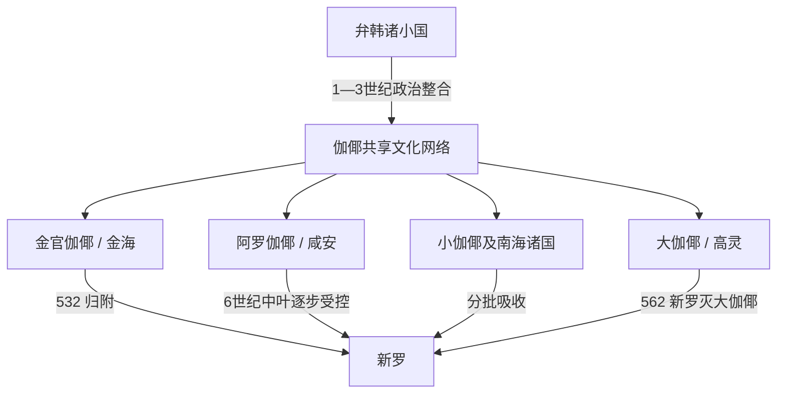

# 伽倻

## 时间

约1世纪—562年。传统以42年为金官伽倻首露王建国年；这一精确年份来自后世建国传说。考古上更稳妥的说法是：弁韩诸政治体在1—3世纪逐步转化为共享伽倻文化、但保持自主的多个国家。

## 别称

- 加耶
- 加罗诸国
- 伽倻联盟

## 概括

伽倻是洛东江中下游、南海岸和邻近内陆盆地多个政治体的文化—政治网络。金官伽倻、大伽倻、阿罗伽倻、小伽倻等各有中心墓地、首领和外交选择，彼此共享伽倻式陶器、石椁墓、铁器与贸易联系，却没有形成一个能长期任命各地官员的“伽倻中央王朝”。考古所见相近规模的首领墓地和地方差异，正好说明其“文化相通、政治多元”的特点。

## 证据边界

| 证据类型 | 可说明内容 | 必须保留的限制 |
| --- | --- | --- |
| 大成洞、池山洞、末伊山等墓群 | 地方首领权力、墓葬等级、铁制武器及各国自主性 | 墓葬不能自动对应后世谱牒中的每一位国王 |
| 伽倻式陶器与石椁墓 | 多个政治体共享文化规范和交流网络 | 共享文化不等于统一国家 |
| 《三国史记》及中国南朝记录 | 479年荷知遣使、532和562年并入新罗等政治事件 | 记载零散，无法补成所有国家的完整王表 |
| 《三国遗事》所引《驾洛国记》 | 首露王、六卵降生及金官伽倻传统世系 | 成书与所述时代相距很远，42年只能标作传统纪年 |
| 《日本书纪》等列岛材料 | 伽倻、百济、倭之间频繁军事和外交互动 | “任那”范围、对应政体和日方控制程度长期有争议，不能直接写成日本殖民统治 |

## 形成与崛起机制

### 弁韩基础与铁资源

伽倻诸国承接[三韩](/%E4%BA%BA%E6%96%87%E7%A7%91%E5%AD%A6/%E5%8E%86%E5%8F%B2/%E4%B8%9C%E4%BA%9A/%E6%9C%9D%E9%B2%9C%E5%8D%8A%E5%B2%9B/%E4%B8%89%E9%9F%A9.md)中弁韩地区的农业和铁生产。洛东江流域拥有铁矿、冶炼技术与河海运输条件，铁锭、农具、武器既供应半岛，也流向乐浪、带方和日本列岛。控制矿产、工匠与港口的首领能够通过交换获得铜镜、玉器、马具和威望品。

### 盆地政治与多中心格局

南部山地把金海、咸安、高灵、陕川、固城、昌宁、南原等盆地分隔开，各地适合形成独立中心，却不利于一个王都持续直接统治全部区域。地方首领通过共同陶器风格、婚盟、军事协作和贸易维持“伽倻”身份，同时保留各自墓地、军队和外交。

### 海陆交通

金海一带接近洛东江口和朝鲜海峡，早期在同北九州、郡县和半岛诸国贸易中占优势。5世纪以后内陆路线和骑兵装备的重要性上升，高灵的大伽倻凭借洛东江西岸及内陆联系成为更强中心，但仍未把所有伽倻变成行政属地。

## 主要政治体

| 政治体 | 核心区域 | 主要证据与特点 | 结局 |
| --- | --- | --- | --- |
| 金官伽倻 / 狗邪国传统 | 今金海，大成洞墓群 | 早期海运、铁贸易和大型木椁墓突出；首露王传统属于后世记忆 | 532年国王仇衡 / 仇亥率众降新罗 |
| 大伽倻 | 今高灵，池山洞墓群 | 5—6世纪内陆强国；大型封土墓、马具、武器和对南朝外交 | 562年为新罗所灭 |
| 阿罗伽倻 | 今咸安，末伊山墓群 | 地处百济、新罗与南海交通之间，多次组织或参加外交协调 | 6世纪中叶前后逐步受新罗控制 |
| 小伽倻 | 今固城、晋州一带 | 南海岸港口与海上贸易重要，墓葬保有地方风格 | 6世纪中叶前后被周边强国吸收 |
| 多罗、非火、星山等诸国 | 陕川、昌宁、星州等地 | 各自拥有首领墓地和地方陶器体系 | 5—6世纪分批进入百济或新罗势力范围 |

这些名称、位置和边界在文献与考古对应上并非全部确定；表格用于展示多国格局，不是完整而固定的“六伽倻行政区”。

## 可识别统治者与证据状态

| 政治体 | 人物 | 时间 | 身份与事件 | 证据说明 |
| --- | --- | --- | --- | --- |
| 金官伽倻 | 首露王 | 传统纪年42年起 | 六卵降生神话中的建立者 | 后世《驾洛国记》传统；不能视为同期确认人物或给出实证在位年 |
| 加罗 / 常与大伽倻联系 | 荷知王 | 479年前后 | 遣使南齐并获册号 | 南朝记录可证“加罗王荷知”；其政权是否必等同后世大伽倻仍需说明 |
| 大伽倻 | 嘉悉王 | 6世纪中叶传统 | 相传命于勒制伽倻琴乐曲 | 主要见后世新罗音乐叙事，具体在位期不详 |
| 金官伽倻 | **仇衡王 / 仇亥王** | 不详—532 | 率国归附新罗，王族后裔进入新罗贵族 | 名称在史书间有异写；灭国事件较明确 |
| 大伽倻 | **道设智王** | 不详—562 | 大伽倻末王，国亡于新罗 | 后世史料可辨，生卒和完整继承关系不详 |

现有材料不能支持把所有伽倻政治体串成一张单一王统。金官伽倻后出十王谱、大伽倻始祖谱和其他地方传说可作为文化记忆研究，但不应填补成“公认伽倻君主全集”。

## 分阶段发展与重要事件

### 1—3世纪：弁韩向伽倻转化

| 时间 | 事件 / 过程 | 意义 |
| --- | --- | --- |
| 1—2世纪 | 洛东江流域铁器生产与海运扩大 | 狗邪、安邪等弁韩小国获得跨海贸易收益 |
| 2—3世纪 | 木棺、木椁墓和输入品显示首领分层 | 各盆地中心成长，尚未出现统一伽倻 |
| 3世纪后期 | 乐浪、带方及东亚海路格局变化 | 金海等港口重新调整贸易伙伴与政治联盟 |

### 4世纪：金官中心与区域冲击

大成洞大型墓葬显示金海首领集团达到高峰，铁甲、马具和外来器物反映军事与贸易能力。400年前后高句丽军南下援助新罗、攻击倭系及其盟军，常被联系到金官伽倻权力网络受创；但参战者构成和“任那加罗”具体所指有文本争议，不能写成高句丽明确消灭整个伽倻。

### 5世纪：大伽倻上升

金官优势减弱后，高灵的大伽倻利用内陆铁产、农业与西部交通扩大影响。479年“加罗王荷知”遣使南齐，显示至少一个伽倻政权能独立参与国际册封。与此同时阿罗、小伽倻等仍保持自身墓地和外交，证明大伽倻并未完成统一。

### 6世纪：夹击与分批灭亡

| 时间 | 事件 | 结果 |
| --- | --- | --- |
| 522 | 大伽倻与新罗缔结婚姻联盟 | 试图以婚盟抵消百济、新罗压力，因领土和服饰、从属争议很快破裂 |
| 532 | 金官伽倻归附新罗 | 新罗控制洛东江口，金官王族被吸收到新罗骨品贵族 |
| 541、544 | 百济召开泗沘会议，伽倻诸国参与 | 诸国寻求借百济遏制新罗，也显示其没有统一外交代表 |
| 554 | 大伽倻等与百济共同对新罗作战 | 管山城战败使反新罗联盟严重受挫 |
| 560年前后 | 新罗吞并阿罗伽倻 | 新罗把控制推进到南部核心盆地，大伽倻更趋孤立 |
| 562 | 新罗将领异斯夫等灭大伽倻 | 最强独立中心消失，伽倻政治史终结 |

## 鼎盛条件

- 铁矿、冶炼工匠和洛东江运输带来长期贸易优势。
- 盆地农业和大型墓葬动员为首领提供粮食、劳力与军事随从。
- 位于百济、新罗、郡县和日本列岛之间，使诸国能够利用多边外交维持自主。
- 共享陶器、葬制和交换规范降低内部合作成本，又不要求取消地方王权。

## 衰落与灭亡原因

- **结构因素**：联盟缺少固定中央、共同财政和统一军令；各国可分别倒向百济或新罗。
- **经济变化**：乐浪、带方消失和东亚海路重组削弱部分早期中转优势；新罗也逐步掌握铁产和港口。
- **外部压力**：百济和新罗已形成更集中的军政体系，能长期筑城、迁民和逐国兼并。
- **外交困境**：伽倻诸国依赖在强邻间平衡，婚盟和泗沘会议都未建立稳定集体防御。
- **直接过程**：532年金官先降，使新罗取得东部与河口支点；554年反新罗联盟战败；560年前后阿罗被并吞；562年大伽倻被军事征服。

## 争议辨析

日本近代曾把“任那日本府”解释为日本古代在半岛南部的殖民统治。现有研究更强调《日本书纪》成书较晚、术语跨时段变化，以及倭人、百济、伽倻诸国之间复杂的使节、移民、工匠和军事合作。承认列岛势力深度参与，并不等于存在一个直接统治全部伽倻的日本总督府。

## 演变关系

- 前一节点：[三韩](/%E4%BA%BA%E6%96%87%E7%A7%91%E5%AD%A6/%E5%8E%86%E5%8F%B2/%E4%B8%9C%E4%BA%9A/%E6%9C%9D%E9%B2%9C%E5%8D%8A%E5%B2%9B/%E4%B8%89%E9%9F%A9.md)中的弁韩诸国。
- 主要后一节点：[新罗王国](/%E4%BA%BA%E6%96%87%E7%A7%91%E5%AD%A6/%E5%8E%86%E5%8F%B2/%E4%B8%9C%E4%BA%9A/%E6%9C%9D%E9%B2%9C%E5%8D%8A%E5%B2%9B/%E6%96%B0%E7%BD%97%E7%8E%8B%E5%9B%BD.md)。
- 百济长期参与伽倻外交和抗新罗联盟，见[百济王国](/%E4%BA%BA%E6%96%87%E7%A7%91%E5%AD%A6/%E5%8E%86%E5%8F%B2/%E4%B8%9C%E4%BA%9A/%E6%9C%9D%E9%B2%9C%E5%8D%8A%E5%B2%9B/%E7%99%BE%E6%B5%8E%E7%8E%8B%E5%9B%BD.md)。
