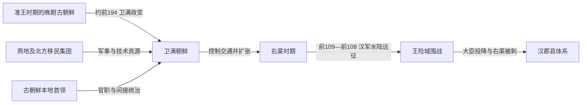

# 卫满朝鲜

## 时间

约前194—前108年。

## 别称

- 卫氏朝鲜
- 卫满政权

## 概括

卫满朝鲜是战国、秦汉之际移民集团与古朝鲜本地势力重组后形成的王国。卫满原在燕地活动，汉初率千余人进入古朝鲜边境，先获准王任用，继而约前194年发动政变、取得王位。新政权保留“朝鲜”国号，并让移民首领和本地贵族共同进入统治集团；它凭借铁制武器、边境军事和对汉—濊—辰交通的中转控制迅速扩张。前109—前108年的汉朝远征并非一击即胜，王险城在长期防守后因上层分裂、投降和刺杀而陷落。

## 建立背景与崛起机制

秦末汉初的战争造成燕、齐、赵等地人口向辽东和古朝鲜迁移。准王把卫满安置在西部边境，授予“博士”等地位，让他统辖移民、守卫边界。卫满由此获得武装、人口和独立地盘，随后以汉军将至、请求入都护王为名接近王险城，夺取准王政权。

卫满的成功不宜描述为一支“汉人军队”简单征服整个古朝鲜。文献说他入境时结椎、着蛮夷服；更重要的是，新王朝继续使用朝鲜国号并吸收本地大臣。其政权更像掌握边疆军事的移民集团与古朝鲜地方首领的联合统治。

崛起依靠四项机制：

- **军事技术**：移民带来更成熟的铁器、骑战和汉地军事经验。
- **地缘位置**：王险城控制辽东、半岛西北与南部政治体之间的通道。
- **中转贸易**：王室阻止濊、辰等直接与汉往来，垄断朝贡、物产和金属器交换。
- **间接统治**：王下设相、将军等职，并让拥有自身邑落和部众的首领参与中央，减少立即反抗。

## 统治结构

| 层级 / 职位 | 作用 | 权力特征 |
| --- | --- | --- |
| 王 | 掌握战争、外交、贸易通道和最高裁决 | 王权增强，但不能完全取消地方集团自治 |
| 相 | 中央大臣或被吸纳的区域首领，如朝鲜相、尼谿相 | 往往有本族、本邑和部众，可集体南迁或在战争中独立投降 |
| 将军 | 负责军队与要地防卫 | 王险城防守显示国家已有较强军事组织 |
| 大小渠帅 / 邑落首领 | 统治地方共同体并向王室服从 | 中央通过他们征发、贸易和动员，不是现代式直接行政 |
| 民众 | 本地古朝鲜人、较早移民与新迁入者 | 身份混合；法律保护生命和财产，也反映贫富、刑罚与奴役扩大 |

所谓“八条法禁”现只存杀人偿命、伤人赔谷、盗窃没为奴婢或赎罪等少数条文。它们可用于观察社会分层和财产权，却不能可靠归给箕子或卫满某一位君主亲自制定。

## 君主世系

| 顺序 | 君主 | 在位时间 | 与前任关系 | 关键事件 / 证据说明 |
| --- | --- | --- | --- | --- |
| 1 | **卫满** | 约前194年起，卒年不详 | 建立者 | 受准王任用后政变夺位；整合移民与本地贵族，扩张至真番、临屯等周边政治体 |
| 2 | 无名王 | 不详 | 卫满之子 | 主要根据右渠被称为卫满之孙而推定中间存在一代；姓名、是否正式在位及具体年限均无可靠记载 |
| 3 | **右渠王** | 不详—前108 | 卫满之孙 | 拒绝让周边首领直接通汉；杀汉使涉何；抵抗汉军约一年，后被尼谿相参派人刺杀 |

表列出了现有材料能够辨认或推定的完整王位序列。第二代不能留空或与右渠合并，但也不能把“祖孙关系”夸大为其在位已经被独立史料确认。

## 重要事件

| 时间 | 事件 | 过程与意义 |
| --- | --- | --- |
| 约前195—前194 | 卫满率千余人进入古朝鲜 | 在秦汉边境重组中获得准王信任、人口与边防职权 |
| 约前194 | 卫满政变 | 以汉军来袭为由接近王都并夺位；准王南走，古朝鲜统治集团重组 |
| 前2世纪前期 | 与汉辽东地方政府达成边境安排 | 卫满名义上充当外臣、维护边界，实际借汉的承认扩张 |
| 前2世纪中期 | 真番、临屯等周边集团受其影响或控制 | 王国版图和人口扩大，铁器与军事力量增强 |
| 右渠时期 | 阻断濊、辰等直接通汉 | 中转收益增加，也使周边政治体和汉帝国不满 |
| 右渠时期 | 朝鲜相历谿卿率二千余户南迁 | 显示王权与地方集团存在分歧，地方首领保有独立动员能力 |
| 前109 | 汉使涉何交涉失败并杀朝鲜送行将领，右渠报复杀涉何 | 边境暴力使外交危机升级为汉武帝远征 |
| 前109—前108 | 汉军水陆进攻王险城 | 杨仆水军和荀彘陆军初战受挫，围城与谈判反复，朝鲜并非迅速崩溃 |
| 前108 | 大臣分裂、右渠被刺 | 韩阴、王唊、尼谿相参等投降或反王；右渠死后成巳继续抵抗 |
| 前108 | 王险城陷落 | 汉利用降臣和原统治集团瓦解余部，随后设置郡县 |

## 鼎盛条件

卫满朝鲜处在辽东、半岛和海路交通交汇处，既能获得汉地铁器和移民技术，又能控制本地物产和南部政治体对外联系。王室没有彻底排斥地方首领，而是以官职和贸易利益吸纳他们；这一联盟结构帮助早期扩张，也是王国能抵挡汉军近一年的原因。

## 衰落与灭亡原因

- **结构因素**：国家以王室和多个强势邑落集团的联盟为基础，权力集中程度有限；相、将军等人拥有自己的部众和谈判空间。
- **外部压力**：汉武帝试图控制东北边疆、阻断可能的匈奴联系，并打破朝鲜对周边交通和朝贡的垄断。
- **政策冲突**：右渠拒绝周边首领直接通汉，涉何事件又使边境矛盾军事化。
- **战争消耗**：汉军虽初战失利，却能够持续增兵、围城和招降；朝鲜难以长期承受帝国级后勤压力。
- **直接触发**：围城中上层对战与和意见分裂，多名大臣投降，尼谿相参派人刺杀右渠；王险城的联合防御由内部瓦解。

因此，卫满朝鲜不是单纯因“汉军强大”灭亡，也不是只因“内讧”崩溃，而是外部长期战争把联合政体的内部裂缝转化为致命危机。

## 演变关系

- 前一节点在传统目录中写作[箕子朝鲜](/%E4%BA%BA%E6%96%87%E7%A7%91%E5%AD%A6/%E5%8E%86%E5%8F%B2/%E4%B8%9C%E4%BA%9A/%E6%9C%9D%E9%B2%9C%E5%8D%8A%E5%B2%9B/%E7%AE%95%E5%AD%90%E6%9C%9D%E9%B2%9C.md)；更准确的是准王统治的晚期古朝鲜，准王的箕子血统不能证实。
- 后一节点是[汉四郡时期](/%E4%BA%BA%E6%96%87%E7%A7%91%E5%AD%A6/%E5%8E%86%E5%8F%B2/%E4%B8%9C%E4%BA%9A/%E6%9C%9D%E9%B2%9C%E5%8D%8A%E5%B2%9B/%E6%B1%89%E5%9B%9B%E9%83%A1%E6%97%B6%E6%9C%9F.md)。
- 王国对南方[辰国](/%E4%BA%BA%E6%96%87%E7%A7%91%E5%AD%A6/%E5%8E%86%E5%8F%B2/%E4%B8%9C%E4%BA%9A/%E6%9C%9D%E9%B2%9C%E5%8D%8A%E5%B2%9B/%E8%BE%B0%E5%9B%BD.md)交通的阻断，是汉朝开战理由之一，也反映半岛南北政治网络已经互相影响。
