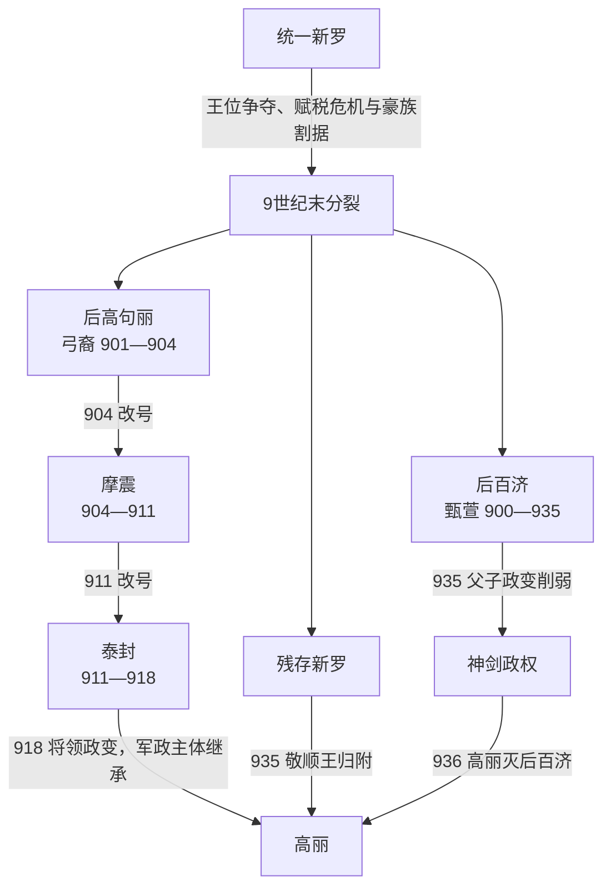

# 后三国

## 时间

9世纪末—936年。分裂的社会背景可上溯至9世纪；甄萱于892年占据武珍州、900年正式建立后百济，弓裔于901年建立后高句丽，936年高丽击败后百济后完成统一。

## 概括

后三国是统一新罗末年中央财政、骨品秩序和王位继承同时失灵后，地方豪族、农民军、海上势力和边防将领重组权力的阶段。“三国”指残存新罗、后百济，以及弓裔的后高句丽—摩震—泰封；918年王建通过政变接收泰封的大部分军队、官僚和领土，改建高丽。统一不是一次决战：王建先争取地方豪族、接纳渤海遗民，与后百济长期拉锯；935年新罗主动归附、后百济发生父子政变，才使936年一利川决战成为终局。

## 形成背景

### 新罗中央衰弱

惠恭王遇弑以后，王位争夺不断；8世纪末至9世纪后期君主频繁更替，真骨贵族以私兵、庄园和寺院网络相互竞争。骨品制限制六头品及地方人才进入最高权力，地方城主、军镇和海商遂建立独立行政与武装。

### 财政与农民起义

王室失去对地方土地和人口的控制，贵族、寺院扩大庄园，国家赋税压在仍登记在册的农户上。889年真圣女王政府催征租税，各地农民和盗贼集团大规模起事。中央不能保护交通或赈济灾荒，地方居民转而依附豪族。

### 国际与区域网络

唐朝衰亡、中国进入五代十国，旧册封与贸易秩序松动；渤海又在926年亡于契丹。松岳海商王氏、清海镇余部、北方边镇及各地豪族拥有跨区域贸易和军事资源，为新政权提供财政、船队和外交渠道。

## 三个政权的形成与发展

### 后百济

甄萱出身新罗军人，负责西南海防。892年他控制武珍州，利用百济故地认同、地方豪族和军队扩张；900年以完山州为都，正式称王、建立后百济。后百济控制全罗道和忠清道大片地区，农业与黄海贸易基础雄厚，早期是后三国最强进攻政权。

927年甄萱攻入新罗都城庆州，逼死景哀王并立敬顺王；随后在公山击败前来救援的王建，高丽将领申崇谦等战死。甄萱却未能把军事胜利转化为稳定地方整合。930年古昌之战后，高丽获得岭南豪族广泛支持；934年运州战败又加速后百济地方倒戈。

935年甄萱意图把王位传给幼子金刚，长子神剑联合良剑、龙剑发动政变，杀金刚并把父亲囚于金山寺。甄萱逃往高丽，向王建提供政治合法性和军事情报。936年高丽在一利川击败神剑，后百济灭亡。

### 后高句丽—摩震—泰封

弓裔可能出身新罗王族，早年为僧，后先后依附箕萱、梁吉等起义势力。他脱离梁吉后控制江原、京畿、黄海及忠清北部，898年以松岳为基地，901年称王、建后高句丽，以“高句丽复兴”争取北方民众和豪族。

904年弓裔改国号摩震，905年迁都铁圆；911年再改国号泰封。连续改号说明他试图摆脱单纯高句丽复国叙事，建立以弥勒信仰和新官制为基础的普遍王权。王建率海军攻取罗州等西南据点，是泰封扩张的关键将领。

晚期弓裔自称弥勒，借“观心法”指控大臣和家人谋反，刑杀加剧；迁都、宫室与战争也加重征敛。918年洪儒、裴玄庆、申崇谦、卜智谦等将领拥立王建。弓裔出逃后被杀，王建在铁圆即位、改国号高丽，随后迁都松岳。泰封不是被外敌整体征服，而是统治集团政变后由高丽实际承接军队、官僚、领土和北方复国名义。

### 残存新罗

新罗仍掌握庆州及岭南部分地区，王室拥有悠久正统和宗教文化声望，却依赖后百济或高丽保护。927年景哀王死于后百济入侵，甄萱扶立敬顺王。高丽在古昌获胜后包围新罗的地方豪族大多转附王建；935年敬顺王在部分贵族反对下决定归附。王建优待新罗王族、赐爵并联姻，使归附成为较少破坏的制度吸收。

## 统治结构

| 政权 | 最高权力 | 支柱 | 实际运作 |
| --- | --- | --- | --- |
| 新罗 | 金氏王室与真骨贵族 | 庆州官僚、寺院和残存州郡 | 正统高而军事财政低，地方豪族多半自主 |
| 后百济 | 甄萱王室 | 西南军队、地方豪族、农业与海贸 | 个人军事威望强，继承制度薄弱导致父子政变 |
| 后高句丽 / 摩震 / 泰封 | 弓裔 | 起义军、北中部豪族、铁圆官僚和弥勒信仰 | 以宗教王权和刑罚集中权力，后期失去将领支持 |
| 高丽 | 王建及开城王氏 | 泰封旧臣、海军、婚姻联盟和归附豪族 | 授官、赐姓、联姻与军事并用，形成更包容的统一联盟 |

## 君主与实际继承

### 后百济

| 顺序 | 君主 | 在位时间 | 与前任关系 | 关键事件 / 备注 |
| --- | --- | --- | --- | --- |
| 1 | **甄萱** | 900—935 | 建立者 | 建都完山州；927年攻庆州；930、934年战败后优势转失；欲传幼子金刚，引发神剑政变 |
| 2 | **甄神剑** | 935—936 | 甄萱长子 | 与良剑、龙剑政变，杀金刚、囚甄萱；936年一利川败于高丽，后百济亡 |

金刚是甄萱指定继承人但在即位前被杀，不列为君主；良剑、龙剑是政变共谋者，也未形成独立在位。

### 后高句丽—摩震—泰封及继承政权

| 顺序 | 君主 | 在位时间 | 国号变化 | 继承说明 |
| --- | --- | --- | --- | --- |
| 1 | **弓裔** | 901—918 | 901后高句丽；904摩震；911泰封 | 三个国号属于同一君主、同一政权连续改号，不是三个王朝 |
| 后继 | **王建** | 918年起 | 高丽 | 被泰封核心将领拥立，接收其军队、官僚与大部领土；属于政变建国后的实际制度继承，不是弓裔血缘继承 |

### 分裂期新罗君主

| 顺序 | 君主 | 在位时间 | 与前任关系 | 关键事件 / 备注 |
| --- | --- | --- | --- | --- |
| 1 | 真圣女王 | 887—897 | 定康王之妹 | 889年催征引发大规模叛乱，地方控制崩解 |
| 2 | 孝恭王 | 897—912 | 宪康王庶子 | 后百济、后高句丽先后正式建国 |
| 3 | 神德王 | 912—917 | 奈勿王系贵族、由朴氏即位 | 王位转入朴氏，中央继续衰弱 |
| 4 | 景明王 | 917—924 | 神德王长子 | 王建建高丽，地方豪族加速分流 |
| 5 | 景哀王 | 924—927 | 神德王次子 | 927年后百济攻庆州时被迫自尽 |
| 6 | **敬顺王** | 927—935 | 金氏贵族，甄萱扶立 | 935年向高丽归附，新罗王统终结 |

## 重要事件

| 时间 | 事件 | 过程与转折 |
| --- | --- | --- |
| 889 | 新罗催征租税、全国起义扩大 | 中央财政失灵，豪族和农民军成为地方实际权力 |
| 892 | 甄萱占据武珍州 | 后百济军政集团形成 |
| 900 | 甄萱在完山州称王 | 后百济正式建国 |
| 901 | 弓裔建立后高句丽 | 后三国格局形成 |
| 904—911 | 后高句丽先后改号摩震、泰封并迁都铁圆 | 弓裔强化独立王权和新制度 |
| 918 | 泰封将领拥立王建，建立高丽 | 高丽实际继承泰封主体，不是另起一支小割据 |
| 927 | 后百济攻陷庆州、杀景哀王；公山之战击败高丽 | 甄萱达到军事顶峰，高丽险遭重创 |
| 930 | 古昌之战高丽胜 | 岭南豪族大批转向王建，战略主动权改变 |
| 934 | 运州之战后百济败 | 后百济北部防线和联盟进一步瓦解 |
| 935 | 神剑政变；甄萱投高丽；新罗归附 | 后百济内部崩裂，高丽无需攻灭新罗 |
| 936 | 一利川决战 | 高丽击败神剑，后百济灭亡，后三国统一完成 |

## 高丽取胜条件

- **包容地方豪族**：王建以婚姻、授官、赐姓和保留地方利益吸收豪族，降低归附成本。
- **继承泰封资源**：918年即拥有成熟军队、官僚、铁圆—松岳腹地和北方政治名义。
- **海陆并用**：开城王氏的海上经验和罗州据点牵制后百济黄海交通。
- **克制与正统**：优待新罗王室、接纳甄萱和渤海遗民，使高丽呈现整合者而非单纯征服者。
- **对手失误**：弓裔以恐怖政治失去将领，甄萱继承安排触发父子相残；两国的个人化王权缺乏稳定交接。

## 分裂终结的原因

结构上，各地长期需要恢复跨区域市场、赋税和安全秩序；外部上，契丹灭渤海后东北局势变化，也增加北方防务压力。直接政治过程则分三种：泰封通过918年宫廷政变被高丽承接，新罗于935年协商归附，后百济在内乱后于936年被军事击败。把三者都简写成“王建灭后三国”会掩盖实际差异。

## 演变关系

- 前一节点：[新罗王国](/%E4%BA%BA%E6%96%87%E7%A7%91%E5%AD%A6/%E5%8E%86%E5%8F%B2/%E4%B8%9C%E4%BA%9A/%E6%9C%9D%E9%B2%9C%E5%8D%8A%E5%B2%9B/%E6%96%B0%E7%BD%97%E7%8E%8B%E5%9B%BD.md)。
- 后一节点：[高丽王朝](/%E4%BA%BA%E6%96%87%E7%A7%91%E5%AD%A6/%E5%8E%86%E5%8F%B2/%E4%B8%9C%E4%BA%9A/%E6%9C%9D%E9%B2%9C%E5%8D%8A%E5%B2%9B/%E9%AB%98%E4%B8%BD%E7%8E%8B%E6%9C%9D.md)。
- 后百济被高丽征服的箭头按“被灭者 → 灭亡者”书写；新罗则是归附，泰封则是内部政变后的制度继承。
