# 大韩民国

## 时间

1948年8月15日成立，延续至今。本页核验截止时间为2026年7月。

## 别称

- 韩国
- 南韩

## 概括

大韩民国是在日本殖民统治结束、美苏分区占领与冷战对立中建立的半岛南部国家。其历史不是从贫困直接线性走向民主与富裕：建国和朝鲜战争伴随内战性暴力，李承晚、朴正熙和全斗焕时期长期存在威权统治；高速工业化带来出口制造业、城市化和教育扩张，也形成财阀集中、劳工压制与地区不均。1987年以后，总统直选、政党竞争、公民社会和宪法法院共同巩固民主制度，但腐败、政治极化和总统权力过度集中反复引发危机。

2024年12月尹锡悦短暂宣布紧急戒严，国会迅速阻止并通过弹劾；宪法法院于2025年4月将其罢免。李在明经提前选举于2025年6月就任。韩国现任总统为李在明，现任国务总理为2026年7月1日就任的韩圣淑。

## 建国背景

- 1945年8月日本投降后，美军在三八线以南建立军政厅，没有承认各地人民委员会为全国政府。
- 殖民时期官僚、警察、地主与新兴政治力量重新组合。反托管、反共、左翼社会改革和民族统一等目标相互冲突。
- 1946—1948年土地、劳工与政治冲突加剧；济州四三事件和丽水—顺天事件及其镇压表明国家建立过程具有内战性。
- 美苏联合委员会未能就统一临时政府达成协议，半岛问题转交联合国。1948年5月南部举行制宪议会选举，部分统一主义者抵制。
- 1948年7月公布宪法，李承晚当选总统；8月15日政府成立。北部随后建立朝鲜民主主义人民共和国，双方都宣称代表整个半岛。

## 共和国与政治阶段

| 阶段 | 时间 | 权力结构 | 主要过程 |
| --- | --- | --- | --- |
| 第一共和国 | 1948—1960 | 李承晚总统制 | 建国、朝鲜战争、反共国家形成；通过釜山政治风波、修宪和压制反对派集中权力，因舞弊选举与四一九革命崩溃。 |
| 第二共和国 | 1960—1961 | 议会制，张勉内阁 | 尝试恢复自由政治和地方自治，但经济困难、军队政治化与社会动员并存，被五一六政变终止。 |
| 军政府 | 1961—1963 | 国家重建最高会议 | 朴正熙集团清洗政治组织，重组官僚和经济计划，为第三共和国奠基。 |
| 第三共和国 | 1963—1972 | 直选总统制下的威权发展 | 经济开发计划、出口工业化、韩日邦交正常化和越战派兵；反对运动与国家安全机构控制并行。 |
| 第四共和国 | 1972—1981 | 维新宪法与间接选举 | 总统近乎无限连任，紧急措施压制异议；朴正熙遇刺后军中“新军部”夺权。 |
| 第五共和国 | 1981—1988 | 全斗焕军事威权 | 光州镇压后重建政权，经济继续增长；学生、劳工、宗教与在野政治联合促成1987年民主化。 |
| 第六共和国 | 1988年至今 | 总统直选、单任五年 | 竞争性选举与和平轮替成为常态，国会、法院、媒体和公民社会加强制衡；同时党争、地域政治、检察权和总统集权仍造成周期性危机。 |

## 统治结构

1987年宪法下，总统由全民直选，任期五年且不得连任；总统任命国务总理须经国会同意。国会为一院制，宪法法院可审理弹劾与违宪争议，最高法院主管普通司法。军队在1980年代以前多次干政，民主化后逐步置于文官监督之下。完整总统、代总统与50任正式国务总理见[大韩民国总统与国务总理表](/%E4%BA%BA%E6%96%87%E7%A7%91%E5%AD%A6/%E5%8E%86%E5%8F%B2/%E4%B8%9C%E4%BA%9A/%E6%9C%9D%E9%B2%9C%E5%8D%8A%E5%B2%9B/%E5%A4%A7%E9%9F%A9%E6%B0%91%E5%9B%BD%E6%80%BB%E7%BB%9F%E4%B8%8E%E5%9B%BD%E5%8A%A1%E6%80%BB%E7%90%86%E8%A1%A8.md)。

| 角色 | 权力与限制 |
| --- | --- |
| 总统 | 国家元首、行政首脑和国军统帅；提名总理、主持国务会议、主导外交安全，但受任期、国会、法院、选举和舆论制约。 |
| 国务总理 | 经国会同意后由总统任命，协助统辖行政各部；总统缺位或停职时按宪法顺序代行职权。 |
| 国会 | 立法、预算、国政调查、任命同意与弹劾；党派对立有时造成行政—立法僵局。 |
| 宪法法院 | 审查法律、政党解散与弹劾；2004年恢复卢武铉职权，2017年和2025年分别罢免朴槿惠、尹锡悦。 |
| 地方政府 | 1961年后长期受中央控制，1990年代恢复全面地方选举，首都圈集中仍是结构问题。 |

## 分阶段发展

### 建国、战争与李承晚体制（1948—1960）

政府以反共与国家安全为核心，在左翼叛乱、游击战和北方冲突中扩大警察、军队与国家保安法。1950年朝鲜战争几乎摧毁城市和工业，数百万军民死亡、失踪或流离，停战后美国同盟和驻军成为安全支柱。土地改革削弱传统地主制，美国援助支持恢复，但李承晚通过1952年改宪直选、1954年取消连任限制和打击反对派走向个人集权。1960年三一五选举舞弊触发学生和市民抗争，军警开火未能维持政权，李承晚辞职。

### 短暂议会民主与军事政变（1960—1963）

第二共和国把总统降为礼仪职位，由张勉内阁负责行政。开放环境释放工会、学生、统一运动和社会改革诉求，政府却面临通货膨胀、派系分裂和军队不满。1961年5月16日朴正熙等军官发动政变，以反共、反腐和经济重建为名建立军政府；政党活动受限，中央情报部成为重要控制工具。

### 发展型威权与维新体制（1963—1979）

政府用五年计划、政策贷款、汇率和出口指标扶植企业集团，纺织、造船、钢铁、汽车和电子业依次扩张。韩日邦交正常化资金、美国市场和越战订单提供外汇与需求，农村人口大规模进入城市工厂。增长依赖长工时、低工资、金融管制和对工会的压制，财阀与国家官僚形成互相依赖。

1971年选举竞争和安全压力促使朴正熙进一步集权。1972年宣布戒严、解散国会并制定维新宪法；总统由统一主体国民会议间接选出，可反复连任并发布紧急措施。重化工业化提升国家能力，也造成债务、通胀和产业倾斜。1979年釜马抗争加剧统治集团分裂，中央情报部长金载圭刺杀朴正熙，维新体制失去核心。

### 新军部、光州与民主化（1979—1988）

全斗焕集团通过十二一二政变控制军队，1980年扩大戒严、逮捕政治人物并关闭国会。光州民众抵抗遭军队武力镇压，死亡人数及责任问题长期成为民主运动核心记忆。第五共和国在压制下推进稳定和产业升级，教育扩张、城市中产和工人组织却扩大了社会自主性。1987年大学生死亡、街头抗争和各阶层联盟形成六月民主抗争，执政集团接受总统直选与基本权利改革。

### 民主巩固、全球化与金融危机（1988—1998）

卢泰愚政府举办首尔奥运，推进北方政策，与苏联、中国建交，南北同时加入联合国。金泳三成为数十年来首位无军职背景的总统，清理军内“一心会”、推动金融实名制并审判前总统。资本账户开放、短期外债和财阀过度扩张使韩国在1997年亚洲金融危机中接受国际货币基金组织援助，企业倒闭、失业和非正规就业上升。

### 危机重组、政权轮替与对朝接触（1998—2008）

金大中实现首次在野党和平接掌中央政权，重组银行与企业、扩大社会保障，同时形成更灵活也更不稳定的劳动市场。信息通信、半导体和文化产业增长，2000年首次朝韩首脑会晤开启阳光政策。卢武铉强调参与民主、地方均衡和自主外交，遭国会弹劾后由宪法法院恢复；房价、党派分裂和韩美关系争论持续。

### 保守执政、烛光运动与首次总统罢免（2008—2017）

李明博政府应对全球金融危机并推动大型基础设施工程，对朝关系在天安舰沉没和延坪岛炮击后急剧恶化。朴槿惠任内发生世越号灾难及对政府问责的长期争议；2016年亲信干政曝光，数百万民众参加烛光集会，国会弹劾、宪法法院于2017年将其罢免，显示民主制度可以通过和平程序更换失去合法性的总统。

### 文在寅政府与半岛外交（2017—2022）

文在寅政府提高最低工资、扩大福利并推进检察改革，政策成效因房价、青年就业和政治极化受到争议。2018年举行三次朝韩首脑会晤，促成美朝会谈，但2019年河内峰会破裂后无核化交换方案停滞。韩国以检测、追踪、疫苗和社会限制应对新冠疫情，公共卫生成效与小商户负担并存。

### 尹锡悦宪政危机与李在明政府（2022—2026）

尹锡悦政府强化韩美日合作，与在野党控制的国会长期冲突。2024年12月3日晚总统以政治僵局为由宣布紧急戒严，国会数小时内投票要求解除，军队未能封锁议会；随后国会弹劾尹锡悦。代理总统韩德洙也一度遭弹劾，崔相穆、复职后的韩德洙和李周浩先后代理。2025年4月4日宪法法院一致支持罢免，6月提前选举由李在明胜出。

截至2026年7月，李在明仍任总统；金民锡于2026年6月30日卸任总理，韩圣淑7月1日就任。新政府强调民生、人工智能与产业转型，并提出尊重朝鲜现存体制、不追求吸收统一、不采取敌对行为的和平共存政策；这些目标能否转化为南北对话仍受核问题和地区安全格局限制。

## 重要事件

| 时间 | 事件 | 结果与长期影响 |
| --- | --- | --- |
| 1948-08-15 | 大韩民国政府成立 | 南北分别建国，竞争性国家建构完成。 |
| 1948—1949 | 济州四三、丽水—顺天事件及镇压 | 反共国家形成伴随大规模政治暴力，记忆与平反延续至民主时期。 |
| 1950—1953 | 朝鲜战争 | 国家几近崩溃后在联合国军支援下存续；停战、驻军和分裂成为安全结构。 |
| 1952、1954 | 两次关键修宪 | 李承晚改为总统直选并取消个人连任限制，威权化加深。 |
| 1960 | 三一五舞弊与四一九革命 | 李承晚政权倒台，学生与市民成为民主化主体。 |
| 1961-05-16 | 军事政变 | 第二共和国终结，军人政治延续二十余年。 |
| 1965 | 韩日邦交正常化 | 获得资金与市场，也因殖民责任、赔偿和程序正当性持续争议。 |
| 1972 | 维新宪法 | 总统权力极端集中，民主制度实质中断。 |
| 1979-10-26 | 朴正熙遇刺 | 维新体制核心崩塌，但未立即带来民主化。 |
| 1979-12—1980-05 | 新军部夺权 | 全斗焕集团控制军队和国家机关。 |
| 1980-05 | 光州民主化运动 | 遭武力镇压，成为后来民主化与转型正义的核心事件。 |
| 1987-06 | 六月民主抗争 | 迫使执政集团接受总统直选和第六共和国宪法。 |
| 1991 | 南北同时加入联合国 | 两个韩国的国际地位制度化。 |
| 1997—1998 | 亚洲金融危机 | IMF援助、金融与财阀重组，劳动市场两极化加深。 |
| 1998 | 首次在野党和平执政 | 金大中就任，选举轮替成为民主巩固标志。 |
| 2000 | 首次朝韩首脑会晤 | 阳光政策达到高点，开启离散家属、交通和经济合作。 |
| 2004 | 卢武铉弹劾被驳回 | 宪法法院确立弹劾审判与权力制衡的重要先例。 |
| 2016—2017 | 烛光集会与朴槿惠罢免 | 首位总统经弹劾审判被罢免，权力和平移交。 |
| 2020—2022 | 新冠疫情 | 检验数字治理、公共卫生和社会保障，也加剧行业差距。 |
| 2024-12—2025-04 | 紧急戒严、弹劾与尹锡悦罢免 | 国会和司法阻止非常权力扩张，代理总统链暴露制度压力。 |
| 2025-06-04 | 李在明就任 | 提前选举完成政权重建。 |
| 2026-07-01 | 韩圣淑就任总理 | 成为韩国第二位女性国务总理。 |

## 经济与社会转型

### 高速增长的条件

战后土地改革、美国援助、安全保护和教育普及提供基础；国家控制金融、选择产业并以出口绩效分配资源，企业集团通过规模与技术学习进入全球市场。劳工的长工时、农村人口迁移、女性劳动和家庭教育投入同样是“汉江奇迹”的组成部分，不能只归因于总统或财阀。

### 增长的代价与调整

威权时期工会和异议受压，环境污染、工伤和地区不平衡严重。1987年后工资和劳权提升，1997年危机又扩大临时与非正规就业。半导体、汽车、造船、电池、数字平台和文化产业使韩国进入高收入经济体，但财阀集中、首都圈房价、教育竞争、青年就业、性别冲突与低生育率成为长期难题。

### 民主化为何能够持续

经济发展扩大中产和受教育人口，却不是民主化的自动原因。学生、工人、宗教组织、律师、记者、在野政治家和遇难者家属形成跨阶层网络；国际环境、1988年奥运压力和统治集团分裂提供机会。1987年后的选举轮替、地方自治、法院判例和公民动员，使危机多次回到宪法程序内解决。

## 演变关系

```mermaid
flowchart LR
    occupation["美军政<br/>1945—1948"] --> founding["大韩民国成立<br/>1948"]
    founding --> war["朝鲜战争<br/>1950—1953"]
    war --> rhee["李承晚威权体制"]
    rhee --> april["四一九革命<br/>1960"]
    april --> second["第二共和国"]
    second --> coup["五一六政变<br/>1961"]
    coup --> developmental["朴正熙发展型威权"]
    developmental --> yushin["维新体制"]
    yushin --> chun["全斗焕第五共和国"]
    chun --> democracy["1987民主化<br/>第六共和国"]
    democracy --> rotations["多次选举轮替与弹劾制衡"]
    rotations --> current["李在明政府<br/>2025年至今"]
```

- 前一节点：[朝韩对峙](/%E4%BA%BA%E6%96%87%E7%A7%91%E5%AD%A6/%E5%8E%86%E5%8F%B2/%E4%B8%9C%E4%BA%9A/%E6%9C%9D%E9%B2%9C%E5%8D%8A%E5%B2%9B/%E6%9C%9D%E9%9F%A9%E5%AF%B9%E5%B3%99.md)。
- 并列节点：[朝鲜民主主义人民共和国](/%E4%BA%BA%E6%96%87%E7%A7%91%E5%AD%A6/%E5%8E%86%E5%8F%B2/%E4%B8%9C%E4%BA%9A/%E6%9C%9D%E9%B2%9C%E5%8D%8A%E5%B2%9B/%E6%9C%9D%E9%B2%9C%E6%B0%91%E4%B8%BB%E4%B8%BB%E4%B9%89%E4%BA%BA%E6%B0%91%E5%85%B1%E5%92%8C%E5%9B%BD.md)。
- 领导人专表：[大韩民国总统与国务总理表](/%E4%BA%BA%E6%96%87%E7%A7%91%E5%AD%A6/%E5%8E%86%E5%8F%B2/%E4%B8%9C%E4%BA%9A/%E6%9C%9D%E9%B2%9C%E5%8D%8A%E5%B2%9B/%E5%A4%A7%E9%9F%A9%E6%B0%91%E5%9B%BD%E6%80%BB%E7%BB%9F%E4%B8%8E%E5%9B%BD%E5%8A%A1%E6%80%BB%E7%90%86%E8%A1%A8.md)。
