# 大韩民国总统与国务总理表

## 说明

大韩民国实行总统制。总统是国家元首、行政权核心与国军统帅；国务总理由总统提名并经国会同意后任命，协助总统统辖行政各部，但通常不是独立于总统的最高决策者。第二共和国（1960—1961）例外采用议会制，总理张勉是实际政府首脑。

总统“第几任”可按选举任期计算，也可按实际担任过总统的人数计算。本表为避免朴正熙、全斗焕等跨共和国或多届任期重复，正式总统表按人物连续任期列示；李在明是第21届总统任期的就任者，也是实际担任正式总统的第14人。代总统另表列出。

## 正式总统

| 人物序次 | 姓名 | 任期 | 共和国 / 政治阶段 | 关键事件与说明 |
| --- | --- | --- | --- | --- |
| 1 | 李承晚 | 1948-07-24—1960-04-27 | 第一共和国 | 建国、朝鲜战争与反共体制；通过修宪强化总统权力，三一五舞弊选举后被四一九革命迫使辞职。 |
| 2 | 尹潽善 | 1960-08-13—1962-03-24 | 第二共和国 / 军事政变过渡 | 议会制下为礼仪性总统；1961年五一六政变后权力被军政府夺取，次年辞职。 |
| 3 | 朴正熙 | 1963-12-17—1979-10-26 | 第三、第四共和国 | 国家主导工业化与出口增长并行于政治压制；1972年维新体制取消实质任期限制，1979年遇刺。 |
| 4 | 崔圭夏 | 1979-12-06—1980-08-16 | 第四共和国末期 | “首尔之春”过渡总统；在十二一二政变和五一七扩大戒严后失去实权并辞职。 |
| 5 | 全斗焕 | 1980-09-01—1988-02-25 | 第五共和国 | 军事集团掌权，光州民主化运动遭镇压；后期在社会抗争压力下接受1987年直选改宪。 |
| 6 | 卢泰愚 | 1988-02-25—1993-02-25 | 第六共和国 | 首位依1987年宪法就任者；推进北方政策、与苏中建交并与朝鲜同时加入联合国。 |
| 7 | 金泳三 | 1993-02-25—1998-02-25 | 第六共和国 | 文人政府、金融实名制与清理军内私组织；任末遭遇1997年亚洲金融危机。 |
| 8 | 金大中 | 1998-02-25—2003-02-25 | 第六共和国 | 完成金融危机重组与社会保障扩展，推进阳光政策并举行2000年首次朝韩首脑会晤。 |
| 9 | 卢武铉 | 2003-02-25—2008-02-25 | 第六共和国 | 强调参与民主、地方均衡与对朝接触；2004年遭弹劾停职后由宪法法院恢复职权。 |
| 10 | 李明博 | 2008-02-25—2013-02-25 | 第六共和国 | 企业家式增长政策与韩美合作加强；全球金融危机、四大江工程及2010年南北军事危机为任内重点。 |
| 11 | 朴槿惠 | 2013-02-25—2017-03-10 | 第六共和国 | 韩国首位女性总统；亲信干政危机引发大规模烛光集会，2016年停职、2017年被罢免。 |
| 12 | 文在寅 | 2017-05-10—2022-05-10 | 第六共和国 | 推动检察与福利改革，经历新冠疫情；2018年三次朝韩首脑会晤后，半岛外交于2019年后停滞。 |
| 13 | 尹锡悦 | 2022-05-10—2025-04-04 | 第六共和国 | 强化韩美日安全合作；2024年12月短暂宣布紧急戒严后遭弹劾停职，2025年被宪法法院罢免。 |
| 14 | **李在明** | 2025-06-04—至今 | 第六共和国 | 经提前选举就任；截至2026年7月仍任总统，政府提出民生、产业转型与半岛和平共存政策。 |

## 代总统与军政府国家元首

| 姓名 | 代行时间 | 法定身份 / 权力基础 | 说明 |
| --- | --- | --- | --- |
| 许政 | 1960-04-27—1960-06-15 | 国务总理 / 过渡政府首脑 | 李承晚辞职后主持过渡。 |
| 郭尚勋 | 1960-06-16—1960-06-23 | 国会议长 | 第二共和国宪制转换期短暂代理。 |
| 许政 | 1960-06-23—1960-08-08 | 国务总理 | 继续主持制宪与政权交接。 |
| 白乐濬 | 1960-08-08—1960-08-13 | 参议院议长 | 尹潽善就任前代理。 |
| 朴正熙 | 1962-03-24—1963-12-17 | 国家重建最高会议议长 | 尹潽善辞职后代理国家元首；实际已自1961年政变起掌权。 |
| 崔圭夏 | 1979-10-26—1979-12-06 | 国务总理 | 朴正熙遇刺后代理，随后当选总统。 |
| 朴忠勋 | 1980-08-16—1980-09-01 | 国务总理署理 | 崔圭夏辞职至全斗焕就任间代理。 |
| 高建 | 2004-03-12—2004-05-14 | 国务总理 | 卢武铉弹劾停职期间代理；宪法法院驳回弹劾后交还权力。 |
| 黄教安 | 2016-12-09—2017-05-10 | 国务总理 | 朴槿惠停职及被罢免后代理至提前选举完成。 |
| 韩德洙 | 2024-12-14—2024-12-27 | 国务总理 | 尹锡悦停职后代理，后自身遭国会弹劾而停职。 |
| 崔相穆 | 2024-12-27—2025-03-24 | 经济副总理 | 韩德洙停职期间兼代总统与国务总理。 |
| 韩德洙 | 2025-03-24—2025-05-01 | 国务总理 | 宪法法院撤销其弹劾后恢复代理总统；为参选而辞职。 |
| 李周浩 | 2025-05-02—2025-06-04 | 社会副总理 | 提前总统选举完成前代理。 |

## 正式国务总理

官方编号只授予经任命同意程序正式就任者；同一人再次正式任职会取得新编号。下表的起讫日期按韩国国务总理室正式名录整理，不把就任前的“署理”期并入正式任期；署理、代理和军政府“内阁首班”另列于后。

| 代 | 姓名 | 正式任期 | 时任总统 / 阶段 | 说明 |
| --- | --- | --- | --- | --- |
| 1 | 李范奭 | 1948-07-31—1950-04-20 | 李承晚 | 建国初期，兼国防部长。 |
| 2 | 张勉 | 1950-11-23—1952-04-23 | 李承晚 | 战争时期；后任第二共和国政府首脑。 |
| 3 | 张泽相 | 1952-05-06—1952-10-05 | 李承晚 | 釜山政治风波时期。 |
| 4 | 白斗镇 | 1953-04-24—1954-06-17 | 李承晚 | 先任署理，正式任期跨战争末期与战后恢复。 |
| 5 | 卞荣泰 | 1954-06-27—1954-11-28 | 李承晚 | 任后总理职位被撤销。 |
| 6 | 许政 | 1960-06-15—1960-08-18 | 过渡期 / 尹潽善 | 主持第一、第二共和国转换。 |
| 7 | 张勉 | 1960-08-19—1961-05-17 | 尹潽善 | 议会制政府实际首脑，五一六政变后结束任职。 |
| 8 | 崔斗善 | 1963-12-17—1964-05-09 | 朴正熙 | 第三共和国首任总理。 |
| 9 | 丁一权 | 1964-05-10—1970-12-20 | 朴正熙 | 长期任职，工业化与韩日邦交正常化时期。 |
| 10 | 白斗镇 | 1970-12-21—1971-06-03 | 朴正熙 | 第二次正式任总理。 |
| 11 | 金钟泌 | 1971-06-04—1975-12-18 | 朴正熙 | 跨第三、第四共和国，参与维新体制。 |
| 12 | 崔圭夏 | 1976-03-13—1979-12-05 | 朴正熙 / 本人 | 先任署理；朴正熙遇刺后代总统并继任总统。 |
| 13 | 申铉碻 | 1979-12-13—1980-05-21 | 崔圭夏 | 十二一二政变和扩大戒严时期。 |
| 14 | 南德祐 | 1980-09-22—1982-01-03 | 全斗焕 | 先任署理，正式任期属第五共和国初期。 |
| 15 | 刘彰顺 | 1982-01-23—1982-06-24 | 全斗焕 | 先任署理，经济官僚出身。 |
| 16 | 金相浃 | 1982-09-21—1983-10-14 | 全斗焕 | 先任署理，后经正式任命。 |
| 17 | 陈懿钟 | 1983-10-17—1985-02-18 | 全斗焕 | 任内因病由副总理代理部分职务。 |
| 18 | 卢信永 | 1985-05-16—1987-05-25 | 全斗焕 | 先任署理，民主化抗争加剧前期。 |
| 19 | 金贞烈 | 1987-08-07—1988-02-24 | 全斗焕 | 直选改宪与政权交接期。 |
| 20 | 李贤宰 | 1988-03-02—1988-12-04 | 卢泰愚 | 先任署理，第六共和国首任总理。 |
| 21 | 姜英勋 | 1988-12-16—1990-12-26 | 卢泰愚 | 先任署理，北方政策与南北高层会谈时期。 |
| 22 | 卢在凤 | 1991-01-23—1991-05-23 | 卢泰愚 | 先任署理，外交与安全政策学者出身。 |
| 23 | 郑元植 | 1991-07-08—1992-10-07 | 卢泰愚 | 先任署理，南北基本协议与同时加入联合国时期。 |
| 24 | 玄胜钟 | 1992-10-08—1993-02-24 | 卢泰愚 | 选举管理型中立内阁。 |
| 25 | 黄寅性 | 1993-02-25—1993-12-16 | 金泳三 | 文人政府首任总理。 |
| 26 | 李会昌 | 1993-12-17—1994-04-21 | 金泳三 | 强调依法行政，因权限分歧辞职。 |
| 27 | 李荣德 | 1994-04-30—1994-12-16 | 金泳三 | 先任署理，金日成逝世与首次核危机时期。 |
| 28 | 李洪九 | 1994-12-17—1995-12-17 | 金泳三 | 地方自治全面恢复时期。 |
| 29 | 李寿成 | 1995-12-18—1997-03-04 | 金泳三 | 社会改革与劳动法争议时期。 |
| 30 | 高建 | 1997-03-05—1998-03-02 | 金泳三 / 金大中 | 亚洲金融危机与政权交接。 |
| 31 | 金钟泌 | 1998-08-18—2000-01-12 | 金大中 | 署理期自 1998-03-03 起；联合政府核心。 |
| 32 | 朴泰俊 | 2000-01-13—2000-05-18 | 金大中 | 企业界与联合政府代表。 |
| 33 | 李汉东 | 2000-06-29—2002-07-10 | 金大中 | 署理期自 2000-05-23 起。 |
| 34 | 金硕洙 | 2002-10-05—2003-02-26 | 金大中 | 署理期自 2002-09-10 起，负责任末过渡。 |
| 35 | 高建 | 2003-02-27—2004-05-24 | 卢武铉 | 第二次任总理；2004 年曾代行总统职权。 |
| 36 | 李海瓒 | 2004-06-30—2006-03-15 | 卢武铉 | 行政改革与政策协调。 |
| 37 | 韩明淑 | 2006-04-20—2007-03-06 | 卢武铉 | 韩国首位女性国务总理。 |
| 38 | 韩德洙 | 2007-04-03—2008-02-28 | 卢武铉 | 韩美自由贸易协定与政权交接期。 |
| 39 | 韩升洙 | 2008-02-29—2009-09-28 | 李明博 | 全球金融危机初期。 |
| 40 | 郑云灿 | 2009-09-29—2010-08-11 | 李明博 | 经济学者出身，世宗市方案争议。 |
| 41 | 金滉植 | 2010-10-01—2013-02-26 | 李明博 | 天安舰、延坪岛事件后的安全局势。 |
| 42 | 郑烘原 | 2013-02-26—2015-02-16 | 朴槿惠 | 世越号灾难后提出辞职，因继任提名受阻而继续履职。 |
| 43 | 李完九 | 2015-02-17—2015-04-27 | 朴槿惠 | 因政治献金疑云短期辞职。 |
| 44 | 黄教安 | 2015-06-17—2017-05-11 | 朴槿惠 / 文在寅 | 2016—2017 年兼代总统。 |
| 45 | 李洛渊 | 2017-05-31—2020-01-13 | 文在寅 | 文在寅政府首任总理。 |
| 46 | 丁世均 | 2020-01-14—2021-04-16 | 文在寅 | 新冠疫情初期政府协调。 |
| 47 | 金富谦 | 2021-05-14—2022-05-11 | 文在寅 / 尹锡悦 | 疫情后期与政权交接。 |
| 48 | 韩德洙 | 2022-05-21—2025-05-01 | 尹锡悦 | 第二次任总理；2024—2025 年宪政危机中两度代总统，中间曾被弹劾停职。 |
| 49 | 金民锡 | 2025-07-04—2026-06-30 | 李在明 | 李在明政府首任总理。 |
| 50 | **韩圣淑** | 2026-07-01—至今 | 李在明 | 截至 2026 年 7 月在任；韩国第二位女性国务总理。 |

## 署理、代理与军政府内阁首班

1954 年 11 月至 1960 年 4 月总理职位一度撤销。1961—1963 年军政府使用“内阁首班”而非正常宪政下的国务总理。下表区分三种情况：“署理”指已获提名或先行履职、尚待国会同意者；“代理”指总理空缺、停职或不能视事时由其他国务委员依法代行；“内阁首班”是军政府时期的行政职位。正式总理在获同意前的署理阶段会在两表各出现一次，以免把署理期误算成正式任期。

### 署理与代理

| 姓名 | 时间 | 身份 | 说明 |
| --- | --- | --- | --- |
| 申性模 | 1950-04-21—1950-11-22 | 代理 | 李范奭离任后代理。 |
| 许政 | 1950-11-06—1952-04-09 | 代理 | 张勉任内因其长期在外执行外交任务而代行；与张勉的正式任期部分重叠。 |
| 李允荣 | 1952-04-24—1952-05-05 | 代理 | 张勉离任后的短暂过渡。 |
| 白斗镇 | 1952-10-09—1953-04-23 | 署理 | 后经同意成为第 4 任正式总理。 |
| 许政 | 1960-04-25—1960-06-14 | 代理 / 过渡政府首脑 | 四一九革命后主持过渡，6 月 15 日起成为第 6 任正式总理。 |
| 崔圭夏 | 1975-12-19—1976-03-12 | 署理 | 后成为第 12 任正式总理。 |
| 朴忠勋 | 1980-05-22—1980-09-01 | 署理 | 申铉碻离任后主持行政，后又兼代总统。 |
| 南德祐 | 1980-09-02—1980-09-21 | 署理 | 后成为第 14 任正式总理。 |
| 刘彰顺 | 1982-01-04—1982-01-22 | 署理 | 后成为第 15 任正式总理。 |
| 金相浃 | 1982-06-25—1982-09-20 | 署理 | 后成为第 16 任正式总理。 |
| 陈懿钟 | 1983-10-15—1983-10-16 | 署理 | 10 月 17 日起成为第 17 任正式总理。 |
| 申秉铉 | 1984-11-11—1985-02-18 | 代理 | 陈懿钟患病期间代行总理职务。 |
| 卢信永 | 1985-02-19—1985-05-15 | 署理 | 后成为第 18 任正式总理。 |
| 李汉基 | 1987-05-26—1987-07-13 | 代理 | 卢信永离任后的过渡。 |
| 金贞烈 | 1987-07-14—1987-08-06 | 署理 | 后成为第 19 任正式总理。 |
| 李贤宰 | 1988-02-25—1988-03-01 | 署理 | 后成为第 20 任正式总理。 |
| 姜英勋 | 1988-12-05—1988-12-15 | 署理 | 后成为第 21 任正式总理。 |
| 卢在凤 | 1990-12-27—1991-01-22 | 署理 | 后成为第 22 任正式总理。 |
| 郑元植 | 1991-05-24—1991-07-07 | 署理 | 后成为第 23 任正式总理。 |
| 李荣德 | 1994-04-22—1994-04-29 | 署理 | 后成为第 27 任正式总理。 |
| 金钟泌 | 1998-03-03—1998-08-17 | 署理 | 后成为第 31 任正式总理。 |
| 李宪宰 | 2000-05-19—2000-05-22 | 代理 | 朴泰俊离任后的短暂过渡。 |
| 李汉东 | 2000-05-23—2000-06-28 | 署理 | 后成为第 33 任正式总理。 |
| 张裳 | 2002-07-11—2002-07-31 | 署理 | 任命同意案未获国会通过，未取得正式总理编号。 |
| 田允喆 | 2002-07-31—2002-08-08；2002-08-29—2002-09-09 | 代理 | 两名总理被提名人的署理期之间及其后短暂代行。 |
| 张大焕 | 2002-08-09—2002-08-28 | 署理 | 任命同意案未获国会通过，未取得正式总理编号。 |
| 金硕洙 | 2002-09-10—2002-10-04 | 署理 | 后成为第 34 任正式总理。 |
| 李宪宰 | 2004-05-25—2004-06-29 | 代理 | 高建离任至李海瓒正式就任间代行。 |
| 韩德洙 | 2006-03-16—2006-04-19 | 代理 | 李海瓒离任后代理。 |
| 权五奎 | 2007-03-07—2007-04-02 | 代理 | 韩明淑离任后代理。 |
| 尹增铉 | 2010-08-11—2010-09-30 | 代理 | 郑云灿离任至金滉植就任间代行。 |
| 崔炅焕 | 2015-04-27—2015-06-16 | 代理 | 李完九离任至黄教安正式就任间代行。 |
| 柳一镐 | 2017-05-11—2017-05-30 | 代理 | 黄教安离任至李洛渊正式就任间代行。 |
| 洪楠基 | 2021-04-16—2021-05-13 | 代理 | 丁世均离任至金富谦就任间代行。 |
| 秋庆镐 | 2022-05-12—2022-05-20 | 代理 | 金富谦离任至韩德洙正式就任间代行。 |
| 崔相穆 | 2024-12-27—2025-03-24 | 代理 | 韩德洙被弹劾停职期间代行总理，并兼代总统。 |
| 李周浩 | 2025-05-02—2025-07-03 | 代理 | 韩德洙辞职后代行，跨越李在明就任至金民锡获任。 |

### 军政府内阁首班

| 顺序 | 姓名 | 任期 | 权力位置 |
| --- | --- | --- | --- |
| 1 | 张都映 | 1961-05-20—1961-07-02 | 五一六政变后任首任内阁首班，同时任国家重建最高会议议长；实权很快转向朴正熙。 |
| 2 | 宋尧讚 | 1961-07-03—1962-06-15 | 军政府行政首脑。 |
| 3 | 朴正熙 | 1962-06-18—1962-07-09 | 兼军政府最高权力中心。 |
| 4 | 金显哲 | 1962-07-10—1963-12-16 | 主持军政向第三共和国转换。 |

## 宪政转折

```mermaid
flowchart LR
    first["第一共和国<br/>总统集权"] --> april["1960 四一九革命"]
    april --> second["第二共和国<br/>议会制"]
    second --> coup["1961 五一六政变"]
    coup --> third["第三共和国<br/>发展型威权"]
    third --> yushin["第四共和国<br/>维新体制"]
    yushin --> fifth["第五共和国<br/>军事威权"]
    fifth --> june["1987 六月民主抗争"]
    june --> sixth["第六共和国<br/>总统直选"]
    sixth --> impeachment["2016—2017、2024—2025<br/>弹劾与宪法法院审判"]
    impeachment --> current["李在明政府<br/>2025年至今"]
```

## 相关笔记

- 主笔记：[大韩民国](/%E4%BA%BA%E6%96%87%E7%A7%91%E5%AD%A6/%E5%8E%86%E5%8F%B2/%E4%B8%9C%E4%BA%9A/%E6%9C%9D%E9%B2%9C%E5%8D%8A%E5%B2%9B/%E5%A4%A7%E9%9F%A9%E6%B0%91%E5%9B%BD.md)。
- 分裂与战争背景：[朝韩对峙](/%E4%BA%BA%E6%96%87%E7%A7%91%E5%AD%A6/%E5%8E%86%E5%8F%B2/%E4%B8%9C%E4%BA%9A/%E6%9C%9D%E9%B2%9C%E5%8D%8A%E5%B2%9B/%E6%9C%9D%E9%9F%A9%E5%AF%B9%E5%B3%99.md)。
- 并列国家：[朝鲜民主主义人民共和国](/%E4%BA%BA%E6%96%87%E7%A7%91%E5%AD%A6/%E5%8E%86%E5%8F%B2/%E4%B8%9C%E4%BA%9A/%E6%9C%9D%E9%B2%9C%E5%8D%8A%E5%B2%9B/%E6%9C%9D%E9%B2%9C%E6%B0%91%E4%B8%BB%E4%B8%BB%E4%B9%89%E4%BA%BA%E6%B0%91%E5%85%B1%E5%92%8C%E5%9B%BD.md)。
- 目录总览：[朝鲜半岛](/%E4%BA%BA%E6%96%87%E7%A7%91%E5%AD%A6/%E5%8E%86%E5%8F%B2/%E4%B8%9C%E4%BA%9A/%E6%9C%9D%E9%B2%9C%E5%8D%8A%E5%B2%9B/README.md)。
