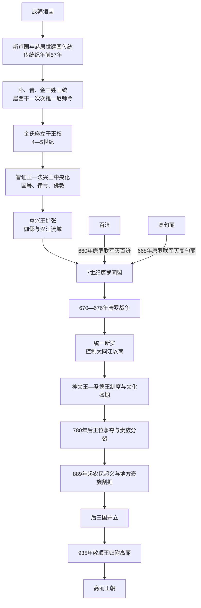

# 新罗王国

## 时间

前57-935。

## 概括

新罗是朝鲜半岛三国之一，起源于辰韩系统中的斯卢国。它从半岛东南部小国发展为三国之一，后联合唐朝灭百济和高句丽，并在676年后控制大同江以南地区，形成统一新罗时期。9世纪后期新罗衰落，最终归附高丽。

## 历史演进图

## 建立背景与年代辨析

- 《三国史记》以赫居世居西干在前57年建立斯卢国为新罗王统起点，并记载朴、昔、金三姓轮流执政。建国故事和早期称号反映后世对六村、王族和国家形成的记忆。
- 考古材料显示，庆州盆地及辰韩地区在公元前后分布多个聚落和木棺、木椁墓中心，斯卢国是在长期联盟、兼并和礼制整合中成长。前57年至约3世纪的绝对年代和连续世系应视为传统纪年。
- 新罗早期发展慢于汉江流域的百济和鸭绿江—平壤方向的高句丽，反而使庆州核心区较少直接承受郡县和大国冲击；它通过吸纳周边小国、借助高句丽保护及后来反制高句丽逐步扩张。
- “统一新罗”是后世常用分期，指676年后新罗控制大同江以南大部分半岛；北部同时存在渤海，不能写成新罗统一了今日意义上的全部半岛与东北地区。

## 分阶段发展

| 阶段 | 时间 | 具体过程 | 阶段结果 |
|---|---|---|---|
| 斯卢国与早期联盟 | 传统纪年前57年—356年 | 六村和辰韩诸国逐步围绕庆州中心整合，朴、昔、金氏王统及居西干、次次雄、尼师今等称号见于传统记录。 | 国家规模和王权仍有限，早期年代与疆域存在较大争议。 |
| 麻立干王权与金氏稳定 | 356—500年 | 奈勿麻立干以后金氏长期掌权，在高句丽援助下抵御倭、伽倻和百济压力，随后又联合百济摆脱高句丽干预。 | 王位、王京六部和贵族秩序趋于稳定，为6世纪中央化奠基。 |
| 制度化与领土扩张 | 500—576年 | 智证王定国号、改用“王”号；法兴王颁律令、整顿骨品并承认佛教；真兴王兼并伽倻、取得汉江流域并建立巡狩碑。 | 新罗获得铁、人口、黄海交通和对华使路，首次成为三国均势中的强权。 |
| 统一战争 | 576—676年 | 面对百济—高句丽压力，金春秋、金庾信推动唐罗同盟；660年灭百济、668年灭高句丽。唐设置都护府试图控制旧地，新罗转而与唐作战。 | 676年前后唐军退出半岛核心区域，新罗控制大同江以南，进入统一新罗阶段。 |
| 中央集权与盛期 | 681—780年 | 神文王压制王族叛乱、整顿九州五小京和军队，尝试以官僚禄邑、俸禄调节贵族经济；圣德王、景德王时期唐制官名、佛教艺术和对外贸易繁荣。 | 王京和地方行政更紧密，佛国寺、石窟庵等体现王室贵族资源，但骨品和土地秩序的矛盾没有消失。 |
| 王位争夺与地方化 | 780—889年 | 惠恭王被杀后，多个真骨支系以政变争位；金宪昌叛乱、张保皋海上势力和地方城主显示中央垄断削弱。 | 王权任期缩短，贵族庄园、寺院和地方豪族掌握更多税源、私兵与贸易。 |
| 后三国与归附高丽 | 889—935年 | 真圣女王时期征税引发全国性起义；甄萱、弓裔等建立后百济、后高句丽，王建继承泰封建立高丽。927年后百济攻入庆州并杀景哀王。 | 新罗仅余庆州周边，敬顺王判断无力继续战争，于935年率国归附高丽。 |

## 统治结构

| 层面 | 主要结构 | 演变与作用 |
|---|---|---|
| 王权与和白会议 | 国王由王京最高骨品集团产生，和白会议由大等贵族讨论继承、战争和佛教等大事。 | 王权强化不等于贵族会议消失；780年以后真骨支系可借会议、军队和政变废立君主。 |
| 骨品制与官位 | 圣骨、真骨及六头品以下身份限制婚姻、官职和服饰，中央有伊伐餐以下官等。 | 骨品制有助于组织贵族等级，却阻塞六头品知识人和地方精英上升，是后期人才外流和政治不满的结构背景。 |
| 王京与地方 | 庆州六部是核心；统一后设置九州、五小京，把旧百济、高句丽和伽倻居民纳入地方体系，并利用村落文书统计人口、土地与牲畜。 | 小京分散部分王京人口并安置不同集团，但地方官、村主和豪族仍掌握实际征收网络。 |
| 军事 | 早期有贵族部众和誓幢，统一后以九誓幢、十停等中央和地方军制整合多来源人口；花郎组织兼具贵族青年教育与政治军事网络功能。 | 多族群军队帮助维持新领土，后期中央无力支付和调动时，地方豪族私兵取而代之。 |
| 宗教与文化 | 法兴王时期佛教获国家承认，王室以护国佛教、寺院和仪式强化正统；国学、留唐学生和汉文官僚支持行政。 | 佛教也是贵族土地与财富中心；禅宗山门后期在地方发展，与王京教宗形成不同社会网络。 |
| 对外关系 | 对高句丽、百济、伽倻在结盟与战争间转换；统一战争借唐军，随后通过唐罗战争争取自主。海商连接唐、日本和东南海域。 | 外援扩大新罗力量却附带唐朝直接统治企图；张保皋等海上势力说明国家外交之外还有商人和地方军事网络。 |

## 重要事件

| 时间 | 事件 | 过程与意义 |
|---|---|---|
| 传统纪年前57年 | 赫居世建国 | 传统上以斯卢国和朴氏王统为新罗起点；早期年代不可全部实证。 |
| 400年前后 | 高句丽出兵援助新罗 | 广开土王军击退侵入新罗的倭、伽倻等力量，新罗得以生存，却一度受高句丽强烈影响。 |
| 503年 | 定国号“新罗”并使用王号 | 智证王时期从麻立干等旧称转向更统一的国家名号和君主称号。 |
| 520—527年 | 律令与佛教国家化 | 法兴王颁律令，异次顿殉教传统后佛教获承认，王权拥有新的法律和礼仪资源。 |
| 532年、562年 | 金官伽倻归附与大伽倻灭亡 | 新罗逐步控制洛东江流域、铁产地和南部交通，并吸收金庾信家族等伽倻贵族。 |
| 551—553年 | 夺取汉江流域 | 与百济协力击退高句丽后，新罗独占汉江，引发罗济同盟破裂，同时取得对中国直接交通。 |
| 660年 | 百济灭亡 | 新罗陆军与唐水军夹攻，随后面对百济复兴运动和唐朝设置熊津都督府。 |
| 668—676年 | 高句丽灭亡与唐罗战争 | 唐罗联军灭高句丽后利益冲突公开化，新罗夺取百济故地并迫使唐军撤出半岛核心。 |
| 681—692年 | 神文王整顿 | 镇压金钦突叛乱、调整军政和地方区划，压制王族挑战并整合新领土。 |
| 780年 | 惠恭王被杀 | 武烈王直系王统结束，此后真骨支系频繁争位，后期政治转折明显。 |
| 822年 | 金宪昌叛乱 | 王族以地方为基地挑战中央，显示州郡军力和王位争端已经结合。 |
| 828年以后 | 张保皋经营清海镇 | 控制黄海海上贸易和侨民网络，说明地方军事商贸势力足以影响王位政治。 |
| 889年 | 元宗、哀奴起义 | 中央强征赋税触发农民反抗，地方叛乱扩散，后三国局面形成。 |
| 927年 | 后百济攻入庆州 | 景哀王遇害，甄萱拥立敬顺王，新罗王权降为依赖外力的区域政权。 |
| 935年 | 敬顺王归附高丽 | 国王与群臣决定交出国家，王建保留王族地位和庆州地方安排，新罗王统终结。 |

## 鼎盛条件

- **后发整合优势**：庆州核心区相对稳定，金氏王权可逐步吸纳六部、伽倻贵族和地方首领，而非持续在首都遭受大国毁灭性攻击。
- **汉江与洛东江资源**：夺取伽倻铁产地、洛东江交通及汉江出海口，使新罗同时获得军需、粮赋和直接对唐外交通道。
- **唐罗同盟与本地军事领导**：唐军提供海运和攻城能力，金春秋外交与金庾信等新罗军队则把外援转化为本国领土成果。
- **战后行政整合**：九州五小京、九誓幢等吸纳原高句丽、百济、伽倻居民，降低单纯以王京贵族占领广大地区的成本。
- **佛教与国际文化**：王室、寺院、留学生和海商连接唐与日本，带动文字行政、艺术、医学和贸易。

## 衰落因素、直接触发与灭亡过程

| 类型 | 因素 | 作用方式 |
|---|---|---|
| 结构因素 | 骨品制限制政治参与；真骨贵族垄断土地与高官；王京消费、寺院庄园和地方豪族侵蚀国家税役；780年后继承规则失去稳定。 | 中央既难吸收六头品和地方人才，也难直接掌握乡村人口、粮食和军队，王位争夺不断消耗合法性。 |
| 外部压力 | 北方渤海与新罗并立，唐朝晚期动荡削弱传统贸易和册封环境；后百济、后高句丽及其继承者高丽从西南、北方争夺州郡。 | 地方豪族可在多个政权间选择，庆州朝廷不再拥有唯一外交和军事中心地位。 |
| 直接触发 | 889年中央命各地催收赋税引发大规模起义；甄萱、弓裔利用反叛网络建立国家，927年甄萱攻入庆州并杀景哀王。 | 新罗失去主要州郡和独立军力，敬顺王即位本身受后百济干预，最终只能在高丽和后百济之间求生。 |

927年后，新罗仅能维持庆州及周边，王族内部对继续抵抗还是归附存在分歧。935年，敬顺王认为国弱兵少、继续作战只会增加民众伤亡，派使向王建请降并亲赴开京。高丽把新罗旧都改置为庆州，给予敬顺王爵位和食邑，并通过婚姻及事审官安排吸收新罗王族与地方网络。王朝灭亡因此不是都城被高丽攻破，而是长期财政—军事解体后以政治归附完成。

## 世系连续性与争议读法

- 下表完整保留传统56位君主，不合并重名、短期在位者或不同王族。前57年至约3世纪的纪年和亲属关系史实性有限，使用“传统纪年”理解。
- 早期朴氏、昔氏、金氏交替与居西干、次次雄、尼师今称号，反映多集团共享王权的传统记忆；奈勿麻立干以后金氏和麻立干王权趋于稳定。
- 654年真骨出身的金春秋即武烈王开创新支系，善德、真德两位女王仍各自保留独立王次；780年惠恭王死后武烈王直系结束，后续王位在多个金氏真骨支系间转移。
- 912年神德王使朴氏短暂重返王位，景明王、景哀王均独立列入；927年甄萱杀景哀王后拥立金氏敬顺王。政治强制下的拥立不改变表中实际在位顺序。

## 说明

- 传统上认为新罗由赫居世居西干于前57年建立，早期国号与“徐罗伐”“斯卢”等名称相关。
- 新罗起初位于半岛东南部，长期弱于高句丽和百济。
- 4世纪后期，新罗形成较稳定的金氏王权。
- 503年，新罗正式定国号为“新罗”。
- 6世纪，新罗兼并伽倻，扩大洛东江流域影响力。
- 7世纪，新罗与唐朝结盟，660年灭百济，668年灭高句丽。
- 唐朝试图在半岛建立控制体系后，新罗与唐发生战争，676年后控制大同江以南地区。
- 统一新罗时期佛教、贵族制度和地方行政发展明显。
- 9世纪后期，新罗贵族内争和地方豪族兴起，引发后三国分裂局面。
- 935年，新罗末王敬顺王归附高丽。

## 君主世系

本表按在位时间顺序整理新罗历代君主。

| 顺序 | 君主 | 在位时间 | 说明 |
| ---: | --- | --- | --- |
| 1 | **赫居世居西干** | 前57-4 | 传统建国君主。 |
| 2 | 南解次次雄 | 4-24 | 早期君主。 |
| 3 | 儒理尼师今 | 24-57 | 早期君主。 |
| 4 | 脱解尼师今 | 57-80 | 早期君主。 |
| 5 | 婆娑尼师今 | 80-112 | 早期君主。 |
| 6 | 祇摩尼师今 | 112-134 | 早期君主。 |
| 7 | 逸圣尼师今 | 134-154 | 早期君主。 |
| 8 | 阿达罗尼师今 | 154-184 | 早期君主。 |
| 9 | 伐休尼师今 | 184-196 | 早期君主。 |
| 10 | 奈解尼师今 | 196-230 | 早期君主。 |
| 11 | 助贲尼师今 | 230-247 | 早期君主。 |
| 12 | 沾解尼师今 | 247-261 | 早期君主。 |
| 13 | 味邹尼师今 | 262-284 | 金氏王统重要君主。 |
| 14 | 儒礼尼师今 | 284-298 | 3世纪末君主。 |
| 15 | 基临尼师今 | 298-310 | 4世纪初君主。 |
| 16 | 讫解尼师今 | 310-356 | 尼师今称号时期末期君主。 |
| 17 | 奈勿麻立干 | 356-402 | 麻立干称号时期开始。 |
| 18 | 实圣麻立干 | 402-417 | 5世纪初君主。 |
| 19 | 讷祇麻立干 | 417-458 | 5世纪君主。 |
| 20 | 慈悲麻立干 | 458-479 | 5世纪后期君主。 |
| 21 | 炤知麻立干 | 479-500 | 麻立干称号时期末期君主。 |
| 22 | **智证王** | 500-514 | 503年正式定国号为“新罗”。 |
| 23 | **法兴王** | 514-540 | 推行律令和佛教国家化。 |
| 24 | **真兴王** | 540-576 | 新罗扩张期重要君主。 |
| 25 | 真智王 | 576-579 | 在位较短。 |
| 26 | 真平王 | 579-632 | 6世纪末至7世纪初君主。 |
| 27 | 善德女王 | 632-647 | 新罗女王之一。 |
| 28 | 真德女王 | 647-654 | 新罗女王之一。 |
| 29 | **武烈王** | 654-661 | 唐罗同盟灭百济时期君主。 |
| 30 | **文武王** | 661-681 | 灭高句丽并推动统一新罗形成。 |
| 31 | 神文王 | 681-692 | 统一新罗初期制度整顿。 |
| 32 | 孝昭王 | 692-702 | 统一新罗君主。 |
| 33 | 圣德王 | 702-737 | 统一新罗盛期君主。 |
| 34 | 孝成王 | 737-742 | 在位较短。 |
| 35 | 景德王 | 742-765 | 统一新罗中期君主。 |
| 36 | 惠恭王 | 765-780 | 统一新罗中期君主。 |
| 37 | 宣德王 | 780-785 | 在位较短。 |
| 38 | 元圣王 | 785-798 | 统一新罗后期君主。 |
| 39 | 昭圣王 | 798-800 | 在位较短。 |
| 40 | 哀庄王 | 800-809 | 9世纪初君主。 |
| 41 | 宪德王 | 809-826 | 9世纪君主。 |
| 42 | 兴德王 | 826-836 | 9世纪君主。 |
| 43 | 僖康王 | 836-838 | 在位较短。 |
| 44 | 闵哀王 | 838-839 | 在位较短。 |
| 45 | 神武王 | 839 | 在位很短。 |
| 46 | 文圣王 | 839-857 | 9世纪中期君主。 |
| 47 | 宪安王 | 857-861 | 在位较短。 |
| 48 | 景文王 | 861-875 | 9世纪后期君主。 |
| 49 | 宪康王 | 875-886 | 9世纪后期君主。 |
| 50 | 定康王 | 886-887 | 在位较短。 |
| 51 | 真圣女王 | 887-897 | 新罗后期女王。 |
| 52 | 孝恭王 | 897-912 | 后三国形成时期君主。 |
| 53 | 神德王 | 912-917 | 新罗末期君主。 |
| 54 | 景明王 | 917-924 | 新罗末期君主。 |
| 55 | 景哀王 | 924-927 | 后百济攻入庆州时遇害。 |
| 56 | **敬顺王** | 927-935 | 新罗末王，935年归附高丽。 |

## 演变关系

新罗承接多条来源：

- [三韩](/%E4%BA%BA%E6%96%87%E7%A7%91%E5%AD%A6/%E5%8E%86%E5%8F%B2/%E4%B8%9C%E4%BA%9A/%E6%9C%9D%E9%B2%9C%E5%8D%8A%E5%B2%9B/%E4%B8%89%E9%9F%A9.md)中的辰韩。
- [伽倻](/%E4%BA%BA%E6%96%87%E7%A7%91%E5%AD%A6/%E5%8E%86%E5%8F%B2/%E4%B8%9C%E4%BA%9A/%E6%9C%9D%E9%B2%9C%E5%8D%8A%E5%B2%9B/%E4%BC%BD%E5%80%BB.md)并入新罗。
- [百济王国](/%E4%BA%BA%E6%96%87%E7%A7%91%E5%AD%A6/%E5%8E%86%E5%8F%B2/%E4%B8%9C%E4%BA%9A/%E6%9C%9D%E9%B2%9C%E5%8D%8A%E5%B2%9B/%E7%99%BE%E6%B5%8E%E7%8E%8B%E5%9B%BD.md)被唐罗联军所灭。
- [高句丽王国](/%E4%BA%BA%E6%96%87%E7%A7%91%E5%AD%A6/%E5%8E%86%E5%8F%B2/%E4%B8%9C%E4%BA%9A/%E6%9C%9D%E9%B2%9C%E5%8D%8A%E5%B2%9B/%E9%AB%98%E5%8F%A5%E4%B8%BD%E7%8E%8B%E5%9B%BD.md)被唐罗联军所灭。

后续节点：[后三国](/%E4%BA%BA%E6%96%87%E7%A7%91%E5%AD%A6/%E5%8E%86%E5%8F%B2/%E4%B8%9C%E4%BA%9A/%E6%9C%9D%E9%B2%9C%E5%8D%8A%E5%B2%9B/%E5%90%8E%E4%B8%89%E5%9B%BD.md)、[高丽王朝](/%E4%BA%BA%E6%96%87%E7%A7%91%E5%AD%A6/%E5%8E%86%E5%8F%B2/%E4%B8%9C%E4%BA%9A/%E6%9C%9D%E9%B2%9C%E5%8D%8A%E5%B2%9B/%E9%AB%98%E4%B8%BD%E7%8E%8B%E6%9C%9D.md)。

## 相关中国朝代与民族史

- 新罗借唐朝力量灭百济、高句丽并统一大同江以南，唐朝侧见[唐](/%E4%BA%BA%E6%96%87%E7%A7%91%E5%AD%A6/%E5%8E%86%E5%8F%B2/%E4%B8%9C%E4%BA%9A/%E4%B8%AD%E5%9B%BD/%E5%94%90/README.md)。
- 同期半岛北部和东北的渤海线索见[渤海线索](/%E4%BA%BA%E6%96%87%E7%A7%91%E5%AD%A6/%E5%8E%86%E5%8F%B2/%E4%B8%9C%E4%BA%9A/%E4%B8%AD%E5%9B%BD/_%E6%B0%91%E6%97%8F/%E4%B8%9C%E5%8C%97%E6%BF%8A%E8%B2%8A%E4%B8%8E%E6%9C%9D%E9%B2%9C/%E6%B8%A4%E6%B5%B7%E7%BA%BF%E7%B4%A2/README.md)。
