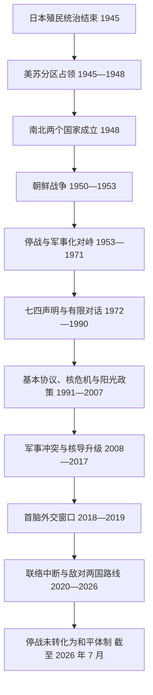

# 朝韩对峙

## 时间

1945 年至今；军事停战体制自 1953 年 7 月 27 日延续至今。本页现代部分核验截至 2026 年 7 月。

## 概括

朝韩对峙并非单纯的两国外交争端，而是日本殖民统治结束后占领区分割、南北竞争性国家建构、半岛内部政治冲突、冷战阵营对抗和朝鲜战争共同形成的复合问题。1953 年《朝鲜停战协定》终止了大规模战斗，却没有签署和平条约，因此半岛在法律与军事上仍处于停战而非战后和平状态。

对峙同时包含四条相互牵制的主线：南北政权合法性与统一观念、韩美同盟与朝中及后来俄朝关系、常规军事冲突、朝鲜核武器与导弹问题。1972 年以来虽多次出现联合声明、首脑会谈和经济合作，但每次缓和都受到核查与履约顺序、军事事件、制裁、国内政治更替及大国关系变化影响。

## 对峙形成的原因

- **占领分区**：1945 年美苏以北纬 38 度线分区受降，南北分别建立军事占领和行政体系。
- **竞争性国家建构**：美苏联合委员会和联合国主持统一选举的方案未能覆盖全半岛。1948 年[大韩民国](/%E4%BA%BA%E6%96%87%E7%A7%91%E5%AD%A6/%E5%8E%86%E5%8F%B2/%E4%B8%9C%E4%BA%9A/%E6%9C%9D%E9%B2%9C%E5%8D%8A%E5%B2%9B/%E5%A4%A7%E9%9F%A9%E6%B0%91%E5%9B%BD.md)与[朝鲜民主主义人民共和国](/%E4%BA%BA%E6%96%87%E7%A7%91%E5%AD%A6/%E5%8E%86%E5%8F%B2/%E4%B8%9C%E4%BA%9A/%E6%9C%9D%E9%B2%9C%E5%8D%8A%E5%B2%9B/%E6%9C%9D%E9%B2%9C%E6%B0%91%E4%B8%BB%E4%B8%BB%E4%B9%89%E4%BA%BA%E6%B0%91%E5%85%B1%E5%92%8C%E5%9B%BD.md)先后成立，双方都曾宣称拥有半岛整体合法性。
- **半岛内部冲突**：土地、阶级、殖民协力者处理、左右翼竞争和地方武装冲突在 1945—1950 年间已造成大量暴力，战争并非突然从无冲突状态开始。
- **冷战国际化**：苏联、中国支持北方，美国及其盟国支持南方，使内战迅速升级为国际战争。
- **统一方式不相容**：双方长期都把自身制度下的统一视为目标，互不承认的政治结构使妥协难以制度化。
- **安全困境**：一方的军备、演习或同盟强化被另一方视为进攻准备，形成武器升级、先发恐惧与危机循环。

## 分阶段演变

### 分区占领与两个国家形成：1945—1950 年

日本于 1945 年 8 月投降后，苏军和美军分别在半岛北部、南部受降。人员往来逐步受限，经济上相互依赖的南北地区被切开。1947—1948 年，联合国推动的选举只在南部举行，南北随后各自建国。济州四三事件、丽水—顺天事件、边境冲突和游击战说明，国家间战争前已经存在激烈的内部政治暴力。

### 朝鲜战争：1950—1953 年

| 阶段 | 过程 | 转折 |
| --- | --- | --- |
| 1950 年 6—8 月 | 朝鲜人民军越过 38 度线，迅速占领首尔并将韩军和美军等压缩至釜山环形防御圈 | 联合国安理会通过援韩决议，美国主导的联合国军持续增援 |
| 1950 年 9—10 月 | 仁川登陆切断北方补给线，联合国军收复首尔、越过 38 度线并向鸭绿江方向推进 | 战争目标由保卫南方扩展到在军事上统一半岛 |
| 1950 年 10 月—1951 年 1 月 | 中国人民志愿军参战，联合国军后撤；平壤和首尔相继易手 | 中国介入阻止北方政权被消灭，战争再次国际化升级 |
| 1951 年 2—6 月 | 联合国军反攻并重新控制首尔，战线逐渐稳定在现今军事分界线附近 | 双方都难以在可接受代价内取得全面胜利 |
| 1951 年 7 月—1953 年 7 月 | 边谈边打，围绕军事分界线、停战监督和战俘遣返长期争执 | 战俘自愿遣返问题及韩国总统李承晚反对停战延迟了协议 |
| 1953 年 7 月 27 日 | 朝鲜人民军、中国人民志愿军和联合国军司令部签署停战协定 | 大规模战斗停止，建立军事分界线、非军事区和停战监督机制；韩国政府不是签字方 |

战争造成军民大规模死亡、城市和交通设施毁坏、家族离散与南北人口迁移。停战线与战前 38 度线接近但并不重合，不能把两者视为同一条线。

### 高度军事化与秘密接触：1953—1971 年

1953 年《韩美共同防御条约》使美军长期驻韩；1961 年朝中友好合作互助条约构成北方的重要安全安排。双方在非军事区、海上和境外展开渗透、情报和破坏行动。1968 年青瓦台袭击未遂与“普韦布洛”号事件、1969 年美军 EC-121 侦察机被击落，使局势多次接近升级。与此同时，双方通过秘密接触探索政治对话。

### 首次共同原则与持续危机：1972—1990 年

1972 年《七四南北共同声明》提出自主、和平、民族大团结三项统一原则，并设立协调机制，但双方随后各自强化国内权力结构。1976 年板门店斧头事件、1983 年仰光爆炸案和 1987 年大韩航空 858 号班机爆炸案使互信反复崩溃。冷战后期的接触没有形成可持续的军事核查和冲突处理制度。

### 制度化对话、核危机与阳光政策：1991—2007 年

1991 年南北同时加入联合国，并签署《南北基本协议》；1992 年《朝鲜半岛无核化共同宣言》提出不试验、不制造、不接收、不拥有、不储存、不部署、不使用核武器以及相互核查，但核查机制未能落实。1993—1994 年第一次朝核危机最终由朝美《框架协议》暂时缓和。

1998 年后，韩国金大中政府实行“阳光政策”。金刚山旅游、离散家属会面和 2000 年首次南北首脑会谈扩大交流；2004 年开城工业园区启动。与此同时，西部海域北方界线争议引发 1999、2002 年海战，朝美核协议瓦解后朝鲜于 2006 年首次核试验。2007 年第二次首脑会谈提出和平与经济合作计划，但政府更替和核争议使多数项目未能持续。

### 军事冲突、制裁与核导升级：2008—2017 年

2008 年金刚山游客被朝方哨兵射杀后，旅游项目停止。2010 年韩国“天安”号警戒舰沉没，国际联合调查认定由朝鲜鱼雷攻击造成，朝鲜否认；同年朝鲜炮击延坪岛，造成军民伤亡。2016 年韩国关闭开城工业园区，最后一个大型常设经济合作项目中断。

朝鲜在此期间多次核试验并发展中远程和洲际弹道导弹，联合国安理会制裁不断扩大。韩国和美国强化延伸威慑、联合军演与导弹防御；朝鲜则把这些措施视为敌对政策证明。2017 年核试验与洲际导弹试射使朝美威胁言辞和军事戒备达到新高点。

### 首脑外交窗口：2018—2019 年

2018 年平昌冬奥会促成南北接触，文在寅与金正恩先后在板门店和平壤会晤。双方签署《板门店宣言》《平壤共同宣言》和《九一九军事协议》，设立开城南北共同联络事务所，并在部分边境区域撤除哨所、限制军事活动。金正恩同年在新加坡与美国总统特朗普会晤。

缓和没有转化为可执行的无核化与制裁交换路线。朝鲜倾向以关闭部分设施换取实质制裁解除，美国要求覆盖核材料、设施和武器能力的更广泛措施。2019 年河内峰会无协议结束，工作层谈判也未恢复稳定进程。

### 联络中断与“敌对两国”转向：2020—2026 年

2020 年朝鲜炸毁开城南北共同联络事务所，象征制度化沟通崩溃。2022 年后，朝鲜核武力政策进一步法制化；韩国强化韩美同盟和美日韩安全合作。2024 年朝鲜将南北关系重新定义为敌对国家关系，拆除统一象征，切断并炸毁部分南北道路与铁路连接；气球、扩音广播、无人机指控等灰色地带冲突再次加剧紧张。

2025 年后，韩国政府采取停止部分扩音广播、强调不追求吸收统一和恢复对话等降温立场。2026 年进一步提出尊重彼此体制与主权、推动和平共存和把停战体制转为和平体制的政策方向。然而截至 2026 年 7 月，朝鲜没有重回持续官方对话，南北正式会谈仍已中断约七年；政策倡议尚未变成双方协议。朝鲜 2026 年的制度文本继续淡化或删除统一表述，使原有“民族内部特殊关系”框架面临更深变化。

## 重要事件与时间节点

| 时间 | 事件 | 结果与长期影响 |
| --- | --- | --- |
| 1945 年 8—9 月 | 38 度线分区受降 | 临时军事分界逐渐变成政治、经济与制度边界 |
| 1948 年 8—9 月 | 南北两个国家成立 | 竞争性主权主张制度化 |
| 1950 年 6 月 25 日 | 朝鲜战争爆发 | 半岛冲突国际化 |
| 1950 年 9 月 | 仁川登陆 | 战局逆转，联合国军随后越过 38 度线 |
| 1950 年 10 月 | 中国人民志愿军参战 | 阻止北方政权被消灭，战线再度南移 |
| 1953 年 7 月 27 日 | 停战协定 | 停战而非和平；军事分界线与非军事区形成 |
| 1953 年 10 月 | 韩美共同防御条约 | 韩美同盟与驻韩美军长期化 |
| 1961 年 7 月 | 朝中友好合作互助条约 | 北方安全关系制度化 |
| 1968 年 1 月 | 青瓦台袭击未遂、“普韦布洛”号事件 | 渗透与美朝军事危机同时升级 |
| 1972 年 7 月 4 日 | 七四南北共同声明 | 首次共同确认自主、和平、民族大团结原则 |
| 1976 年 8 月 | 板门店斧头事件 | 非军事区危机险些扩大，随后局部规则调整 |
| 1983 年 10 月 | 仰光爆炸案 | 韩国总统访问团遭袭，多国认定朝鲜策划 |
| 1987 年 11 月 | 大韩航空 858 号班机爆炸 | 对朝制裁与安全敌意加深 |
| 1991 年 | 同时加入联合国；签署南北基本协议 | 相互关系与和解合作首次形成较系统文件 |
| 1992 年 | 无核化共同宣言生效 | 提出半岛无核与相互核查，但执行失败 |
| 1994 年 | 朝美《框架协议》 | 第一次核危机暂时冻结，后因互不履约与新争议瓦解 |
| 1998 年 | 金刚山旅游启动 | 阳光政策下人员与经济交流扩大 |
| 2000 年 6 月 | 首次南北首脑会谈 | 发表《六月十五日共同宣言》，推动离散家属会面 |
| 2002 年 6 月 | 第二次延坪海战 | 北方界线争议再次造成军人伤亡 |
| 2004 年 | 开城工业园区投产 | 形成最大规模南北常设经济合作 |
| 2006 年 10 月 | 朝鲜首次核试验 | 制裁与核威慑竞争进入新阶段 |
| 2007 年 10 月 | 第二次南北首脑会谈 | 提出和平与共同繁荣项目，但多数未落实 |
| 2008 年 7 月 | 金刚山游客被射杀 | 金刚山旅游中断 |
| 2010 年 3 月 | “天安”号沉没 | 韩国及国际调查指向朝鲜，朝鲜否认；南北关系急剧恶化 |
| 2010 年 11 月 | 延坪岛炮击 | 停战后少见的对居民区直接炮击，造成军民伤亡 |
| 2016 年 2 月 | 开城工业园区关闭 | 常设经济合作基本中断 |
| 2017 年 | 洲际导弹试射与第六次核试验 | 朝美军事危机和联合国制裁达到新高 |
| 2018 年 4—9 月 | 三次南北首脑会谈与九一九军事协议 | 边境降温、联络与合作机制短暂恢复 |
| 2019 年 2 月 | 河内朝美峰会破裂 | 无核化与制裁交换失去政治动力 |
| 2020 年 6 月 | 开城联络事务所被炸毁 | 制度化南北联络象征性终结 |
| 2022 年 9 月 | 朝鲜核武力政策法制化 | 核使用条件与指挥原则更明确，谈判门槛提高 |
| 2024 年 | 朝鲜转向“敌对两国”叙事 | 统一机构、象征与交通连接被撤除或破坏 |
| 2025—2026 年 | 韩国推动降温与和平共存政策 | 单方面降温意向出现，但截至 2026 年 7 月尚未恢复持续正式会谈 |
| 2026 年 | 朝鲜继续调整宪法统一表述 | 南北关系的法理与政治框架进一步分离 |

## 停战与安全结构

| 机制 | 内容 | 易混点 |
| --- | --- | --- |
| 朝鲜停战协定 | 停止敌对行动，设置军事分界线、非军事区和军事停战委员会 | 不是和平条约；韩国政府不是签字方 |
| 军事分界线与非军事区 | 军事分界线两侧各约 2 千米构成约 4 千米宽非军事区 | 不是 1945 年原始 38 度线 |
| 北方界线 | 联合国军司令部在西部海域设定的海上控制线 | 朝鲜不承认其合法性，成为多次海战和渔业冲突焦点 |
| 韩美同盟 | 共同防御条约、驻韩美军、联合指挥与延伸威慑 | 韩国拥有本国军队和政府；同盟不等于美国直接统治 |
| 朝中安全关系 | 1961 年条约及长期政治、经济联系 | 中朝利益并非始终一致，中国也执行过联合国核制裁 |
| 联合国军司令部 | 维持停战协定相关职能，由美国主导、多国参与 | 与联合国秘书处及今日联合国维和行动不是同一机构 |
| 核与导弹问题 | 朝鲜核武器、运载工具及相关制裁、威慑和谈判 | 核问题与南北关系重叠，但朝美、国际核查和安理会也是独立层面 |
| 南北协议 | 1972、1991、2000、2007、2018 年文件 | 多为政治或行政承诺，执行程度不一，不能等同于和平条约 |

## 和解与破裂反复出现的机制

### 促成和解的条件

- 高层领导同时愿意承担国内政治成本，并授权持续工作层谈判。
- 军事危机暂时受控，双方都需要经济、外交或安全上的缓冲空间。
- 美国、中国等外部力量至少不阻止接触，朝美核谈判与南北合作能够相互配合。
- 先从离散家属、通信、交通和局部军事规则等可验证项目建立信任。

### 导致破裂的因素

- **终局不一致**：一方强调先无核化，另一方要求先解除敌对政策和制裁；双方对“无核化”范围也不相同。
- **验证与顺序争议**：核设施、材料、武器和军事活动难以在缺乏信任时全面申报并核查。
- **安全事件冲击**：海上冲突、试射、军演、渗透与人员伤亡会迅速压倒合作议程。
- **国内政治更替**：韩国政府的对朝政策、美国政府的谈判方式及朝鲜内部路线变化，都会使前任承诺失去支持。
- **制度不对称**：韩国的选举周期和公开舆论与朝鲜的高度集中决策节奏不同，履约预期难以同步。
- **大国竞争**：中美、俄美关系恶化时，半岛更容易被纳入更广泛阵营对抗。

因此，缓和声明本身不足以终止对峙；稳定和平需要危机通信、常规军控、核问题安排、制裁与经济交换、国内批准以及和平机制彼此衔接。

## 人道与社会影响

- 数百万家庭因战争与边界长期离散，离散家属会面次数有限，参与者逐年高龄化。
- 战俘、被俘人员、绑架指控、越境者与遗骸返还问题长期影响互信。
- 非军事区限制人员往来，却也因长期低度开发形成特殊生态带。
- 制裁旨在限制核导资金和技术，但执行与边境封锁也会影响普通居民的粮食、医药和贸易；人道援助通常设有豁免，仍受运输、监督和政治关系制约。
- 金刚山、开城工业园区、铁路公路连接表明经济合作可创造共同利益，但项目若缺乏稳定法律和安全框架，也会在危机中迅速中断。

## 截至 2026 年 7 月的状态

- 没有和平条约，1953 年停战机制仍是军事秩序的基础。
- 朝鲜核武器与导弹能力、韩美延伸威慑及美日韩安全合作相互强化。
- 南北部长级或首脑级正式会谈约七年未恢复，常设联络机制也没有正常运行。
- 韩国李在明政府公开承诺尊重朝鲜体制、不追求吸收统一、减少敌对行为并推动和平共存和对话。
- 朝鲜继续把韩国作为敌对的另一国家看待，2026 年制度文本调整进一步弱化统一框架；截至核验日期，没有公开迹象表明其已接受韩国的持续对话提议。
- 当前状态应表述为“韩国提出降温与和平共存路线，但双方尚未形成新协议”，不能写成对峙已经结束或正式和解已经恢复。

## 演变关系

- 前一历史背景：[殖民时期](/%E4%BA%BA%E6%96%87%E7%A7%91%E5%AD%A6/%E5%8E%86%E5%8F%B2/%E4%B8%9C%E4%BA%9A/%E6%9C%9D%E9%B2%9C%E5%8D%8A%E5%B2%9B/%E6%AE%96%E6%B0%91%E6%97%B6%E6%9C%9F.md)。
- 南方国家发展：[大韩民国](/%E4%BA%BA%E6%96%87%E7%A7%91%E5%AD%A6/%E5%8E%86%E5%8F%B2/%E4%B8%9C%E4%BA%9A/%E6%9C%9D%E9%B2%9C%E5%8D%8A%E5%B2%9B/%E5%A4%A7%E9%9F%A9%E6%B0%91%E5%9B%BD.md)。
- 北方国家发展：[朝鲜民主主义人民共和国](/%E4%BA%BA%E6%96%87%E7%A7%91%E5%AD%A6/%E5%8E%86%E5%8F%B2/%E4%B8%9C%E4%BA%9A/%E6%9C%9D%E9%B2%9C%E5%8D%8A%E5%B2%9B/%E6%9C%9D%E9%B2%9C%E6%B0%91%E4%B8%BB%E4%B8%BB%E4%B9%89%E4%BA%BA%E6%B0%91%E5%85%B1%E5%92%8C%E5%9B%BD.md)。
