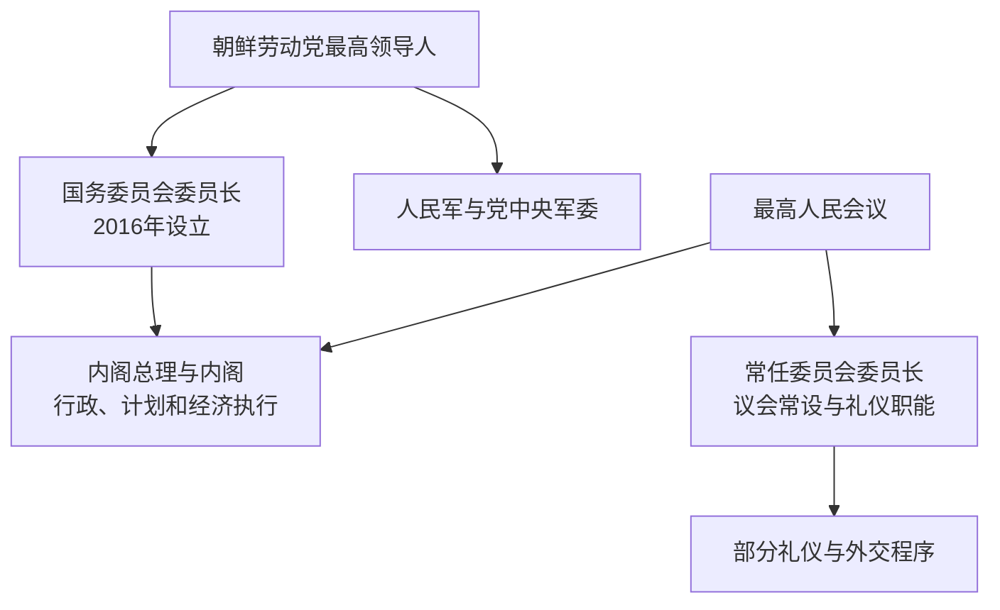

# 朝鲜国家领导人与内阁总理表

## 说明

朝鲜的“最高领导人”、宪制国家元首、最高人民会议常任机构负责人和内阁总理不是同一职务。最高领导权长期集中于朝鲜劳动党领袖及金氏家族；宪法中的国家代表职务则随1948、1972、1998、2016和2019年制度调整而变化。内阁总理主管行政和经济执行，但在劳动党领导体系下不构成与最高领导人并列的独立权力中心。

2019年宪法调整后，国务委员会委员长被明确为“代表国家”的最高职位；最高人民会议常任委员会委员长仍承担议会常设机关和部分礼仪、外交程序。故2019年以后的两职必须分列。

## 最高领导人

| 顺序 | 人物 | 实际最高领导时期 | 主要权力职务 | 继承与说明 |
| --- | --- | --- | --- | --- |
| 1 | **金日成** | 1948-09-09—1994-07-08 | 劳动党委员长 / 总书记、内阁首相、共和国主席 | 建国领导人；1950年代清除党内派系，形成个人领导体制；身后被尊为“永远的主席”。 |
| 2 | **金正日** | 1994-07-08—2011-12-17 | 劳动党总书记、国防委员会委员长、人民军最高司令官 | 金日成之子；1994年后经过数年制度过渡完成继承，以“先军政治”和国防委员会为权力核心；身后被尊为“永远的国防委员长”。 |
| 3 | **金正恩** | 2011-12-17—至今 | 劳动党第一书记 / 委员长 / 总书记、国务委员会委员长 | 金正日之子；2016年以国务委员会取代国防委员会，2021年起任劳动党总书记，2026年再次当选党总书记和国务委员长。 |

## 宪制国家元首 / 国家代表职务

| 时段 | 人物 / 状态 | 法定职位 | 说明 |
| --- | --- | --- | --- |
| 1948-09-09—1957-09-20 | 金枓奉 | 最高人民会议常任委员会委员长 | 1948年宪法下承担集体国家元首体系中的对外代表职能，实际最高权力逐渐集中于金日成。 |
| 1957-09-20—1972-12-28 | 崔庸健 | 最高人民会议常任委员会委员长 | 继续担任礼仪性国家代表。 |
| 1972-12-28—1994-07-08 | **金日成** | 朝鲜民主主义人民共和国主席 | 1972年社会主义宪法新设执行性主席职位，明定为国家元首。 |
| 1994-07-08—1998-09-05 | 总统职位空缺 | 共和国主席职位未补 | 金日成逝世后不设继任主席；国家代表、议会和行政职能由既有机关分担，1998年修宪正式废止主席职位。 |
| 1998-09-05—2019-04-11 | 金永南 | 最高人民会议常任委员会委员长 | 1998年改组后的常任机构负责人，长期被视为礼仪性国家元首，负责大量对外代表活动。 |
| 2019-04-11—至今 | **金正恩** | 国务委员会委员长 | 2019年宪法进一步明确其为代表国家的最高职位；与劳动党最高领导身份结合。 |

## 最高人民会议常任机构负责人

1972—1998年该职位不等同于共和国主席；1998—2019年其负责人承担礼仪性国家元首职能；2019年后国家最高代表地位转由国务委员会委员长，但常任委员会委员长继续主持议会常设机关。中文译名在不同时期也见“常设会议议长”“常任委员会委员长”。

| 顺序 | 人物 | 任期 | 当时制度位置 |
| --- | --- | --- | --- |
| 1 | 金枓奉 | 1948-09-09—1957-09-20 | 1948年宪法下的常任委员会委员长和对外国家代表。 |
| 2 | 崔庸健 | 1957-09-20—1972-12-28 | 同上，至共和国主席职位设立。 |
| 3 | 黄长烨 | 1972-12-28—1983-04-07 | 共和国主席制下的议会常设机关负责人，不是最高领导人。 |
| 4 | 杨亨燮 | 1983-04-07—1998-09-05 | 金日成晚期及1994—1998过渡期的常设机关负责人。 |
| 5 | **金永南** | 1998-09-05—2019-04-11 | 1998年修宪后任常任委员会委员长，承担礼仪性国家元首职能。 |
| 6 | 崔龙海 | 2019-04-11—2026-03-22 | 2019年后主持议会常设机关，并兼任国务委员会第一副委员长。 |
| 7 | **赵甬元** | 2026-03-22—至今 | 第十五届最高人民会议选出；截至2026年7月在任，并任国务委员会第一副委员长。 |

## 内阁总理

1948—1972年称内阁首相，金日成兼任并掌握最高权力；1972—1998年称政务院总理，权力受共和国主席和中央人民委员会制约；1998年恢复内阁后称内阁总理。

| 顺序 | 人物 | 任期 | 职称阶段 | 说明 |
| --- | --- | --- | --- | --- |
| 1 | **金日成** | 1948-09-09—1972-12-28 | 内阁首相 | 建国政府首脑并为实际最高领导人。 |
| 2 | 金一 | 1972-12-28—1976-04-30 | 政务院总理 | 共和国主席制设立后的首任政务院总理。 |
| 3 | 朴成哲 | 1976-04-30—1977-12-15 | 政务院总理 | 后长期担任国家副主席等职。 |
| 4 | 李钟玉 | 1977-12-15—1984-01-25 | 政务院总理 | 经济与行政干部。 |
| 5 | 姜成山 | 1984-01-25—1986-12-29 | 政务院总理 | 第一次任期。 |
| 6 | 李根模 | 1986-12-29—1988-12-12 | 政务院总理 | 经济困难加深时期。 |
| 7 | 延亨默 | 1988-12-12—1992-12-11 | 政务院总理 | 参与1990—1992年南北高级别会谈。 |
| 5（再任） | 姜成山 | 1992-12-11—1997-02-21 | 政务院总理 | 第二次任期。 |
| 代理 | 洪成南 | 1997-02-21—1998-09-05 | 代理政务院总理 | 饥荒与制度改组时期。 |
| 8 | 洪成南 | 1998-09-05—2003-09-03 | 内阁总理 | 1998年修宪恢复内阁后的首任总理。 |
| 9 | 朴凤柱 | 2003-09-03—2007-04-11 | 内阁总理 | 第一次任期，推动有限经济管理调整。 |
| 10 | 金英日 | 2007-04-11—2010-06-07 | 内阁总理 | 2009年货币改革失败后被撤换。 |
| 11 | 崔永林 | 2010-06-07—2013-04-01 | 内阁总理 | 金正日末期至金正恩初期的过渡。 |
| 9（再任） | 朴凤柱 | 2013-04-01—2019-04-11 | 内阁总理 | 第二次任期，配合经济与核武并进路线。 |
| 12 | 金才龙 | 2019-04-11—2020-08-13 | 内阁总理 | 2019年制度调整后的首任总理。 |
| 13 | 金德训 | 2020-08-13—2024-12-29 | 内阁总理 | 疫情封境、灾害与五年计划执行时期。 |
| 14 | **朴泰成** | 2024-12-29—至今 | 内阁总理 | 2026年3月再次获最高人民会议任命；截至2026年7月仍在任，并任国务委员会副委员长。 |

## 权力关系示意

图中箭头表示制度上的领导、任命或组织关系；实际权力还受劳动党中央组织体系、领袖权威和安全机构影响，不能仅按宪法职位排序推断。

## 相关笔记

- 主笔记：[朝鲜民主主义人民共和国](/%E4%BA%BA%E6%96%87%E7%A7%91%E5%AD%A6/%E5%8E%86%E5%8F%B2/%E4%B8%9C%E4%BA%9A/%E6%9C%9D%E9%B2%9C%E5%8D%8A%E5%B2%9B/%E6%9C%9D%E9%B2%9C%E6%B0%91%E4%B8%BB%E4%B8%BB%E4%B9%89%E4%BA%BA%E6%B0%91%E5%85%B1%E5%92%8C%E5%9B%BD.md)。
- 分裂与战争背景：[朝韩对峙](/%E4%BA%BA%E6%96%87%E7%A7%91%E5%AD%A6/%E5%8E%86%E5%8F%B2/%E4%B8%9C%E4%BA%9A/%E6%9C%9D%E9%B2%9C%E5%8D%8A%E5%B2%9B/%E6%9C%9D%E9%9F%A9%E5%AF%B9%E5%B3%99.md)。
- 并列国家：[大韩民国](/%E4%BA%BA%E6%96%87%E7%A7%91%E5%AD%A6/%E5%8E%86%E5%8F%B2/%E4%B8%9C%E4%BA%9A/%E6%9C%9D%E9%B2%9C%E5%8D%8A%E5%B2%9B/%E5%A4%A7%E9%9F%A9%E6%B0%91%E5%9B%BD.md)。
- 目录总览：[朝鲜半岛](/%E4%BA%BA%E6%96%87%E7%A7%91%E5%AD%A6/%E5%8E%86%E5%8F%B2/%E4%B8%9C%E4%BA%9A/%E6%9C%9D%E9%B2%9C%E5%8D%8A%E5%B2%9B/README.md)。
