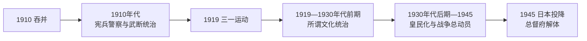

# 朝鲜总督表

## 说明

本表列出1910—1945年日本殖民统治下的历任朝鲜总督。朝鲜总督由日本天皇任命，直接统辖行政、警察、司法监督、经济与教育事务；总督府发布的“制令”可在殖民地内发挥近似法律的效力。历任正式总督均出身日本陆军或海军高级将领，文官任用在制度上虽于1919年后成为可能，实际并未出现文官总督。

“文化统治”“皇民化”等名称描述的是统治方式的调整，不代表殖民地主权、警察控制或差别结构已经消失。1927年宇垣一成的临时总督任期与斋藤实第三任总督任期重叠，故单列而不计入正式顺序。

## 历任总督

| 顺序 | 姓名 | 任期 | 背景 | 任内重点与说明 |
| --- | --- | --- | --- | --- |
| 1 | **寺内正毅** | 1910-10-01—1916-10-14 | 陆军大将 | 完成吞并后的总督府建制，推行宪兵警察、土地调查与公司管制，确立“武断统治”框架。 |
| 2 | 长谷川好道 | 1916-10-14—1919-08-12 | 陆军元帅 | 继续军事警察体制；1919年三一运动在其任内爆发并遭镇压，随后被撤换。 |
| 3 | **斋藤实** | 1919-08-13—1927-12-10 | 海军大将 | 以所谓“文化统治”缓和公开军事色彩，调整警察、教育和出版制度，同时扩大普通警察、情报监控与殖民经济整合。 |
| 临时 | 宇垣一成 | 1927-04-15—1927-10-01 | 陆军大将 | 斋藤实离任期间代理，任期与第三任正式总督重叠。 |
| 4 | 山梨半造 | 1927-12-10—1929-08-17 | 陆军大将 | 延续殖民行政与产米增殖政策；总督府官商关系及贪腐问题引发争议。 |
| 5 | 斋藤实 | 1929-08-17—1931-06-17 | 海军大将 | 第二次出任总督；任内发生光州学生运动，世界经济危机加剧农村与劳工困境。 |
| 6 | 宇垣一成 | 1931-06-17—1936-08-05 | 陆军大将 | 在日本侵占中国东北后强化半岛的军事后方与工业基地功能，推进农村振兴、北部工业和交通建设。 |
| 7 | **南次郎** | 1936-08-05—1942-05-29 | 陆军大将 | 中日战争后全面推进皇民化、日语教育、神社参拜、创氏改名和战时劳务动员。 |
| 8 | 小矶国昭 | 1942-05-29—1944-07-22 | 陆军大将 | 太平洋战争时期扩大粮食、劳工、兵员和军需资源征集；1944年开始在朝鲜实施征兵。 |
| 9 | **阿部信行** | 1944-07-24—1945-09-28 | 陆军大将、前日本首相 | 战败前继续总动员；1945年8月日本宣布投降，9月9日总督府在首尔向美军移交统治权，机构随后正式废止。 |

## 统治机构

| 层级 | 机构 / 职位 | 权力与实际作用 |
| --- | --- | --- |
| 帝国主权 | 日本天皇与日本政府 | 朝鲜被纳入大日本帝国，殖民地重大制度以敕令、法律及日本内阁决定为依据。 |
| 殖民最高首脑 | 朝鲜总督 | 对天皇负责，掌握总督府行政、警察和军政协调，并可发布制令。 |
| 中枢行政 | 政务总监及总督官房、各局 / 部 | 政务总监协助总督处理日常行政；警务、财务、殖产、学务、铁道等部门执行专门政策。 |
| 强制体系 | 宪兵警察、普通警察、法院与监狱 | 1910年代以宪兵警察为核心；1919年后改称普通警察体制，但人员、预算、情报和治安网络反而扩大。 |
| 地方行政 | 道、府、郡、岛及面 | 地方长官由总督府控制，基层行政承担户籍、税收、粮食征集、治安和动员。 |
| 咨询与吸纳 | 中枢院及各类咨询机构 | 吸纳部分朝鲜王公、地主、士绅和专业人士，提供有限咨询与身份利益，不具有代议主权。 |

## 与统治阶段的关系

## 相关笔记

- 主笔记：[殖民时期](/%E4%BA%BA%E6%96%87%E7%A7%91%E5%AD%A6/%E5%8E%86%E5%8F%B2/%E4%B8%9C%E4%BA%9A/%E6%9C%9D%E9%B2%9C%E5%8D%8A%E5%B2%9B/%E6%AE%96%E6%B0%91%E6%97%B6%E6%9C%9F.md)。
- 前一阶段：[朝鲜王朝](/%E4%BA%BA%E6%96%87%E7%A7%91%E5%AD%A6/%E5%8E%86%E5%8F%B2/%E4%B8%9C%E4%BA%9A/%E6%9C%9D%E9%B2%9C%E5%8D%8A%E5%B2%9B/%E6%9C%9D%E9%B2%9C%E7%8E%8B%E6%9C%9D.md)。
- 后一阶段：[朝韩对峙](/%E4%BA%BA%E6%96%87%E7%A7%91%E5%AD%A6/%E5%8E%86%E5%8F%B2/%E4%B8%9C%E4%BA%9A/%E6%9C%9D%E9%B2%9C%E5%8D%8A%E5%B2%9B/%E6%9C%9D%E9%9F%A9%E5%AF%B9%E5%B3%99.md)。
- 目录总览：[朝鲜半岛](/%E4%BA%BA%E6%96%87%E7%A7%91%E5%AD%A6/%E5%8E%86%E5%8F%B2/%E4%B8%9C%E4%BA%9A/%E6%9C%9D%E9%B2%9C%E5%8D%8A%E5%B2%9B/README.md)。
