# 朝鲜民主主义人民共和国

## 时间

1948 年 9 月 9 日至今。本页现代部分核验截至 2026 年 7 月。

## 别称

朝鲜、北朝鲜、北韩；正式国名为朝鲜民主主义人民共和国，英文缩写 DPRK。

## 概括

朝鲜民主主义人民共和国建立于第二次世界大战后苏联占领的半岛北部。它以朝鲜劳动党为政治核心，在冷战、朝鲜战争、战后重建、中苏分裂、社会主义阵营解体和长期制裁中逐步形成以最高领导人为中心、党政军高度结合的体制。名义国家机关的负责人、内阁总理和实际最高领导人并非同一职位，不能混列。

朝鲜早期依靠土地改革、工业国有化和苏联、中国援助迅速恢复重工业；20 世纪 70 年代以后，外债、技术与能源约束以及计划体制低效日益突出。苏联解体、贸易网络中断和自然灾害共同引发 1990 年代严重饥荒。此后市场活动在正式计划体制之外扩张，但核武器与导弹建设、联合国制裁和安全对抗持续限制对外经济联系。

## 建立背景

- 1945 年 8 月日本投降后，苏军进入北纬 38 度线以北，美军进入以南。原本作为受降便利线的分界很快因美苏对立而制度化。
- 北部各地的人民委员会被纳入苏联占领当局支持的行政体系。1946 年成立北朝鲜临时人民委员会，金日成任委员长。
- 1946 年土地改革无偿没收日本人、亲日地主和大地主土地并分配给农民；同年主要工业、银行、交通和通信设施国有化，改变了殖民时期的所有制结构。
- 南北联合政府方案在冷战和半岛内部政治冲突中失败。1947 年北朝鲜人民委员会成立，1948 年制定宪法并举行北部政权的代议机关选举。
- 1948 年 9 月 9 日，朝鲜民主主义人民共和国成立。它与 8 月成立的[大韩民国](/%E4%BA%BA%E6%96%87%E7%A7%91%E5%AD%A6/%E5%8E%86%E5%8F%B2/%E4%B8%9C%E4%BA%9A/%E6%9C%9D%E9%B2%9C%E5%8D%8A%E5%B2%9B/%E5%A4%A7%E9%9F%A9%E6%B0%91%E5%9B%BD.md)都宣称代表整个朝鲜半岛，竞争性国家建构成为战争的重要制度背景。

## 统治结构

| 层级 | 主要机关或职位 | 实际作用 |
| --- | --- | --- |
| 最高政治核心 | 朝鲜劳动党及其总书记 | 决定路线、干部任用和党政军重大政策；总书记兼任最高军事与国家职务时，构成最高权力中心 |
| 国家最高领导职务 | 国务委员会委员长 | 现行体制下代表国家最高领导地位并统辖国家重大事务；2016 年由国防委员会体制改组而来 |
| 立法机关 | 最高人民会议 | 宪法上的最高权力机关；会议闭会期间由常任委员会处理持续性职能 |
| 常设国家代表机关 | 最高人民会议常任委员会及委员长 | 负责法令、外交礼仪和部分国家代表职能；其委员长不等同于最高领导人 |
| 行政机关 | 内阁及内阁总理 | 负责经济、行政和国家计划执行；在人事和路线方面受党的领导 |
| 军事与安全体系 | 朝鲜人民军、党中央军事委员会及安全机关 | 承担国防、战略武器、安全控制和政权保卫等任务 |
| 群众组织与基层单位 | 青年、工会、妇女等组织及地方人民会议、人民委员会 | 连接党、国家与社会，执行动员、分配和社会管理 |

最高领导人、国家代表职务、最高人民会议常设机关负责人和历任内阁总理的完整分表，见[朝鲜国家领导人与内阁总理表](/%E4%BA%BA%E6%96%87%E7%A7%91%E5%AD%A6/%E5%8E%86%E5%8F%B2/%E4%B8%9C%E4%BA%9A/%E6%9C%9D%E9%B2%9C%E5%8D%8A%E5%B2%9B/%E6%9C%9D%E9%B2%9C%E5%9B%BD%E5%AE%B6%E9%A2%86%E5%AF%BC%E4%BA%BA%E4%B8%8E%E5%86%85%E9%98%81%E6%80%BB%E7%90%86%E8%A1%A8.md)。

## 分阶段发展

### 政权建立与战争：1945—1953 年

北部通过土地改革、国有化和干部组织迅速建立政权。1950 年 6 月 25 日，朝鲜人民军越过 38 度线进攻南方，战争从半岛内部的国家与政治冲突升级为有美国主导的联合国军和中国人民志愿军参加的国际战争。战线在半岛南北多次移动，人员伤亡、离散和基础设施毁坏极其严重。1953 年停战协定只停止军事行动，没有缔结和平条约。

### 重建、权力集中与中苏平衡：1953—1972 年

战后朝鲜优先恢复重工业和城市基础设施，最初增长得到社会主义国家援助支撑。1956 年“八月宗派事件”及其后的清洗削弱延安派、苏联派等党内力量，金日成逐渐完成个人权力集中。千里马运动以政治动员推动超额生产，但长期也造成指标压力、投资失衡和资源浪费。中苏分裂后，朝鲜在两国之间寻求援助与战略自主，并把“主体”逐步发展为国家意识形态。

### 主体体制、继承布局与经济停滞：1972—1994 年

1972 年社会主义宪法设置国家主席，金日成成为国家主席；同年平壤与首尔签署《南北共同声明》，但对话很快被安全竞争压倒。1970 年代朝鲜以外债进口成套设备，能源与出口能力却不足，债务和技术更新困难显现。1980 年劳动党第六次代表大会使金正日的接班地位公开化。1980 年代末至 1990 年代初，东欧剧变、苏联解体和经互会式贸易中断，使依赖优惠能源与易货结算的经济遭到结构性冲击。

### “苦难行军”、先军政治与有限市场化：1994—2011 年

金日成于 1994 年去世后，金正日通过劳动党、国防委员会和军队巩固继承。能源短缺、洪灾、农业投入崩溃、配给体系失灵与政策失误叠加，造成 1990 年代中后期严重饥荒，死亡规模存在较大估计差异。国家配给衰退迫使家庭、地方单位和边境贸易更多依赖集市，非正式市场逐渐成为生活资料的重要来源。

外交上，1994 年朝美《框架协议》一度冻结宁边石墨反应堆相关设施；协议破裂后，朝鲜于 2003 年宣布退出《不扩散核武器条约》，2006 年首次核试验。六方会谈达成过关闭设施与援助交换安排，但核申报、核查、制裁和安全保证分歧使执行中断。

### 金正恩时期的权力重组与核导并进：2011—2019 年

金正日于 2011 年去世后，金正恩继承最高权力。其初期通过党代会、国家机构改组和高级干部更替集中权力，2013 年处决张成泽是显著转折。经济政策允许部分企业、农场和市场在国家框架内扩大自主空间，平壤建设和消费服务有所增长，但地区、阶层和获取外汇能力的差距扩大。

朝鲜同时加快核武器与远程导弹建设。2013 年提出经济建设与核武建设“并进”路线，2016—2017 年连续进行核试验和远程导弹试射。2018 年后，金正恩先后与韩国总统文在寅、美国总统特朗普会晤；板门店与平壤宣言带来军事降温和联络机制，但 2019 年河内朝美峰会因制裁解除范围、无核化步骤和核设施申报分歧未达成协议。

### 疫情封锁、对俄靠近与“两个敌对国家”路线：2020—2026 年

2020 年起，朝鲜以防疫为由长期严格限制跨境交通，贸易、粮食和医药供应受到冲击；其后边境往来逐步恢复。核导计划继续推进，2022 年以法律形式明确核武器使用政策，2023 年又把核武力建设政策写入宪法。与此同时，俄朝军事与经济合作快速增强，外部阵营对立加深。

2024 年，朝鲜领导层否定以往以民族统一为前提的南北关系框架，把韩国界定为敌对的另一国家，并撤销或改组部分对南机构。南北道路、铁路的象征性连接也被拆除或切断。2026 年党和国家机构换届后，这一方向没有逆转；公开披露的宪法修订进一步删除或改写统一相关表述。它改变的是朝鲜对南政策与领土叙事，并不意味着停战状态已经由和平条约取代。

## 重要事件

| 时间 | 事件 | 过程与意义 |
| --- | --- | --- |
| 1946 年 2—8 月 | 临时人民委员会、土地改革与工业国有化 | 建立北部行政和经济制度基础，削弱地主与殖民资本结构 |
| 1948 年 9 月 9 日 | 朝鲜民主主义人民共和国成立 | 南北两个竞争性国家相继建立 |
| 1950 年 6 月—1953 年 7 月 | 朝鲜战争 | 统一战争演变为国际战争；停战而未和平解决 |
| 1956 年 8 月及以后 | 八月宗派事件与党内清洗 | 反对金日成路线的干部失败，个人权力进一步集中 |
| 1956 年后 | 千里马运动 | 以群众动员推动战后工业化，也加剧计划指标与资源错配 |
| 1967 年前后 | 唯一思想体系强化 | 党内意识形态和领袖中心体制进一步制度化 |
| 1972 年 | 新宪法与南北共同声明 | 设置国家主席并确立社会主义国家结构；同时出现首次南北原则性和解文件 |
| 1980 年 | 劳动党第六次代表大会 | 金正日接班地位公开化 |
| 1985—1992 年 | 加入《不扩散核武器条约》并接受保障监督 | 核问题进入国际核查与外交框架 |
| 1994 年 | 金日成去世；朝美《框架协议》 | 权力继承与核冻结安排同时展开 |
| 1990 年代中后期 | “苦难行军” | 饥荒、配给失灵和人口损失推动市场活动扩张 |
| 1998 年 | 金正日时代国家体制调整 | 宪法确认金日成为“永远的主席”，国防委员会成为权力枢纽之一 |
| 2000 年 | 首次南北首脑会谈 | 和解、离散家属会面与经济合作短暂扩大 |
| 2003 年 | 宣布退出《不扩散核武器条约》 | 核危机进入武器化与多边谈判阶段 |
| 2006 年 | 首次核试验 | 联合国制裁体系逐步扩大 |
| 2009 年 | 六方会谈中断 | 核设施、核查、制裁和安全保证交换未能制度化 |
| 2011—2012 年 | 金正恩继承权力 | 第三代最高领导体制形成 |
| 2013 年 | 并进路线与张成泽被处决 | 核战略制度化，内部权力重组加速 |
| 2016 年 | 国务委员会体制建立 | 国务委员会委员长成为现行国家最高领导职务 |
| 2017 年 | 第六次核试验与洲际导弹进展 | 朝美军事危机升至冷战后高点 |
| 2018 年 | 南北、朝美首脑外交 | 出现缓和窗口，但无核化路线图和核查机制未能落地 |
| 2019 年 2 月 | 河内峰会破裂 | 制裁解除与无核化步骤分歧使谈判停顿 |
| 2020 年 | 疫情边境封锁 | 对外贸易与人员流动锐减，加重物资约束 |
| 2022—2023 年 | 核武力政策法制化、宪法化 | 核武器被定位为国家安全和体制生存的长期工具 |
| 2024 年 | “两个敌对国家”路线与南北连接切断 | 传统统一叙事被国家间敌对关系叙事取代 |
| 2026 年 3 月 | 第十五届最高人民会议首次会议 | 金正恩续任国家最高领导职务，赵甬元任最高人民会议常任委员会委员长，朴泰成续任内阁总理 |
| 2026 年 | 宪法与对南路线继续调整 | 统一表述进一步退出国家制度文本，南北政治关系仍处停滞 |

## 经济与社会结构

### 计划经济的形成与局限

殖民时期北部集中了较多水电、矿业和重工业设施，战后国家据此优先发展钢铁、机械、化工和军工。早期土地改革、基础教育和公共卫生扩展提高了社会动员能力，但重工业优先压缩消费品和农业投入。计划体系依赖行政指标、优惠能源、社会主义国家设备和有限出口，一旦外部结算网络消失，结构弱点集中暴露。

### 配给、市场与不平等

国家粮食配给体系在城市与战略部门具有核心地位，但 1990 年代后无法稳定覆盖全部人口。综合市场、私人小规模生产、运输与边境贸易成为家庭生计的重要补充。国家时而整顿、时而规范市场，形成计划分配与市场交换并存的格局。平壤居民、党政军单位、外汇来源家庭与边远地区居民获得住房、食品、医疗和教育资源的能力并不相同。

### 社会控制与人权问题

户籍与政治分类、组织生活、信息管制、旅行限制和刑罚体系共同维持高度组织化社会。免费教育和公共医疗是制度性承诺，但设施、药品和地区供给受经济条件限制。国际机构、脱北者证词和人权调查长期报告政治拘禁、强迫劳动及表达和迁徙自由受限；具体规模因信息封闭而难以完全核实，书写时应区分可确认制度、证词和推算数据。

## 核与安全政策的形成

朝鲜把核武器解释为应对美国军事压力、政权安全不确定性和常规力量差距的威慑手段；美国、韩国、日本及联合国则强调其违反安理会决议、破坏不扩散制度并提高误判风险。核问题并非单纯技术争议，而是安全保证、制裁、联盟、和平机制和国内政治彼此锁定的结果。

- 1985 年加入《不扩散核武器条约》，1992 年与国际原子能机构签署保障协定。
- 1993—1994 年第一次核危机以朝美《框架协议》暂时缓和。
- 2002—2003 年协议瓦解，朝鲜宣布退约；2006 年完成首次核试验。
- 2003—2008 年六方会谈曾推进冻结、核查和援助交换，但未能形成可持续执行顺序。
- 2016—2017 年核试验和远程导弹能力快速发展，制裁与军事威慑同步升级。
- 2018—2019 年首脑外交没有解决核设施范围、库存申报、制裁解除和终局定义。
- 2022 年以后，核武器政策进一步法制化；截至 2026 年 7 月，核裁军谈判仍未恢复为持续进程。

## 政权延续与危机因素

### 延续机制

- **组织控制**：劳动党、安全机关和基层组织贯穿干部任用、资源分配与社会生活。
- **领袖合法性**：抗日叙事、战争记忆、主体思想和家族继承塑造连续政治象征。
- **安全优先**：外部威胁被用于解释军备、动员和内部团结。
- **制度适应**：在不放弃党国控制的前提下容纳部分市场、地方经营和外汇活动。
- **地缘环境**：中国、俄罗斯与美国主导的联盟体系相互牵制，使外部力量难以低成本改变现状。

### 长期压力

- **结构因素**：能源和耕地约束、设备老化、计划与市场规则冲突、人口营养和公共服务不足。
- **外部压力**：核导制裁、军事对峙、贸易渠道狭窄和国际金融隔离。
- **直接风险**：粮食与灾害冲击、政策急转、边境封锁、核导试验引发的危机升级。
- **信息限制**：封闭环境使决策纠错、外部评估和危机预警更加困难。

这些压力并未自动导向体制崩溃；同样，政权持续存在也不等于经济与社会问题已经解决。

## 截至 2026 年 7 月的现状

- **实际最高领导人**：金正恩，兼任朝鲜劳动党总书记、国务委员会委员长等核心职务。
- **最高人民会议常任委员会委员长**：赵甬元，自 2026 年 3 月任职，承担相应常设国家代表职能。
- **内阁总理**：朴泰成，自 2024 年末任职，2026 年获续任。
- **对南关系**：朝鲜已从以统一为目标的特殊民族内部关系转向敌对国家关系叙事，未响应韩国恢复制度化对话的主要倡议。
- **外交与安全**：对俄关系和军事合作增强，对华关系仍具关键经济与战略意义；核武器与导弹仍是国家安全路线核心。
- **和平状态**：[朝韩对峙](/%E4%BA%BA%E6%96%87%E7%A7%91%E5%AD%A6/%E5%8E%86%E5%8F%B2/%E4%B8%9C%E4%BA%9A/%E6%9C%9D%E9%B2%9C%E5%8D%8A%E5%B2%9B/%E6%9C%9D%E9%9F%A9%E5%AF%B9%E5%B3%99.md)仍受 1953 年停战体制约束，没有和平条约。

## 演变关系

```mermaid
flowchart LR
    A["日本殖民统治结束 1945"] --> B["苏联占领区与北部人民委员会 1945—1948"]
    B --> C["朝鲜民主主义人民共和国成立 1948"]
    C --> D["朝鲜战争 1950—1953"]
    D --> E["战后重建与权力集中 1953—1972"]
    E --> F["主体体制与继承布局 1972—1994"]
    F --> G["苦难行军与先军政治 1994—2011"]
    G --> H["金正恩时期 2011—至今"]
    H --> I["核导并进与首脑外交 2013—2019"]
    I --> J["疫情封锁与敌对两国路线 2020—2026"]
```

- 前一阶段：[殖民时期](/%E4%BA%BA%E6%96%87%E7%A7%91%E5%AD%A6/%E5%8E%86%E5%8F%B2/%E4%B8%9C%E4%BA%9A/%E6%9C%9D%E9%B2%9C%E5%8D%8A%E5%B2%9B/%E6%AE%96%E6%B0%91%E6%97%B6%E6%9C%9F.md)结束后，半岛北部进入苏联占领与政权重建阶段。
- 并列政权：[大韩民国](/%E4%BA%BA%E6%96%87%E7%A7%91%E5%AD%A6/%E5%8E%86%E5%8F%B2/%E4%B8%9C%E4%BA%9A/%E6%9C%9D%E9%B2%9C%E5%8D%8A%E5%B2%9B/%E5%A4%A7%E9%9F%A9%E6%B0%91%E5%9B%BD.md)于 1948 年在半岛南部成立。
- 军事与外交关系：南北关系的战争、停战、对话与危机见[朝韩对峙](/%E4%BA%BA%E6%96%87%E7%A7%91%E5%AD%A6/%E5%8E%86%E5%8F%B2/%E4%B8%9C%E4%BA%9A/%E6%9C%9D%E9%B2%9C%E5%8D%8A%E5%B2%9B/%E6%9C%9D%E9%9F%A9%E5%AF%B9%E5%B3%99.md)。
