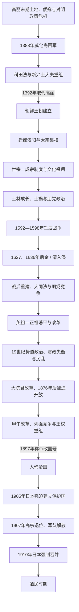

# 朝鲜王朝

## 时间

1392—1897年（朝鲜王朝）；1897—1910年（大韩帝国，延续李氏皇统）。

## 别称

- 李氏朝鲜
- 后期改称大韩帝国

## 概括

朝鲜王朝由李成桂取代高丽建立，是朝鲜半岛历史上延续时间很长的王朝。它以儒学为国家意识形态，建立两班官僚体系，发展训民正音和朝鲜式文治秩序；近代以后在清、日本、俄国等势力夹击下被迫开放，1897年改称大韩帝国，1910年被日本吞并。

## 历史演进图

## 建立背景

- 高丽末年，权门土地兼并、倭寇和红巾军侵扰、元明更替及军阀崛起削弱旧秩序。以程朱学为思想资源的新兴士大夫主张重建土地、官僚和礼制，内部又分为保留高丽王统的温和派与另建王朝的急进派。
- 1388年李成桂威化岛回军后控制军队，郑道传、赵浚等推进科田法和官制改革。1392年郑梦周遇害、恭让王退位，李成桂即位。
- 新王朝请明朝在“朝鲜”“和宁”中选择国号，最终使用“朝鲜”；此举既争取国际承认，也把新国家与古朝鲜政治记忆连接。
- 1394年迁都汉阳利用汉江运输和半岛中心位置。王子之乱后李芳远即太宗压制私兵和功臣，确立更集中的王权官僚体制。

## 分阶段发展

| 阶段 | 时间 | 具体过程 | 阶段结果 |
|---|---|---|---|
| 建国与中央集权 | 1392—1418年 | 太祖与郑道传设计议政府、六曹和科田制；两次王子之乱后太宗即位，废私兵、强化户籍与六曹直启。 | 王权压过开国功臣和宗室武装，汉阳成为稳定首都。 |
| 制度与文化盛期 | 1418—1494年 | 世宗、世祖、成宗时期发展集贤殿、训民正音、历法、农书和边疆建置；世祖夺位后重整军政，《经国大典》在成宗时完成。 | 官僚、法律、八道地方制和两班秩序定型，北部边界大体推进至鸭绿江、图们江。 |
| 士林成长与政治分化 | 1494—1567年 | 燕山君、中宗、明宗时期发生多次士祸，勋旧与士林竞争；乡约、书院和地方宗族扩大士林社会基础。 | 士林最终进入中央并分化为朋党，言官政治活跃，但军备和财政改革屡受派系牵制。 |
| 壬辰战争与后金—清冲击 | 1567—1637年 | 1592年丰臣秀吉军入侵，朝鲜水军、义兵、官军与明军共同反攻，战争至1598年结束；1623年仁祖反正后对后金强硬，1627、1636年两次遭入侵。 | 人口、田地和文书遭巨大破坏；1637年朝鲜向清称臣，东亚外交秩序和国内正统观发生深刻变化。 |
| 重建、朋党与制度调整 | 17世纪中叶—1724年 | 推行大同法、重建军队和山城，商品货币经济恢复；礼讼、换局和党争围绕王位、礼制与政策展开。 | 国家财政部分由贡物实物转向统一征收，但军役和土地负担仍不均，朋党竞争日益与宫廷继承结合。 |
| 荡平政治与晚期改革 | 1724—1800年 | 英祖、正祖试图超越朋党，整顿均役、刑政、奎章阁和亲卫军，发展水原华城；实学、商业和城市文化活跃。 | 王权和政策能力一度恢复，但改革高度依赖君主个人，未根本解决两班特权、税役转嫁和大土地问题。 |
| 势道政治与社会危机 | 1800—1863年 | 幼主继位使安东金氏、丰壤赵氏等外戚控制人事；三政紊乱、灾荒、人口流动和地方腐败加重。洪景来起义、1862年农民起义等冲击地方。 | 中央财政和军备能力下降，天主教与新宗教传播，地方社会对改革和反官府动员增强。 |
| 大院君改革与开港 | 1863—1894年 | 高宗即位后兴宣大院君摄政，重建景福宫、改革书院和税制并强化王权；法国、美国远征被击退。1876年日本以武力迫签《江华条约》，此后清、日本及西方列强竞争加剧。 | 新式军队、外交机构和开化改革出现，但壬午军乱、甲申政变等显示宫廷、旧军、新军与外军交错。 |
| 甲午改革与大韩帝国 | 1894—1905年 | 东学农民战争促使朝鲜请求清军，日本出兵并发动甲午战争；改革废除部分身份和旧官制。1895年明成皇后被杀，高宗俄馆播迁；1897年称帝建大韩帝国并推进光武改革。 | 国家名义上摆脱对清册封关系，建设近代军队、财政、土地调查和城市设施，但列强权益和日本军事压力同步增长。 |
| 保护国化与被吞并 | 1905—1910年 | 日俄战争后日本强迫签订乙巳条约、剥夺外交权并设统监府；高宗派海牙密使后被迫退位，军队解散，义兵扩大。 | 统监府逐步控制内政、警察和司法；1910年吞并条约在强制环境下签署，王朝与帝国国家终结。 |

## 统治结构

| 层面 | 主要结构 | 演变与作用 |
|---|---|---|
| 国王与议政府、六曹 | 国王是最高裁决者，议政府由领议政等宰相合议，吏户礼兵刑工六曹分掌行政；太宗的六曹直启与世宗的议政府署事体现王权—宰相权的不同配置。 | 制度不是固定的君主专制：国王能力、代理听政、外戚和朋党都会改变实际决策中心。 |
| 承政院与三司 | 承政院传达王命并管理日常机务，司宪府、司谏院和弘文馆构成言论、监察与经筵体系。 | 三司使士大夫能公开批评国王和官员，也可能在朋党竞争中成为排斥对手的工具。 |
| 地方行政 | 全国分八道，观察使监督府牧郡县，中央任命守令；乡吏处理户籍、仓储和征收，两班宗族、乡约和书院形成地方社会权威。 | 中央命令依赖守令与地方精英合作，偏远地区和边疆控制程度不同。 |
| 身份与选官 | 文武科举、荫叙和荐举产生官员，两班逐步成为具有教育、婚姻和土地优势的身份集团；中人、常民、奴婢等承担不同职业与义务。 | 法律身份和社会实际不完全一致，后期买官、纳粟、奴婢减少和商业发展使边界变化，但政治资源仍高度不平等。 |
| 财政与土地 | 科田制转为职田等安排后，国家以田税、贡物和军役为主要负担；大同法把许多贡物统一按土地征米或布，均役法减轻良役名义负担。 | 改革提高部分财政可预测性，却常把不足转嫁给农户、军布承担者或地方附加税，19世纪三政危机由此爆发。 |
| 军事与备边司 | 前期有五卫和地方镇，壬辰战争中暴露动员不足；战后训练都监等五军营成为中央军，备边司从边防会议扩为最高军政中枢。 | 备边司强化危机协调，却压缩议政府、六曹正常分工；19世纪军队待遇不均直接触发壬午军乱。 |
| 儒学、礼制与文字 | 程朱学是官僚考试和国家礼仪基础，宗庙、学校和家礼塑造政治社会；训民正音扩大非汉文记录能力。 | 儒学内部有不同学派，佛教、巫俗、天主教和东学仍持续存在；官方正统并不等于社会文化单一。 |
| 大韩帝国机构 | 甲午改革后形成近代内阁、各部和法院，1897年后皇帝、宫内府、元帅府与政府并存。 | 光武改革建设新机构，却因皇室财政与政府财政边界、列强顾问及日本控制而出现多重权力中心。 |

## 实际权力结构的阶段变化

| 阶段 | 主要实际权力组合 | 说明 |
|---|---|---|
| 1392—1400年 | 太祖、开国功臣与王子集团 | 郑道传等试图建立宰相主导秩序，李芳远通过王子之乱清除对手，最终重塑为强王权。 |
| 15—16世纪 | 国王、议政府六曹、三司与勋旧 / 士林 | 国王拥有任免和最终裁决，文官集团通过经筵、台谏和朋党组织制约政策。 |
| 16世纪末—18世纪 | 国王、朋党、外戚与备边司 | 战争使备边司成为常设中枢，朋党围绕继承、礼制和官职竞争；肃宗换局显示国王也主动利用派系。 |
| 1800—1863年 | 外戚势道家门 | 幼主和王室近支稀少使安东金氏、丰壤赵氏等控制高官任命，国王仍在位但人事、财政受家门网络支配。 |
| 1863—1873年 | 高宗名义统治、兴宣大院君摄政 | 大院君以国王生父身份主导书院、宫殿、税制和外交，高宗成年后收回亲政。 |
| 1873—1894年 | 高宗、明成皇后集团、开化派及清日势力交错 | 宫廷派系借外援竞争，清军、日本公使和新旧军队直接影响政变结果。 |
| 1894—1905年 | 国王 / 皇帝、改革内阁与列强顾问 | 甲午改革受到日本军事压力，俄馆播迁后俄国影响上升；大韩帝国试图以皇权统合近代化。 |
| 1905—1910年 | 皇帝和内阁保留名义，日本统监府逐步控制实际主权 | 外交、军队、警察、司法和高官任免依次受日本支配，纯宗即位不能逆转保护国化。 |

## 重要事件

| 时间 | 事件 | 过程与意义 |
|---|---|---|
| 1392—1394年 | 建国与迁都汉阳 | 李成桂受禅即位，随后以汉阳作为新都，重塑宫阙、宗庙和行政空间。 |
| 1398、1400年 | 两次王子之乱 | 李芳远击败郑道传和王室竞争者，定宗退位后成为太宗，私兵被废、王权集中。 |
| 1443—1446年 | 训民正音创制与颁布 | 世宗组织学者设计表音文字，降低记录本国语言的门槛；使用范围经历长期社会变化。 |
| 1469—1485年 | 成宗即位与《经国大典》完成 | 通过综合法典固定中央、地方、身份和礼制框架，成为后世施政基础。 |
| 1498—1545年 | 四次士祸 | 新旧官僚、王权和外戚借文字、宗统和政变清洗对手，士林受挫后转向书院和乡村组织。 |
| 1592—1598年 | 壬辰、丁酉战争 | 日本大军迅速北上，朝鲜水军切断海运、义兵和明援军参与反攻；战争以丰臣秀吉死后日军撤退结束。 |
| 1623—1637年 | 仁祖反正与两次胡乱 | 西人集团废光海君，外交转向尊明；后金、清两次入侵，仁祖在三田渡降服。 |
| 1608—1708年 | 大同法逐步扩展 | 从京畿开始，经一个世纪推广多数地区，减少贡物中间盘剥并促进贡人物主和商品流通。 |
| 1724—1800年 | 英祖、正祖荡平与改革 | 均役法、奎章阁、壮勇营和华城建设加强王权、文化与财政实验。 |
| 1811—1812年 | 洪景来起义 | 西北地域歧视、商人矿业网络与地方不满结合，反映势道政治下中央—地方裂痕。 |
| 1862年 | 壬戌农民起义 | 三政紊乱和地方勒索引发全国多地抗争，朝廷设三政厘整厅但未能根治。 |
| 1866、1871年 | 丙寅洋扰、辛未洋扰 | 法国和美国舰队先后进攻，朝鲜守军抵抗；大院君据此强化通商拒绝政策。 |
| 1876年 | 《江华条约》 | 日本以军舰压力迫使朝鲜开港，并以治外法权等条款建立不平等条约体系。 |
| 1882、1884年 | 壬午军乱与甲申政变 | 旧军不满引发兵变并招致清军介入；开化派依靠日本发动政变三日失败，清日竞争公开化。 |
| 1894—1895年 | 东学农民战争、甲午战争与甲午改革 | 农民军要求反腐和社会改革，清日出兵后日本控制宫廷并击败清军；身份、官制和财政改革快速推行。 |
| 1895—1897年 | 明成皇后遇害、俄馆播迁与称帝 | 日本势力参与杀害王后，高宗避入俄国公使馆，返宫后建立大韩帝国以宣示独立皇权。 |
| 1904—1905年 | 日俄战争与乙巳条约 | 日本军事占领半岛并迫使大臣接受保护条约，高宗未予批准，统监府接管外交。 |
| 1907年 | 海牙密使、高宗退位与军队解散 | 高宗争取国际否认保护国失败后被迫让位，纯宗即位；军队解散推动军人加入义兵。 |
| 1910年 | 日本强制吞并 | 日本在控制警察、军队和政府后迫签吞并条约，8月29日公布，朝鲜王朝—大韩帝国国家终结。 |

## 鼎盛条件

- **成文化官僚国家**：《经国大典》、六曹八道和文书户籍使政策能跨越君主更替持续执行。
- **科举与地方教育网络**：成均馆、乡校、书院和宗族教育提供大批汉文官僚，也把地方精英与国家正统相连。
- **农业与财政恢复**：15世纪土地开发、测量和农学提高税基，17世纪战后人口复苏、大同法和市场扩展又支撑长期重建。
- **相对稳定的对外秩序**：对明、清的事大关系与对日本、女真等交邻实践在多数时期降低全面战争频率，同时保留内部制度自主。
- **知识与文字创新**：训民正音、天文仪器、医学、地理志和实录编纂增强行政、文化传播和历史记忆。
- **危机后的制度适应**：壬辰战争后重建军营和财政、18世纪均役及王权改革说明王朝并非从16世纪起线性衰亡。

## 衰落因素、直接触发与灭亡过程

| 类型 | 因素 | 作用方式 |
|---|---|---|
| 结构因素 | 两班和外戚垄断高位、土地与税役负担不均；势道政治破坏任官和监督；中央军财政薄弱，改革机构彼此重叠。 | 19世纪国家难以稳定征税、训练军队并吸收地方不满，民乱和宫廷依赖外援增加。 |
| 外部压力 | 工业化日本、清、俄及西方列强争夺港口、贸易、铁路和战略控制；不平等条约和治外法权限制政策空间。 | 朝鲜试图利用列强均势维持自主，却因地处清日俄冲突核心而反复遭驻军、政变和战争。 |
| 直接触发 | 日本在甲午、日俄战争获胜后排除清俄主要竞争者；1905年以武力强迫保护条约，1907年控制内政并解散军队。 | 大韩帝国失去外交、军事、警察和任官权，统监府具备实施吞并的强制条件。 |

王朝终结不是1876年开港的自动结果，也不能归因于“拒绝现代化”单因。朝鲜和大韩帝国持续进行军事、教育、财政、土地和城市改革，但内部权力分散、财税能力不足与帝国主义军事压力共同限制成效。1905年乙巳条约在日军威逼下由部分大臣接受，高宗拒绝签署或批准；1907年日本借海牙密使事件迫使高宗退位，控制政府并解散军队；1910年在统监府已经掌握强制机关的条件下完成吞并。义兵、启蒙团体和海外独立运动则表明主权丧失并非社会一致同意。

## 世系连续性与继承读法

- 下表完整保留27位实际在位君主：1392—1897年为国王序列，高宗于1897年称帝后继续在位，纯宗为第二位也是末代皇帝，不另把同一位高宗拆成两个统治者。
- 继承并非一直父子相承：定宗、太宗是兄弟；端宗被叔父世祖夺位；成宗由睿宗侄辈入继；中宗反正取代异母兄燕山君；宣祖由中宗旁支入继；仁祖反正取代伯父光海君一支。
- 燕山君、光海君被废后未获庙号，仍因实际在位而各占独立顺序。端宗虽被废并遇害，后获追复王号，也不应从世系中删除。
- 哲宗、高宗均由较远宗室支系选立，背后分别有势道家门和王室继承危机。理解19世纪王表时需同时查看外戚、大院君、皇后集团和日本统监府等实际权力结构。

## 说明

- 1392年，李成桂取代高丽建国。
- 新王朝为争取明朝承认，在“朝鲜”和“和宁”等国号中请求明太祖裁定，最终使用“朝鲜”。
- 朝鲜王朝以朱子学为官方意识形态，形成以两班士大夫为核心的官僚政治。
- 世宗时期创制训民正音，即后来的谚文 / 韩文，对文化传播影响深远。
- 16世纪末，日本丰臣秀吉发动侵朝战争，朝鲜在明朝支援下抵抗，史称壬辰倭乱或万历朝鲜战争。
- 17世纪，后金 / 清两次入侵朝鲜，朝鲜最终向清称臣。
- 19世纪后期，朝鲜面对日本、清、俄等势力竞争，被迫开放并尝试改革。
- 1876年《江华条约》后，日本影响力增强。
- 1897年，高宗称帝，改国号为大韩帝国。
- 1910年日本吞并朝鲜，大韩帝国暨朝鲜王朝灭亡。

## 君主世系

本表按在位时间顺序整理朝鲜王朝和大韩帝国君主。

| 顺序 | 君主 | 在位时间 | 说明 |
| ---: | --- | --- | --- |
| 1 | **太祖** | 1392-1398 | 李成桂，建立朝鲜王朝。 |
| 2 | 定宗 | 1398-1400 | 太祖之子。 |
| 3 | **太宗** | 1400-1418 | 强化王权和中央制度。 |
| 4 | **世宗** | 1418-1450 | 创制训民正音，推动文治。 |
| 5 | 文宗 | 1450-1452 | 世宗之后继位。 |
| 6 | 端宗 | 1452-1455 | 被世祖夺位。 |
| 7 | 世祖 | 1455-1468 | 通过政变即位。 |
| 8 | 睿宗 | 1468-1469 | 在位较短。 |
| 9 | 成宗 | 1469-1494 | 朝鲜前期制度完善时期君主。 |
| 10 | 燕山君 | 1494-1506 | 被中宗反正废黜。 |
| 11 | 中宗 | 1506-1544 | 士林政治发展时期君主。 |
| 12 | 仁宗 | 1544-1545 | 在位较短。 |
| 13 | 明宗 | 1545-1567 | 16世纪中期君主。 |
| 14 | **宣祖** | 1567-1608 | 壬辰倭乱时期在位。 |
| 15 | 光海君 | 1608-1623 | 被仁祖反正废黜。 |
| 16 | **仁祖** | 1623-1649 | 丁卯胡乱、丙子胡乱时期在位。 |
| 17 | 孝宗 | 1649-1659 | 17世纪中期君主。 |
| 18 | 显宗 | 1659-1674 | 礼讼论争时期在位。 |
| 19 | 肃宗 | 1674-1720 | 党争和换局政治时期君主。 |
| 20 | 景宗 | 1720-1724 | 在位较短。 |
| 21 | **英祖** | 1724-1776 | 在位时间很长，推行荡平政策。 |
| 22 | **正祖** | 1776-1800 | 推动改革和文化发展。 |
| 23 | 纯祖 | 1800-1834 | 势道政治发展时期。 |
| 24 | 宪宗 | 1834-1849 | 19世纪中期君主。 |
| 25 | 哲宗 | 1849-1863 | 19世纪中期君主。 |
| 26 | **高宗** | 1863-1907 | 1897年称帝，建立大韩帝国。 |
| 27 | **纯宗** | 1907-1910 | 末代皇帝，1910年日本吞并朝鲜。 |

## 政府首脑

| 类型 | 官职 / 人物 | 时间 | 说明 |
| --- | --- | --- | --- |
| 朝廷最高政务官 | 领议政 | 朝鲜王朝时期 | 朝鲜王朝议政府最高官职，不能等同于现代内阁总理。 |
| 近代内阁首脑 | 内阁总理大臣 | 大韩帝国时期 | 近代改革后出现的政府首脑职务。 |

## 演变关系

- 前一节点：[高丽王朝](/%E4%BA%BA%E6%96%87%E7%A7%91%E5%AD%A6/%E5%8E%86%E5%8F%B2/%E4%B8%9C%E4%BA%9A/%E6%9C%9D%E9%B2%9C%E5%8D%8A%E5%B2%9B/%E9%AB%98%E4%B8%BD%E7%8E%8B%E6%9C%9D.md)。
- 后一节点：[殖民时期](/%E4%BA%BA%E6%96%87%E7%A7%91%E5%AD%A6/%E5%8E%86%E5%8F%B2/%E4%B8%9C%E4%BA%9A/%E6%9C%9D%E9%B2%9C%E5%8D%8A%E5%B2%9B/%E6%AE%96%E6%B0%91%E6%97%B6%E6%9C%9F.md)。

## 相关中国朝代与民族史

- 朝鲜王朝与明清长期处在册封、朝贡、战争和边境互动关系中，见[明](/%E4%BA%BA%E6%96%87%E7%A7%91%E5%AD%A6/%E5%8E%86%E5%8F%B2/%E4%B8%9C%E4%BA%9A/%E4%B8%AD%E5%9B%BD/%E6%98%8E/README.md)、[清](/%E4%BA%BA%E6%96%87%E7%A7%91%E5%AD%A6/%E5%8E%86%E5%8F%B2/%E4%B8%9C%E4%BA%9A/%E4%B8%AD%E5%9B%BD/%E6%B8%85/README.md)。
- 壬辰战争牵涉朝鲜、明和日本丰臣政权，日方见[安土桃山时代](/%E4%BA%BA%E6%96%87%E7%A7%91%E5%AD%A6/%E5%8E%86%E5%8F%B2/%E4%B8%9C%E4%BA%9A/%E6%97%A5%E6%9C%AC/%E5%AE%89%E5%9C%9F%E6%A1%83%E5%B1%B1%E6%97%B6%E4%BB%A3.md)。
