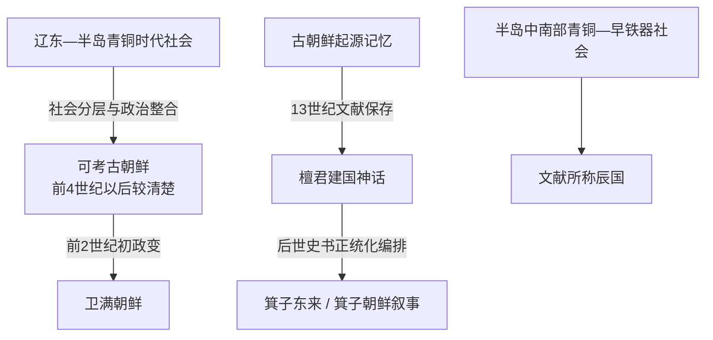

# 檀君朝鲜

## 时间

传统纪年把建国置于前2333年；这一年份是后世依据神话纪年推算的象征性年代，不是经同期文献或考古测年确认的王朝起点。

## 性质

“檀君朝鲜”首先是古朝鲜建国神话和后世历史记忆，而不是能够列出连续王统的实证王朝。现存最早完整叙述见于13世纪的《三国遗事》，《帝王韵记》等稍后文献又以不同方式重述。神话可能保存了青铜时代部落联合、天神祭祀、农耕社会和首领权威的文化记忆，但不能把其中人物、寿命、都城和年代逐项当作同期史实。

## 概括

叙事中，桓雄从天而降，与由熊化人的熊女结合，生下檀君王俭；檀君建立朝鲜、建都阿斯达并统治极久。这个故事把天界血统、地方集团、农耕象征和政治权威结合起来，为古朝鲜及后世朝鲜国家提供神圣起源。可考的古朝鲜则到前4世纪左右才在中国文献中较清楚地以称王、设官并与燕竞争的政治体出现；两者之间不能画成未经证明的单线世系。

## 证据边界

| 层次 | 已有证据 | 可以得出的结论 | 不能得出的结论 |
| --- | --- | --- | --- |
| 后世传说 | 《三国遗事》《帝王韵记》等保存檀君故事 | 13世纪以前已形成重要的建国与族源记忆 | 檀君本人和前2333年已经被同期材料证实 |
| 早期文献 | 前4世纪以后文献逐渐记载“朝鲜”称王、与燕交涉 | 古朝鲜在战国后期已是可识别政治体 | 这些“朝鲜王”就是檀君或其直系后裔 |
| 考古材料 | 辽宁式铜剑、细形铜剑、支石墓、聚落与墓葬等级 | 辽东至半岛西北存在青铜时代文化网络和社会分层 | 某件器物、墓葬或遗址可直接命名为“檀君陵”“檀君都城” |
| 现代记忆 | 开天节、檀君崇敬和近现代民族叙事 | 神话持续具有文化与政治意义 | 现代纪念传统能够替代古代史证据 |

## 神话结构与政治含义

- **天神下降**：桓雄携风伯、雨师、云师下临，反映农业社会对天气、丰收和祭祀权威的关注。
- **熊与虎考验**：不同动物集团可能象征族群或图腾的解释很流行，但没有直接证据证明它们对应两个确定部落。
- **檀君王俭**：“檀君”和“王俭”常被解释为祭司与政治首领称号的结合，也可能只是后世对理想始祖的称谓；词义和制度对应仍有争议。
- **阿斯达与平壤**：传说列出多种地名，后世又把都城与平壤、九月山等地联系；具体位置不能仅凭神话确定。
- **长寿与禅让**：所谓统治一千余年应理解为表达“久远”，不能转成个人寿命或连续年表。

## 叙事形成与历史化节点

| 时间 | 节点 | 说明 |
| --- | --- | --- |
| 前4世纪左右 | 文献中的古朝鲜君长称王并与燕交涉 | 这是可考古朝鲜政治史的重要起点，却没有提及檀君 |
| 前3世纪初 | 燕向东北扩张，古朝鲜活动中心与疆域发生变化 | 考古文化与文献政治体开始较可对应 |
| 13世纪后期 | 《三国遗事》保存现存最早完整檀君建国叙事 | 成书距传说时代极远，应作为中世纪保存的古代记忆阅读 |
| 1287年前后 | 《帝王韵记》以韵文重述始祖与古朝鲜 | 与《三国遗事》细节不完全相同，说明传统并非单一版本 |
| 高丽末—朝鲜时代 | 国家史书、祭祀与地理叙述持续历史化檀君 | 建国传说被纳入王朝正统与疆域记忆 |
| 20世纪以来 | 檀君成为民族起源、宗教与开天纪念的重要象征 | 现代意义真实存在，但不反向证明神话年代 |

## 传说人物

| 人物 | 身份 | 证据状态 | 说明 |
| --- | --- | --- | --- |
| 桓因 | 天界祖神 | 神话人物 | 只见于后世建国叙事，不能列入古朝鲜君主表 |
| 桓雄 | 下临人间的天神之子 | 神话人物 | 象征神圣权威及对人间事务的治理 |
| 熊女 | 由熊化人的母神 | 神话人物 | 与桓雄结合生檀君；其族群寓意属于解释而非定论 |
| 檀君王俭 | 建国者与始祖 | 传说君主 | 是文化记忆中的古朝鲜建立者，没有可核实的在位年和世系 |

不存在可由同期材料连续排列的“檀君诸王表”。后世谱牒所列数十代檀君形成很晚，不能伪装成公认君主世系。

## 从神话到可考历史

檀君叙事的“崛起机制”应理解为神话所表达的政治整合：拥有祭祀正当性的首领吸纳不同社群，以农耕秩序和共同祖先建立共同体。可考古朝鲜的形成则与青铜生产、设防聚落、贸易通道、首领集团和对燕外交竞争有关。两者可以互相帮助理解观念，却不能彼此替代证据。

将“檀君朝鲜—箕子朝鲜—卫满朝鲜”排成整齐三朝，是后世史书的正统化框架。较稳妥的说法是：檀君属于古朝鲜的起源记忆；所谓[箕子朝鲜](/%E4%BA%BA%E6%96%87%E7%A7%91%E5%AD%A6/%E5%8E%86%E5%8F%B2/%E4%B8%9C%E4%BA%9A/%E6%9C%9D%E9%B2%9C%E5%8D%8A%E5%B2%9B/%E7%AE%95%E5%AD%90%E6%9C%9D%E9%B2%9C.md)是另一套后起文化叙事；前2世纪初[卫满朝鲜](/%E4%BA%BA%E6%96%87%E7%A7%91%E5%AD%A6/%E5%8E%86%E5%8F%B2/%E4%B8%9C%E4%BA%9A/%E6%9C%9D%E9%B2%9C%E5%8D%8A%E5%B2%9B/%E5%8D%AB%E6%BB%A1%E6%9C%9D%E9%B2%9C.md)则进入较可靠的政治史范围。半岛中南部的[辰国](/%E4%BA%BA%E6%96%87%E7%A7%91%E5%AD%A6/%E5%8E%86%E5%8F%B2/%E4%B8%9C%E4%BA%9A/%E6%9C%9D%E9%B2%9C%E5%8D%8A%E5%B2%9B/%E8%BE%B0%E5%9B%BD.md)也不能被证明是从檀君政权直接分出的支系。

## 演变关系

图中“神话叙事”和“可考政治史”是两种证据层次；没有箭头表示檀君个人世系已连续传到卫满或三韩。
